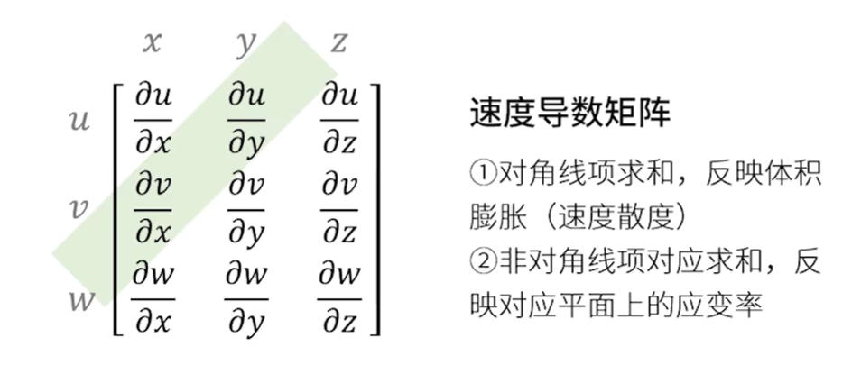

## 流体静力学

### 流体静力学的基本方程——欧拉静平衡方程

静平衡方程

$$\nabla p=\rho \bm{f}$$

静压力差公式

$$\mathrm{d}p=\rho(f_x \mathrm{d}x+f_y\mathrm{d}y+f_z \mathrm{d}z)$$

引入彻体力势函数

$$f_x=-\frac{\partial \Pi}{\partial x},f_y=\frac{\partial \Pi}{\partial y},f_z=-\frac{\partial \Pi}{\partial z}$$

欧拉静平衡方程又可写为

$$\mathrm{d}p=-\rho d\Pi$$

积分式为

$$p=-\rho \mathcal{\Pi}+C$$

$$p=p_0-\rho(\Pi-\Pi_0)$$

非惯性系的静平衡方程

$$\nabla p=\rho \bm{f}=\rho(\bm{f}_g+\bm{f}_a)$$

## 国际标准大气

### 不可压流体/流动与可压缩流体/流动

低速流动又称不可压流动，高速流动又称可压缩流动

### 采用马赫数划分流动范围的物理内涵

马赫数：飞行速度与声速之比

$$Ma=\frac{V}{a}$$

Ma<0.3为低速（不可压）流动，Ma>0.3为高速（可压缩）流动

## 完全气体的热力学特性

### 完全气体状态方程

$$p=\rho\frac{\bar{\mathcal{R}}}{\mathcal{M}_r}T=\rho RT$$

对于极高压或低温，完全气体假设不成立

### 气体的内能

气体内能是分子热运动的能量、分子间相互作用的能量和分子内部能量的总和；分子热运动的能量，包括分子的平动能、转动能、振动能和电子激发能

平动能

$$e_{tr}=\frac{3}{2}RT$$

转动能

$$e_{rot}=RT$$

振动能

$$e_{vib}=\frac{R\mathcal{\Theta}_v}{e^{\frac{\mathcal{\Theta}_v}{T}}-1}$$

对于双原子气体，忽略电子激发能，称为量热完全气体

$$e=e_{tr}+e_{rot}+e_{vib}$$

在$T\ll \Theta_v$，可忽略振动能

$$e=\frac{5}{2}RT$$

对于单原子气体，不计分子的振动和转动

$$e=\frac{3}{2}RT$$

### 热力学第一定律、焓和比热容

热力学第一定律

$$\delta q+\delta w=\rm{d}e$$

对于准静态无摩擦这样的可逆过程，外界对系统做功就是压力做功，为

$$\delta w=-p\rm{d} (\frac{1}{\rho})$$

则

$$\delta q=de+p\rm{d}(\frac{1}{\rho})$$

引入焓

$$h=e+\frac{p}{\rho}$$

则

$$\delta q=\rm{d}h-\frac{1}{\rho} \rm{d} p$$

### 热力学第二定律和熵

考虑熵

$$\rm{d}s=\frac{\delta q_{rev}}{T}$$

热力学第二定律

$$\rm{d}s \ge \frac{\delta q}{T}$$

对于绝热过程

$$ds\gg 0$$

!!! note 熵的计算式
    $$T\rm{d}s=de+pd(\frac{1}{\rho})$$

    $$T \rm{d}s=dh -\frac{1}{\rho}dp$$

### 等熵关系式

$$\frac{p_2}{p_1}=(\frac{\rho_2}{\rho_1})^{\gamma}=(\frac{T_2}{T_1})^{\frac{\gamma}{\gamma-1}}$$

### 声速

声波：对弹性介质施加扰动，在介质中引起微小的应力增量，并以波的形式传播

声速，扰动波的传播速度

$$a=\sqrt{\frac{E_s}{\rho}}$$

其中，$E_s$为等熵过程的体积弹性模量

对于热完全气体，可导出

$$a=\sqrt{\gamma RT}$$

## 引言

### 动力学任务与基本原则

### 系统（流体微团）与控制体（微元体）

### 积分形式和微分形式的基本方程

### 雷诺输送定理

## 质量方程

连续方程

质量守恒定律

控制面流出质量=控制体减少质量

积分形式

$$\frac{\partial }{\partial t}\oiiint \rho dV+\oiint_S \rho V \cdot dS=0$$

微分形式

$$\frac{\partial \rho}{\partial t}+\nabla \cdot(\rho V)=0$$

实质导数形式

$$\frac{D \rho}{D t}+\rho \nabla\cdot V=0$$

质量流量：单位时间内流过面积A的质量

$$\dot{m}=\rho V \cdot dS=\rho V_n A$$

质量通量：单位时间内通过单位面积的质量

$$Mass flux=\frac{\dot{m}}{A}=\rho V_n$$

### 微分形式的质量方程（连续方程）

### 积分形式的质量方程

## 运动微分方程

### 应力形式的运动微分方程

### 牛顿流体的应力与应变率关系

### 纳维-斯托克斯方程

## 积分形式的动量方程

动量方程

积分形式

$$\frac{\partial}{\partial t}\oiiint_V \rho V \cdot dV+\oiint_S(\rho V \cdot dS)V=\oiiint_V \rho f \cdot dV-\oiint_S pdS+F_{viscous}$$

微分形式

$$\frac{\partial (\rho u)}{\partial t}+\nabla \cdot (\rho u V)=\rho f_x-\frac{\partial p}{\partial x}+F_{x_{viscous}}$$

实质导数形式

$$\rho \frac{Du}{Dt}=\rho f_x-\frac{\partial p}{\partial x}+F_{x_{viscous}}$$

$\rho f\cdot dV$ 控制体微元dV所受体积力

$-pdS$ 控制面微元dS所受表面压力

$F_{viscous}$ 控制面S所受粘性力

对如图控制体假设，在定常无粘不可压缩流动中

$$D=\rho \int_{h}^b u_2(u_1-u_2)dy$$

### 积分形式动量方程的推导

### 积分形式动量方程的应用

### 积分形式的动量矩方程及应用

## 理想流体的欧拉方程及其积分

### 理想流体的欧拉方程

### 兰姆-葛罗米柯方程

### 欧拉方程的积分

### 应用举例

## 理想流体的旋涡定理

### 亥姆霍兹方程

### 开尔文环量守恒定理

### 亥姆霍兹旋涡定理

## 理想流体的能量方程

能量方程

方程原理：热力学第一定律

积分形式

$$\oiiint_V \dot{q}\rho dV+\dot{Q}_{viscous}-\oiint_S   (pfd\mathcal{V})V+\dot{W}_{viscous}=\frac{\partial }{\partial t}\oiiint_V \rho (e+\frac{V^2}{2})d\mathcal{V}\cdot dS$$

微分形式

$$\dot{q}\rho +\dot{Q}_{viscous}-\nabla \cdot {\rho V}+\rho f\cdot V+\dot{W}_{viscous}=\frac{\partial}{\partial t}[p(e+\frac{V^2}{2})]+\nabla \cdot [\rho (e+\frac{V^2}{2})V]$$

实质导数形式

$$\dot{q}\rho+\dot{Q}_{viscous}-\nabla \cdot \rho V+\rho f\cdot V+\dot{W}_{viscous}=\rho \frac{D(e+\frac{V^2}{2})}{Dt}$$

传热率（控制体单位时间吸收的热量）= 控制体的加热率 + 粘性效应引起热量传递

$$B_1 = \oiiint_V \dot{q}\rho d\mathcal{V}+\dot{Q}_{viscous}$$

做功率（外界对控制体单位时间内所做功）= 控制体表面压力功率/控制体体积力功率 + 粘性力功率

$$B_2 = pdS\cdot dV + \dot{W}_{viscous}$$

能量增加率 = 质量经控制面流入/流出带来的能量变化率 + 控制体内的流体因流场变化（非定常）导致的能量变化率

$$B_3=\oiint_S \rho (e+\frac{V^2}{2})V \cdot dS+ \frac{\partial}{\partial t}\oiiint_V \rho(e+\frac{V^2}{2})d\mathcal{V}$$

系统吸热Q+ 外界做功W=内能改变$\Delta E$

$$B_1+B_2=B_3$$

### 微分形式的总能方程

### 微分形式能量方程的其他形式

### 积分形式的能量方程

## 流体动力学方程组的封闭性和定解条件

### 方程组的封闭性

### 定解条件

## 流动相似与相似参数

### 流动控制方程和定解条件的无量纲化

### 相似律和相似参数

### 流场

流场：流体运动所处空间，也即流体质点布满或流动参数布满空间

速度场：流动空间各坐标点上的速度矢量构成的场

定常流场：流场任意点流动参数都不随时间变化

### 随体导数

$$\frac{D}{Dt}=\frac{\partial }{\partial t}+(V\cdot \nabla)=\frac{\partial}{\partial t}+u\frac{\partial}{\partial x}+v\frac{\partial}{\partial y}+w\frac{\partial }{\partial z}$$

随体导数：$\frac{D}{Dt}$

当地导数：$\frac{\partial}{\partial t}$

迁移导数：$u\frac{\partial}{\partial x}+v\frac{\partial}{\partial y}+w\frac{\partial }{\partial z}$

## 流体运动的几何描述

流体微元的运动和变形：平移、线变形、旋转、角变形

对于定常流动，流线、迹线、脉线是重合的

### 迹线

迹线：流体质点的运动轨迹

### 流线

流线：流场中各点速度矢量的连线

流线上各点处，微元速度方向与流线相切

### 流管和流面

流管：定常流动中，若干流线在空间中形成的管。流体不会穿越流管。

### 脉线

## 流体微团的运动分析

### 流体微团运动过程中形状变化特点

### 流体微团的基本运动形式

### 流体微团中毗邻点的速度关系

### 流体微团基本运动形式的分析

### 亥姆霍兹速度分解定理

### 流动实例分析

## 有旋流动

角速度

$$\vec{\omega}=\frac{1}{2}(\frac{\partial w}{\partial y}-\frac{\partial v}{\partial z})\vec{i}+\frac{1}{2}(\frac{\partial u}{\partial z}-\frac{\partial w}{\partial x})\vec{j}+\frac{1}{2}(\frac{\partial v}{\partial x}-\frac{\partial u}{\partial y})\vec{k}$$

涡量（速度旋度）

应变率

$$\varepsilon_{xy}=\frac{\partial v}{\partial x}+\frac{\partial u}{\partial y}$$

$$\varepsilon_{yz}=\frac{\partial w}{\partial y}+\frac{\partial v}{\partial z}$$

$$\varepsilon_{xz}=\frac{\partial u}{\partial z}+\frac{\partial w}{\partial x}$$

体积膨胀（速度散度）

$$\frac{1}{\delta \mathcal{V}}\frac{D(\delta \mathcal{V})}{Dt}=\nabla \cdot V$$

简记方法

!!! note 流体是否有旋的判定
    $\nabla \times V$在全流场中是否处处为0

粘性流动一般是有旋流，上下表面的粘性力会使微团旋转

### 有旋流动的一般概念、涡线和涡管

### 速度环量及其与涡通量的关系

### 涡管强度守恒定理及推论

### 旋涡的诱导速度