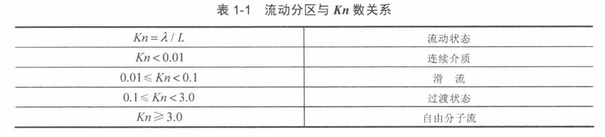

# Chap1 绪论

## 流体

### 流体的连续介质模型

!!! definition "流体"
    流体：静止状态下无法承受剪切应力，包括气体和液体

!!! theorem "连续介质假设"
    - 不考虑分子间隙，认为介质是连续分布于流体所占据的整个空间
    - 流体由连续的流体微团组成，宏观上足够小，以反映流场点状态；微观上足够大，以消除分子随机运动带来的宏观物理量在统计上的涨落
    - 表征流体属性的物理量在流体连续流动时是时间与空间的单值、连续可微函数

!!! definition "努森数"
    努森数：判断连续介质假设的适用范围的无量纲参数

    $$\text{Kn}=\frac{\lambda}{L}$$

    其中$L$为特征长度，$\lambda$为分子平均自由程

    当$\text{Kn}<0.01$时，采用连续介质假设；$\text{Kn}>10$时，采用离散流假设，使用分子运动的玻尔兹曼方程描述流体运动

    

    分子平均自由程：一个气体分子在随机运动过程中两次碰撞之间所走过的距离的平均值

### 流体的基本物理量

!!! definition "密度"
    密度：单位体积具有的质量

    平均密度：$\bar{\rho}=\frac{\Delta m}{\Delta V}$

    点密度：$\rho=\lim_{\Delta V\rightarrow 0}\frac{\Delta m}{\Delta V}=\frac{\mathrm{d}m}{\mathrm{d}V}$

    比体积：$v=\frac{1}{\rho}$

!!! definition "压强"
    压强：作用在单位面积上的正压力，来源于气体分子在单位时间在该面上发生的动量变化

    $$p=\lim_{A\rightarrow 0}\frac{force}{A}$$

!!! definition "温度"
    温度：分子（原子）作无序的微观运动的平均动能的度量

    $$\frac{3}{2}kT=<\frac{1}{2}mv^2>$$

### 理想气体

!!! theorem "理想气体假设"

    1. 原子或者分子间为完全弹性碰撞

    2. 不考虑分子（原子）间的相互吸引力

    3. 忽略分子（原子）的实际体积

!!! formula "状态方程"

    $$f(p,\rho,T)=0$$

    对于理想气体

    $$p=\frac{2N}{3V}<\frac{1}{2}mv^2>$$

    $$p=\rho\frac{R_0}{M}T=\rho RT$$

    n-摩尔数 R-普适气体常数 N-分子数 k-玻尔兹曼常数

## 流体的性质

### 流动性

!!! definition "流动性"
    流动性/易变形性：处于静止状态的流体不能抵抗剪切力，流体在很小的剪切力作用下将发生连续不断的变形

    流动性是流体与固体的主要区别标志

### 压缩性

!!! definition "可压缩性"
    可压缩性：流体在外力（主要是压力）作用下，其体积或密度发生变化的性质，也称为弹性

!!! definiton "弹性模量"
    弹性模量：压力增量对气体单位比体积增量之比

    $$E=\frac{\mathrm{d}p}{-\mathrm{d}V/V}=\rho\frac{\mathrm{d}p}{\mathrm{d}\rho}=\frac{1}{\beta}$$

### 热膨胀性

!!! definition "热膨胀性"

    热膨胀性：流体的体积或密度随温度改变的性质

    在一般的有状态方程

    $$\rho=f(p,T)$$

    $$\mathrm{d}\rho=\frac{\partial \rho}{\partial p}\mathrm{d}p+\frac{\partial \rho}{\partial T}\mathrm{d}T=\underbrace{\frac{\rho}{E}\mathrm{d} p}_{\text{可压缩性}}- \underbrace{\rho \beta \mathrm{d}T}_{\text{热膨胀性}}$$

    热膨胀系数：

    $$\beta=-\frac{1}{\rho}\frac{\partial \rho}{\partial T}=\frac{1}{v}\frac{\partial v}{\partial T}$$

### 粘性

!!! definition "粘性"
    粘性：流体运动时，流体内部具有抵抗剪切变形的特性，以内摩擦力的形式抵抗流层之间的相对运动

    粘性还表现在对固体表面的黏附作用，分子的内聚力将流体黏附在固体表面上，随固体一起运动或静止，称为流体在固体表面的无滑移条件

!!! theorem "牛顿切应力定律"
    切应力与接触面法向的速度梯度呈正比，即

    $$\frac{P}{A}=\tau=\mu\frac{\mathrm{d}u}{\mathrm{d}y}$$

!!! proof "牛顿切应力定律推导"
    

    考虑两块平行放置的平板，平板间充满均匀粘性流体，下板固定，上板以恒速U平行运动

    1. 两板之间的流体流动速度呈线性分布

    $$u(y)=\frac{y}{h}U$$

    2. 切应力与速度呈正比，与两板间距离呈反比

    $$\tau=\mu\frac{U}{h}$$

    3. 推广到任意层流直线运动，取dy薄层

    $$\tau=\mu\frac{u+du-u}{dy}=\mu\frac{du}{dy}$$

    其中，$\tau$为单位面积上的粘性摩擦力，称为粘性切应力；$\mu$为（动力）粘度，或称为（动力）粘性系数

!!! definition "运动粘度"
    $$v=\frac{\mu}{\rho}$$

牛顿粘性应力公式给出切应力与速度梯度（剪切应变率）的线性关系，满足此关系的流体称为牛顿流体，其余称为非牛顿流体

!!! attention "流体粘度与温度的关系"

    对于气体，粘度随温度升高而增大。气体粘性力主要由于分子热运动导致相邻气体层之间的质量和动量交换，对于理想气体

    $$\mu=\frac{1}{2}\rho \bar{u}\lambda, \bar{u}=\sqrt{<u^2>}$$

    对于液体，粘度随温度升高而减小。液体粘性力除了和分子热运动有关，还与分子间作用力有关

!!! formula "空气粘度近似式"
    萨特兰公式

    $$\frac{\mu}{\mu_0}=(\frac{T}{T_0})^{1.5}(\frac{T_0+C}{T+C})$$

    $\mu_0$为$T=T_0=288.15K$时的值，C=110.4K

    幂次公式

    $$\frac{\mu}{\mu_0}=(\frac{T}{T_0})^n$$

    $90K<T<300K$，$n=\frac{8}{9}$；$400K<T<500K$，$n=\frac{3}{4}$

### 传热性

!!! definition "传热性"
    传热性：当气体沿某一方向存在温度梯度时，热量会从温度高的地方传向温度低的方向

!!! theorem "傅里叶导热定律"
    热流密度：

    $$q=-k\nabla T$$

    温度梯度：

    $$\nabla T=\frac{\partial T}{\partial x}\bm{i}+\frac{\partial T}{\partial y}\bm{j}+\frac{\partial T}{\partial z}\bm{k}$$

    其中，k为热传导系数；气体热传导系数随温度升高而增大

### 扩散性

!!! definition "扩散性"
    扩散性：物质分子从高浓度区域向低浓度区域转移，直到均匀分布的性质

!!! theorem "菲克定律"
    扩散速率与物质的浓度梯度成正比

    物质扩散通量

    $$\bm{J}=-D\nabla C$$

    $$\nabla C=\frac{\partial C}{\partial x}\bm{i}+\frac{\partial C}{\partial y}\bm{j}+\frac{\partial C}{\partial z}\bm{k}$$

    D为物质扩散系数，C为物质的体积浓度

!!! summary "梯度运输过程"
    实质上是分子热运动和分子碰撞

    - 动量输运：牛顿内摩擦定律
    - 热量输运：傅里叶定律
    - 质量输运：菲克定律

## 作用在流体微团上的力

### 体积力（质量力）

!!! definition "体积力"
    体积力：由外力场作用在流体微团质量中心、大小与微团质量成正比的非接触力

    当流体元的体积确定后，作用在流体元上的体积力即确定，与流体元的形状无关

### 表面力

!!! definition "表面力"
    表面力：由物体或相邻流体作用在流体微团的外表面上的、大小与微团表面积成正比的接触力

    大小与作用面的面积成正比，可分解为法向力和切向力

!!! attention ""
    在运动流体内任取一个剖面，一般有法向应力和切向应力，但法向应力完全是由粘性产生的，而流体的粘性力只有在流动时才存在，静止流体是不能承受切向应力的

### 流体内一点处的压强

采用连续介质假设

$$p_A=\lim_{\Delta S \rightarrow 0}\frac{\Delta F_n}{\Delta S}=\frac{\mathrm{d}F_n}{\mathrm{d}S}$$

### 应力张量

!!! info "合应力的分量"
    用两个下标可把各个应力分量的作用面方位和投影方向表述清楚

    其中第一个下标表示作用面的法线方向，第二个下标表示应力分量的投影方向

    x面的合应力表达式为

    $$\vec{\tau}_x=\tau_{xx}\vec{i}+\tau_{xy}\vec{j}+\tau_{xz}\vec{k}$$

    y面的合应力表达式为

    $$\vec{\tau}_y=\tau_{yx}\vec{i}+\tau_{yy}\vec{j}=\tau_{yz}\vec{k}$$

    z面的合应力表达式为

    $$\vec{\tau}_z=\tau_{zx}\vec{i}+\tau_{zy}\vec{j}+\tau_{zz}\vec{k}$$

!!! definition "应力张量"
    应力张量：三个坐标面上的九个应力分量称为该点的应力状态，组成的矩阵称为应力矩阵，也称应力张量

    $$[\tau]=\begin{bmatrix}\tau_{xx} & \tau_{xy} & \tau_{xz} \\ \tau_{yx} & \tau_{yy} & \tau_{yz} \\ \tau_{zx} & \tau_{zy} & \tau_{zz} \end{bmatrix}$$

    根据剪力互等定理，在这九个分量中，只有六个独立量，其中三法向应力和三切向应力

    $$\tau_{xy}=\tau_{yx}, \tau_{xz}=\tau_{zx}, \tau_{yz}=\tau_{zy}$$

    如果在同一点上给定三个互相垂直坐标面上的应力，那么过该点任意方向作用面上的应力可通过坐标变换唯一确定

!!! note "应力分量特征"
    在理想流体中，不存在粘性力，三个法向应力相等，等于该点压强负值

    $$\tau_{xx}=\tau_{yy}=\tau_{zz}=-p$$

    $$[\tau]=-p\begin{bmatrix}1 & 0 & 0 \\ 0 & 1 & 0 \\ 0 & 0 & 1 \end{bmatrix}$$

    在粘性流体中，任意一点的任何三个相互垂直面上的正应力之和一个不变量，并定义此不变量的平均值为该点的平均压强的负值

    $$p=-\frac{\tau_{xx}+\tau_{yy}+\tau_{zz}}{3}=-\frac{\sigma_x+\sigma_y+\sigma_z}{3}$$

    在粘性流体中，任意面的切应力一般不为零

## 流动的类型

!!! note "流动类型"
    - 连续介质区与自由分子流动
        + 连续介质：$\text{Kn}<0.01$
        + 滑流区：$0.001<\text{Kn}<0.1$
        + 过渡区：$0.1<\text{Kn}<10$
        + 自由分子流区：$\text{Kn}>10$
    - 无粘流和粘性流动
    - 可压缩和不可压缩流动
        + 不可压缩流动：$\rho=\text{const.}$，$\text{Ma}<0.3$可作不可压缩
        + 可压缩流动：$\rho \ne \text{const.}$，$\text{Ma}>0.3$

    

!!! note "采用马赫数划分"
    + 低速流：$\text{Ma}<0.3$
    + 亚声速流：$\text{Ma}<1$
    + 跨声速流：$0.8<\text{Ma}<1.2$
    + 超声速流：$\text{Ma}>1$
    + 高超声速流：$\text{Ma}>5$

