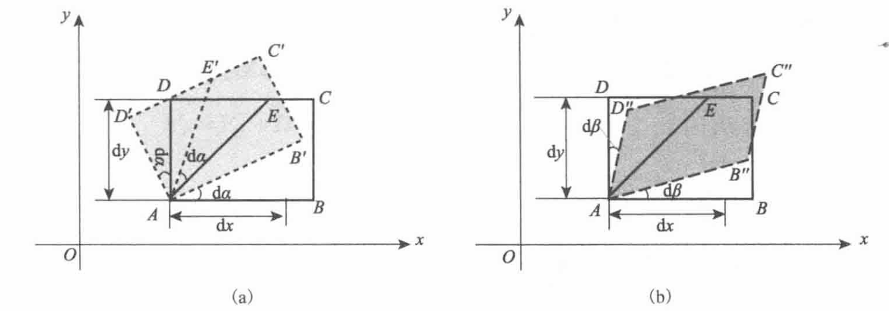

# Chap2 流体力学基本方程

## 流体运动的描述方法

!!! info "描述方法"
    - 拉格朗日方法（质点系法）：着眼于流体质点，跟踪流体质点在空间中的运动
    - 欧拉法（空间点法，流场法）：着眼于空间位置，记录不同流体质点通过空间固定点的运动

### 拉格朗日法

!!! info "拉格朗日法"
    流体质点轨迹方程

    $$\mathbf{r}=\mathbf{r}(a,b,c,t)$$

    a、b、c、t称为拉格朗日坐标或拉格朗日变数

$$\mathbf{V}=\frac{\partial \mathbf{r}(a,b,c,t)}{\partial t}
$$

$$\mathbf{a}=\frac{\partial^2 \mathbf{r}(a,b,c,t)}{\partial t^2}$$

!!! definition "迹线"
    流体质点的迹线：同一质点在不同时刻的轨迹曲线，迹线方程为

    $$\frac{\mathrm{d}x}{u}=\frac{\mathrm{d}y}{v}=\frac{\mathrm{d}z}{w}=\mathrm{d}t$$
### 欧拉法

!!! info "欧拉法"
    空间点速度函数

    $$\mathbf{V}=\mathbf{V}(x,y,z,t)$$

    x、y、z、t称为欧拉坐标或欧拉变数

### 拉格朗日法和欧拉法的转换

一般情况下，引起质点速度的变化来自于两方面的贡献：流场的不均匀性，流场的非定常性

下面我们考察流体质点的速度和加速度

!!! proof "推导过程"
    设t时刻质点位于M(x,y,z)，t+dt时刻质点到达点N(x+dx,y+dy,z+dz)

    流体质点的加速度是经过dt这段时间的变化除以时间dt

    $$\mathbf{a}=\frac{\mathrm{D}\mathbf{V}}{\mathrm{D}t}=\frac{\mathbf{V}_{N,t+\mathrm{d}t}-V_{M,t}}{\mathrm{d}t}$$

    在欧拉法中，流体速度是空间和时间的函数

    $$\mathbf{V}_{M,t}=\mathbf{V}(x,y,z,t)$$

    $$\mathbf{V}_{N,t+\mathrm{d}t}=\mathbf{V}(x+\mathrm{d}x,y+\mathrm{d}y,z+\mathrm{d}z,t+\mathrm{d}t)$$

    $$\mathrm{D}\mathbf{V}=\mathbf{V}_{N,t+\mathrm{d}t}-\mathbf{V}_{M,t}=\frac{\partial \mathbf{V}}{\partial t}\mathrm{d}t+\frac{\partial \mathbf{V}}{\partial x}\mathrm{d}x+\frac{\partial \mathbf{V}}{\partial y}\mathrm{d}y+\frac{\partial \mathbf{V}}{\partial z}\mathrm{d}z$$

    质点的位置变化是沿着质点运动轨迹的变化

    $$\mathrm{d}x=u\mathrm{d}t,\mathrm{d}y=v\mathrm{d}t,\mathrm{d}z=w\mathrm{d}t$$

    $$\mathrm{D}\mathbf{V}=\frac{\partial \mathbf{V}}{\partial t}\mathrm{d}t+\frac{\partial \mathbf{V}}{\partial x}u\mathrm{d}t+\frac{\partial \mathbf{V}}{\partial y}v\mathrm{d}t+\frac{\partial \mathbf{V}}{\partial z}w\mathrm{d}t$$

    加速度为

    $$\frac{\mathrm{D}\mathbf{V}}{\mathrm{D}t}=\frac{\partial \mathbf{V}}{\partial t}+u\frac{\partial \mathbf{V}}{\partial x}+v\frac{\partial \mathbf{V}}{\partial y}+w\frac{\partial \mathbf{V}}{\partial z}=\frac{\partial \mathbf{V}}{\partial t}+(\mathbf{V}\cdot \nabla)\mathbf{V}$$

!!! note "哈密顿算子"
    $$\nabla=\frac{\partial }{\partial x}\mathbf{i}+\frac{\partial }{\partial y}\mathbf{j}+\frac{\partial }{\partial z}\mathbf{k}$$

    哈密顿算子是具有矢量和微分双重性质的符号可进行矢量运算，也可进行微分运算

    $$\mathbf{V\dot \nabla}=(u\mathbf{i}+v\mathbf{j}+w\mathbf{k})\cdot (\frac{\partial }{\partial x}\mathbf{i}+\frac{\partial }{\partial y}\mathbf{j}+\frac{\partial }{\partial z}\mathbf{k})=u\frac{\partial }{\partial x}+v\frac{\partial }{\partial y}+w\frac{\partial }{\partial z}$$

!!! note "随体导数公式的理解"
    - $\partial \mathbf{V}/\partial t$称为当地导数（局部导数），反映流场的非定常性

    - $(\mathbf{V}\cdot \nabla)\mathbf{V}$称为迁移导数（对流导数），反映流场的不均匀性

## 流体微元运动和变形

基本运动形式：平动、转动、线变形运动、角变形运动

### 线变形

??? proof "推导过程"
    

    边界线$\bar{A}\bar{B}$伸长到$AB^\prime$，方位未变

    $v_{\bar{B}}=v_{\bar{A}}$，即 $\frac{\partial v}{\partial x}=0$

    同理，$\bar{A}\bar{D}$伸长到$AD^\prime$，方位未变

    $u_{\bar{D}}=u_{\bar{A}}$，即 $\frac{\partial u}{\partial y}=0$

    故只有线变形的情况是异名偏导数为零的情况

    考察变形量，$x$方向的变形是由$\bar{A}\bar{B}$伸长到$AB^\prime$，这是因为$\bar{B}$点沿$x$方向的速度比$\bar{A}$大。伸长量$BB^\prime$为

    $(u_{\bar{B}}-u_{\bar{A}})\cdot \mathrm{d}t=\frac{\partial u}{\partial x}\cdot \mathrm{d}x\cdot \mathrm{d}t$

    单位长度上的线变形量，即线应变为

    $\frac{\partial u}{\partial x}\cdot \mathrm{d}t$

    单位时间的线应变即线应变率，记作$\varepsilon_x=\frac{\partial u}{\partial x}$

!!! formula "线变形公式"
    线变形率

    $$\boxed{\varepsilon_x=\frac{\partial u}{\partial x},\varepsilon_y=\frac{\partial v}{\partial y},\varepsilon_z=\frac{\partial w}{\partial z}}$$

    体积膨胀率（速度$\mathbf{V}$的散度）

    $$\boxed{\frac{1}{\delta V}\frac{\mathrm{d}(\delta y)}{\mathrm{d}t}=\frac{\partial u}{\partial x}+\frac{\partial v}{\partial y}+\frac{\partial w}{\partial z}}$$

### 角变形和旋转

??? proof "推导过程"
    

    对于旋转，微团的$AB$边、$AD$边、$\angle DAB$的角平分线，均绕$A$点旋转$\mathrm{d}\alpha$

    对于角变形，$AE$方位不变，$AB$边和$AD$边均向$AE$旋转$\mathrm{d}\beta$

    下考察旋转和角变形和合效果

    

    $AB$到达$A\bar{B}$，转过角度微量$\mathrm{d}\alpha+\mathrm{d}\beta$，小角度情况下有

    $$\mathrm{d}\alpha+\mathrm{d}\beta=\frac{B\bar{B}}{AB}=\frac{(v_B-v_A)\cdot \mathrm{d}t}{\mathrm{d}x}=\frac{\partial v}{\partial x}\mathrm{d}t$$

    $AD$到达$A\bar{D}$，转过的角度$\mathrm{d}\alpha-\mathrm{d}\beta$

    $$\mathrm{d}\alpha-\mathrm{d}\beta=-\frac{D\bar{D}}{AD}=-\frac{(u_D-u_A)\cdot \mathrm{d}t}{\mathrm{d}y}=-\frac{\partial u}{\partial y}\mathrm{d}t$$

    微团的角速度可由上述两式之和除以$2\mathrm{d}t$得到，为

    $$\omega_z=\frac{\mathrm{d}\alpha}{\mathrm{d}t}=\frac{1}{2}(\frac{\partial v}{\partial x}-\frac{\partial u}{\partial y})$$

    此即为$xy$平面上微团的角速度

!!! note "角速度"
    角速度矢量记作$\vec{\omega}$

    $$\vec{\omega}=\frac{1}{2}(\frac{\partial w}{\partial y}-\frac{\partial v}{\partial z})\vec{i}+\frac{1}{2}(\frac{\partial u}{\partial z}-\frac{\partial w}{\partial x})\vec{j}+\frac{1}{2}(\frac{\partial v}{\partial x}-\frac{\partial u}{\partial y})\vec{k}$$

    可见微团的角速度可由异名偏导数的差表示

    另外，角速度其实就是速度旋度的一半

    $$\vec{\omega}=\frac{1}{2} \text{rot}\mathbf{V}=\frac{1}{2}\nabla \times \mathbf{V}$$

    角速度矢量的方向按右手定则确定，即涡量在某一方向的分量为正时，代表绕该方向轴线逆时针旋转

!!! definition "涡量与速度旋度"
    $$\boxed{\Omega=\text{rot} \mathbf{V}=\nabla \times \mathbf{V}=\left|\begin{array}{cccc}i & j & k \\
    \frac{\partial}{\partial x} & \frac{\partial}{\partial y} & \frac{\partial}{\partial z} \\
    u & v & w\end{array}\right|=(\frac{\partial w}{\partial y}-\frac{\partial v}{\partial z})\vec{i}+(\frac{\partial u}{\partial z}-\frac{\partial w}{\partial x})\vec{j}+(\frac{\partial v}{\partial x}-\frac{\partial u}{\partial y})\vec{k}}$$

!!! formula "角变形公式"
    角变形率

    $$\boxed{\gamma_x=\frac{1}{2}(\frac{\partial w}{\partial y}+\frac{\partial v}{\partial z}),\gamma_y=\frac{1}{2}(\frac{\partial w}{\partial x}+\frac{\partial u}{\partial z}),\gamma_z=\frac{1}{2}(\frac{\partial v}{\partial x}+\frac{\partial u}{\partial y})}$$

### 流体速度的梯度、散度和旋度

!!! formula "速度梯度"
    $$\frac{\partial \mathbf{V}}{\partial \mathbf{x}} = \begin{bmatrix} \frac{\partial u}{\partial x} & \frac{\partial u}{\partial y} & \frac{\partial u}{\partial z} \\ \frac{\partial v}{\partial x} & \frac{\partial v}{\partial y} & \frac{\partial v}{\partial z} \\ \frac{\partial w}{\partial x} & \frac{\partial w}{\partial y} & \frac{\partial w}{\partial z} \end{bmatrix}$$

!!! formula "速度散度"
    $$\mathrm{div} \vec{V} = \lim_{\Delta t \to 0} \frac{1}{\Delta x \Delta y \Delta z \Delta t} \left[ \left(1 + \frac{\partial u}{\partial x} \Delta t \right) \Delta x \left(1 + \frac{\partial v}{\partial y} \Delta t \right) \Delta y \left(1 + \frac{\partial w}{\partial z} \Delta t \right) \Delta z - \Delta x \Delta y \Delta z \right]= \frac{\partial u}{\partial x} + \frac{\partial v}{\partial y} + \frac{\partial w}{\partial z} = \nabla \cdot \vec{V}$$

!!! formula "速度旋度"
    $$\mathbf{\Omega} = \mathrm{rot}\mathbf{V} = \nabla \times \mathbf{V}= \mathbf{i}\left(\frac{\partial w}{\partial y} - \frac{\partial v}{\partial z}\right) + \mathbf{j}\left(\frac{\partial u}{\partial z} - \frac{\partial w}{\partial x}\right) + \mathbf{k}\left(\frac{\partial v}{\partial x} - \frac{\partial u}{\partial y}\right)$$

### 亥姆霍兹速度分解定理

!!! theorem "刚体速度分解定理"
    刚体的一般运动可分解为两种基本运动：一是整个刚体以基点A的速度作平动；二是绕通过基点A的某瞬时轴作转动

    因此，刚体上任一点E的速度$V_E$与基点A速度$V_A$关系为

    $$V_E=V_A+\vec{\omega}\times (\mathbf{r}_E-\mathbf{r}_A)$$

!!! theorem "流体速度分解定理"
    $$\boxed{\frac{\partial \mathbf{V}}{\partial \mathbf{x}}=\frac{\partial u_i}{\partial x_j}=\frac{1}{2}(\frac{\partial u_i}{\partial x_j}+\frac{\partial u_j}{\partial x_i})+\frac{1}{2}(\frac{\partial u_i}{\partial x_j}-\frac{\partial u_j}{\partial x_i})=\mathbf{\varepsilon}_{ij}-\mathbf{a}_{ij}}$$

!!! formula "应变率"
    应变率张量

    $$\varepsilon_{ij}=\frac{1}{2}(\frac{\partial u_i}{\partial x_j}+\frac{\partial u_j}{\partial x_i})$$

    转动角速度矢量

    $$\vec{\omega}=\frac{1}{2}\nabla \times \mathbf{V}=\frac{1}{2}e_{ijk}\frac{\partial u_k}{\partial x_j}\mathbf{e}_i$$

    $$e_{ijk}=\left\{\begin{aligned}1 ,\text{i,j,k正序排列} \\ -1 , \text{i,j,k逆序排列} \\ 0,\text{i,j,k有两个指标值相同}\end{aligned}\right.$$

    $$\boxed{\mathbf{V}(M)=\mathbf{V}(M_0)+\mathbf{\varepsilon}\cdot \delta \mathbf{r}+\mathbf{\omega}\times \delta \mathbf{r}}$$

## 基本方程

### 控制体

!!! definition "系统（流体微团）"
    定义：某个有确定质量的流体团。系统以外的一切，统称为外界。无限小的流体系统称为流体微团。随体观点模型，对应拉格朗日方法。

    特点：系统体积和界面积随流体流动而随时变化；系统界面上，只有能量交换，没有质量交换；系统边界上，系统受到外界对其作用的表面力。

!!! definition "控制体（微元体）"
    定义：流体空间一个固定的控制面所包围的区域。无限小的流体控制点称为微元体。当地观点模型，对应欧拉方法。

    特点：控制体的体积和界面积是固定不变的；在控制体的界面上，既有能量交换，又有质量交换；在控制体的界面上，控制体内流体受到控制体以外的流体对其作用的表面力。

### 雷诺输送定理

!!! theorem "雷诺输送定理"
    某一瞬间，控制体内的流体所构成的体系，它所具有的物理量总量的随体导数，等于同一瞬间控制体系中所含同一物理量的增加率与该物理量通过控制面的净流出率之和

    $$\frac{\mathrm{D}}{\mathrm{D}t}\int_{V} B \mathrm{d}V=\frac{\partial}{\partial t}\int B \mathrm{d}V+\int_{S} B(\mathbf{v}\cdot \mathbf{n})\mathrm{d}S=\int_V (\frac{\partial }{\partial t}B+\nabla cdot (B\mathbf{v}))\mathrm{d}V $$

    B可以是质量、动量、能量等

### 流体力学方程组

!!! note "基本控制方程"
    - 质量守恒定律——连续性方程
    - 动量守恒定律——动量方程
    - 能量守恒定律——能量方程

    1. 能量方程对于可压缩流才是必要的
    2. 能量方程额外引入两个变量：内能e、温度T，额外需要两个辅助方程
    $e=C_vT$ (热力学状态关系式)
    $p=\rho RT$（理想气体状态方程）
    3. 无粘流体的动量方程，称为Euler方程；粘性流动的动量方程，称为N-S方程

!!! summary "控制方程组"
    - 连续方程 $\frac{\partial }{\partial t}\rho+\nabla \cdot (\rho \mathbf{v})=0$
    
    - 动量方程 $\rho \frac{\mathrm{D}}{\mathrm{D}t} \mathbf{V}=\rho \mathbf{f}+\nabla \cdot \tau$

    - 能量方程 $\rho \frac{\mathrm{D}}{\mathrm{D}t}e=\rho q+\nabla \cdot (k\Delta T)+\tau:\varepsilon$

    - 本构方程 $\tau=-p\mathbf{I}+2\mu\varepsilon -\frac{2}{3}\mu (\nabla \cdot \mathbf{V})\mathbf{I}$

    - 状态方程 $\rho=\rho(p,T)$
### 连续性方程

!!! formula "连续性方程"
    质量守恒定律 $B=\rho$

    $$\boxed{\frac{\mathrm{D}}{\mathrm{D}t}\int_V \rho \mathrm{d}V=0}$$

    积分形式

    $$\int_V (\frac{\partial }{\partial t}\rho +\nabla \cdot(\rho \mathbf{v}))\mathrm{d}V=0$$

    微分形式

    $$\frac{\partial}{\partial t}\rho +\nabla \cdot (\rho \mathrm{v})=0$$

!!! formula "定常流动的连续方程"
    定常流动流场任何空间点密度均不随时间变化

    $$\int_V \frac{\partial \rho}{\partial t}\mathrm{d}V=0$$

    在定常流动中，从控制体流出的质量流量永远等于流入控制体的质量流量

    定常流动的连续方程式

    $$\int_V \nabla \cdot (\rho \mathbf{v})\mathrm{d}V=0$$

    可简化为

    $$\frac{\partial (\rho v_x)}{\partial x}+\frac{\partial (\rho v_y)}{\partial y}+\frac{\partial (\rho v_z)}{\partial z}=0$$

!!! formula "不可压缩流动的连续方程"
    流体密度不随时间变化，也不随空间变化

    $$\nabla \cdot \mathbf{v}=0$$

    在不可压缩流体流动时，任何瞬时从控制体流出的质量等于流入控制体的质量

    $$\frac{\partial v_x}{\partial x}+\frac{\partial v_y}{\partial y}+\frac{\partial v_z}{\partial z}=0$$

### 本构方程
!!! note "本构关系"
    本构方程：确定应力和应变速度关系的方程式

    对于牛顿流体

    - 应力张量与应变率张量成线性关系
    - 这种线性关系在流体各向同性
    - 流体静止的时候，应变率为零，流体中的偏应力为零，正应力就是各项等值的静压强

    $$\tau=-p \mathbf{I}+2\mu \varepsilon -\frac{2}{3}\mu (\nabla \cdot \mathbf{V})\mathbf{I}$$

!!! theorem "斯托克斯假设"
    1. 流体是连续的，其应力矩阵与变形率矩阵成线性关系，与流体的平动和转动无关
    2. 流体是各向同性的，其应力与变形率的关系与坐标系的选择和位置无关
    3. 当流体静止时，变形率为零，流体中的应力为流体静压强
### 动量方程

!!! formula "动量方程"
    动量守恒定律，$B=\rho \mathbf{V}$

    $$\boxed{\frac{\mathrm{D}}{\mathrm{D}t}\int_V \rho \mathbf{V}\mathrm{d}V=\mathbf{F}_{\text{body}}+\mathbf{F}_{\text{surface}}}$$

    $$\int_V (\rho \frac{\mathrm{D}}{\mathrm{D}t}\mathbf{V}-\rho \mathbf{v}-\nabla \cdot \tau)\mathrm{d}V=0$$

    微分形式

    $$\rho \frac{\mathrm{D}}{\mathrm{D}t}\mathbf{V}=\rho \mathbf{f}+\nabla \cdot \tau$$

!!! formula "动量方程特例"
    定常流动

    $$\mathbf{V}\frac{\partial (\rho \mathbf{V})}{\partial \mathbf{X}}=\rho \mathbf{v}+\nabla \cdot \tau$$

    无粘流体

    $$\rho \frac{\mathrm{D}}{\mathrm{D}t}\mathbf{V}=\rho \mathbf{f}-\nabla \cdot \rho$$

### 能量方程

!!! formula "能量方程"

### 内能方程

!!! formula "内能方程"

## 流动的分类

## 流体运动相关概念

### 流线、迹线、脉线

!!! defintion "流线、迹线、脉线"
    
    - 迹线：流体质点在流场中运动的轨迹

        $$\mathrm{d}\mathbf{r}=\mathbf{V}\mathrm{d}t$$

    - 流线：某时刻，该曲线所有点的运动（速度）方向都与这条曲线相切

        $$\mathrm{d}\mathbf{v}\times \mathbf{V}=0$$

    - 脉线：一段时间内相继通过空间某固定点的很多流体质点连成的线，又称染色线
    

!!! definition "流管与流面"
    流管：在三维流动里，经过一条有流量穿过的封闭曲线的所有流线围成封闭管状曲面

    流面：由许多相邻的流线连成的一个曲面

!!! definition "流量"
    流量：单位时间穿过指定截面的流体量

    体积流量

    $$Q=\int_A (\vec{V}\cdot \vec{n})\mathrm{d}A$$

    质量流量

    $$\dot{m}=\int_A \rho (\vec{V}\cdot \vec{n})\mathrm{d}A$$

!!! attention 
    一般情况下，流线、迹线、脉线并不重合；定常情况下，三者重合

### 环量与涡

!!! definiton "涡"
    - 涡量：旋转角速度的两倍，速度场的旋度
    - 涡线：在同一瞬时，该线上每一点的涡轴线都与曲线相切
    - 涡面：在同一瞬时，通过某一曲线（本身不是涡线）的所有涡线构成的曲面
    - 涡管：在同一瞬时，通过某一封闭围线的所有涡线所组成的涡面

!!! defintion "涡通量"
    涡通量：涡量在一个截面上的面积分，也称涡强

