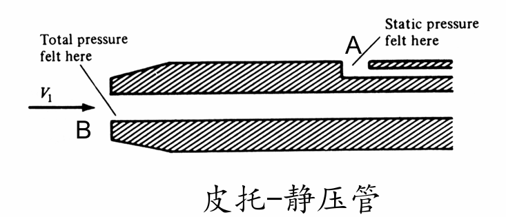
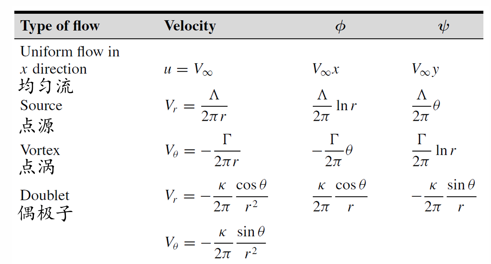

# Chap4 无粘不可压缩流动

## 无粘不可压缩流体的基本方程

!!! note "简化流体模型"
    - 理想流体：无粘流体
    - 绝热流体：流体的导热系数视为零
    - 不可压缩流体：体积弹性模量无穷大，或密度为常数

!!! formula "无粘不可压缩流体基本方程"
    理想流体，液体和低速气体（Ma<0.3）流动

    $$\nabla \cdot V=0$$

    $$\rho \frac{\mathrm{D}V}{\mathrm{D}t}=\rho f -\nabla p$$

## 伯努利方程
!!! formula "伯努利方程"
    $$\boxed{p+\frac{1}{2}\rho v^2=\text{const}}$$

??? proof "伯努利方程推导"
    条件：定常，无粘，不可压缩，不考虑体积力

    无粘不可压流体（条件1），忽略体积力（条件2）

    $$\rho \frac{\mathrm{D}V}{\mathrm{D}t}=-\nabla p$$

    方程两边点乘速度

    $$\rho \frac{\mathrm{D}}{\mathrm{D}t} (\frac{V^2}{2})=-\nabla p \cdot V$$

    $$\frac{\partial}{\partial t} \left( \rho \frac{\mathbf{V}^{2}}{2} \right) + \mathbf{V} \cdot \nabla \left( \rho \frac{\mathbf{V}^{2}}{2} \right) = - \mathbf{V} \cdot (\nabla p)$$

    定常（条件3）

    $$\mathbf{V} \cdot \left( \nabla \left( \frac{1}{2} \rho \mathbf{V}^2 \right) + \nabla p \right) = 0$$

    $$V \cdot \nabla (\frac{1}{2}\rho V^2+p)=0$$

    在同一流线上（条件4），流线的方向即速度的方向

    $$\mathrm{d}s=\frac{V}{|V|}$$

    $$d\left(p + \frac{1}{2}\rho \mathbf{V}^2\right) = \nabla \left(p + \frac{1}{2}\rho \mathbf{V}^2\right) \cdot d\mathbf{s} = \nabla \left(p + \frac{1}{2}\rho \mathbf{V}^2\right) \cdot \frac{\mathbf{V}}{|\mathbf{V}|} = 0$$

    $$p+\frac{1}{2}\rho V^2=\text{const}$$

无旋流动中，任意方向上均有伯努利方程

!!! note "伯努利方程物理意义"
    - 同一条流线上对于有旋和无旋流动均成立
    - 常数的值随流线不同而变化
    - 对于无旋流动，在整个流场中，常数相等

### 皮托管

$$\underbrace{p_1}_{\text{静压}}+\underbrace{\frac{1}{2}\rho V^2}_{\text{动压}}=\underbrace{p_0}_{总压} $$

!!! note "皮托管测速"
    

    对于A，B点，由伯努利方程

    $$p_A+\frac{1}{2}\rho V_A^2=p_B+\frac{1}{2}V_B^2$$

    $$V_B=0$$

    得

    $$V_A=\sqrt{\frac{2(p_B-p_A)}{\rho}}$$

### 文丘里管

连续性方程

$$A_1V_1=A_2V_2$$

伯努利方程

$$p_A+\frac{1}{2}\rho V_A^2=p_B+\frac{1}{2}V_B^2$$

!!! note "文丘里管测速"
    

    进口、喉道面积比已知，由伯努利方程：

    $$V_1^2=\frac{2}{\rho}(p_2-p_1)+V_2^2$$

    由连续性方程：

    $$V_2=\frac{A_1}{A_2}V_1$$

    得：

    $$V_1=\sqrt{\frac{2(p_2-p_1)}{\rho[(A_1/A_2)^2-1]}}$$

## 无旋不可压缩流动控制方程及边界条件

### 势函数的拉普拉斯方程

!!! formula "势函数的拉普拉斯方程"
    不可压无旋流动势函数的拉普拉斯方程：

    $$\nabla^2 \phi=0$$

    或

    $$\Delta \phi=0$$

    或

    $$\frac{\partial^2 \phi}{\partial x^2}+\frac{\partial^2 \phi}{\partial y^2}+\frac{\partial^2 \phi}{\partial z^2}=0$$

!!! note "势函数的性质"
    1. 速度势函数沿着某一方向的偏导数等于<b>该方向的速度分量</b>，速度势函数沿着流线方向增加
    2. 速度势函数相等的点连成的线称为等势线，速度方向垂直于等势线
    3. 连接任意两点的速度曲线等于该两点的速度势函数之差。速度线积分与路径无关，仅决定于两点的位置。如果是封闭曲线，速度环量为零。

### 流函数的拉普拉斯方程

有旋必无势，无旋必有势，两者等价

!!! formula "流函数的拉普拉斯方程"
    不可压无旋流动流函数的拉普拉斯方程：

    $$\frac{\partial^2 \psi}{\partial x^2}+\frac{\partial^2 \psi}{\partial y^2}=0$$

    记为：

    $$\nabla^2 \psi=0$$

!!! definition "流线"
    流函数值相等的点的流线

    $$\psi=C$$

    两流线间所通过的体积流量等于其流函数值之差

### 边界条件

!!! note "远场边界条件"

    $$u=\frac{\partial \phi}{\partial x}=\frac{\partial \psi}{\partial y}=V_\infty,v=\frac{\partial \phi}{\partial y}=-\frac{\partial \psi}{\partial x}=0$$

!!! note "固壁边界条件"
    气流不能穿越固壁表面

    对粘性流动，在翼型表面摩擦力的影响下，物面处的气流速度为零；对无粘流动，物面上的流动速度不为零，其物面上的气流速度必须与物面相切

    <b>垂直于物面的法向速度分量为零</b>

    势函数：$\frac{\partial \phi}{\partial n}=0$

    流函数：$\psi_{\text{surface}}=\psi_{y=y_b}=const.$

    流线方程：$\frac{\mathrm{d}y_b}{\mathrm{d}x}=(\frac{v}{u})_{\text{surface}}$

!!! info "求解无旋不可压缩二维流动的一般步骤"
    1. 在合适的边界条件下求解$\phi$或者$\psi$。经常可以利用叠加原理，从基本流动的解得到实际流动的拉普拉斯方程的解。

    2. 从流函数或势函数的定义求解出速度：

    3. 根据伯努利方程求解压力

## 一些基本流的解

## 流动的叠加

### 半无限体绕流

均匀流与点源的叠加

组合后的流函数：

$$\psi = V_{\infty} r \sin \theta + \frac{\Lambda}{2 \pi} \theta$$

流场速度：

$$V_{r} = -\frac{1}{r} \frac{\partial \psi}{\partial \theta} = V_{\infty} \cos{\theta} + \frac{\Lambda}{2 \pi r}$$

$$V_{\theta} = -\frac{\partial \psi}{\partial r} = -V_{\infty} \sin{\theta}$$

对于每条流线均可以看为固体壁面，但根据实际情况，一般最关心的是驻点所在流线：

$$V_{r} = V_{\infty} \cos \theta + \frac{\Lambda}{2 \pi r} = 0$$

$$V_{\theta} = -V_{\infty} \sin \theta = 0$$

解得：

$$r=\frac{\Lambda}{2\pi V_{\infty}},\theta=\pi$$

则通过驻点的流线：

$$\psi=\frac{\Lambda}{2}$$

### 兰金椭圆

均匀流+点源+点汇的组合

组合后的流函数：

$$\psi=V_\infty r\sin \theta+\frac{\Lambda}{2\pi}(\theta_1-\theta_2)$$

!!! note "兰金椭圆"

    $$V_\infty r\sin \theta+\frac{\Lambda}{2\pi}(\theta_1-\theta_2)=0$$

    - 此流线是一个椭圆方程
    - 椭圆将流场分为两部分
        + 椭圆内部区域可以用固体区域来取代
        + 椭圆外部区域可以表现无粘不可压缩绕椭圆的有势流动

### 偶极子

点源+点汇

组合后的流函数

$$\psi=-\frac{\Lambda}{2\pi}\Delta \theta$$

$$\boxed{\psi=-\frac{\kappa}{2\pi}\frac{\sin \theta}{r}}$$

!!! note "偶极子的流线方程"
    偶极子的流线方程为：

    $$\psi=-\frac{\kappa}{2\pi}\frac{\sin \theta}{r}=\text{const}=c$$

    即

    $$r=-\frac{\kappa }{2\pi c}\sin \theta=d\sin \theta$$

    偶极子的流线是一族直径为$\frac{\kappa}{2\pi c}$的圆

    当点源和点汇无限靠近时，两者相互叠加，但不是相互抵消

## 绕圆柱无升力流动（均匀流/偶极子）

均匀流+偶极子

$$\boxed{\psi=V_{\infty}r\sin\theta (1-\frac{k}{2\pi V_{\infty}r^2})}$$

## 涡旋流

!!! definition "点涡"
    - 所有流线为以O点为圆心的同心圆
    - 流线上速度大小与其到O距离成反比
    - 涡旋流为不可压缩流动
    - 涡旋流除了O点，为无旋流动，O点为奇点

速度：

$$V_r=0,V_\theta=\frac{C}{r}$$

环量：

$$\Gamma=-\oint V \cdot \mathrm{d}s=-V_\theta (2\pi r)$$

涡心的旋度

$$\Gamma=-\iint_s (\nabla \times V)\cdot dS$$

涡心处的旋度为无穷大，涡心为奇点

## 绕圆柱有升力流动（均匀流/涡旋流）

绕圆柱无升力流动（均匀流+偶极子）+涡旋流

绕圆柱有升力流动的流函数

$$\boxed{\psi=V_{\infty}r\sin\theta (1-\frac{ R^2}{r^2})+\frac{\Gamma}{2\pi}\ln \frac{r}{R}}$$

## 库塔-茹科夫斯基定理

!!! theorem "库塔-茹科夫斯基定理"
    一个封闭物体所受升力等于来流的密度乘速度再乘以环量，升力方向等于沿着气流方向逆旋涡旋转90度

    $$L'=\rho_\infty V_\infty \Gamma$$

    - 单位展长上的升力与环量成正比
    - 不仅适用于圆柱情况，对任意截面形状的柱状体均适用

## 面元法求解任意物体无升力绕流

边界条件

$$V_{\infty,n}+V_n=0$$

$$\frac{\lambda_{i}}{2} + \sum_{\substack{j=1 \ (j \neq i)}}^{n} \frac{\lambda_{j}}{2\pi} \int_{j} \frac{\partial}{\partial n_{i}} (\ln r_{ij}) ds_{j} + V_{\infty} \cos \beta_{i} = 0m$$