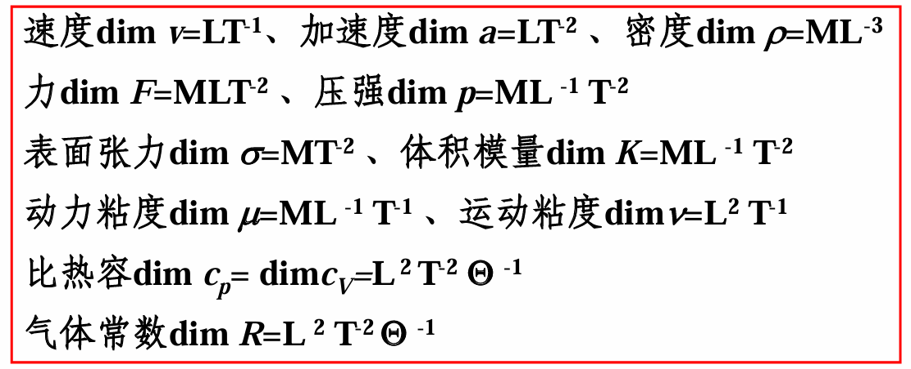

# Chap6 量纲分析和相似理论

## 量纲分析原理

### 量纲分析

空气动力学问题的研究方法：解析方法、计算流体力学方法（CFD）、实验研究方法（实物实验和模型实验）

模型实验在空气动力学研究中有重要作用。量纲分析可以提供复杂实验中各物理量之间的关系。相似理论是模型试验的理论基础。

!!! info "量纲分析"
    1. 在物理现象中，确定<b>物理量之间的函数关系</b>
    2. <b>物理量无量纲化</b>：简化实验结果中物理量之间的关系
    3. 给出<b>无量纲形式的方程组</b>（确定描述物理现象的控制参数）
    4. 给出<b>相似律</b>，使用模型测试来替代大型原型实验

### 量纲公式

任何物理量的度量单位都可用基本单位导出

基本量纲：$L,M,T,\Theta$

导出量纲：$L^lM^mT^t\Theta^s$

## 量纲一致性原则

!!! theorem "量纲一致性原则"
    描述物理现象的物理方程中的各项量纲必然相同

量纲分析：利用量纲一致性原则寻求物理量之间的关系

### 瑞利法

!!! info "瑞利法"
    用定性物理量$x_1、x_2、...x_n$的某种幂次之积的函数来表示被决定的物理量

    $$y=kx_1^{a_1}x_2^{a_2}...x_n^{a_n}$$

    $k$为无量纲系数，由试验确定

    $a_1,a_2,...a_n$为待定指数，根据量纲一致性原则求出

!!! example "例题"
    

    

### 铂金汉定理

!!! theorem "铂金汉定理"
    如果一个物理过程涉及到n个物理量和m个基本量纲，则这个物理过程可以由n个物理量组成的(n-m)个无量纲量（相似准则数$\pi_i$）的函数关系来描述，即

    $$F(x_1,x_2,...x_n)=0$$

    $$\Downarrow$$

    $$f(\pi_1,\pi_2,...\pi_{n-m})=0$$
    
!!! example "例题"
    

    
    
## 相似准则

!!! definition "流动相似"
    表征流动过程的物理量

    - 描述几何形状的，如长度、面积、体积
    - 描述运动状态的，如速度、加速度、体积流量
    - 描述动力特征的，如质量力、表面力、动量

    对应满足相似的条件称为几何相似、运动相似、动力相似，三者皆相似时称为流动相似

### 几何相似

几何相似：模型和原型的全部对应线性长度的比值为一定常数

长度比例尺：$k_l=\frac{l^\prime}{l}$

面积比例尺：$k_A=\frac{A^\prime}{A}=\frac{l^{\prime 2}}{l^2}=k_l^2$

体积比例尺：$k_V=\frac{V^\prime}{V}=\frac{l^{\prime 3}}{l^3}=k_l^3$

### 运动相似

运动相似：满足几何相似的流场中，对应时刻、对应点流速（加速度）的方向一致，大小的比例相等

速度比例尺：$k_V=\frac{V^\prime}{V}$

时间比例尺：$k_t=\frac{t^\prime}{t}=\frac{l^\prime / V^\prime}{l/V}=\frac{k_l}{k_V}$

加速度比例尺：$k_a=\frac{a^\prime}{a}=\frac{V^\prime / t^\prime}{V/t}=\frac{k_V}{k_t}=\frac{k_V^2}{k_l}$

体积流量比例尺：$k_{q_V}=k_l^2 k_V$

运动粘度比例尺：$k_v=k_lk_V$

角速度比例尺：$k_\omega=\frac{k_V}{k_l}$

### 动力相似

动力相似：模型与原型的流场所有对应点作用在流体微团上的各种力彼此方向相同，大小比例相等

力的比例尺：$k_F=\frac{F_P^\prime}{F_P}=\frac{F_\tau^\prime}{F_\tau}=\frac{F_g^\prime}{F_g}=\frac{F_i^\prime}{F_i}$

$F_P$-总压力，$F_\tau$-切向力，$F_g$-重力，$F_i$-惯性力

### 相似判据

!!! info "相似判据"
    - 几何相似、运动相似有比较清晰的关系表达式
    - 动力相似判断方法有**方程分析法**、**量纲分析方法**

!!! info "方程分析法"
    考虑垂直方向（z方向）运动方程

    原形流动：反映实际流场的动力学性质和过程

    $$\rho_{1} \frac{\partial w_{1}}{\partial t_{1}} + \rho_{1} \left( u_{1} \frac{\partial w_{1}}{\partial x_{1}} + v_{1} \frac{\partial w_{1}}{\partial y_{1}} + w_{1} \frac{\partial w_{1}}{\partial z_{1}} \right) = -\rho_{1} g_{1} - \frac{\partial p_{1}}{\partial z_{1}} + \mu_{1} \left( \frac{\partial^{2} w_{1}}{\partial x_{1}^{2}} + \frac{\partial^{2} w_{1}}{\partial y_{1}^{2}} + \frac{\partial^{2} w_{1}}{\partial z_{1}^{2}} \right)$$

    模型流动：反映实验流场的动力学性质和过程

    $$\rho_2 \frac{\partial w_2}{\partial t_2} + \rho_2 \left( u_2 \frac{\partial w_2}{\partial x_2} + v_2 \frac{\partial w_2}{\partial y_2} + w_2 \frac{\partial w_2}{\partial z_2} \right) = -\rho_2 g_2 - \frac{\partial p_2}{\partial z_2} + \mu_2 \left( \frac{\partial^2 w_2}{\partial x_2^2} + \frac{\partial^2 w_2}{\partial y_2^2} + \frac{\partial^2 w_2}{\partial z_2^2} \right)$$

    将相似系数代入模型流动方程

    $$c_l=x_2/x_1=y_2/y_1=z_2/z_1;c_v=u_2 /u_1=w_2 / w_1;c_t=t_2/t_1$$
    
    $$c_\rho=\rho_2 / \rho_1;c_\mu=\mu_2/\mu_1;c_g=g_2/g_1$$

    代入得

    $$\frac{c_{\rho} c_{v}}{c_{t}} \rho_{1} \frac{\partial w_{1}}{\partial t_{1}} + \frac{c_{\rho} c_{v}^{2}}{c_{l}} \rho_{1} \left( u_{1} \frac{\partial w_{1}}{\partial x_{1}} + v_{1} \frac{\partial w_{1}}{\partial y_{1}} + w_{1} \frac{\partial w_{1}}{\partial z_{1}} \right)=-c_{\rho} c_{g} \rho_{1} g_{1} - \frac{c_{p}}{c_{l}} \frac{\partial p_{1}}{\partial z_{1}} + \frac{c_{\mu} c_{v}}{c_{l}^{2}} \mu_{1} \left( \frac{\partial^{2} w_{1}}{\partial x_{1}^{2}} + \frac{\partial^{2} w_{1}}{\partial y_{1}^{2}} + \frac{\partial^{2} w_{1}}{\partial z_{1}^{2}} \right)$$

    对比原形方程，得到两流场相似的充要条件

    $$\frac{c_p c_v}{c_t}=\frac{c_pc_v^2}{c_l}=c_\rho c_g= \frac{c_p}{c_l}=\frac{c_\mu c_V}{c_l^2}$$

    对上式稍作变换，最后可得

    $$\frac{c_l}{c_v c_t}=1,\frac{c_g c_l}{c_V^2}=1,\frac{c_p}{c_\rho c_V^2}=1,\frac{c_mu}{c_Vc_lc_\rho}=1$$

    即为两流场相似时，各相似常数必须满足的关系式，进一步得到

    $$\frac{l_1}{t_1u_1}=\frac{l_2}{t_2u_2},\frac{u_1^2}{g_1l_1}=\frac{u_2^2}{g_2l_2},\frac{p_1}{\rho_1 u_1^2}=\frac{p_2}{\rho_2 u_2^2},\frac{l_1 u_1 \rho_1}{\mu_1}=\frac{l_2 u_2 \rho_2}{\mu_2}$$

    包含无量纲数St、Re、Eu、Fr

!!! note "运动方程相似判据"
    对于动量方程

    $$\rho \frac{\partial w}{\partial t} + \rho \left( u \frac{\partial w}{\partial x} + v \frac{\partial w}{\partial y} + w \frac{\partial w}{\partial z} \right) = - \rho g - \frac{\partial p}{\partial z} + \mu \left( \frac{\partial^2 w}{\partial x^2} + \frac{\partial^2 w}{\partial y^2} + \frac{\partial^2 w}{\partial z^2} \right)$$

    只要四个无量纲数在两流场中时相同的，那么原型和模型流场相似，则两方程应反映同一事实

!!! note "相似参数"
    Reynolds准则（粘性力相似）：雷诺数Re——惯性力与粘性力的比值

    $$Re_L=\frac{\rho L^2U^2}{\mu UL}=\frac{\rho UL}{\mu}=\frac{UL}{v}$$

    Froude准则（重力相似）：弗劳德数Fr——惯性力与重力的比值

    $$Fr=\frac{\rho L^2U^2}{\rho L^3 g}=\frac{U^2}{gL}$$  

    Strouhal准则（非定常性相似）：斯特劳哈尔数St——当地惯性力和迁移惯性力的比值

    $$St=\frac{L}{tU}=\frac{fL}{U}$$

    Euler准则（压力相似）：欧拉数Eu——所受压力与惯性力的比值

    $$Eu=\frac{\Delta pL^2}{\rho U^2L^2}=\frac{\Delta p}{\rho U^2}$$

    Mach准则（弹性力相似）：马赫数Ma——惯性力与弹性力之比

    $$Ma=\frac{\rho U^2L^2}{\rho c_0^2 L^2}=\frac{U^2}{c_0^2}$$

### 相似准则的选择

在流体力学实验中，要保证满足全部相似准则是困难的。模型相似律选择的原则就是保证对流动起主要作用的力相似，而忽略次要力的相似。

堰顶溢流、闸孔出流、明渠流动、自然界中的江河溪
流等，重力起起主要作用，应按弗劳德数相似准则设
计模型

有压管流、低速翼型绕流、流体机械中的流动，粘性
力起主要作用，应按雷诺数相似准则设计模型

对于可压缩流动，应按马赫数相似准则设计模型

## 相似运动方程的无量纲化

### 无量纲方程

!!! note "物理量的表示"
    

### 空气动力学问题中的动力相似准则

对于无粘不可压缩流动：只需满足几何相似的流场条件，即绕流体的几何相似，迎角、侧滑角等

对于不可压粘性流动：除满足上述条件外，雷诺数相等

对于无粘可压缩流动：除满足几何相似，迎角、侧滑角相等条件外，马赫数及绝热指数相等

对于可压缩粘性流动：除满足几何相似，迎角、侧滑角相等条件外，马赫数及绝热指数、雷诺数相等

当考虑热传导时，普朗特数相等