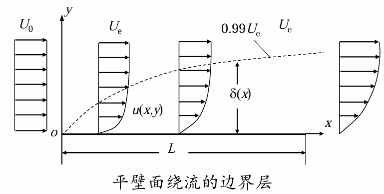
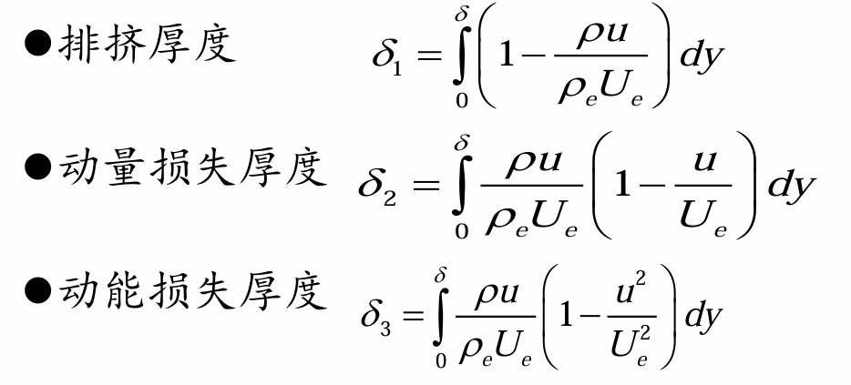

# Chap8 边界层理论

## 边界层的概念

!!! definition "边界层"
    速度梯度很大的薄层，粘性在该薄层内起作用

### 边界层厚度

!!! definition "名义厚度"
    名义厚度：$u=0.99U_e$处的y值$\delta(x)$

    

    可根据边界层中惯性力与粘性力具有相同量级，大致估计边界层的厚度

    惯性力项和粘性力项的量级分别为

    $$\rho u \frac{\partial u}{\partial x} \sim \rho \frac{V_\infty^2}{l}, \frac{\partial}{\partial y}(\mu \frac{\partial u}{\partial y})\sim \frac{\mu V_\infty}{\delta^2}$$

    若

    $$\frac{\rho V_\infty^2}{l} \sim \frac{\mu V_\infty}{\delta^2}$$

    则有

    $$\delta \sim \sqrt{\frac{\mu l}{\rho \infty}}=\frac{l}{\sqrt{Re}}$$

    或写成

    $$\frac{\delta}{l}\sim \frac{1}{\sqrt{Re}}$$

!!! definition "排挤厚度"
    

    排挤厚度用于边界层精确计算时修正物面
    
    厚度为$\delta$的理想流体进入边界层时流量损失等于损失了厚度为$\delta_1$的理想流体流量$\delta_1U_e$

    其被排向主流，使主流的流线较势流流线外移$\delta_1$，相当于势流中物体增加$\delta_1$厚度

    $$\delta_1 U_e=\int_0^\delta (U_e-u) \mathrm{d}y$$

!!! definition "动量损失厚度"
    边界层内损失的动量相当于厚度为$\delta_2$的理想流体动量

    $$\delta_2 = \int_0^{\infty(\delta)} \frac{u}{U_e} (1-\frac{u}{U_e})\mathrm{d}y$$

    边界层动量损失为

    $$\int_0^{y_1} \rho u (U_e-u) \mathrm{d}y$$

!!! definition "动能损失厚度"
    边界层内损失的动能相当于厚度为$\delta_3$的理想流体动能

    $$\delta_3 =\int_{0}^{\infty(\delta)} \frac{u}{U_e}(1-\frac{u^2}{U_e^2}) \mathrm{d}y$$

!!! summary "厚度比较"
    $\delta_2<\delta_1<\delta_3$

    都是流向位置x的函数，随x的增加而增厚

    对于可压缩流体，上述各种厚度计算公式变为  

    

    适用于层流和湍流

## 边界层微分方程 

考察空气流过翼型的流场，流动分为三个区域

边界层：N-S方程化简为边界层方程；尾迹区：N-S方程；势流区：理想流Euler方程

!!! formula "Prandtl边界层方程"
    在<b>高Re数</b>情况下<b>δ较小</b>可以忽略，同时<b>忽略质量力</b>，得到Prandtl边界层方程为

    $$\left\{\begin{aligned}\frac{\partial u}{\partial x} + \frac{\partial v}{\partial y} = 0 \\ \frac{\partial u}{\partial t} + u \frac{\partial u}{\partial x} + v \frac{\partial u}{\partial y} = - \frac{1}{\rho} \frac{\partial p}{\partial x} + v \frac{\partial^2 u}{\partial y^2} \\ \frac{\partial p}{\partial y} = 0\end{aligned}\right.$$

    边界条件为

    $$\left\{\begin{aligned}y=0,u=0,v=0 \\ y=\infty ,u=u_e \end{aligned} \right.$$

!!! summary "边界层基本特征"
    1. 边界层很薄
    2. 边界层内速度梯度很大，粘性不可忽略
    3. 边界层内压力沿壁面法向不变，等于外部势流压力
    4. 边界层内速度分布具有渐进性
    5. 边界层有涡性

!!! info "定常层流边界层问题解法"
    
    
    
    
## 平板层流边界层

!!! formula "边界层方程"
    半无限长平板、不可压缩、定常、层流、不计重力、$\frac{\mathrm{d} p_e}{\mathrm{d}x}=0$

    $$\left\{\begin{aligned}\frac{\partial u}{\partial x} + \frac{\partial v}{\partial y} = 0 \\ u \frac{\partial u}{\partial x} + v \frac{\partial u}{\partial y} = v \frac{\partial^2 u}{\partial y^2} \\ y = 0, \quad u = v = 0 \\ y \rightarrow \infty, \quad u = U_{\infty}\end{aligned}\right.$$

!!! formula "Blasius解法"
    化简后得三阶常微分方程

    $$\left.\begin{aligned}2F''' + FF'' = 0 \\ \eta = 0, F' = 0, F = 0 \\ \eta \rightarrow \infty, F' = 1\end{aligned}\right\}$$

## 边界层动量积分式

!!! formula "边界层动量积分方程"
    边界层动量积分方程

    $$\boxed{\frac{\tau_0}{\rho}=u_e^2 \frac{\mathrm{d} \delta_2}{\mathrm{d}x}+u_e (2\delta_2+\delta_1)\frac{\mathrm{d} u_e}{\mathrm{d}x}}$$

    无量纲形式

    $$\boxed{\frac{C_f}{2}=\frac{\mathrm{d}\delta_2}{\mathrm{d}x}+(2+H)\frac{\delta_2}{u_e}\frac{\mathrm{d}u_e}{\mathrm{d}x}}$$

    $C_f=\frac{\tau_0}{\frac{1}{2}\rho u_e^2}$为当地摩擦系数，$H=\frac{\delta_1}{\delta_2}$称为形状因子

    对平板边界层流动，有$\frac{\mathrm{d}p}{\mathrm{d}x}=0,\frac{\mathrm{d}u_e}{\mathrm{d}x}=0,u_e=const.$

    $$\frac{\tau_0}{\rho}=u_e^2 \frac{\mathrm{d}\delta_2}{\mathrm{d}x}$$

## 边界层微分方程的数值解法

## 边界层的分离

边界层中的流体质点受惯性力、粘性力和压力的作用，其中：

惯性力与粘性力的相对大小决定了粘性影响的相对区域大小，或边界层厚度的大小

粘性力的作用始终是阻滞流体质点运动，使流体质点减速，失去动能

压力的作用取决于扰流物体的形状和流道形状，顺压梯度有助于流体加速前进，而逆压梯度阻碍流体运动

!!! definition "分离点"
    分离点下游区域受逆压梯度的作用而发生倒流。分离点定义为紧邻壁面顺流区与倒流区的分界点

    在分离点附近和分离区，边界层假设不再成立

边界层分离的必要条件是：<b>存在逆压梯度和粘性剪切层</b>

!!! definition "边界层分离"
    在逆压梯度作用下，附面层底层出现倒流，与上层顺流相互作用，形成漩涡脱离物体表面的现象