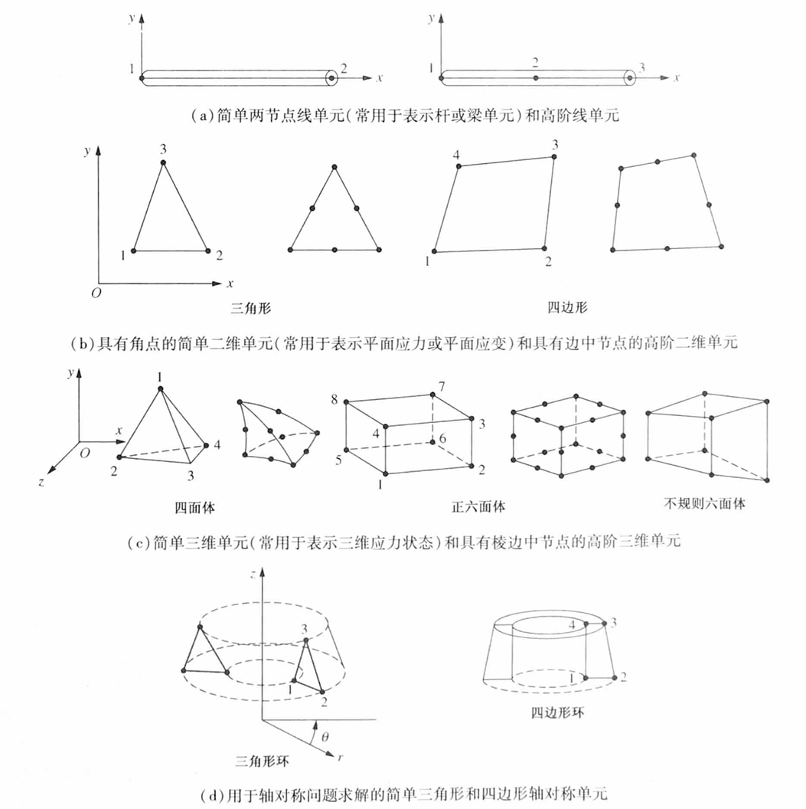

# Chap1 Introduction

## Basic concept of the FEM

!!! definition "FEM"
    Finite Element Method: A numerical technique for obtaining approximate solutions to differential equations

    - FEM discretizes a physical domain into many elements

    - Then reconnect elements at nodes as if nodes were pins or drops of glue that hold elements together

    - This process results in a set of simultaneous algebraic equations(一组联立的代数方程组)

!!! example "example"
    <b>Engineering problems(工程问题):</b> structural analysis(结构分析)、thermal analysis(热分析)、fluid flow(流体流动)、electromagnetics(电磁学)、buckling(变形)

    $$\downarrow$$

    <b>Physical model(物理模型):</b> governing equation(控制方程)$L(\phi)+f=0$、boundary conditions(边界条件)$B(\phi)+g=0$

    $$\downarrow$$

    <b>FEM:</b> a set of simultaneous algebraic equations

    $$KU=F$$

!!! summary "concepts summary"
    - A set of simultaneous algebraic equations at nodes

    $$KU=F$$

    - K-property U-Behavior F-action 

    - FEM uses the concept of piecewise polynomial(分段多项式) interpolation(插值)

    - By connecting elements together, the field quantity becomes interpolated over the entire structure in piecewise fashion

## General steps of the FEM

Step 1: Discretize(离散化) and select the element type(选择单元类型)

Step 2: Select a displacement function(位移函数)

Step 3: Define the strain(应变)/displacement and stress(应力)/strain relationships

对于一维线弹性情况，小应变的应变$\varepsilon_x$和位移$u$的关系为

$$\varepsilon_x=\frac{du}{dx}$$

应力和应变通过本构关系关联，胡克定律为最简单的应力/应变定律

$$\sigma_x=E\varepsilon_x$$

Step 4: Derive(推导) the element stiffness matrix(单元刚度矩阵) and equations

Step 5: Assemble(组合) the element equations(单元方程) to obtain the global equations(总体方程) and introduce boundary conditions

组合方程或总体方程的矩阵形式如下

$$\{F\}=[K]\{d\}$$

其中$\{F\}$为总体节点力矢量，$[K]$为结构总体刚度矩阵，$\{d\}$是结构已知和结构未知的节点的自由度或广义位移

Step 6: Solve for the unknown degrees of freedom(未知自由度)

写为扩展的矩阵形式

$$\left\{\begin{aligned}F_1 \\ F_2 \\ ... \\ F_n \end{aligned}\right\}=\begin{bmatrix}K_{11 } & K_{12} & ... & K_{1n} \\ K_{21} & K_{22} & ... & K_{2n} \\ ... \\ K_{n1} & K_{n2} & ... & K_{nn}\end{bmatrix}\left\{\begin{aligned}d_1 \\ d_2 \\ ... \\ d_n \end{aligned}\right\}$$

其中n是结构未知节点自由度的总数

方程可用消元法或迭代法求解，得出所有d值；d值是利用刚度（或位移）有限元方法获得的第一组量，因此称为初始未知量

Step 7: Solve for the element strains and stresses

Step 8: Interpret the results

## Applications of the FEM

!!! note "Application in Engineering"
    - Structural problems
        + Stress analysis(static/dynamic, linear/nonlinear)
        + Buckling(屈曲)
        + Vibration(振动) analysis
    - Nonstructural problems
        + Heat transfer analysis(steady/transient(瞬时))
        + Fluid flow
        + Distribution of electric or magnetic petential(电势或磁势的分布))

## Errors of the FEM

FEM only obtains <b>approximate</b> solutions with <b>inherent</b> errors(固有误差)