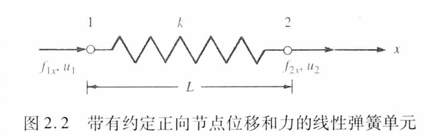

# Chap3 Stiffness method

## Stiffness matrix of spring system

Two nodes: i, j; Nodal displacement: $u_i$, $u_j$; Nodal forces: $f_i$, $f_j$; Spring constant(stiffness): k

## Direct stiffness method

## Applying the fixed displacements

## Properties of global stiffness matrix