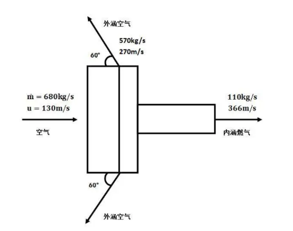
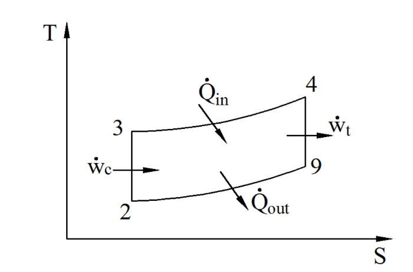

# 附录 作业答案

答案收集自学长学姐，注意校对！

## Homework01

1.（20分）空气流率为 100 kg/s，进口温度为 1400 K，压强 8 atm，马赫数为 0.3，被等熵（绝热可逆）膨胀到 1 atm. 假定空气为量热完全气体，试确定进口速度和面积、出口温度。（r=1.4，$C_p$=1004 J/(kg K)）。

---

2.（15分）减小飞机着陆距离的一个有效方法是反转发动机喷射速度的方向。如图所示是一个大涵道比的涡扇发动机（**注意：这是一个轴对称圆柱形状！**），在飞机着陆时其发动机外涵喷射速度被反转成与水平线 $60^\circ$ 的方向。其它相关参数如图所示（**注意质量守恒！**）。忽略压力的影响，试计算发动机的推力（流体对发动机的作用力）并明确说明其方向（**定义一个正方向！**）。

---

3.（10分）空气流率为 50 kg/s，入口温度为 $20\ ^\circ\mathrm{C}$，被绝热压缩（不可逆）到 $427\ ^\circ\mathrm{C}$. 假定空气为量热完全气体，忽略动能的变化，试确定所需的压缩功率（r=1.4，$C_p$=1004 J/(kg K)）。

## Homework02

1.（20 分）空气入口温度为 225 K，压力 28 kPa，马赫数为 2.0，入口面积为 0.2 $\mathrm{m}^2$，被等熵（绝热可逆）变化到 0.2 Ma。假定空气为量热完全气体，（r=1.4，$C_p$=1004 J/(kg K)），试确定：

(a) 空气的质量流率；

(b) 出口处的压力和温度；

(c) 出口面积；

---

2.（20 分）燃烧气体在缩张管中从（入口）2.0 MPa，2000K，0.05 Ma 被等熵（绝热可逆）加速到（出口）1.3 Ma，其质量流率为 100 kg/s. 假定 R=286 J/(kg K)，r=1.3，试计算：

a) 出口处的压力和温度；

b) 利用 MFP 参数计算入口和出口处的面积。

---

3.（10 分）在 H-K 图中，分别画出等温、等速度、等马赫数、等能量、等冲量函数线各一条。

## Homework03

1.（25 分）氢气和氧气在 500 K 和 1 atm 条件下完全燃烧生成 $\mathrm{H_2O}$，试确定：

a) 反应的燃烧热值（$\mathrm{H_2}$，$\mathrm{O_2}$，$\mathrm{H_2O}$ 的定压比热分别为 31、33 和 41 kJ/(kmol K)，水的标准形成焓为 -241845 kJ/kmol）；

b) 反应的绝热火焰温度（建议把计算值与实际值比较！）。

---

2.（15 分）一个小型液体火箭发动机在实验中测得以下参数：

喷管出口速度：$\quad$ 800 m/s
喷管出口质量流率：50 kg/s
喷管出口压力：$\quad$ 350 kPa
喷管出口面积：$\quad$ 0.02 $\mathrm{m}^2$
环境压力：$\quad\quad\quad$ 100 kPa

试确定其有效喷射速度，推力，比冲。

## Homework04

1.（15 分）一个单级火箭系统需要将 2000 kg 的有效载荷送入低地轨道。假定火箭发动机的比冲为 400 s。试确定系统发射时的初始质量（$\Delta u_{ef} = 9140\ \mathrm{m/s}$，$\delta = 0.03$，不再考虑重力和空气阻力）。

---

2.（15 分）一个小型 $\mathrm{H_2/O_2}$ 火箭发动机在海平面（1 atm）处于最佳工作状态，其最佳推力为 444800 N，其喷管的出口面积为 $0.33\ \mathrm{m}^2$，假定其比冲为 400 s。试确定其：

a) 有效喷射速度；

b) 喷管出口的喷射速度；

c) 推进剂质量流率；

d) 真空推力。

## Homework05

1.（20 分）一个两级火箭系统需要将 2000 kg 的有效载荷送入低地轨道（总的速度变化要求 $\Delta u_{ef} = 9140\ \mathrm{m/s}$，不需要再考虑重力和空气阻力）。假定每一级火箭的比冲都为 400 s、$\delta = 0.03$，每一级火箭系统完成一半的速度变化要求。试确定火箭系统发射时的初始质量。

---

2.（25 分）一个**理想的** $\mathrm{H_2/O_2}$ 火箭发动机的在海平面上（1 atm）的理论推力为 444800 N，其燃烧室的温度为 2680 K，喷管的喉部面积为 $0.05\ \mathrm{m}^2$。假定其比冲为 400 s，r=1.26，R=0.92 KJ/(Kg K)。试确定：

a) 有效喷射速度；

b) 推进剂质量流率；

c) 特征速度；

d) 燃烧室压力；

e) 推力系数；

f) 达到最佳推力时的喷管出口面积。

## Homework06

1.（20 分）一个安装前的涡喷发动机进行地面静态试验（$\mathrm{Ma}_0=0$，$p_t=1$ atm，$T_t=289$ K）。发动机入口面积 $A_1$ 为 $0.56\ \mathrm{m}^2$，测得发动机入口处的压力为 0.95 atm、喷管出口处的喷射速度为 500m/s。假定流动为理想的等熵流动过程、喷管处于最佳膨胀状态。忽略燃油的质量流率，试计算这个发动机的安装前推力。[r=1.4，R=286 J/(Kg K)]

---

2.（20 分）一个涡喷发动机进行地面静态试验（$\mathrm{Ma}_0=0$，$p_t=1$ atm，$T_t=289$ K）。发动机入口面积 $A_1$ 为 $0.56\ \mathrm{m}^2$，质量流率为 60 kg/s。试确定其入口附加阻力 $D_{\mathrm{add}}$。 [r=1.4，R=286 J/(Kg K)]（注意：$\mathrm{Ma}_1$ 为亚声速）

## Homework07

1.（20 分）一个涡喷发动机以 300m/s 的速度飞行，其吸入的空气为 100kg/s，燃油消耗率为 1.0kg/s，燃油的热值为 42000kJ/kg，喷管喷出的燃气速度为 600m/s。假定喷管处于最佳膨胀状态，试计算这个发动机的：

a) 安装前推力；

b) 单位燃油消耗率；

c) 热效率；

d) 推进效率；

e) 总效率。

---

2.（20 分）如图，一个理想的 Brayton 循环中，$T_2$=300K，$T_3$=700K，$T_4$=2000K。假定 r=1.4，R=286 J/(Kg K)，试计算

a) 循环过程的热效率；

b) 循环过程中单位流量的净输出功。

## Homework08

1.（25 分）一个理想的涡喷发动机，其工作参数如下：

飞行马赫数 $Ma_0 = 0.9$，环境温度 $T_0 = 217K$，$\pi_c = 20$，$T_{t4} = 1670K$，
$C_p = 1.004kJ/(kgK)$，$\gamma = 1.4$，$\Delta h_c = 42800kJ/kg$

试确定其：

a) 喷管出口速度 $u_9$；

b) 喷管出口温度 $T_9$；

c) 单位推力（$F/m_0$）；

d) 单位燃油消耗率（S）；

e) 油气比（f）。

---

2.（25 分）一个理想的小涵道比涡扇发动机，其工作参数如下：

涵道比 $\alpha = 1$，风扇的总压力比 $\pi_f = 4$，飞行马赫数 $Ma_0 = 0.9$，
环境温度 $T_0 = 217K$，$\pi_c = 20$，$T_{t4} = 1670K$，$C_p = 1.004kJ/(kgK)$，$\gamma = 1.4$，
$\Delta h_c = 42800kJ/kg$

试确定其：

a) 喷管出口速度 $u_9$ 和 $u_{19}$；

b) 喷管出口温度 $T_9$ 和 $T_{19}$；

c) 单位推力（$F/m_0$）；

d) 单位燃油消耗率（S）；

e) 油气比（f）。