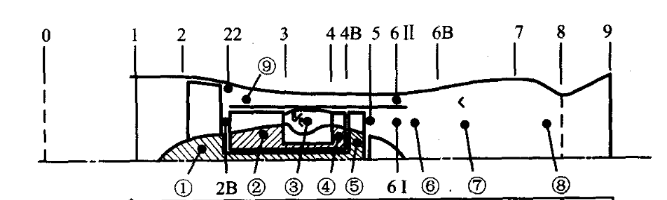
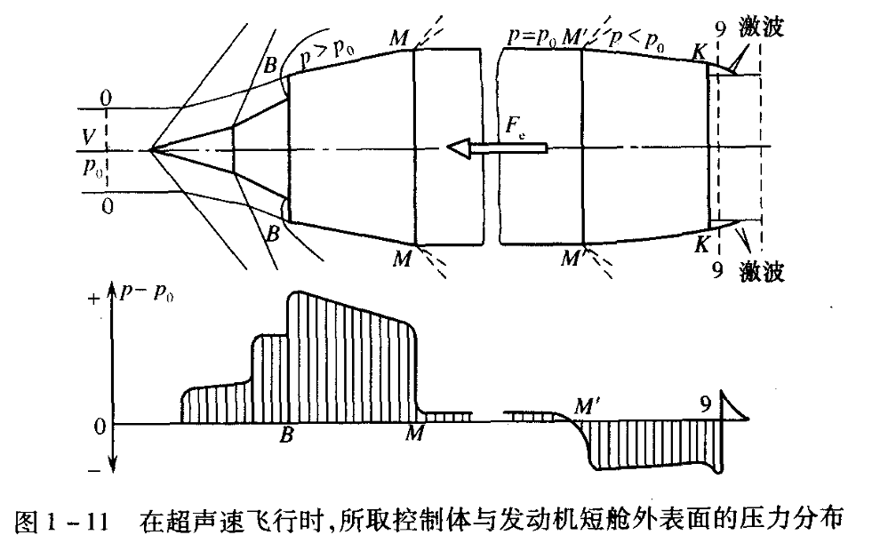
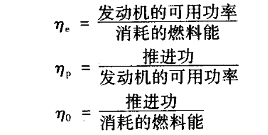

# Chap1 绪论

!!! definition "推进"
    本课程中指喷气推进（Jet Propulsion），即通过高速（吸入、）喷出动力系统的流体的动量变化来产生推力的方法，包括：

    + 火箭推进（一般无需空气）：化学能、电能、太阳能、核能等（适用于大气层内、外，推力大，一般需要自身携带氧化剂）
        - 化学能推进：化学反映产生高温气体，然后膨胀加速
            + 推进剂分为液体推进剂（氢/氧，液氧/煤油等）、固体推进剂（火药）、混合推进剂
            + 增压方法有高压存储气体（中小推力）、涡轮增压（大推力）
        - 电推进

    + 吸气推进（利用空气）：航空发动机（涡轮发动机）、冲压发动机等（适用于大气层内）
        - 航空涡轮发动机：
            + 涡喷发动机：单位推力大、推进效率低、高速
            + 涡轮涡桨发动机：单位推力小、推进效率高、较低的速度（Ma0.6左右）
            + 涡扇发动机：推进效率高、单位推力较大、大多数飞机
            + 涡轮轴发动机：直升机等

    + 组合推进系统：吸气推进与火箭推进（或其他推进系统）的组合，扩大工作范围、提高效率

!!! note "特征截面及其符号"
    

    - 0——发动机远前方未收扰动截面
    - 1——进气道与发动机的交界面
    - 2——风扇（低压压气机）进口截面
    - 22——风扇（低压压气机）出口截面
    - 2B——高压压气机进口截面
    - 3——高压压气机出口（主燃烧室进口）截面
    - 4——主燃烧室出口（高压涡轮进口）截面
    - 4B——高压涡轮出口（低压涡轮进口）截面
    - 5——低压涡轮出口截面
    - 6Ⅰ——混合器内涵进口截面（有时认为与5截面重合）
    - 6Ⅱ——混合器外涵进口截面
    - 6B——混合器出口（加力燃烧室进口）截面
    - 7——尾喷管进口截面
    - 8——尾喷管喉部截面
    - 9——尾喷管出口截面

涡轮风扇（或涡轮喷气）发动机既是热力机又是推进器。作为热力机，它将燃料燃烧放出的热能转变为机械能；作为推进器，它又把获得的机械能转变为有效推进功

有效推力是指直接用来克服飞行器的迎面阻力和惯性力而做有效功的力，因此是作用在发动机内部和动力装置外表面上所有气体压力和摩擦力的轴向合力，可表示为：

$$F_e=F_{\text{in}}-F_{\text{out}}$$

取控制体，控制体内的气体在0-0截面处速度为$V$，空气流量为$W_a$；在9-9截面处速度为$c_9$，其流出的燃气流量为$W_g$

$F_{in}$的计算公式为：

$$F_{in}=W_gc_9-W_aV+p_9A_9-p_0A_0-\int_{A_0}^{A_B}p\mathrm{d}A$$

$F_{out}$的计算公式为：

$$F_{out}=\int_{A_B}^{A_K}p\mathrm{d}A+\int_{A_K}^{A_9}p\mathrm{d}A+X_f$$

其中$X_f$为作用在短舱外表面上摩擦力的总和

可得

$$F_e=W_gc_9-W_aV+(p_9-p_0)A_9-\int_{A_0}^{A_9}(p-p_0)\mathrm{d}A-X_f$$

假设$p=p_0$、$X_f=0$，则此时动力装置的有效推力称为发动机理想推力，即

$$F=W_gc_9-W_aV+(p_9-p_0)A_9$$

$(W_gc_9-W_aV)$为流过发动机内部气体的动量变化率，称为推力的动力分量；$(p_9-p_0)A_9$是由于尾喷管内燃气不完全膨胀引起的，称为推力的静力分量

飞行中能量转换有效程度采用三种效率：有效效率$\eta_e$、推进效率$\eta_p$、总效率$\eta_0$

推力性能指标

- 推力和单位推力

$$F_s=\frac{W}{F_a}$$

- 推重比

- 迎面推力