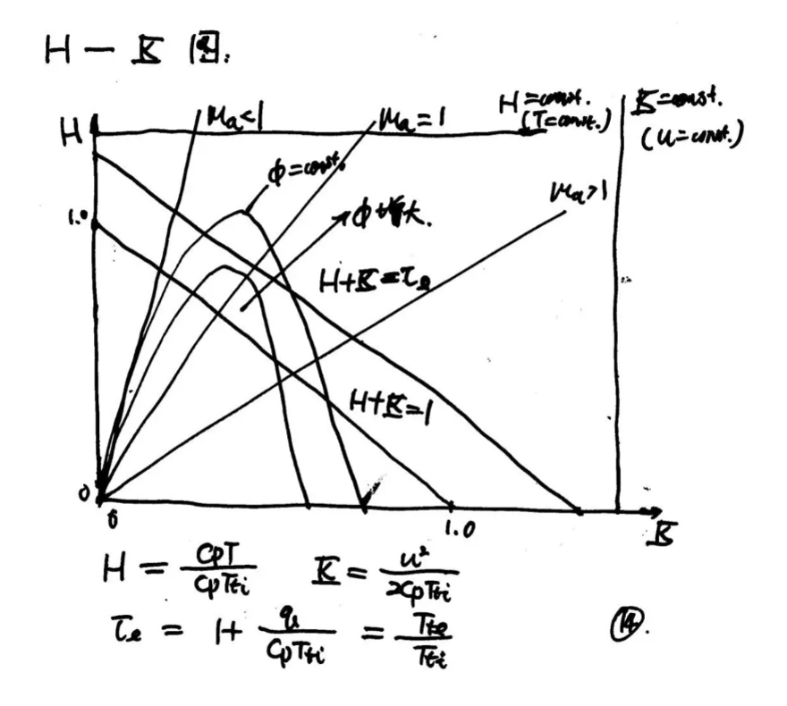

# Chap3 内流可压缩流动现象

直观、物理现象的了解

## 等能量流动

!!! definition "流推力函数"
    流推力函数：单位质量流率的冲量函数

    $$Sa=\frac{I}{\dot{m}}=u(1+\frac{RT}{u^2})$$

定义

$$H=\frac{C_p T}{C_p T_{ti}}$$

为无量纲的焓

$$K=\frac{u^2}{2C_pT_{ti}}$$

为无量纲的动能

等能量流动满足

$$H+K=1$$

## 加热的等面积无摩擦流动（Raileigh流动）

热壅塞现象（超声速燃烧室）

初始状态

$$H_i+K_i=1$$

出口

$$H_e+K_e=\tau_e\ge 1$$

## 等面积有摩擦无加热的流动（Fanno流动）

摩擦壅塞现象

$$\Phi_i >\Phi_e$$