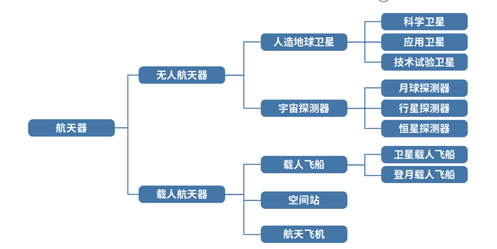

# Chap1 绪论

## 航天器的分类与系统组成

### 分类

航天技术包括航天器、运载工具和地面测控三大部分

人造地球又可分为观测站、中继站、基准站和轨道武器四类

### 基本系统组成

基本系统一般分为有效载荷和保障系统两大类

## 航天器控制的基本概念

一个刚体航天器的运动可由其位置、速度、姿态和姿态运动来描述

位置和速度描述航天器的质心运动，属于航天器的轨道问题

姿态和姿态运动描述航天器绕质心的转动，属于姿态问题

从运动学的观点来说，一个航天器的运动具有6个自由度，其中3个位置自由度表示航天器的轨道运动，另外三个绕质心的转动自由度表示航天器的姿态运动

!!! note "航天器控制"
    航天器的控制可以分为两大类，即轨道控制和姿态控制

    - 轨道控制：对航天器的质心施以外力，以有目的地改变其运动轨迹的技术
        + 轨道控制包括轨道确定和轨道控制两方面内容
        + 
    - 姿态控制：对航天器绕质心施加力矩，以保持或按需要改变其在空间的定向的技术

## 控制稳定性分析方法