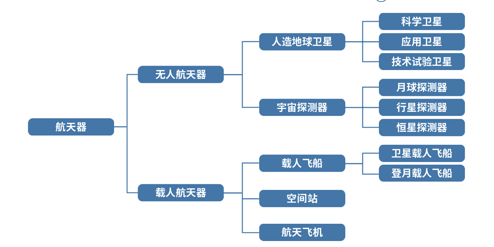
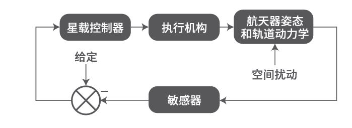
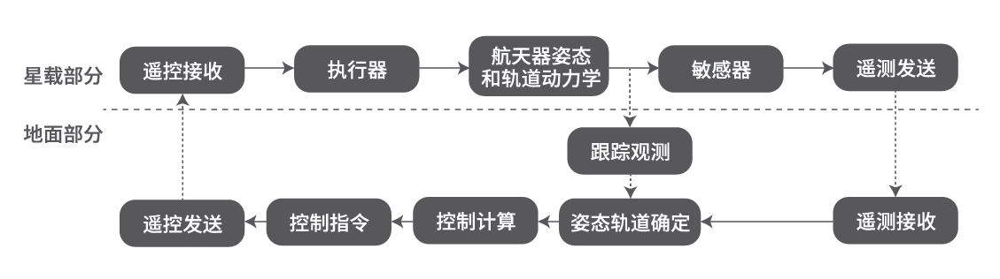

# Chap1 绪论

## 航天器的分类与系统组成

### 分类

航天技术包括航天器、运载工具和地面测控三大部分

!!! note "人造地球卫星分类"
    人造地球卫星根据在轨道上的功能又可分为观测站、中继站、基准站和轨道武器四类

    - 观测站
        + 视场大、不受大气干扰影响，利于地球观察和天文预测
        + 侦察卫星、气象卫星、地球资源卫星、海洋卫星、预警卫星、核爆炸探测卫星、天文预测卫星
    - 中继站
        + 对信息进行放大和转发
        + 通信卫星、广播卫星、跟踪和数据中继卫星
    - 基准站
        + 轨道上的测量基准点
        + 导航卫星、测地卫星
    - 轨道武器
        + 具有空间防御和空间攻击的职能
        + 拦截卫星、轨道轰炸系统

### 基本系统组成

基本系统一般分为有效载荷和保障系统两大类

有效载荷是指用于直接完成特定的航天飞行任务的部件、仪器或分系统

保障系统又称卫星平台，用于保障航天器从火箭起飞到工作寿命终止，星上所有分系统的正常工作，一般包括结构、热控、电源、姿控、轨控、测控等分系统

!!! note "保障系统"
    - 结构系统：用于支承和固定航天器上各种仪器设备，使它们构成一个整体，以承受地面运输、运载器发射和空间运行时的各种力学环境以及空间运行环境
        + 通常用结构质量比，即结构质量占航天器总重量的比例来衡量航天器结构设计和制造水平
    - 热控制系统：
    - 电源系统：
    - 姿态控制系统：用来保持或改变航天器的运行姿态
        + 常用的姿态控制方式有<b>重力梯度稳定、自旋稳定和三轴稳定</b>
    - 轨道控制系统：用来保持或改变航天器的运行轨道
        + 与姿态控制配合，构成航天器控制系统
    - 测控系统：包括<b>遥测、遥控和跟踪</b>三部分
        + 遥测部分主要由<b>传感器、调制器、发射机</b>组成，用于测量并向地面发送航天器的各种仪器设备的工程参数（212作电压、电流和温度等）和其他参数（环境参数和姿态参数等）
        + 遥控部分一般由<b>接收机和译码器</b>组成，用于接收地面测控站发来的遥控指令，传送给有关系统执行
        + 跟踪部分主要是<b>信标机和应答机</b>，不断发出信号，以便地球测控站跟踪航天器并测量其轨道位置和速度

一般航天器按舱段划分可以分为<b>有效载荷舱和公用舱</b>两部分，或者分为<b>有效载荷舱、公用舱和推进舱</b>三部分。有效载荷放置于有效载荷舱中，保障系统安装在公用舱和推进舱中。

## 航天器控制的基本概念

一个刚体航天器的运动可由其位置、速度、姿态和姿态运动来描述。

位置和速度描述航天器的质心运动，属于航天器的轨道问题；姿态和姿态运动描述航天器绕质心的转动，属于姿态问题。

从运动学的观点来说，一个航天器的运动具有6个自由度，其中3个位置自由度表示航天器的轨道运动，另外三个绕质心的转动自由度表示航天器的姿态运动。

!!! note "航天器控制"
    航天器的控制可以分为两大类，即轨道控制和姿态控制

    - 轨道控制：对航天器的质心施以外力，以有目的地改变其运动轨迹的技术
        
    - 姿态控制：对航天器绕质心施加力矩，以保持或按需要改变其在空间的定向的技术

### 轨道控制

轨道控制包括轨道确定和轨道控制两方面的内容

- 轨道确定的任务是研究如何确定航天器的位置和速度，有时也称为空间导航，简称导航

- 轨道控制是根据航天器现有位置、速度、飞行的最终目标，对质心施以控制力，以改变其运动轨迹的技术，又称为制导

轨道控制应用方式可分为四类：

- 轨道机动：指航天器从一个自由飞行段轨道转移到另一个自由飞行段轨道的控制

- 轨道保持：指克服摄动影响，使航天器轨道的某些参数保持不变的控制

- 轨道交会：指航天器能与另一个航天器在同一时间以相同速度达到空间同一位置而实施的控制过程

- 再入返回保持：指使航天器脱离原来的轨道，返回进入大气层的控制

### 姿态控制

姿态控制包括姿态确定和姿态控制

姿态控制通常包括

- 定向：指航天器的本体或附件以单轴或三轴按一定精度保持在给定的参考方向上

- 再定向：指航天器本体从对一个参考方向的定向改变到另一个新参考方向的定向

- 捕获：又称为初始对准，是指航天器由未知不确定姿态向已知定向姿态的机动控制过程

- 粗对准：

- 精对准：

- 跟踪：

- 搜索：

姿态稳定是保持已有姿态的控制，可分为

- 自旋稳定：卫星等航天器绕其一轴（自旋轴）旋转，依靠旋转动量矩保持自旋轴在惯性空间的指向。自旋稳定常辅以主动姿态控制，来修正自旋轴指向误差

- 三轴稳定：依靠主动姿态控制或利用环境力矩，保持航天器本体三条正交轴线在某一参考空间的方向

### 姿态控制与轨道控制的关系

航天器控制按控制力和力矩的来源可分为

- 被动控制：其控制力或力矩由空间环境和航天器动力学特性提供，不需要消耗星上能源

- 主动控制：需要消耗电能或工质等星上能源，由星载或地面设备组成闭环系统来实现

主动控制系统可分为

- 星上自主控制；指不依赖于地面干预，完全由星载仪器实现的控制

- 地面控制：或称星-地大回路控制

## 控制稳定性分析方法