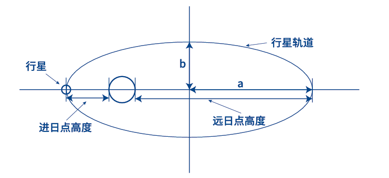
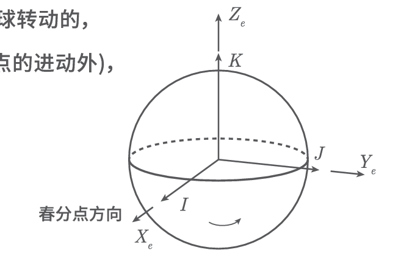
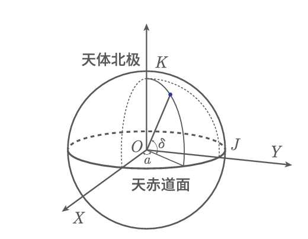
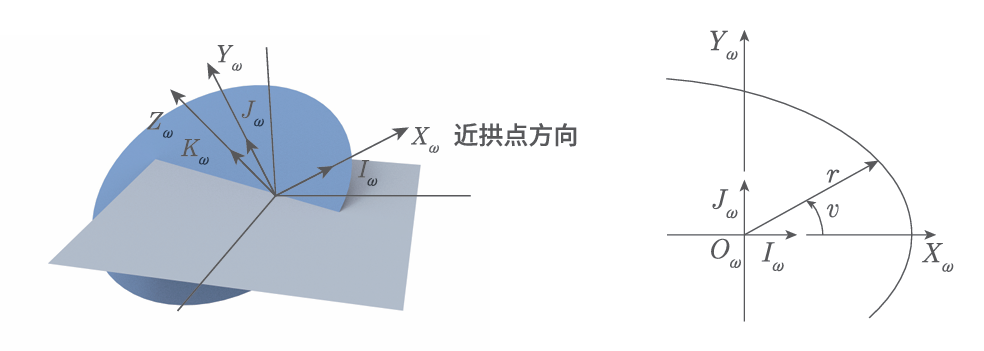
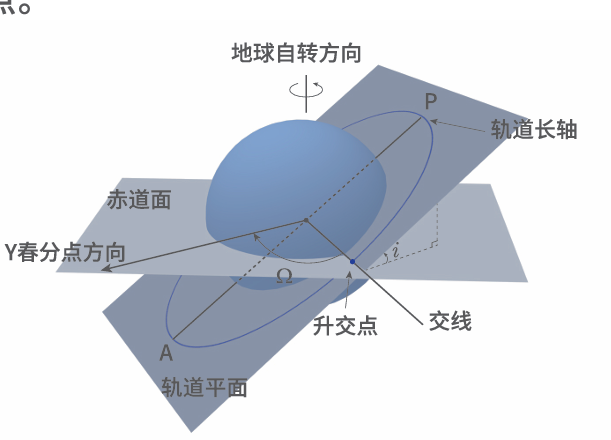

# Chap2 轨道动力学

## 航天器轨道基本定律

轨道动力学主要研究航天器在重力场和其他外力作用下的质点动力学问题

!!! theorem "开普勒行星运动定律"
    1. 第一定律——<b>椭圆律</b>：<b>每个行星沿椭圆轨道绕太阳运行，太阳位于椭圆的一个焦点上</b>。

    2. 第二定律——<b>面积律</b>：<b>由太阳到行星的矢径在相等的时间间隔内扫过相等的面积</b>。$\mathrm{d}A/\mathrm{d}t$表示单位时间内矢径扫过的面积叫做面积速度，这种变化规律叫做面积速度守恒。

    3. 第三定律——<b>周期律</b>：<b>行星绕太阳公转的周期T的平方与椭圆轨道的长半径a的立方成正比</b>，即

        $$a^3/T^2=K$$

    

!!! theorem "牛顿定律"
    1. 第一运动定律：任一物体将保持其静止或是匀速直线运动的状态，除非有作用在物体上的力强迫其改变这种状态
    2. 第二运动定律：动量变化速率与作用力成正比，且与作用力的方向相同
    3. 第三运动定律：对每一个作用，总存在一个大小相等的反作用

!!! theorem "万有引力定律"
    任何两个物体间均有一个相互吸引的力，这个力与它们的质量成正比，与两物体间距离的平方成反比

    $$\vec{F}_g=-\frac{GMm}{r^2}\frac{\vec{r}}{r}$$

    $G=6.670\times 10^{-13} N\cdot cm^2/g^2 $

## 二体轨道力学与运动方程

!!! proof "二体运动方程推导"
    对于N体问题，有

    $$\ddot{\vec{r}_i}=-G\sum_{j=1,j\ne i}^n \frac{m_j}{r_{ji}^3}(\vec{r_{ji}})$$

    对i=1

    $$\ddot{\vec{r}_1}=-G\sum_{j=2}^n \frac{m_j}{r_{j1}^3}(\vec{r_{j1}})$$

    对i=2

    $$\ddot{\vec{r}_2}=-G\sum_{j=1,j\ne 2}^n \frac{m_j}{r_{j2}^3}(\vec{r_{j2}})$$

!!! formula "二体运动方程"
    $$\ddot{r}+\frac{\mu}{r^3}r=0$$

    M为中心引力体，$\mu=GM$为引力参数 

### 轨道运动常数

机械能守恒：当卫星沿着轨道运行时，卫星的比机械能$\varepsilon$（即单位质量的动能和单位质量的势能之和）既不增加，也不减少，而是保持常值

$\varepsilon=\frac{v^2}{2}-\frac{\mu}{r}$

角动量守恒：比角动量h沿着其轨道为一常数

$h=r \times v$

## 航天器轨道的几何特性与轨道描述

!!! formula "轨道几何方程"
    $$r \cdot \dot{r} \times h=r \cdot \mu \frac{v}{r}+r \cdot B$$

轨道几何方程为一个圆锥曲线的极坐标方程

!!! summary "航天器轨道运动总结"
    - 圆锥曲线族为二体问题中的航天器唯一可能的运动轨道
    - 中心引力体中心必定为圆锥曲线轨道的一个焦点
    - 当航天器沿着圆锥曲线轨道运动时，其比机械能保持不变
    - 航天器绕中心引力体运动，当r和v沿轨道变化时，比角动量h保持不变
    - 轨道运动总是处在一个固定于惯性空间的平面内

1. 圆锥曲线轨道的几何参数

$$e=\frac{c}{a}$$

$$p=a(1-e^2)$$

2. 轨道的近拱点和远拱点

轨道长轴的两个端点称为拱点，离主焦点近的称为近拱点，离主焦点远的称为远拱点

3. 轨道形状与比机械能

### 椭圆轨道

### 圆轨道

### 抛物线轨道

### 双曲线的轨道

### 航天器的轨道描述

1. 日心黄道坐标系

2. 地心赤道坐标系

3. 赤经赤纬坐标系

4. 近焦点坐标系

### 经典轨道要素

!!! note "轨道六要素"
    - 轨道倾角$i$：航天器运行轨道所在的面叫轨道面，这个平面通过地心，与地球赤道平面的夹角称为轨道倾角
    - 升交点赤径$\Omega$：从春分点方向轴量起的升交点的经度，顺地球自转方向为正
    - 近地点角距$\omega$：投影在天球上的椭圆轨道近地点与升交点对地心所张的角度，从升交点顺航天器运行方向量到近地点
    - 椭圆轨道的长半轴$a$
    - 椭圆偏心率$e$
    - 航天器过近地点的时刻$t_p$

    

!!! note "轨道参数的实际意义"
    - 确定航天器轨道平面在空间的方位：由轨道倾角i与升交点赤经$\Omega$确定
    - 确定椭圆长轴在轨道平面上的指向：由近地点角距$\omega$确定
    - 确定航天器在轨道上的位置：由航天器过近地点时刻$t_p$把时间和空间（航天器在轨道上的位置）联系起来

星下点轨迹

### 经典轨道

1. 地球同步轨道：航天器绕地球运行的周期与地球自转周期相同的轨道

2. 地球静止轨道：轨道倾角为零的地球同步轨道

3. 地球回归轨道：星下点轨迹出现周期性重复的轨道

4. 太阳同步轨道：航天器轨道面转动角速度与地球公转角速度相同的轨道

## 轨道摄动

!!! definition "摄动"
    以上讨论的航天器运行轨道，是一种理想情况，与实际情况有差别

    这是因为：

    1. 地球并非理想的球体
    2. 没有考虑大气阻力对航天器运动的影响
    3. 没有考虑其他天体对航天器的作用
    4. 没有考虑地球周围的磁场作用

    这些因素，使得航天器在实际上并不沿开普勒轨道运动，航天器轨道参数每时每刻都在变化，从而偏离由开普勒定律所确定的轨道，这种偏离现象称为摄动

    卫星和航天器的实际运动轨道就称为受摄开普勒轨道

### 地球非球形摄动