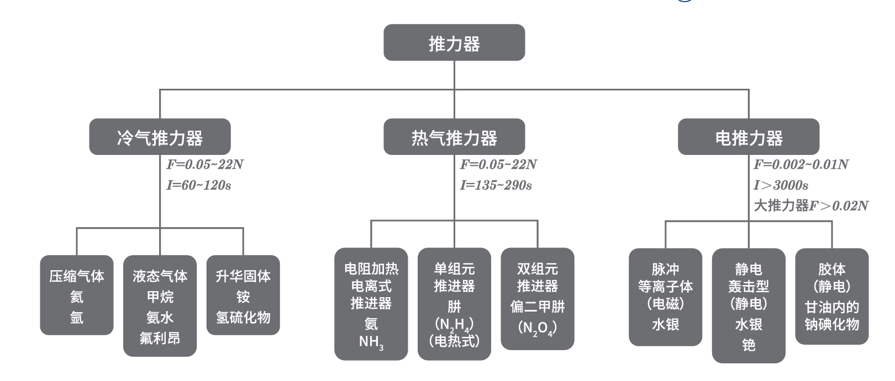

# Chap6 姿态控制系统

## 姿态控制模式分类

被动式：自旋稳定、环境力矩稳定

主动式：以飞轮执行机构为主的三轴姿态控制系统、喷气三轴姿态控制、地磁力矩控制系统

## 执行机构

!!! formula "推力公式"
    $$F=\dot{m}v_e +S_ep_e$$

!!! definition "比推力"
    推力器推力与工质的中来那个秒耗量之比

    $$I_S=\frac{F}{\dot{m}g_0}=\frac{v_{ef}}{g_0}$$

根据飞轮的结构特点和产生控制作用的形式可以分为惯性轮、控制力矩陀螺和框架动量轮三种

其中惯性轮又分为反作用轮和动量轮两种

### 星载控制计算机

## 常见控制模式基本原理

### 自旋卫星的稳定性

### 自旋卫星的章动性

### 自旋卫星的章动阻尼

### 重力梯度稳定系统