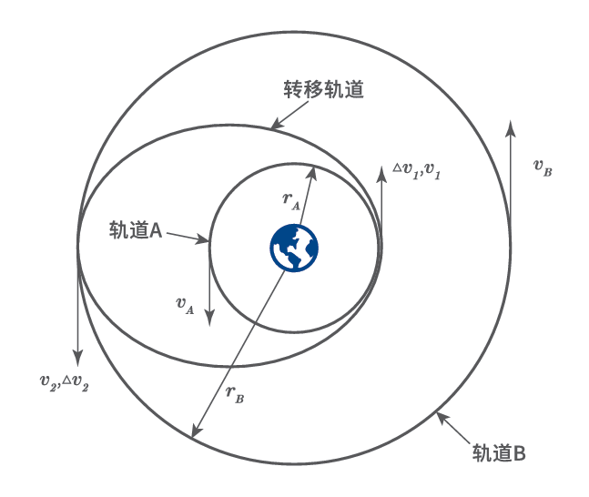

# Chap9 轨道控制和编队控制

## 轨道机动

轨道机动包括变轨控制和轨道校正

变轨控制分为轨道改变和轨道转移

### 霍曼转移

!!! question "最优轨道转移问题"
    给定的是一个沿半径为$r_A$的圆形轨道A运行的航天器，要确定以最小的燃料消耗量把航天器从轨道B转移到半径为$r_B$的圆形轨道B所需要的速度增量

转移轨道的偏心率为

$$e=\frac{(r_B/r_A)-1}{1+(r_B/r_A)}$$
## 轨道保持

## 编队控制

### 组网构型设计

### 卫星编队