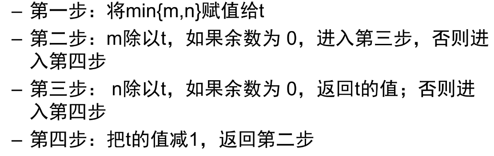
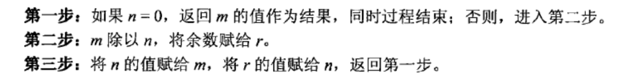

# Chap1 算法概念及效率分析基础

## 绪论

### 算法概念

算法：一系列解决问题的明确指令

算法性质：
- 输入：零个或多个外部量
- 输出：至少一个量
- 确定性：每条指令清晰、无歧义
- 有限性：每条指令的执行次数有限，执行时间有限

!!! note 求解最大公约数
    质因数分解法：求m和n的质因数分解式，然后公因数相乘
    
    连续整数检测法：降序遍历整数序列
    
    欧几里得分解法：
    
    PS：质数表可以用埃拉托色尼筛选法

### 问题类型

问题类型：排序、查找搜索、字符串处理、图问题、组合问题、几何问题、数值问题

### 基本数据结构

+ 数据：描述客观事物的符号，是计算机中可以操作的对象，是能被计算机识别并输入给计算机处理的符号集合 
+ 数据元素：组成数据的、有一定意义的基本单位，在计算机中通常作为整体处理，也被称为记录
+ 数据项：数据不可分割的最小单位，一个数据元素可以由若干个数据项组成
+ 数据对象：性质相同的数据元素的集合，是数据的子集
+ 数据结构：相互之间存在一种或多种特定关系的数据元素的集合

#### 逻辑结构

逻辑结构是指数据对象中数据元素之间的相互关系

+ 集合结构
+ 线性结构
+ 树形结构
+ 图形结构

#### 存储结构

存储结构是指数据的逻辑结构在计算机中的存储形式
+ 顺序存储结构：数据元素存放在地址连续的存储单元中，数据间的逻辑关系和物理关系一致
+ 链式存储结构：数据元素存放在任意的存储单元中（需要指针存放数据元素的地址）

#### 数据类型

+ 数据类型：一组性质相同的值的集合及定义在此集合上的一些操作的总称
+ 抽象：抽取出事物具有的普遍性的性质
+ 抽象数据类型（Abstact Data Type）：一个数学模型及定义在该模型上的一组操作，体现了程序设计中问题分解、抽象和信息隐藏的特性

数据结构：
- 线性列表（数组、链表、字符串、栈和队列）
- 图（无向图、有向图）
- 树（自由树、有根树）
- 集合字典
- 抽象数据类型：由一个表示数据项的抽象对象集合和一系列对这些对象所做的操作构成

## 算法效率分析基础

### 算法效率分析框架

时间效率（time complexity，时间复杂度）
- 算法运行速度快慢的度量
- 算法输入规模的函数
- 对输入规模为n的算法，可采用算法的基本操作执行次数，来对其效率进行度量
- 可区分为最优效率（best-case efficiency）、最差效率（worst-case efficiency）、平均效率（average-case efficiency）

基本操作：算法中最重要的、对总运行时间的贡献最大的操作，如比较（排序）、乘法（矩阵乘法）、边或节点的访问（图问题）

$$T(n)\approx c_{op}C(n)$$

空间效率（space complexity，空间复杂度）：算法运行存储空间大小的度量

### 算法效率的渐进表征

渐进表征：算法执行次数随着输入规模的增长而增长的速度

|符号|含义|
|:-:|:-:|
|$O(g(n))$|增长次数小于等于$cg(n)$的函数集合|
|$\Omega(g(n))$|增长次数大于等于$cg(n)$的函数集合|
|$\Theta(g(n))$|增长次数介于$c_1g(n)$和$c_2g(n)$间的函数集合|

### 非递归算法的效率分析

1. 使用变量n描述输入规模
2. 定义算法的基本操作
3. 在输入规模为n的情况下，区分最坏、平均和最好情况
4. 对基本操作的执行次数进行求和
5. 使用相关公式和规则对求和进行化简

### 递归算法的效率分析

递归算法
- 函数调用自身
- 子问题与原问题属于同样问题，且更为简单
- 不能无限制调用，需有出口条件

