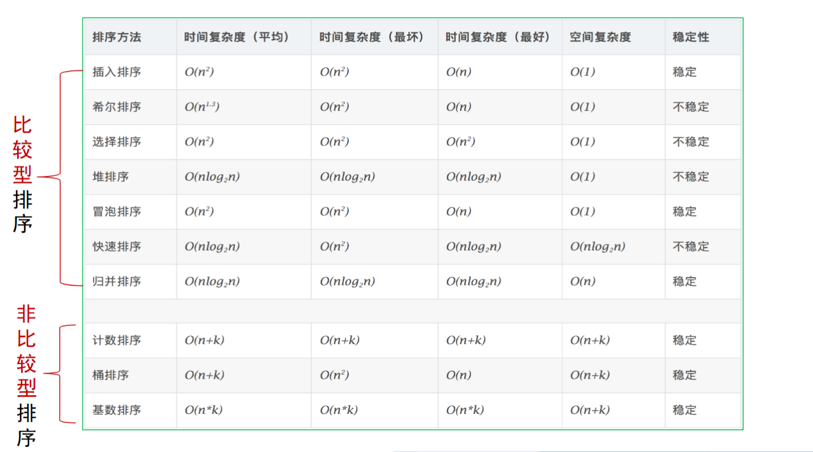

# 时空权衡

!!! note 基本思想
    - 输入增强（Input Enhancement）：对问题的部分或全部输入做预处理，然后将获得的额外信息进行存储，以加速后面问题的求解
        + 计数法排序
        + Boyer-Moore字符串匹配及简化版本
    - 预构造（Prestructing）：使用额外空间来实现更快和更方面的输入数据存储，从而提高算法的时间效率
        + 散列法（Hashing）
        + B树

## 计数排序

算法思想：针对待排序数组的每一个元素，统计数组中小于该元素的元素个数，并将结果统计在表中

```
ComparisonCountingSort(A[0..n-1])
for i<-0 to n-1 do Count[i]<-0
for i<-0 to n-2 do 
  for j<-i+1 to n-1 do
    if A[i]<A[j]
      Count[j]<-Count[j]+1
    else Count[i]<-Count[i]+1
for i<-0 to n-1 do S[Count[i]]<-A[i]
```

效率为$O(n^2)$，空间复杂度增加，但时间效率没有提升

### 分布计数排序

算法思想：假设最小值l和最大值u已知，统计每个元素在数组中出现的频率及分布值

```
DistributionCountingSort(A[0..n-1],l,u)
for j<-0 to u-l do D[j]<-0  // 初始化频率数组
for i<-0 to n-l do D[A[i]-l]<- D[A[i]-l]+1  // 计算频率值
for j<-1 to u-l do D[j]<-D[j-1]+D[j] // 重用于分布
for i<-n-1 downto 0 do 
    j<-A[i]-l
    S[D[j]-1]<-A[i]
    D[j]<-D[j]-1
return S
```

时间效率：$O(n+k)$（k为输入数组元素的范围）

### 桶排序

算法思想：将待排序数组n个元素均匀分布到k个桶中，然后对每个桶中的元素进行排序

### 基排序

算法思想：将待排序数组统一为同样的数位长度，从最低位到最高位，依次进行一次排序



### 最小距离排序问题

!!! note 求解思路
    1. 按照比较计数排序方法，计算小于当前数的项数，记录在count数组中
    2. 基于这些计数，移动当前位置为i的项到其目标位置count[i]
    3. 将原本位于count[i]的项移动到count[count[i]]位置处
    4. 重复上述两个步骤，直至所有项移动到正确位置

## 字符串匹配中的输入增强技术

算法思想：对于模式进行预处理得到的一些信息，储存在表中，在查找过程中策略性地使用这些信息，使得模式往后移动的距离尽可能大

著名算法
- KMP算法：Knuth-Morris-Pratt（模式匹配时，从左到右比较）
- BM算法：Boyer-Moore（模式匹配时，从右到左比较）
- Harspool算法：BM算法的简化


### Harspool算法
### Boyer-Moore算法

坏符号移动
好后缀移动

## 散列法

## B树