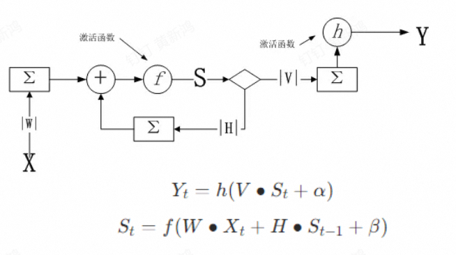

# 人工智能基础（A）

!!! abstract
  - 时间：2024-2025 秋冬学期
  - 教师：朱朝阳
  - 学分：2.0
  - 教材：/（《人工智能：一种现代的方法》）

## 绪论


## 机器学习

基于统计建模，通过数据和算法使计算机系统能够自动学习和改进

有监督学习
分类 拟合

无监督学习
聚类 降维

半监督学习

强化学习

深度学习

五要素：数据、模型、训练、预测和评估

步骤：1.获取数据和预处理 2.特征提取 3.训练模型 4.模型评估和优化 5.预测分类结果解释

应用：图像识别、自然语言处理、推荐系统、预测分析、自动驾驶

线性分类 逻辑回归模型
损失函数：评估性能、优化目标
二分类问题 交叉熵损失函数
梯度下降
迭代优化算法
随机初始化参数、计算梯度、沿反向小步更新参数、损失函数收敛到局部最小值
随机梯度下降：加快速度、找到更优解
正则化：解决过拟合

决策树
特征选择、决策树生成、决策树剪枝
特征选择：信息增益、信息增益比、基尼指数
决策树生成：递归
决策树剪枝：解决过拟合问题
预剪枝：限制条件 后剪枝：先生成完整树，删除贡献不大的子树

过拟合欠拟合
过拟合：增加数据量、交叉验证、早停、数据增强

## 深度学习

主要模型
多层感知机（MLP）
卷积神经网络
循环神经网络
Transformer
扩散模型

### 感知机模型

### 单隐含层MLP

### BP算法

误差反向传播算法

RELU是隐含层中最为常用的损失函数

## Chap4 打开机器学习之门

### 问题求解


### 机器学习定义

#### 概念

定义：已知一个**数据集**，其中输入$X$均存在与其对应的**标签**$Y$，寻找一个**数学模型**，使得对于所有X，$Y^\prime$尽可能逼近$Y$，该寻找过程称为机器学习

样本：每一对$X$和$Y$称为样本

样本空间：$Y$的所有可能取值

要素：数据、模型、训练、预测、评估

#### 评价指标

||预测正|预测负|
|:-:|:-:|:-:|
|实际正|TP：真正例|FN：假反例|
|实际负|FP：假正例|TN：真反例|

准确率：

$$准确率=\frac{预测正确的样本数}{样本总数}\times 100\%$$

精确率：

$$精确率=\frac{TP}{TP+FP}\times 100\%$$

召回率：

$$召回率=\frac{TP}{TP+FN}\times 100\%$$

F1：

$$F1=2\times \frac{精确率\times召回率}{精确率+召回率}$$

基准测试：与公认的大型数据集进行对比验证。公认数据集经过数据清洗，具有良好的分布

交叉验证：将数据集划分为多个子集，将模型训练和测试分别在不同子集上进行，从而减少过拟合和提高模型性能

#### 面临挑战

数据质量、可解释性、计算资源、过拟合

消除过拟合，提升泛化能力：

- 交叉验证

- dropout：动态随机切断神经元的连接

- 正则化：L1范式（LASSO回归）和L2范式（岭回归），优化损失函数

- 不过度训练（实时监控）

- 特征选择

- 集成学习，即多种不同质模型的组合投票

- 核心：数据质量与预处理技术

### 机器学习算法

十大算法：线性回归、逻辑回归、贝叶斯算法、支持向量机、K-近邻、决策树、随机森林、聚类算法、梯度下降、深度学习

#### 梯度下降

定义：以最快速度找到函数局部最小值的优化算法

限制：固定学习率、局部最优、每次计算全部样本误差、损失函数必须连续可导

优化器：随机梯度下降法SGD（一次计算一个/批）、自适应梯度算法AdaGrad（根据权重梯度自适应调整学习率）

#### 回归

定义：找出自变量X和因变量Y之间的数学函数关系

线性回归：一次函数关系

#### 逻辑回归

#### 决策树

#### 随机森林

#### 支持向量机

#### 聚类

#### K最近邻

#### 朴素贝叶斯

### 强化学习

### Scikit-learning

## Chap5 深度学习基础

主要模型：多层感知机、卷积神经网络、循环神经网络、Transformoer、扩散模型

### 图像识别技术

### 感知机模型

### 单隐含层MLP

### 损失函数

#### 回归损失函数

用于衡量回归系统的误差

- 均方误差（mean_squared_error）

$$MSE=\frac{1}{N}\sum_{i=1}^N(T_i-Y_i)^2$$

- 平均绝对误差（mean_absolute_error）

$$MAE=\frac{1}{N}\sum_{i=1}^N|T_i-Y_i|$$

- 平均绝对百分比误差（mean_absolute_percentage_error）

- 均方根对数误差（mean_squared_logarithmic_error）

#### 分类损失函数

用于衡量分类系统的误差

- 二进制交叉熵（binary_crossentroppy）
用于二分类问题，对应激活函数sigmoid

- 多分类交叉熵（categorical_crossentropy）
用于多分类问题，对应激活函数softmax

### 激活函数

- Sigmoid

    + $f(x)=\frac{1}{1+e^{-x}}$

    + 非线性

    + 在[-3,3]优化比较明显

    + 值域是[0,1]，是非对称算法，下一个神经元只能接受正值的输入

- ReLU

    + $f(x)=max(0,x)$

    + 非线性

    + 不会同时激活所有神经元

    + 计算速度快

    + 有趋于零的梯度

    + **是目前隐含层最为常用的激活函数**

- Softmax

    + $S_i=\frac{e^{x_i}}{\sum_j e^{x_j}}$

    + 应用最为广泛的一个激活函数分类器，一般用于最后一层，输出分类结果

### BP算法

## Chap6 卷积神经网络

卷积运算：卷积运算就是通过设计一系列大小适中的卷积核（感受野），对数字图像的各个通道分量（二维矩阵）进行卷积，提取特征值的过程。

参数：

- 卷积核形状
常用的卷积核大小为3×3、5×5、7×7

- 步长
决定运算速度

- 卷积核数量
决定每一层能提取的特征数

池化（pooling）：池化也称下采样，其作用就是缩小特征图的尺寸，减少计算量。池化的原理是可以用某一图像区域子块的统计信息包含了该子块全局信息。池化操作主要有最大池化、平均池化、随机池化、L2范数池化、
K-max池化和全局平均池化等。CNN常用2×2区域进行池化。


独热码（One-Hot code）：在分类问题中，我们不能将不同的分类用1,2,3，……这种有序的数字来表示，只能通过独热码这样的向量矩阵来进行编码，供计算机识别计算，并用所在索引位置的概率值来预测最终的分类结果

层次特征学习：深度神经网络之所以如此强大，一个很重要的原因在于它可以通过层次性处理逐渐提取抽象特征。随着层次的深入，低级特征逐渐向高级特征进化。

输出尺寸的计算公式通常为：
Output Height (or Width)=(W−K+2P)/S+1
W 是输入的宽度（或高度）
K 是卷积核的大小（kernel size）
P 是填充大小（padding）
S 是步幅（stride）

## Chap7 循环神经网络

循环神经网络（Recurrent Neural Network，RNN）：是一种特殊类型的反馈神经网络，专门用于处理序列数据。RNN的核心思想在于其循环结构，使得网络能够捕捉和利用序列中的顺序依赖性信息。RNN的基本单元是一个具有循环连接的神经网络层。这个循环连接允许网络在处理每个时间步的数据时，能够利用之前时间步的信息。具体来说，RNN在每个时间步都会接收一个输入，并产生一个输出，同时其内部状态（隐藏状态）会被更新并传递到下一个时间步。



RNN的问题：无法学习太长的序列
长短期记忆网络（Long Short-Term Memory， LSTM ）：专门设计用于解决长期依赖的问题


## Chap8 自然语言处理

nlp技术演变：基于规则算法->统计语言模型->序列生成模型->预训练-微调模型

Token：令牌，可以是一个字，也可以是一个词，或者是一个字母，甚至是一个字节，要看具体的情况。
本质上，一个“Token”就是通过分词技术（工具）将一句话分割成的最小单位，是一个特定的自然语言处理模型能处理的最基本元素。

词向量就是词的特征分布，是NLP模型层与层之间进行信息传递的数据形式
词向量和词嵌入是指的同一个东西，区别在于词向量是指数字编码技术，词嵌入是指NLP网络之间的数据存在形式

文本相似度

- 余弦相似度

$$
\frac{A \cdot B}{||A|| ||B||}
$$

- 欧氏距离

- Jaccard相似度

$$
\frac{A \cdot B}{||A||^2 + ||B||^2 - A \cdot B}$$

或者

$$\frac{A \cap B}{A \cup B}$$

## Chap9 Transformer

LLM（Large Language Model，大语言模型） 特指用于执行NLP任务的语言模型

- 训练数据大

- 参数规模大

- 耗资巨大

GAI（Generative Artificial Intelligence，生成式人工智能）

自回归生成技术 不是搜索引擎

AGI（Artificial General Intelligence，通用人工智能）是指机器能够完成人类能够完成的任何智力任务
的能力

GPT（Generative Pre-trained Transformer），是一个基于Transformer结构的预训练模型。

MLLM（Multimodal Large Language Model，多模态大语言模型）

## 附录 pytorch和tensorflow函数及其参数解释

### tensorflow

1. 定义模型

```python
model = models.Sequential([
    layers.Conv2D(32, kernel_size=(3, 3), activation='relu', input_shape=(32, 32, 3)),
    layers.MaxPooling2D(pool_size=(2, 2)),
    layers.Flatten(),
    layers.Dense(128, activation='relu'),
    layers.Dense(10, activation='softmax')  # 假设是10分类问题
])
```

2. 编译模型

```python
model.compile(optimizer=Adam(),  # Adam 优化器
              loss=SparseCategoricalCrossentropy(from_logits=False),  # 交叉熵损失函数
              metrics=[Accuracy()])  # 评估指标：准确率
```

- optimizer：优化器（如 'adam', 'sgd', Adam(), SGD() 等）

- loss：损失函数（如 'sparse_categorical_crossentropy', 'binary_crossentropy', MeanSquaredError() 等）

- metrics：评估指标（如 Accuracy(), Precision(), Recall() 等，通常用于分类任务）

3. 训练模型

```python
model.fit(train_images, train_labels, batch_size=32, epochs=10, validation_data=(val_images, val_labels)
```

- x_train, y_train：训练数据和标签

- batch_size：每个训练步骤的样本数量

- epochs：训练的轮数

- validation_data：验证数据集，用于训练时每个 epoch 后进行评估

4. 评估模型

```python
test_loss, test_accuracy = model.evaluate(test_images, test_labels)
```

- x_test, y_test：测试数据和标签，模型使用它们计算损失和评估指标

#### pytorch

1. 定义模型

```python
class CNNModel(nn.Module):
    def __init__(self):
        super(CNNModel, self).__init__()
        self.conv1 = nn.Conv2d(3, 32, kernel_size=3, padding=1)
        self.pool = nn.MaxPool2d(2, 2)
        self.fc1 = nn.Linear(32 * 16 * 16, 128)
        self.fc2 = nn.Linear(128, 10)  # 10 类分类问题

    def forward(self, x):
        x = self.pool(torch.relu(self.conv1(x)))
        x = x.view(-1, 32 * 16 * 16)  # 展开为一维
        x = torch.relu(self.fc1(x))
        x = self.fc2(x)
        return x
```

2. 定义损失函数和优化器

```python
model = CNNModel()
criterion = nn.CrossEntropyLoss()  # 损失函数
optimizer = optim.Adam(model.parameters(), lr=0.001)  # Adam 优化器
```

3. 模型训练

```python
def train_model(model, train_loader, num_epochs=10):
    model.train()  # 设置模型为训练模式
    for epoch in range(num_epochs):
        running_loss = 0.0
        for images, labels in train_loader:
            optimizer.zero_grad()  # 清除梯度
            outputs = model(images)  # 前向传播
            loss = criterion(outputs, labels)  # 计算损失
            loss.backward()  # 反向传播
            optimizer.step()  # 更新参数
            running_loss += loss.item()  # 累加损失
        print(f"Epoch {epoch+1}/{num_epochs}, Loss: {running_loss / len(train_loader):.4f}")
```

4. 评估模型

```python
def evaluate_model(model, test_loader):
    model.eval()  # 设置模型为评估模式
    y_true = []
    y_pred = []
    with torch.no_grad():
        for images, labels in test_loader:
            outputs = model(images)
            _, predicted = torch.max(outputs, 1)  # 获取最大概率的类别
            y_true.extend(labels.numpy())
            y_pred.extend(predicted.numpy())

    accuracy = accuracy_score(y_true, y_pred)
    print(f"Test Accuracy: {accuracy * 100:.2f}%")
    return accuracy
```

- model.train() 和 model.eval()：
train()：设置模型为训练模式。在训练模式下，模型会启用 dropout、batch normalization 等层的训练模式。

eval()：设置模型为评估模式。在评估模式下，模型会禁用 dropout 和 batch normalization。

- optimizer.zero_grad()：
清除模型参数的梯度。因为 PyTorch 默认会对梯度进行累加，所以每次迭代前需要清除上一次的梯度。

- model(images)：
前向传播：将输入数据传递给模型，获取输出。

- loss.backward()：
反向传播：计算损失函数的梯度。

- optimizer.step()：
更新模型参数。

- accuracy_score(y_true, y_pred)：
计算模型在测试集上的准确率。