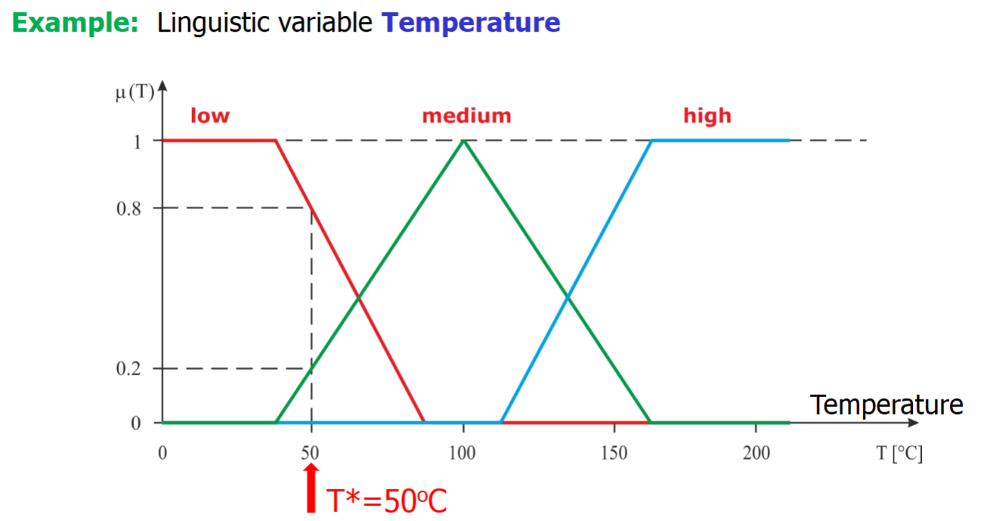
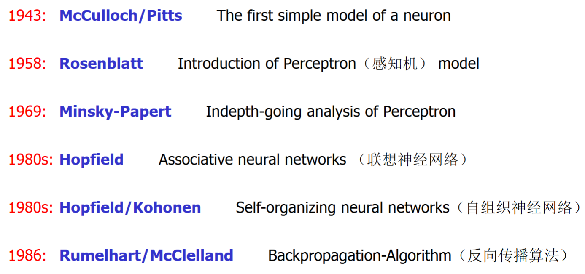

# Chap2 Fuzzy logic and ANN: Introduction

!!! abstract 
    - Biological background

    - Historical development

    - Basic ideas and principles

## Fuzzy logic: Introduction

### Introduction

The fuzzy logic(FL) is an extension of the binary logic(二元逻辑).

The crucial step towards the application of fuzzy logic to technical systems: to allow **variables with linguistic(qualitative, fuzzy) values**, to **map them onto a numerical(quatitative) range**(将语言变量映射到数字范围) and to process them at the numberical level automatically(自动数值计算).

### Fuzzy logic

Use and map well-defined words(linguisitics parameters) that describe the existing interdependencies in a **for humans natural way**

This makes it possible to incorporate **empirical process knowledge**(经验性知识) that is available in a linguistic form into numeric control strategies

The **major premise of fuzzy theory** is the(for a human natural) incompatibility of high complexity and high precision(高复杂性和高精度的不可兼容性)。Striving for high precision if often even counterproductive!(适得其反)

The fuzzy concept is predestined for the control of complex processes, which **cannot be described mathematically**(or only extremely resourced-consuming effort) and **therefore cannot be controlled using the the classical control theory**

### Understanding of fuzziness

The **fuzziness of information** provided in colloquial(common) or technical language is characterized by **a gradual representation(渐变表示) of the truth values**

This fuzziness in the statements in natural language allows a **certain flexbility in the decision-making process** and thus **enables intelligent system behavior**

A combination of fuzzy statements is a **relatively precise description of the system behaviour** and reflects the existing **expert knowledge(in form of IF-THEN rules)**

### Key concepts of fuzzy logic 

FL describes logical systems in the mathmatical sense, with the aim of implementing models representing human decision making(IF-THEN rule base)

In a fuzzy set, a so-called **membership function**(隶属度函数) assigns a numerical value to each element to the set, which is **the degree of belonging to the set**

Fuzzy set theory is a generalization(一般化) of a classical set theory

Membership degree and probablity are different in nature and have absolutely no correlation

### Operation of a fuzzy controller

The behaviour of a fuzzy controller is determined by a **set of IF-THEN rules(fuzzy rules)** that form a so-called **rule base**(规则库)

In addition, **fuzzy inference**(模糊推理) based on fuzzy mathematics for the **numberical processing**(数值处理) of these fuzzy rules(which are **linguistic statements**语言性陈述) must be also be defined to convert the (numberical) input values of the controller into a (numeric) output value of the controller

Each element of the codomain(上域/陪域) belongs to the membership degree that varies between 0(no belonging) and 1(full belonging)

### Fuzzification(模糊化) of input signals

Fuzzification: the transformation of a **numeric input signal into a set of membership degrees** for all values(fuzzy sets) of the linguistic input variable

If the linguistic input variable is described by n fuzzy sets, then the fuzzification step results in an n-dimensional vector with the elements $\mu_i(x)\in [0,1], i=1,..n$
which is called a **fuzzified input signal** or a **belonging vector** to the fuzzy sets

!!! example
    
    在此例中，温度是语言变量（linguistic variable），T=50℃是语言值（linguistic value）和输入信号（numberic input signal），对于low，medium，hign三个模糊集（fuzzy set）的隶属度（membership）分别是0.8，0.2，0，故模糊化（fuzzification）的结果是模糊化输入信号（fuzzified input signal）[0.8,0.2,0]

### Fuzzy-logic reasoning(inference)

When the controller receives numeric input signals, the fuzzy rule base will be processed by a **given inference method** to calculate a fuzzy output value

### Defuzzification(解模糊)

The **numeric output signal of the FC** has to be determined by defuzzificationof this fuzzy output value

## Neural Networks: Introduction

### History

### Artificial neural networks(ANN, NN)

### Generalization

Ability to draw conclusions about unknown things on the condition that given unknown information is different from the existing information, but is similar to

Advantage: Ability to discover complex dependences （依赖性）between input/output that are difficult to describe by mathematical formulas or linguistic rules

In associative learning, which provides a learning model for the supervised trained(有监督训练) artificial NN, a new response becomes associated with a particular stimulus

- instrumental conditioning
  learning the relationship between a stimulus(event) and a reaction 
- classical conditioning
  learning the relationships between two different events 

Structure and connnetion strengths(weights) of an ANN determine its behavior and represent the degrees of freedom during optimization.
