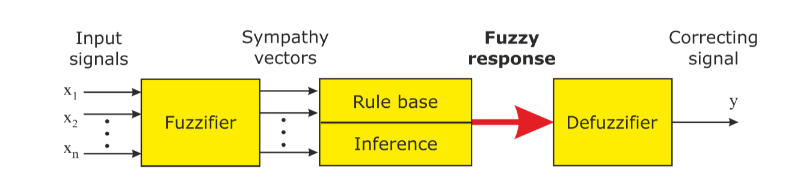

## Chap4 Fuzzy control

!!! abstract
  - Fuzzification
  - Fuzzy inference
  - Fuzzy controller
  - Defuzzification

A fuzzified signal is an n tuple of membership degrees; n is the number of linguistic 