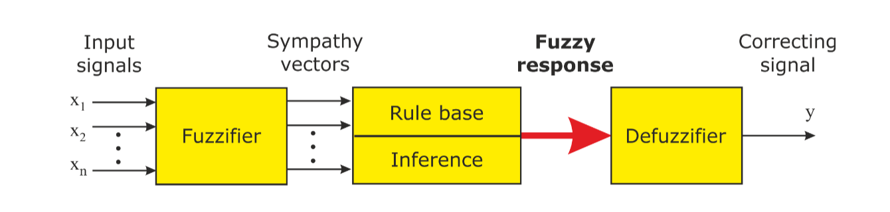

# 模糊控制和人工神经网络

!!! abstract 摘要
    - 时间：2024-2025 冬学期
    - 教师：马志鹏
    - 学分：2.0
    - 教材：/

## Chap1 Control challenges in robotics and automation

### System & Model

### Introduction: Automation

Closed-loop control

Open-loop control(non-feedback control)

### Introduction: Robotics

mechanical subsystems

- Vehicle or platform(coarse positioning)
- Manipulator(fine positioning)
- Endeffector

characterized by

- Kinematics/Dynamics(运动学与动力学)
- Actuators/Sensors(驱动器与传感器)
- Control system
- SW/User interface

## Chap2a Fuzzy Logic: Introduction

The fuzzy logic(FL) is an extension of the binary logic(二元逻辑).

The crucial step towards the application of fuzzy logic to technical systems: to allow variables with linguistic(qualitative, fuzzy) values, to map them onto a numerical(quatitative) range and to process them at the numberical level automatically.

The major premise of fuzzy theory is the(for a human natural) incompatibility of high complexity and high precision(高复杂性和高精度的不可兼容性).

FL describes logical systems in the mathmatical sense, with the aim of implementing models representing human decision making(IF-THEN rule base)

In a fuzzy set, a so-called membership function(隶属度函数) assigns a numerical value to each element to the set, which is the degree of belonging to the set.

Membership degree and probablity are different in nature and have absolutely no correlation.

## Chap2b Neural Networks: Introduction

In associative learning, which provides a learning model for the supervised trained(有监督训练) artificial NN, a new response becomes associated with a particular stimulus

- instrumental conditioning
  learning the relationship between a stimulus(event) and a reaction 
- classical conditioning
  learning the relationships between two different events 

Structure and connnetion strengths(weights) of an ANN determine its behavior and represent the degrees of freedom during optimization.

## Chap3 Mathematical basics of fuzzy logic

Given μ is a fuzzy set in G, then 
{x| x∈G,μ(x)>0} is called support of fuzzy set μ
{x| x∈G,μ(x)=1} is called kernel of fuzzy set μ

fuzzy-similar: have the same kernal
strongly fuzzy-similar: have the same kernal and the same support

And link(intersection)

$$
\mu_1 \cap \mu_2:G \rightarrow[0,1], with (\mu_1 \cap \mu_2)(x) = MIN\{\mu_1 (x) + \mu_2(x)\}
$$

Or link(union)

$$
\mu_1 \cup \mu_2 : G\rightarrow[0,1] mit (\mu_1 \cap \mu_2)(x) = MAX \{\mu_1 (x), \mu_2(x)\}
$$

Special operators: Modifiers
- Concentration operator CON
- Dilatation operator DIL

fuzzy relations
$$
R: G_1 \times G_2 \rightarrow [0,1]
$$

$$
(\mu_1 \times \mu_2)(x,y)= MIN\{ \mu_1(x), \mu_2(y)\}, with (x,y) \in G_1 \times G_2
$$

$$
\mu_1 \times \mu_2 =\mu_1^T \circ \mu_2
$$

product calculation is replaced by the MIN opertor and the addition is replaced by the MAX operatior

$$
\mu_{R \circ S}(x, z)= MAX_{y \in G_2} {MIN \{\mu_R(x,y), \mu_S(y,z)}\}, with (x,z) \in G_1 \times G_3
$$

fuzzy inference

$$
\mu_2(y) = MAX_{x \in G_1} \{ MIN{\mu_1 (x), \mu_R(x,y)}\} = \mu_1 \circ R, y\in G_2
$$

inference with several rules

1. Construct implication relation for each rule i

$$
\mu_{R_i}(x,y) = I(\mu_{A_i}(x), \mu_{B_i}(y))
$$

2. Aggregate relations $R_i$ into one

$$
\mu_R(x,y) = aggr(\mu_{R_i}(x,y))
$$

The aggr operator is the minimum for implications and the maximum for junctions

3. Use relational composition to derive B' from A'

$$
B^\prime = A^\prime \circ R
$$

## Chap4 Fuzzy control

A fuzzified signal is an n tuple of membership degrees; n is the number of linguistic 

## Chap5 Neuron models

### Mcculloch-Pitts model

MCP network is a directed graph that contains a set of neurons.

### Perceptron

XOR and identity can not be computed by a singel perceptron.

A perceptron can only compute linearly separable functions of n binary arguments.

