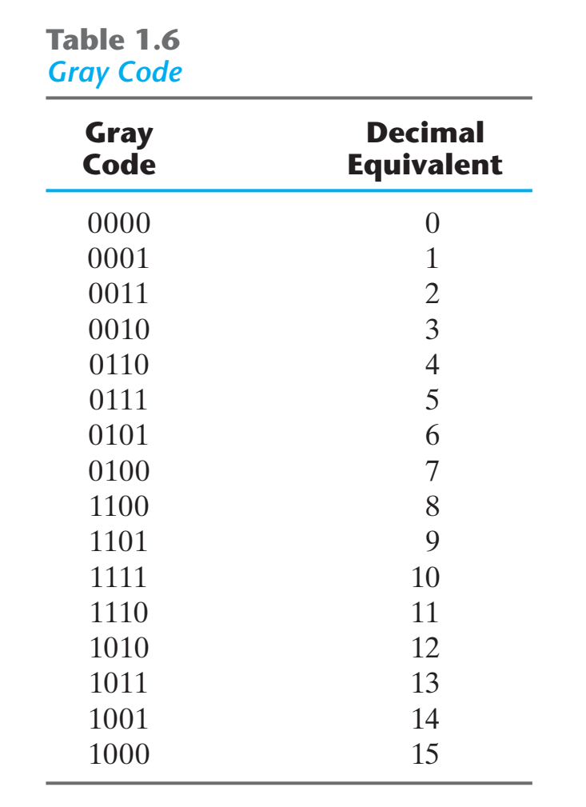

# Chap1 Digital Systems and Binary Numbers

## Introduction

电子电路作用：信息处理、能量转换

!!! summary 
    - Structure
        + hierarchical design
        + limited complexity at each level
        + reusable building blocks
    - Interface
        + key elements of system engineering
        + isolate technologies, allow evolution
        + major abstraction mechanism
    - Design
        + minimal mechanism, maximal function
        + reliable in a wide range of environments
        + accommodates future technical improvements

!!! definition "数码"
    - 数制：数码表示数量时，多位数码每一位的构成方法和从低位到高位的进位规则
    - 码制：数码表示不同事物或事物不同状态时，编制代码遵循的规则
    - 数字电路中采用二进制，表示数量时称二进制，表示事物时称二值逻辑

## Complements of numbers

!!! definition "radix complement"
    Diminished radix complement: Given a number N in base r having n digits, the (r-1)'s complement of N, i.e., its dimished radix complements, is defined as (r^n - 1) - N

    Radix complement: The r's complement of an n-digit number N in base r is defined as r^n - N

!!! definition "反码、补码"
    对于有效数字（不包括符号位）为n位的二进制数N，其补码为
 
    $$(N)_{COMP}=\left\{\begin{aligned}N, when \quad N \quad is \quad positive \\ 2^n-N , when \quad N \quad is\quad negative \end{aligned}\right.$$

    其原码为

    $$(N)_{INV}=\left\{\begin{aligned}N, when \quad N \quad is \quad positive \\ (2^n-1)-N , when \quad N \quad is\quad negative \end{aligned}\right.$$

!!! attention "教材差异"

    补码对应英文教材的"radix complement"，而反码对应英文教材的"diminished radix complement"

    二进制补码对应英文教材中的"2's Complement"，而反码对应"1's Complement"

!!! note "补码的减法"
    考虑两个有$n$位数字的$r$进制无符号数做减法$M-N$

    1. 将被减数$M$加上减数$N$的补码，即$M+(r^n-N)=M-N+r^n$
    2. 如果$M\ge N$，结果的和将产生可被丢弃的进位$r^n$，剩下的就是$M-N$的结果
    3. 如果$M<N$，那么和就不会产生进位，等于$(r^n-(N-M))$，即$(N-M)$得补码，计算结果即取和的补码添上符号

!!! attetion "注意" 
    - 补码的扩展：前置位全为符号数
    - 小数的补码：取补时末尾+1，不是数值+1

## Signed Binary Numbers

ways to represent negetive numbers: signed-magnitude & signed-complement
    
!!! example "ways to represent -9"
    - signed-magnitude: 10001001
    - signed-1's-complement: 11110110
    - signed-2's-complement: 11110111

!!! question "原码、补码、反码"
    逻辑电路输出的高、低电平表示二进制数的1和0，数的正、负如何表示？

    不难想到，我们在二进制数前面增加一位作为符号位，0表示正数，1表示负数，这种形式的数称为原码

    进行减法运算时，使用原码需要比较两数的绝对值，需要使用数值比较电路和减法运算电路，操作过程比较麻烦。我们引入补码简化运算

    在舍弃进位的条件下，减去某数相当于加上其补码

!!! info "记忆方法"
    - 正数的补码和原码相同
    - 负数的反码 = 诸位求反
    - 负数的补码 = 诸位求反 + 1

## Binary Codes

### Equal-length Encodings

!!! note "Decimal Codes"
    Binary-Coded Decimal(BCD, 8421): each group of 4 bits representing one decimal digit

    Decimal Codes: BCD8421、2421、Excess-3、84-2-1、6311(631-1)

    

!!! note "Gray Code"
    Gray Code: only one bit in the code group changes in going from one number to the next

    

!!! note "格雷码"
    - 格雷码相邻代码只有一位发生变化，代码转换过程不会产生过渡噪声
    - 余3循环码即为4位格雷码
    - 通信网络中，路由器寻找发送数据包的最短路径时，如果路由器采用格雷码编码，可以快速区分最近的路由器

!!! note "ASCII"

    American Standard Code for Information Interchange(ASCII): use seven bits to code 128 characters

    

    

!!! note "Error-Detecting Code"
    Error-Detecting Code: a parity bit is an extra bit included with a message to make the total number of 1's either even or odd

    

### Variable-length Encoding

!!! note "Haffman Code"
    Haffman Code: use shorter bit sequences for high probability choices, longer sequences for less proable choices

## Binary Storage and Registers

## Binary Logic

!!! note "logiccal operations"
    

!!! note "logic gates"
    