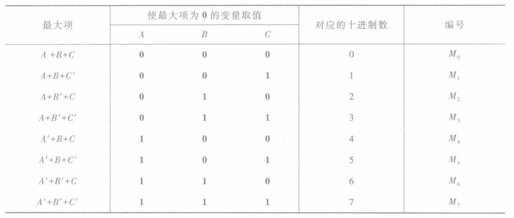
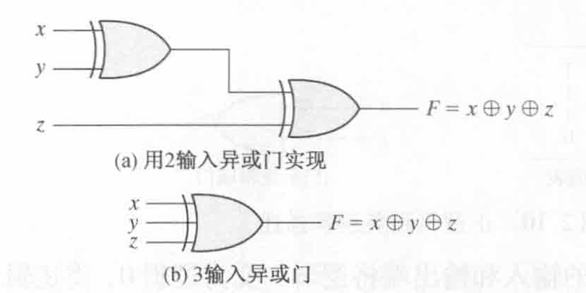

# Chap2 Boolean Algebra and Logic Gates

## Basic Theorems and Properties of Boolean Algebra

### Properties
!!! theorem "Postulates and Theorems of Boolean Algebra"

    - Postulate2 (a) $x+0=x$ (b) $x\cdot 1=x$
    - Postulate5 (a) $x+x^\prime=1$ (b) $x\cdot x^\prime=0$
    - Theorem1 (a) $x+x=x$ (b) $x\cdot x=x$
    - Theorem2 (a) $x+1=1$ (b) $x\cdot 0=0$
    - Theorem, involution $(x^\prime)^\prime=x$
    - Postulate3, communicative (a) $x+y=y+x$ (b) $xy=yx$
    - Theorem4, associative (a) $x+(y+z)=(x+y)+z$ (b) $x(yz)=(xy)z$
    - Postulate4, distribute (a) $x(y+z)=xy+xz$ (b) $x+yz=(x+y)(x+z)$
    - Theorem5, DeMorgan (a) $(x+y)^\prime=x^\prime y^\prime$ (b) $(xy)^\prime = x^\prime +y^\prime$
    - Theorem6, absorption (a) $x+xy=x$ (b) $x(x+y)=x$

!!! formula "常用公式"
    - $A+AB=A$
    - $A+A^\prime B=A+B$
    - $AB+AB^\prime =A$
    - $A(A+B)=A$
    - $AB+A^\prime C+BC=AB+A^\prime C$
    - $AB+A^\prime C+BCD=AB+A^\prime C$
    - $A(AB)^\prime=AB^\prime$
    - $A^\prime (AB)^\prime=A^\prime$

### Basic Theorems
!!! theorem "代入定理"
    在任何一个包含A的逻辑等式中，若以另一个逻辑式代入式中A的位置，则等式依然成立

!!! theorem "反演定理"
    对于任意一个逻辑式Y，若将所有的“与”换成“或”，“或”换成“与”，0换成1，1换成0，原变量变成反变量，反变量变成原变量，得到的一个新的逻辑式即为逻辑式Y的非

    !!! example "示例"

        $$Y=A(B+C)+CD$$

        $$Y^\prime=(A^\prime+B^\prime C^\prime)(C^\prime+D^\prime)$$

!!! theorem "对偶定理"
    若两逻辑式相等，则其对偶式也相等
## Boolean Functions

!!! info "逻辑函数表示方法"
    逻辑函数表示方法：真值表、逻辑式、逻辑图、波形图、卡诺图、硬件描述语言（HDL）

    真值表

    

    逻辑式

    $$Y=A(B+C)$$

    逻辑图

    

    波形图

    

!!! note "Boolean Functions"
    

## Canonical and Standard Forms

!!! definition "最小项"
    在n变量逻辑函数中，若m为包含n个因子的乘积项，且这n个变量均以原变量或反变量的形式在m中出现一次，则称m为该组变量的最小项

    

!!! definition "最大项"
    在n变量逻辑函数中，若M为n个变量之和，且这n个变量均以原变量或反变量的形式在M中出现一次，则称M为该组变量的最大项

    

!!! attention "注意"
    最小项和最大项的编号有区别，最小项编号是结果取1时变量组合得到的十进制数，最大项则是结果取0时变量组合的数值

!!! info "最小项之和"
    逻辑函数式以**与或**的形式化为**最小项之和**的标准形式

    !!! example "示例"

        $$Y=ABC^\prime+ABC+A^\prime BC=m_3+m_6+m_7$$

        或写作

        $$Y(A,B,C)=\sum m(3,6,7)$$

!!! info "最大项之积"
    逻辑函数以**或与**的形式化为**最大项之积**的标准形式

    !!! example "示例"
        $$Y=(A+B+C)(A+B+C^\prime)(A^\prime +B+C)(A^\prime +B^\prime +C)$$

        或写作

        $$Y(A,B,C)=\prod M(0,1,4,6)$$

## Other Logic Operations

!!! note "Logic Operations"
    

## Digital Logic Gates

!!! note "Digital Logic Gates"
    

!!! note "复合逻辑"
    与非（NAND）、或非（NOR）、与或非（AND-NOR）、异或（EXCLUSIVE OR）、同或（EXCLUSIVE NOR）

### Extension to Multiple Inputs

!!! note "多输入"
    如果门所代表的二进制运算具有交换性和结合性，则该门可以被扩展到多个输入

    由于与非和或非函数可交换而不可结合，因此多输入的与非（或非）门定义为与门（或门）的反

    

    异或和同或具有交换性和结合性

    

### Positive and Negative Logic

选择高电平H表示逻辑1，称为正逻辑；选择低电平L表示逻辑1，称为负逻辑

## Integrated Circuits

集成度：小规模集成（SSI）、中规模集成（MSI）、大规模集成（LSI）、超大规模集成（VLSI）

数字逻辑系列：晶体管-晶体管逻辑（TTL）、发射极耦合逻辑（ECL）、金属氧化物半导体（MOS）、互补金属氧化物半导体（CMOS）