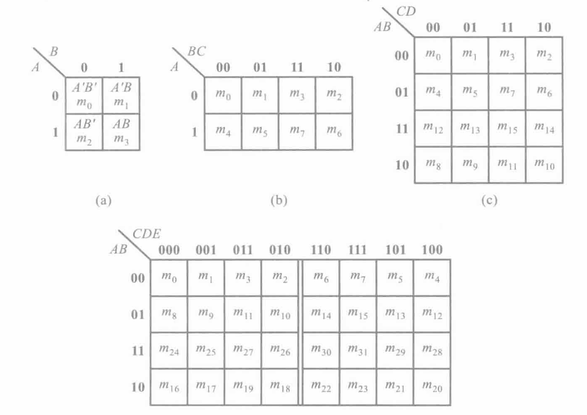
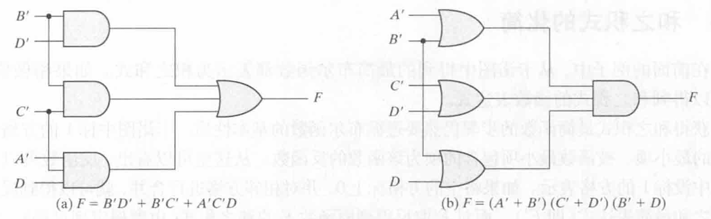

# Chap3 Gate-Level Minimization

## The Map Method

!!! info "卡诺图"
    将逻辑函数的最小项之和以图形的方式表示出来

    1. 将函数表示为最小项之和的形式$\sum m_i$
    2. 在卡诺图上与这些最小项对应的位置上添上1，其余地方添0

    

!!! definition "最简与或"
    包含的乘积项最少，每个乘积项的因子也最少，称为最简的与-或逻辑式

!!! info "卡诺图化简"
    1. 化简后的乘积项应包含函数式的所有最小项，即覆盖图中所有的1
    2. 乘积项的数目最少，即圈成的矩形最少
    3. 每个乘积项因子最少，即圈成的矩形最大

## Product-of-Sums Simplification

!!! note "和之积式的化简"
    反函数可以由卡诺图中标0的方格表示，对相邻方格进行合并，可以得到反函数$F^\prime$的积之和最简表达式，对$F^\prime$取反应用摩根定理可以得到原函数$F$的和之积式

!!! note "二级门电路"
    函数表示成积之和与和之积的标准式，都可以由一个二级门电路实现

    !!! example "示例"
        对于$F(A,B,C,D)=\sum(0,1,2,5,8,9,10)=B^\prime D^\prime+B^\prime C^\prime + A^\prime C^\prime D=(A^\prime+B^\prime)(C^\prime+D^\prime)(B^\prime +D)$

        

## Dont't-Care Conditions

!!! definition "约束项、任意项、无关项"
    - 约束项：在逻辑函数中，对输入变量取值的限制，在这些取值下为1的最小项称为约束项
    - 任意项：在输入变量某些取值下，函数值为1或为0不影响逻辑电路的功能，在这些取值下为1的最小项称为任意项
    - 无关项：约束项和任意项可以写入函数式，也可不包含在函数式中，因此统称为无关项
    

## NAND and NOR Implementation

### NAND Implementation

**The implementation of Boolean functions with NAND gates requires that the functions be in sum-of-products form**

### NOR Implementation

**A two-level implementation with NOR gates requires that the functions be simplified into product-of-sums form**

## Other Two-Level Implementations

## Exclusive-OR Function

异或运算满足交换律和结合律

三变量异或函数中奇数个变量取1，函数值为1，因而多变量异或函数被定义为奇函数

异或函数适用于奇偶校验
