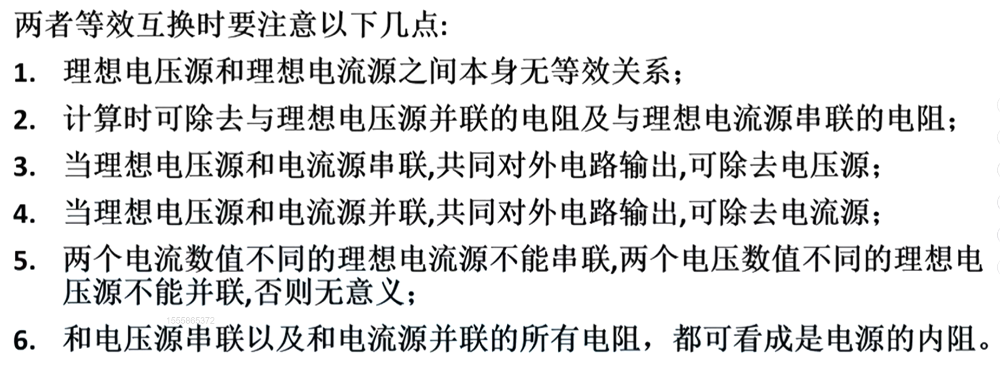
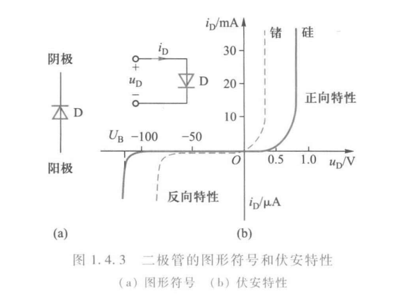
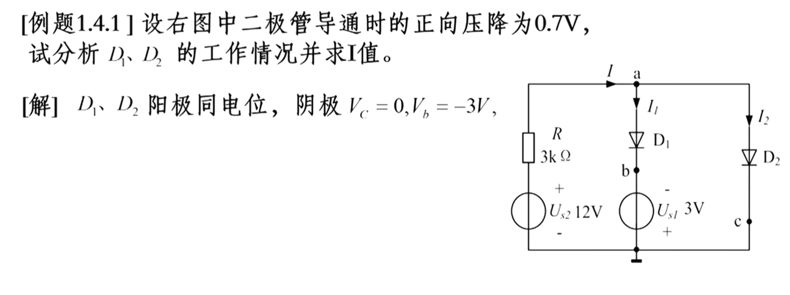
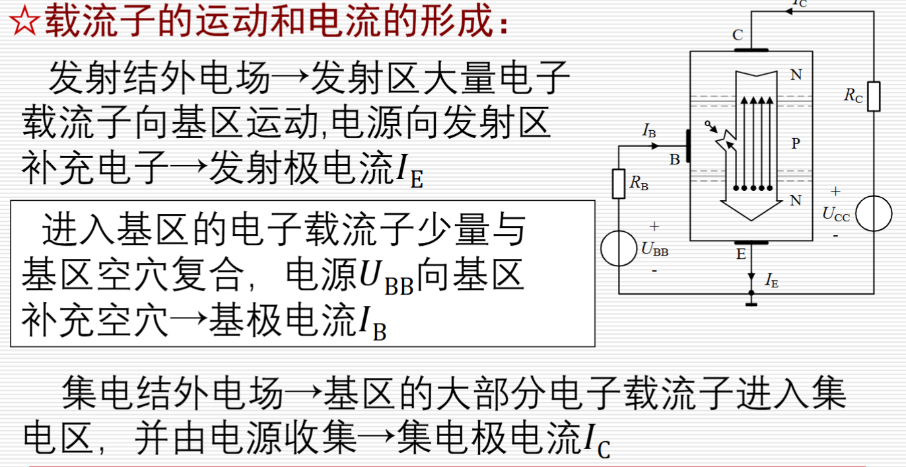
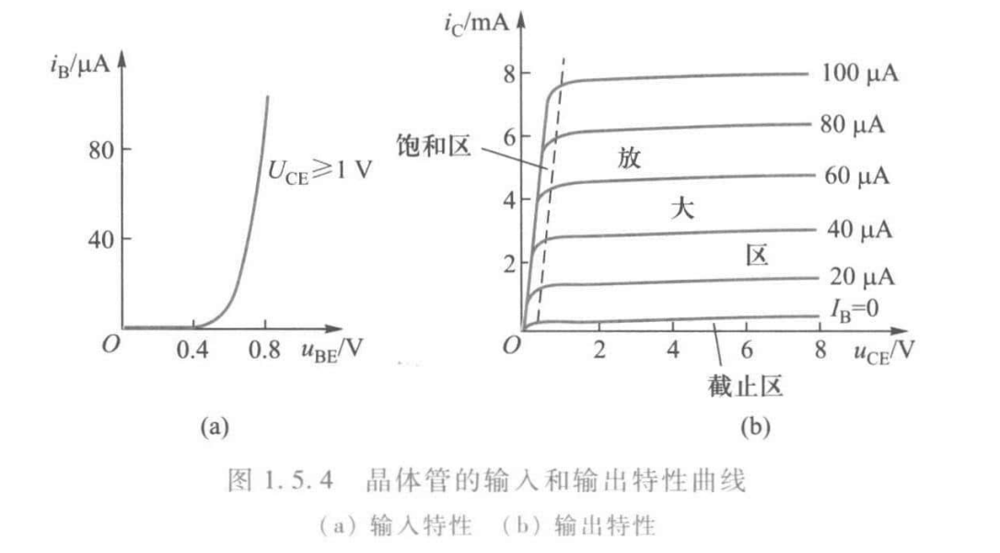
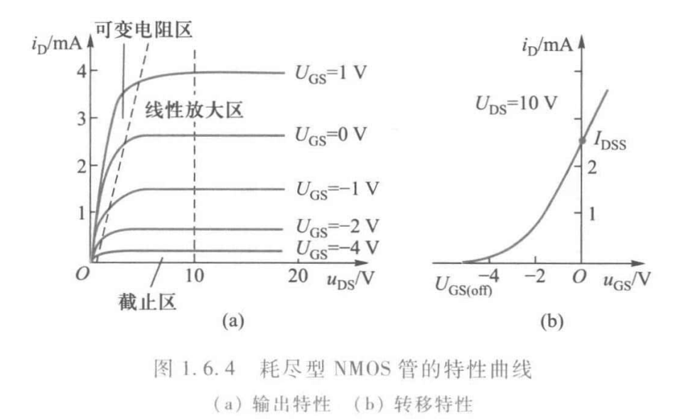
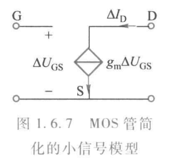

# Chap1 电路和电路元件

## 电路和电路的基本物理量

!!! definition "概念"
    - 强电电路：用于实现电能的传输和转换；电压较高、电流和功率较大
    - 弱电电路：用于进行电信号的传递和处理；电压较低、电流和功率较小
    - 直流电流（DC）：电路的大小和方向都不随时间变化，用I表示
    - 交流电流（AC）：电流的大小和方向都随时间变化，用i表示                                                    

电压的方向是电位降低的方向；电动势的方向是电位升高的方向

!!! note "关联参考方向"   
    对电源以外的元件假定电压参考方向与电流参考方向一致，即电流参考方向从电压参考方向的+端流向-端 

    当电流方向和电压方向关联时，$p=ui>0$，吸收功率；$p=ui<0$，输出功率

    对电源上的电流、电压规定为非关联参考方向，对电阻、电感、电容上的电压、电流规定为关联参考方向

## 电阻、电感和电容元件

### 电阻元件

电阻：表征电能的消耗，是一个耗能元件

$$W=\int_{t_1}^{t_2}Ri^2 \mathrm{d}t$$

### 电感元件

电感：表征磁场能的储存，是一个储能元件

$$W_L=\frac{1}{2}L I^2$$

??? proof "推导过程"

    $$N\phi = Li, L=\frac{N\phi}{i}$$

    $$e_L=-\frac{dN\phi}{dt}=-L\frac{di}{dt}$$

    $$u=-e_L$$

    $$p=ui$$

    $$W=\int p\mathrm{d}t=\int Li\mathrm{d}i=\frac{1}{2}Li^2$$

### 电容元件

电容：表征电场能的储存，是一个储能元件

$$W_C=\frac{1}{2} CU^2$$

{width=500px}

## 独立电源元件

### 电压源和电流源

电压源（理想电压源）：源电压等于端电压

$$U_S=U$$

电流源（理想电流源）：源电流等于端电流

$$I_S=I$$

独立电源的符号可以用其伏安特性记忆：电压源端电压恒定，平行于横轴；电流源端电流恒定，平行于纵轴

### 实际电源的模型

实际电压源：理想电压源与电阻串联

$$U=U_S-R_0I$$

实际电流源：理想电流源与电阻并联

$$I=I_s-\frac{U}{R_0}$$

PS：两种实际电源模型可以等效互换，推荐用伏安特性曲线记忆。

## 二极管

### PN结及其单向导电性

!!! note "半导体"
    载流子（运载电荷的粒子） = 自由电子（带负电） + 空穴（带正电）

    - 本征半导体
        + 自由电子和空穴数量相等
        + 纯净的半导体如硅、锗
    - P型半导体
        + 自由电子小于空穴数量
        + 掺入三价元素如硼、铝、镓
    - N型半导体
        + 自由电子大于空穴数量
        + 掺入五价元素如磷、砷、锑

!!! note "PN结"
  
    + 在P型半导体和N型半导体交界面形成的空间电荷区
    + 空间电荷区产生内电场阻挡多子扩散并推动少子漂移
    + 多子的扩散运动和少子的漂移运动达到平衡，空间电荷区的宽度稳定

!!! hint "记忆方法"
    
    可以这样记忆，P（positive）型半导体空穴多（正电），N（negative）型半导体电子多（负电）；PN结内电场阻碍多子扩散和推动少子漂移，方向由N指向P。

!!! note "单向导电性"

    - 正向偏置
        + P区一侧接外电源正极，N区一侧接外电源负极
        + 空间电荷区变窄
        + 形成较大的正向电流
        + PN结处于导通状态
        + 正向电阻数值很小

    - 反向偏置
        + 空间电荷区变宽
        + 形成很小的反向电流
        + PN结处于截止状态
        + 反向电阻数值很大

### 二极管的特性和主要参数

二极管由一个PN结加电极引线和管壳构成，由P侧引出的电极称为阳极，由N侧引出的电极称为阴极

!!! note "伏安特性"
    

    - 正向特性
        + 死区：电压小，基本不导通（死区电压硅管0.4~0.5V，锗管约0.1V）
        + 非线性区：开始导通，电流小
        + 导通区：近似线性（导通压降硅管0.6\~0.7V，锗管0.2\~0.3V）

    - 反向特性
        + 正常工作区：截止，反向电流很小
        + 反向击穿区：反向电流过大，反向击穿

主要参数：最大正向电流$I_{FM}$、最高反向工作电压$U_{RM}$、反向电流$I_R$、最高工作频率$f_M$

PS：F-forward，R-reverse，B-breakdown，M-maximum

### 二极管的工作点和理想特性

工作点：$U_D=U_S-RI_D$

静态电阻：$R_D=\frac{U_D}{I_D}$

动态电阻：$r_D=\frac{dU_D}{dI_D}$

理想特性：分为考虑导通压降和忽略导通压降

!!! note "二极管电路分析"

    - 单个：阳极电位高于阴极电位足够大小
    - 多个：
        - 阳极接于同一点（同电位），阴极电位最低的优先导通
        - 阴极接于同一点（同电位），阳极电位最高的优先导通
    PS：电压越大，越容易导通

!!! question "例题"
    

    两个二极管共阳极，D1阴极电位更低，先导通；计算可知D2为负向电压，不导通。

!!! question "例题"
    

    两个二极管共阴极，D2阳极电位更高，先导通；考虑D2导通的情况，是不可能成立的。

!!! question "思考"
    

    对于交流电源Us而言，在二极管导通情况下，U0恒为U1+Uon，截止情况下，U0恒为Us，所以只需要判断出临界点即可。这是一个限幅电路。
    
    
    考虑理想二极管，由于反向电压截止，反向电流消除，这是一个整流过程。

### 稳压二极管

伏安特性：反向击穿区特性曲线陡直（稳压特性）

主要参数：稳定电压$U_Z$，动态电阻$r_Z$，稳定电流$I_Z$、最大耗散功率$P_{ZM}$、电压温度系数$\alpha_{U_Z}$

稳压条件：$U_I>U_Z$，有一定的$I_Z$

稳态二极管的动态电阻越小，稳压效果越好

稳压二极管工作在反向击穿状态

### 发光二极管和光电二极管

发光二极管简称LED，工作在正向偏置状态，导通压降大于普通二极管

光电二极管，又称光敏二极管，<b>工作在反向偏置状态</b>，反向电流随光照强度增加而增加

## 双极晶体管

### 基本结构和电流放电作用

!!! definition "晶体管"
    双极晶体管（BJT）简称晶体管、三极管

    

    - 两个PN结：发射结、集电结
    - 三个电极：发射极E（emiter）、基极B（base）、集电极C（collector）
    - 三个区：发射区、集电区、基区

发射区杂质浓度很高，基区很薄且杂质浓度很低，集电区的面积比发射结的面积大，且集电区杂质浓度较发射区低

!!! note  "电流放大作用"

    条件：发射结正向偏置，集电结反向偏置

    

    $$I_E=I_C+I_B$$

    $$I_B \ll I_C \approx I_E$$

    小的基极电流变化量引起大的集电极电流变化量，具有电流放大作用，故<b>三极管是电流控制电流器件</b>

### 特性曲线和主要参数

!!! note "输入特性曲线"
    输入特性曲线：以$u_{CE}$为参变量，$i_B$和$u_{BE}$之间的关系，即

    $$i_B=f(u_{BE})|u_{CE=const.}$$

!!! note "输出特性曲线"
    输出特性曲线：以$i_B$为参变量，$i_C$和$u_{CE}$之间的关系，即

    $$i_c=f(u_{CE})|i_{B=const.}$$

=== "截止区"
    + $I_B=0$曲线以下区域
    + 集电结、发射结均反向偏置
    + 无放大作用
    + $I_C=I_{CEO}\approx 0$ $I_{CEO}$为穿透电流
    + 集电极和发射极相当于断开开关——用于开关电路

=== "饱和区"
    + $U_{CE}\le U_{BE}$区域
    + 发射结、集电结均正向偏置
    + 无放大作用
    + 有$I_C$，但$U_{CE}=U_{CES}\approx 0$
    + 集电极和发射极相当于接通开关——用于开关电路

=== "放大区"
    + 发射结正向偏置，集电结反向偏置
    + 有放大作用——用于放大电路

!!! note "主要参数"
    - 电流放大系数 $\bar{\beta}=\frac{I_C-I_{CEO}}{I_B}\approx \frac{I_C}{I_B}（直流）$ $\beta=\frac{\Delta I_C}{\Delta I_B}（交流）$
    - 穿透电流 $I_{CEO}$
    - 集电极最大允许电流 $I_{CM}$
    - 集电极最大允许耗散功率 $P_{CM}$
    - 集电极——发射极反向击穿电压 $U_{(BR)CEO}$

!!! caution "注意"
    硅管的导通电压约0.5V，锗管的导通电压约0.1V；工作在放大电路中时，NPN满足$V_C>V_B>V_E$，PNP满足$V_E>V_B>V_C$

!!! question "例题"
    在放大电路中，若测得某晶体管的三个极的电位分别是7V，1.5V，1.3V，则该管为____。

    最小电位差是0.2V，只有锗管才能导通，然后有基极电位和发射极电位出在1.5V与1.3V中，即集电极电位一定是7V。由于$V_C>V_B$，且集电结在反向偏置状态，可知电位高的是负极（N），推出为NPN锗管。当然也可由上面的电位关系得知。

### 简化的小信号模型

!!! definition "受控源"
    受控源：非独立电源，输出电压或电流受电路中另一电压或电流的控制

    - 电压控制电压源（VCVS）：$\mu$为电压放大系数
    - 电压控制电流源（VCCS）：$g$为转移电导
    - 电流控制电压源（CCVS）：$r$为转移电阻
    - 电流控制电流源（CCCS）：$\beta$为电流放大系数

    

    比例系数为常数时，受控源为线性元件

B-E之间，工作在输入特性的近似线性区，用电阻$r_{be}$模拟

$$r_{be}=\frac{\Delta U_{BE}}{\Delta I_B}=r_b+(1+\beta)\frac{26}{I_E}$$

$r_b$=200Ω，$I_E$单位mA

C-E之间，$I_C=\beta I_B$

$I_C$和$U_{CE}$基本无关

双极晶体管是电流控制电流源

## 绝缘栅场效晶体管

场效晶体管：简称FET，分为结型场效晶体管、绝缘栅场效晶体管

### 基本结构和工作原理

!!! definition "MOS管"
    MOS管：金属-氧化物-半导体场效晶体管，可分为：

    - N沟道绝缘场效晶体管（NMOS）和P沟道绝缘场效晶体管（PMOS）
    - 增强型绝缘场效晶体管（无沟道）和耗尽型绝缘场效晶体管（有沟道）

    

场效晶体管的源极相当于晶体管的发射极，漏极相当于集电极，栅极相当于基极  

PS：G-栅极，S-源极，D-漏极；$U_{GS}$控制$I_D$，栅源电压控制漏极电流，故<b>MOS管是电压控制电流元件</b>

### 特性曲线和主要参数

#### 特性曲线

输出特性：以$u_{cs}$为参变量时，$i_D$和$u_{DS}$之间的关系，即

$$i_D=f(u_{DS})|u_{CS=const.}$$

转移特性：以$u_{DS}$为参变量时，$i_D$和$u_{CS}$之间的关系，即

$$i_D=f(u_{CS})|u_{DS=const.}$$

可近似表示为

$$I_D=I_{DSS}(1-\frac{U_{GS}}{U_{GS_{(off)}}})^2$$

#### 主要参数

!!! note "主要参数"
    - 夹断电压$U_{GS_{off}}$和开启电压$U_{GS_{th}}$
    - 饱和漏极电流$I_{DSS}$，即$u_{GS}=0$时的漏极电流
    - 低频跨导$g_m$
    - 最大漏极电流$I_{DM}$和最大耗散功率$P_{DM}$
    - 最大漏-源击穿电压$U_{(BR)DS}$
    - 栅源直流电阻$R_{GS}$

### 简化的小信号模型

