# Chap1 电路和电路元件

## 电路和电路的基本物理量

- 强电电路：用于实现电能的传输和转换；电压较高、电流和功率较大
- 弱电电路：用于进行电信号的传递和处理；电压较低、电流和功率较小
- 直流电流（DC）：电路的大小和方向都不随时间变化，用$I$表示
- 交流电流（AC）：电流的大小和方向都随时间变化，用$i$表示                                                    
电压的方向是电位降低的方向；电动势的方向是电位升高的方向

!!! note "关联参考方向"   
    对电源以外的元件假定电压参考方向与电流参考方向一致，即电流参考方向从电压参考方向的+端流向-端 

    当电流方向和电压方向关联时，$p=ui>0$，吸收功率；$p=ui<0$，输出功率

    <b>对电源上的电流、电压规定为非关联参考方向，对电阻、电感、电容上的电压、电流规定为关联参考方向</b>

## 电阻、电感和电容元件

### 电阻元件

电阻：表征电能的消耗，是一个耗能元件

$$W=\int_{t_1}^{t_2}Ri^2 \mathrm{d}t$$

### 电感元件

电感：表征磁场能的储存，是一个储能元件

$$W_L=\frac{1}{2}L I^2$$

??? proof "推导过程"

    $$N\phi = Li, L=\frac{N\phi}{i}$$

    $$e_L=-\frac{dN\phi}{dt}=-L\frac{di}{dt}$$

    $$u=-e_L$$

    $$p=ui$$

    $$W=\int p\mathrm{d}t=\int Li\mathrm{d}i=\frac{1}{2}Li^2$$

### 电容元件

电容：表征电场能的储存，是一个储能元件

$$W_C=\frac{1}{2} CU^2$$

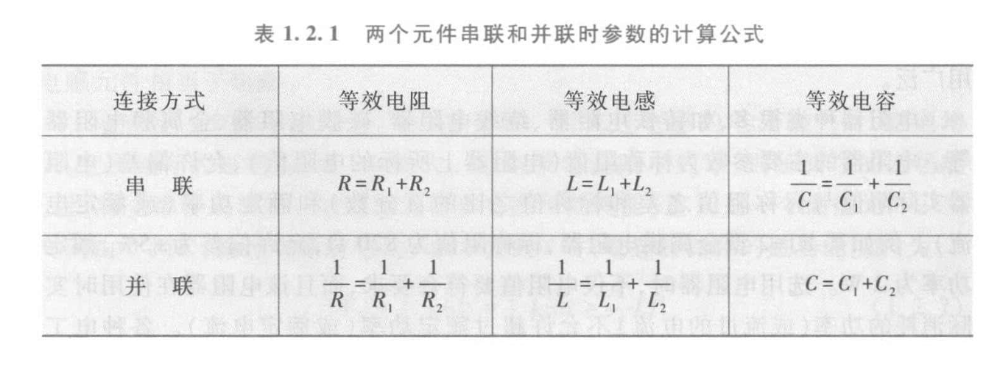{width=500px}

## 独立电源元件

### 电压源和电流源

电压源（理想电压源）：源电压等于端电压

$$U_S=U$$

电流源（理想电流源）：源电流等于端电流

$$I_S=I$$

独立电源的符号可以用其伏安特性记忆：电压源端电压恒定，平行于横轴；电流源端电流恒定，平行于纵轴

### 实际电源的模型

实际电压源：理想电压源与电阻串联

$$U=U_S-R_0I$$

实际电流源：理想电流源与电阻并联

$$I=I_s-\frac{U}{R_0}$$

PS：两种实际电源模型可以等效互换，推荐用伏安特性曲线记忆

!!! caution "注意"
    1. 理想电压源和理想电流源之间本身无等效关系
    2. 计算时可除去与理想电压源并联的电阻及与理想电流源串联的电阻
    3. 当理想电压源和电流源串联，共同对外电路输出，可除去电压源
    4. 当理想电压源和电流源并联，共同对外电路输出，可除去电流源
    5. 两个电流数值不同的理想电流源不能串联，两个电压数值不同的理想电压源不能并联，否则无意义
    6. 和电压源以及和电流源并联的所有电阻，均可视为电源的内阻

## 二极管

### PN结及其单向导电性

#### PN结

运载电荷的粒子称为<b>载流子</b>。导体导电只有一种载流子，即自由电子导电；而<b>本征半导体有两种载流子，即自由电子和空穴均参与导电</b>

本征半导体即纯净的半导体如硅、锗，其自由电子和空穴数量相等；在本征半导体中掺入少量杂质元素即得到<b>杂质半导体</b>

P型半导体掺入三价元素如硼、铝、镓，其自由电子小于空穴数量；N型半导体掺入五价元素如磷、砷、锑，其自由电子大于空穴数量

!!! note "PN结"
  
    + 在P型半导体和N型半导体交界面形成的<b>空间电荷区</b>
    + 空间电荷区产生内电场阻挡多子扩散并推动少子漂移
    + 多子的扩散运动和少子的漂移运动达到平衡，空间电荷区的宽度稳定

    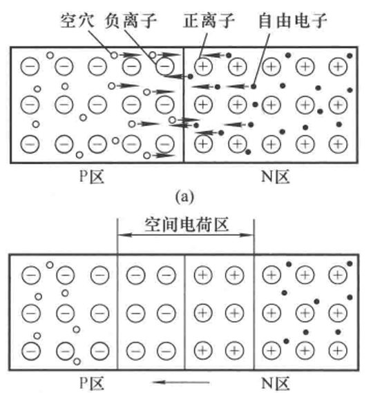

!!! hint "记忆方法"
    
    可以这样记忆，P（positive）型半导体空穴多（正电），N（negative）型半导体电子多（负电）；PN结内电场阻碍多子扩散和推动少子漂移，方向由N指向P

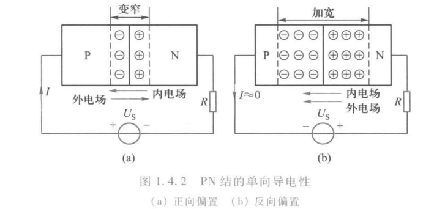

#### 单向导电性

P区一侧接外电源正极，N区一侧接外电源负极，称PN结外加正向电压，或称<b>正向偏置</b>。此时空间电荷区变窄，形成较大的正向电流，PN结处于<b>导通状态</b>

反之则称<b>反向偏置</b>。此时空间电荷区变宽，形成很小的反向电流，PN结处于<b>截止状态</b>

!!! note "PN结的伏安特性"
    PN结所加端电压$u$与流过电流$i$的关系为

    $$i=I_S(e^{\frac{qu}{kt}}-1)$$

    式中$I_S$为<b>反向饱和电流</b>，$q$为电子的电量，$k$为玻尔兹曼常数，$T$为热力学温度。将式中的$kT/q$用$U_T$取代，则有

    $$i=I_S(e^{\frac{u}{U_T}}-1)$$

    常温下，即$T=300\mathrm{K}$时，$U_T\approx 26\mathrm{mV}$，称$U_T$为温度的电压当量

    画出$i$与$u$的关系曲线，称为PN结的伏安特性

    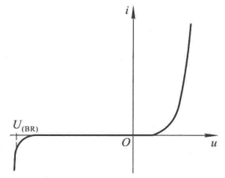

当反向电压超过一定数值$U_{BR}$时，反向电流急剧增加，称为<b>反向击穿</b>，根据机理可分为齐纳击穿和雪崩击穿

6V以上雪崩击穿多，6V以下齐纳击穿多；温度越高齐纳击穿多，温度越低雪崩击穿多

在一定条件下，PN结具有电容效应，根据产生原因可分为势垒电容和扩散电容

### 二极管的特性和主要参数

二极管由一个PN结加电极引线和管壳构成，由P侧引出的电极称为阳极，由N侧引出的电极称为阴极

!!! note "伏安特性"
    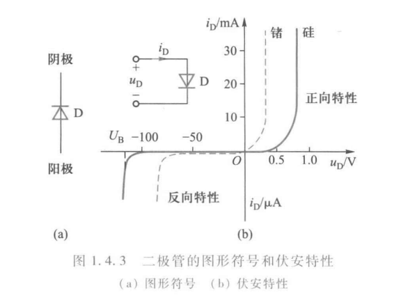

    - 正向特性
        + 死区：电压小，基本不导通（死区电压硅管0.4~0.5V，锗管约0.1V）
        + 非线性区：开始导通，电流小
        + 导通区：近似线性（导通压降硅管0.6\~0.7V，锗管0.2\~0.3V）

    - 反向特性
        + 正常工作区：截止，反向电流很小
        + 反向击穿区：反向电流过大，反向击穿

主要参数：最大正向电流$I_{FM}$、最高反向工作电压$U_{RM}$、反向电流$I_R$、最高工作频率$f_M$

PS：F-forward，R-reverse，B-breakdown，M-maximum

### 二极管的等效电路

我们希望用线性元件所构成的电路去近似模拟二极管的特性，并以之取代。我们称能够模拟二极管特性的电路为二极管的<b>等效电路</b>，或称<b>等效模型</b>

!!! note "伏安特性折线化"
    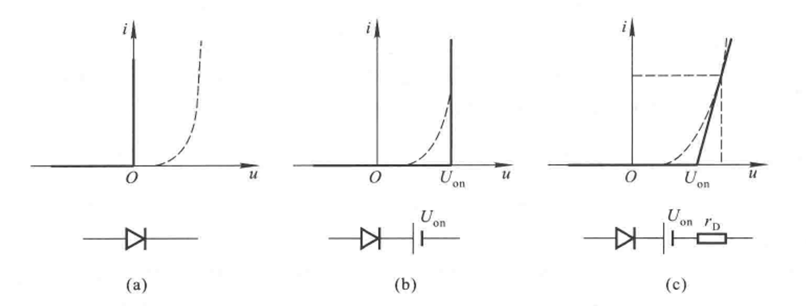

!!! question "思考"
    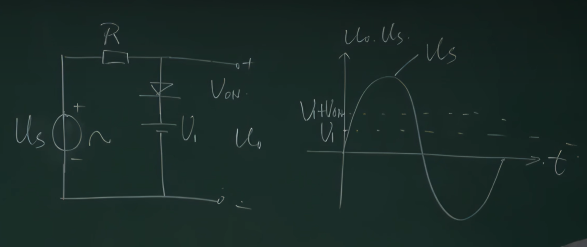

    对于交流电源Us而言，在二极管导通情况下，U0恒为U1+Uon，截止情况下，U0恒为Us，所以只需要判断出临界点即可。这是一个限幅电路，常用于保护电路
    
    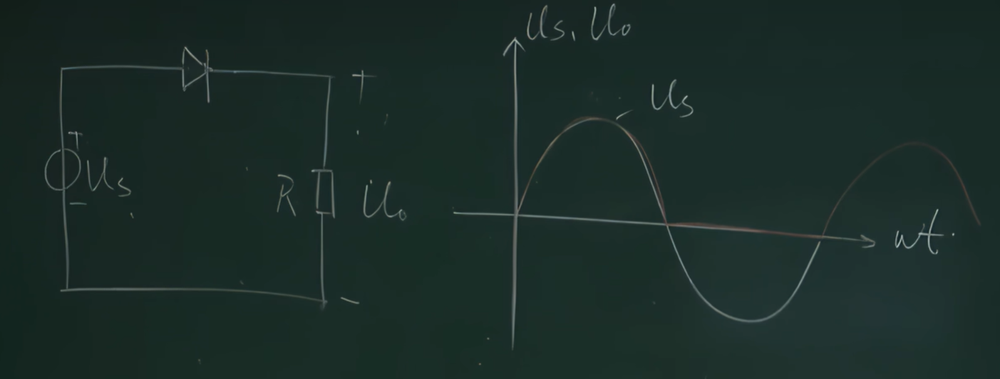
    考虑理想二极管，由于反向电压截止，反向电流消除，这是一个整流过程

    更进一步地，假设二极管导通电压为0.6V，考虑输入电压是一个小的电压交流信号（10mV），我们需要加上一个直流电压分量，由此我们有“小信号”的思想

### 二极管的工作点和理想特性

#### 工作点

二极管正向导通时，其电路和电压的大小由正向确定。根据闭合电路的欧姆定律，可得二极管的端电压

$$U_D=U_S-RI_D$$

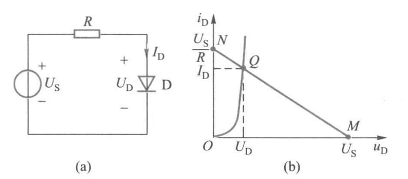

此直线与伏安特性的曲线的交点称为<b>工作点</b>，对应的$U_D$、$I_D$即二极管的电压、电流

我们定义<b>静态电阻</b>为$U_D$和$I_D$的比值

$$R_D=\frac{U_D}{I_D}$$

若使二极管电压在原工作点附近发生微小变化，变化量为$
\Delta U_D$，相应的电流为$\Delta I_D$，我们称$\Delta U_D$与$\Delta I_D$之比的极限为<b>动态电阻</b>

$$r_D=\lim_{\Delta I_D \rightarrow 0}\frac{\Delta U_D}{\Delta I_D}=\frac{\mathrm{d}U_D}{\mathrm{d}I_D}=\frac{1}{\tan \beta}$$

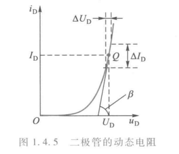

!!! note "二极管的微变等效"
    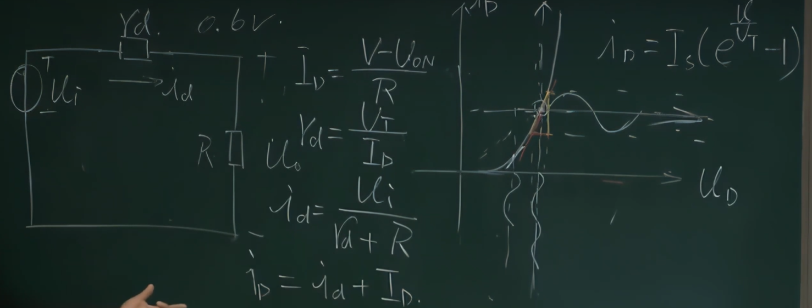

    现在我们考虑输入信号为一个小的交流信号+一个直流信号，我们可以将二极管等效为电阻$r_d$。注意，这样做的前提为我们将坐标系平移至以工作点为原点

    据此可得

    $$i_d=\frac{U_i}{r_d+R}$$

    $$i_D=i_d+I_D$$

    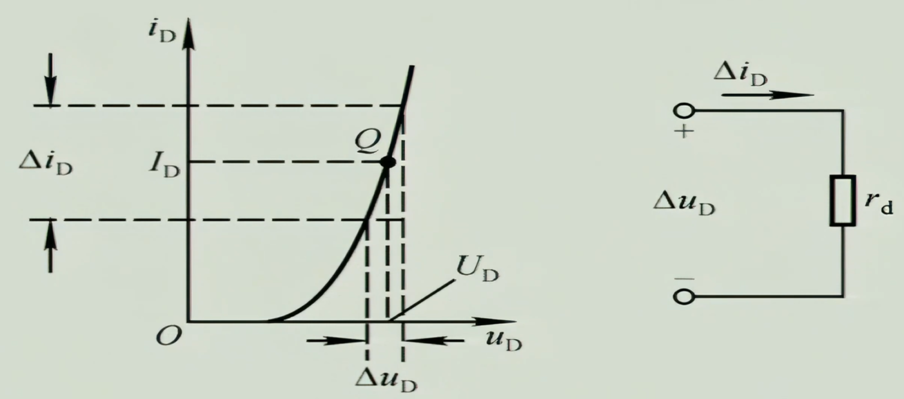

#### 理想特性

理想特性：分为考虑导通压降和忽略导通压降

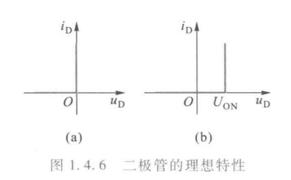

!!! note "二极管电路分析"
    - 单个：阳极电位高于阴极电位足够大小
    - 多个：
        - 阳极接于同一点（同电位），阴极电位最低的优先导通
        - 阴极接于同一点（同电位），阳极电位最高的优先导通
    PS：电压越大，越容易导通

!!! question "例题"
    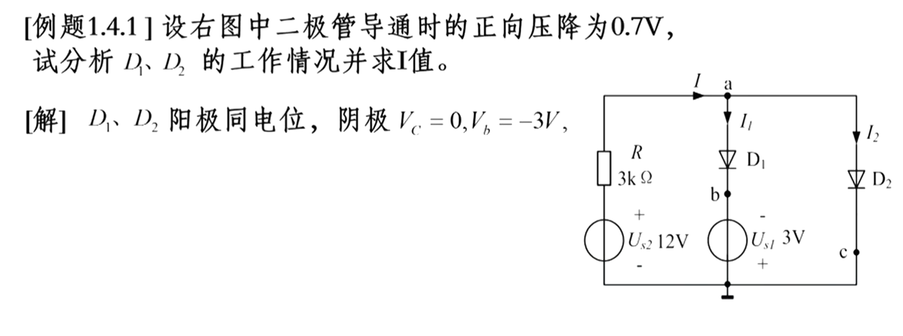

    两个二极管共阳极，D1阴极电位更低，先导通；计算可知D2为负向电压，不导通

!!! question "例题"
    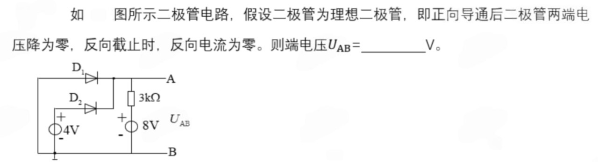

    两个二极管共阴极，D2阳极电位更高，先导通；考虑D2导通的情况，是不可能成立的

### 稳压二极管

稳压二极管工作在<b>反向击穿</b>状态

!!! note "稳压二极管"
    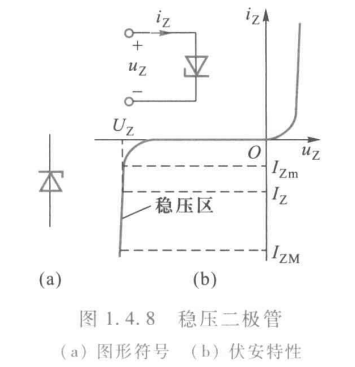

    伏安特性：反向击穿区特性曲线陡直（稳压特性）

    主要参数：稳定电压$U_Z$，动态电阻$r_Z$，稳定电流$I_Z$、最大耗散功率$P_{ZM}$、电压温度系数$\alpha_{U_Z}$

    稳压条件：$U_I>U_Z$，有一定的$I_Z$

!!! question "思考"
    二极管的正向特性也能稳压，为什么不考虑正向状态？

    正向稳压为固定的导通压降，而反向稳定电压可以通过调节掺杂浓度改变

稳态二极管的动态电阻越小，稳压效果越好；其在电路中应用时，需要串联一个限流电阻

!!! note "稳压电路"
    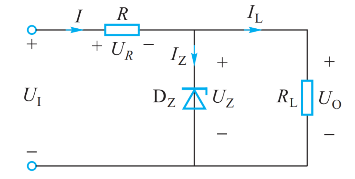

    若$U_o \uparrow \rightarrow U_o=U_Z \uparrow \rightarrow I_Z \uparrow \rightarrow I\uparrow \rightarrow IR \uparrow \rightarrow U_o \downarrow $

### 发光二极管和光电二极管

发光二极管简称LED，<b>工作在正向偏置状态</b>，导通压降大于普通二极管，常在$1.4V$以上

光电二极管，又称光敏二极管，<b>工作在反向偏置状态</b>，反向电流随光照强度增加而增加

## 双极晶体管

### 基本结构和电流放电作用

!!! definition "晶体管"
    双极晶体管（Bipolar Junction Transistor,BJT）简称晶体管、三极管

    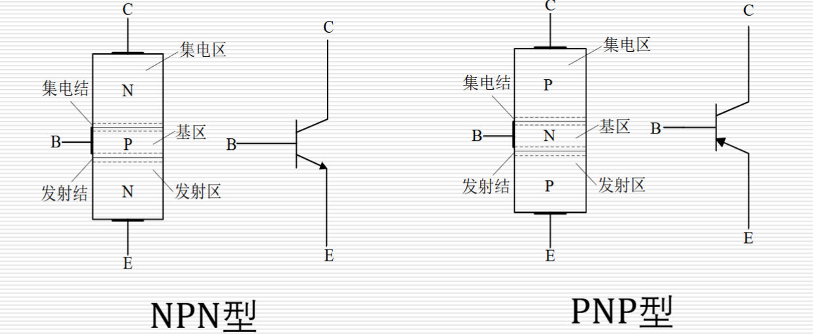

    - 两个PN结：发射结、集电结
    - 三个电极：发射极E（emiter）、基极B（base）、集电极C（collector）
    - 三个区：发射区、集电区、基区

发射区杂质浓度很高，基区很薄且杂质浓度很低，集电区的面积比发射结的面积大，且集电区杂质浓度较发射区低

!!! note  "电流放大作用"

    条件：<b>发射结正向偏置，集电结反向偏置</b>

    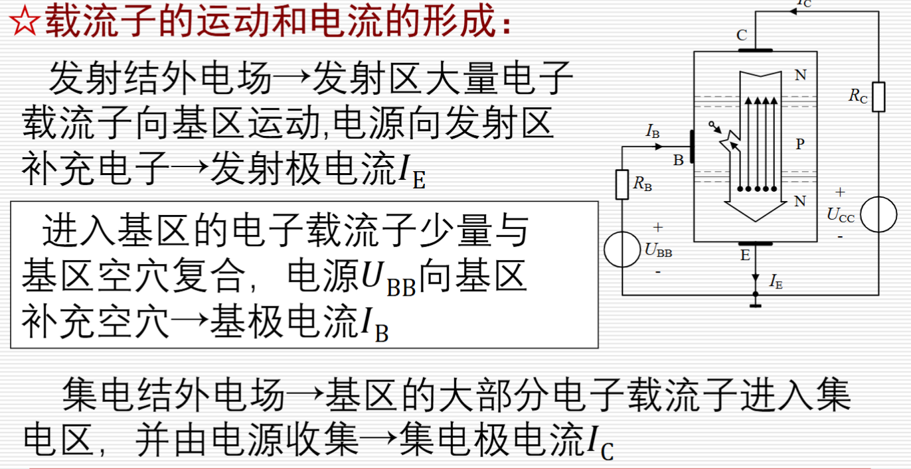

    $$I_E=I_C+I_B$$

    $$I_B \ll I_C \approx I_E$$

    小的基极电流变化量引起大的集电极电流变化量，具有电流放大作用，故<b>三极管是电流控制电流器件</b>

    放大倍数本质上是扩散与复合的电子比例

### 特性曲线和主要参数

!!! definition "特性曲线"
    输入特性曲线：以$u_{CE}$为参变量，$i_B$和$u_{BE}$之间的关系，即

    $$i_B=f(u_{BE})|u_{CE=\text{const.}}$$

    输出特性曲线：以$i_B$为参变量，$i_C$和$u_{CE}$之间的关系，即

    $$i_c=f(u_{CE})|i_{B=\text{const.}}$$

    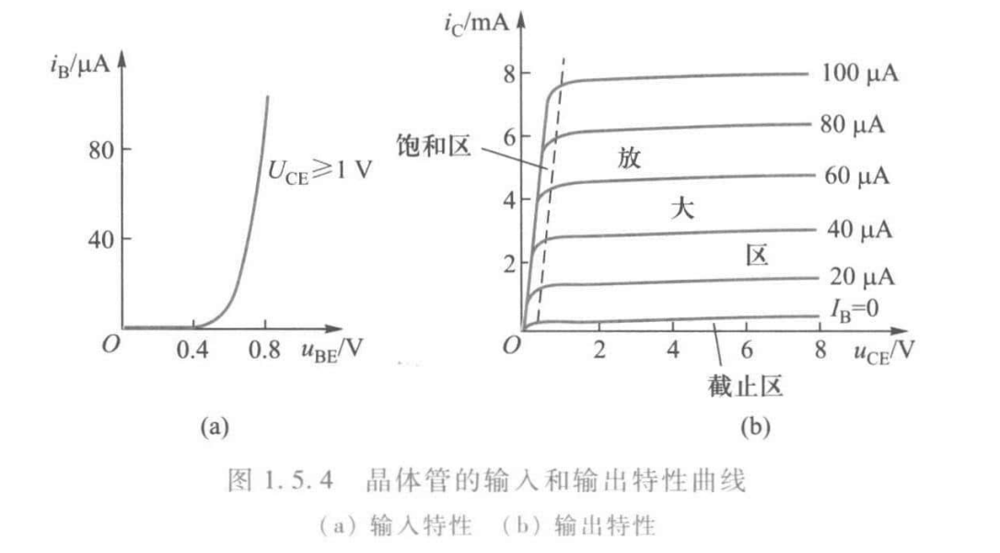

    === "截止区"
        + $I_B=0$曲线以下区域
        + 集电结、发射结均反向偏置
        + 无放大作用
        + $I_C=I_{CEO}\approx 0$ $I_{CEO}$为穿透电流
        + 集电极和发射极相当于断开开关——用于开关电路

    === "饱和区"
        + $U_{CE}\le U_{BE}$区域
        + 发射结、集电结均正向偏置
        + 无放大作用
        + 有$I_C$，但$U_{CE}=U_{CES}\approx 0$
        + 集电极和发射极相当于接通开关——用于开关电路

    === "放大区"
        + 发射结正向偏置，集电结反向偏置
        + 有放大作用——用于放大电路

!!! note "主要参数"
    - 电流放大系数 $\bar{\beta}=\frac{I_C-I_{CEO}}{I_B}\approx \frac{I_C}{I_B}$（直流） $\beta=\frac{\Delta I_C}{\Delta I_B}$（交流）
    - 穿透电流 $I_{CEO}$
    - 集电极最大允许电流 $I_{CM}$
    - 集电极最大允许耗散功率 $P_{CM}$
    - 集电极——发射极反向击穿电压 $U_{(BR)CEO}$

!!! caution "注意"
    硅管的导通电压约0.5V，锗管的导通电压约0.1V；工作在放大电路中时，NPN满足$V_C>V_B>V_E$，PNP满足$V_E>V_B>V_C$

!!! question "例题"
    在放大电路中，若测得某晶体管的三个极的电位分别是7V，1.5V，1.3V，则该管为____。

    最小电位差是0.2V，只有锗管才能导通，然后有基极电位和发射极电位出在1.5V与1.3V中，即集电极电位一定是7V。由于$V_C>V_B$，且集电结在反向偏置状态，可知电位高的是负极（N），推出为NPN锗管。当然也可由上面的电位关系得知。

### 简化的小信号模型

!!! definition "受控源"
    受控源：非独立电源，输出电压或电流受电路中另一电压或电流的控制

    - 电压控制电压源（VCVS）：$\mu$为电压放大系数
    - 电压控制电流源（VCCS）：$g$为转移电导
    - 电流控制电压源（CCVS）：$r$为转移电阻
    - 电流控制电流源（CCCS）：$\beta$为电流放大系数

    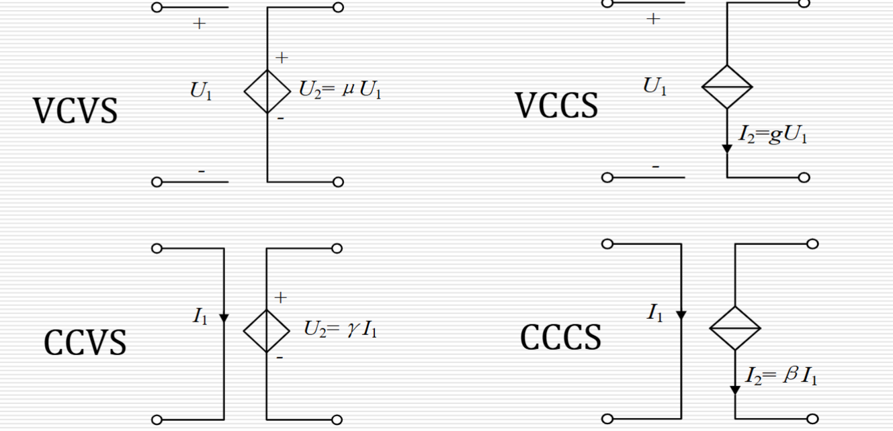

    比例系数为常数时，受控源为线性元件

B-E之间，工作在输入特性的近似线性区，用电阻$r_{be}$模拟

$$r_{be}=\frac{\Delta U_{BE}}{\Delta I_B}=r_b+(1+\beta)\frac{26}{I_E}$$

$r_b$=200Ω，$I_E$单位mA

C-E之间，$I_C=\beta I_B$

$I_C$和$U_{CE}$基本无关

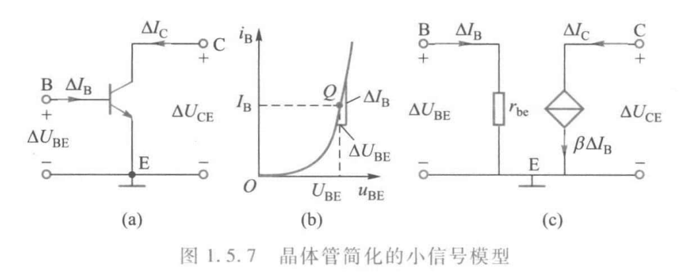

## 绝缘栅场效晶体管

场效晶体管（field effect transistor, FET）分为结型场效晶体管、绝缘栅场效晶体管

不同于双极晶体管，场效晶体管只有多子参与导电（N沟道是电子、P沟道是空穴），故又称单极晶体管

### 基本结构和工作原理

!!! definition "MOS管"
    绝缘栅场效晶体管又称金属-氧化物-半导体场效晶体管，简称MOS管（metal oxide semiconductor），可分为：

    - N沟道绝缘场效晶体管（NMOS）和P沟道绝缘场效晶体管（PMOS）
    - 增强型绝缘场效晶体管和耗尽型绝缘场效晶体管

    以NMOS为例，其以一块杂质浓度较低的P型硅片作为衬底，在其上面扩散两个杂质浓度很高的N区，并引出两个电极，分别称为<b>源极</b>和<b>漏极</b>。在源极和漏极之间的二氧化硅绝缘层上制作一个金属电极称为<b>栅极</b>

    栅极和其他电极是绝缘的，故称为绝缘栅；金属栅极和半导体之间的绝缘层常用二氧化硅，故称为金属-氧化物-半导体

    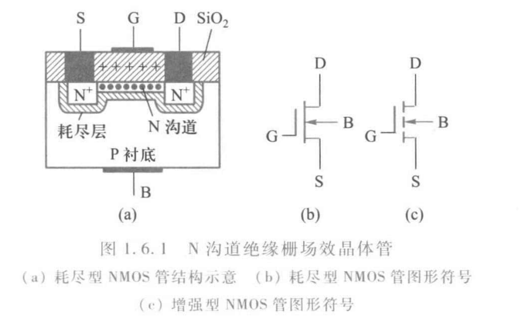

    符号简记：增强型为虚线（需要电压才能出现沟道），耗尽型为实线；N沟道为B指出（流向$N^+$），P沟道为B指向

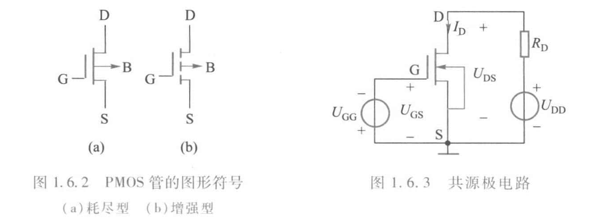

和双极晶体管的共发射极接法类似，MOS管常采用共源极接法

场效晶体管的源极相当于晶体管的发射极，漏极相当于集电极，栅极相当于基极  

PS：Gate-栅极，Source-源极，Drain-漏极；$U_{GS}$控制$I_D$，栅源电压控制漏极电流，故<b>MOS管是电压控制电流元件</b>

### 特性曲线和主要参数

由于MOS管的栅极是绝缘的，栅极电流$I_G \approx 0$，因此不研究$I_G$与$U_{GS}$之间的关系（即没有输入特性）

#### 特性曲线

!!! definition "输出特性"
    输出特性：以$u_{GS}$为参变量时，$i_D$和$u_{DS}$之间的关系，即

    $$i_D=f(u_{DS})|u_{GS=\text{const.}}$$

    输出特性曲线也称为漏极特性曲线

    当$u_{DS}$较小时，场效晶体管D、S之间可视为一个受$u_{GS}$控制的可变电阻，称为<b>可变电阻区</b>

    当$u_{DS}$较大时，在一定的$u_{DS}$下$i_D$随$u_{GS}$的增加而增长，称为<b>线性放大区</b>或<b>恒流区</b>，为放大功能的工作区

    当$u_{GS}$减小到某一数值时，N型导电沟道消失，$i_D\approx 0$，称为场效晶体管处于<b>夹断</b>状态（即截止）。定义$i_D$为某一微笑电流时的栅源电压为<b>栅源夹断电压</b>$U_{GS(off)}$

!!! definition "转移特性"
    转移特性：以$u_{DS}$为参变量时，$i_D$和$u_{CS}$之间的关系，即

    $$i_D=f(u_{CS})|u_{DS=\text{const.}}$$

    $u_{GS}=0$时的漏极电流用$I_{DSS}$表示，称为<b>饱和漏极电流</b>。在$u_{GS}>U_{GS(off)}$的范围内，转移特性可近似表示为

    $$I_D=I_{DSS}(1-\frac{U_{GS}}{U_{GS_{(off)}}})^2$$

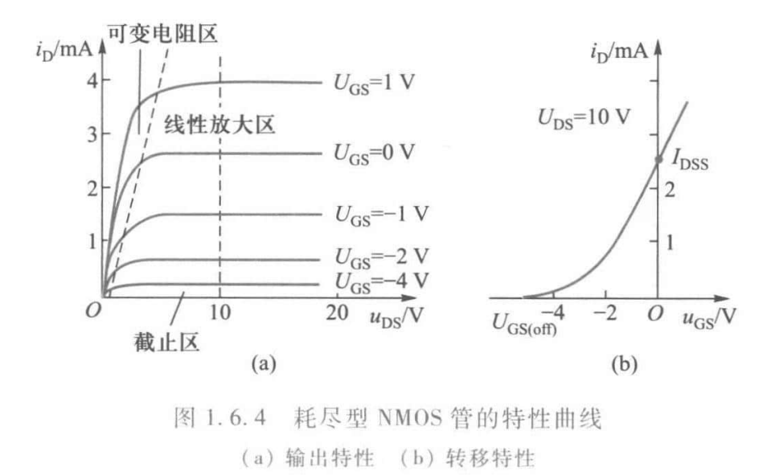

增强型MOS管在制成后不存在导电沟道，使用时必须外加一定的$u_{GS}$才会出现导电沟道。使漏极和源极之间开始有电流流过的栅源电压称为开启电压$U_{GS(th)}$

PS：th-threshold-阈值

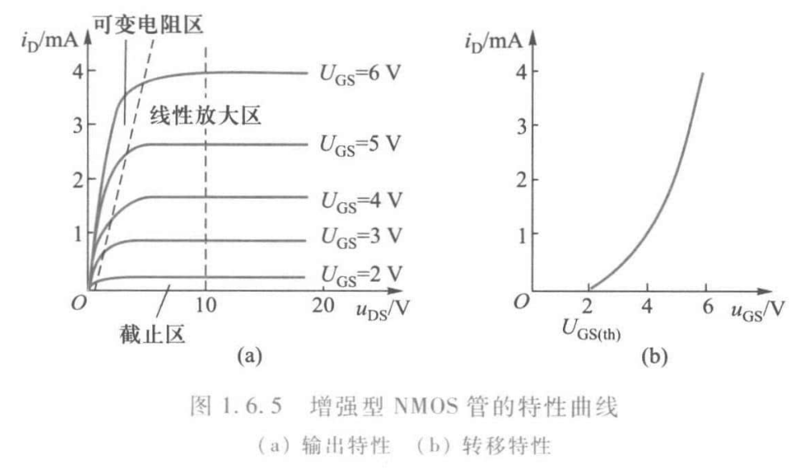

#### 主要参数

- 夹断电压$U_{GS(off)}$（耗尽型MOS管），开启电压$U_{GS(th)}$（增强型MOS管）
- 饱和漏极电流$I_{DSS}$（耗尽型MOS管），即$u_{GS}=0$时的漏极电流
- 最大漏极电流$I_{DM}$和最大耗散功率$P_{DM}$
- 最大漏-源击穿电压$U_{(BR)DS}$
- 栅源直流电阻$R_{GS}$
- 低频跨导$g_m$，在$U_{DS}$为某一固定值时，漏极的微小电流变化量$\Delta I_D$和相应的栅源输入电压变化量$\Delta U_{GS}$之比，即

$$g_m=\frac{\Delta I_D}{\Delta U_{GS}}|_{U_{DS}=\text{const}}$$

### 简化的小信号模型

!!! note "小信号模型"
    场效晶体管的输出特性曲线在线性放大区内比较平坦，可以近似认为是一族和横轴平行的直线，故$I_D$仅受$U_{GS}$控制，与$U_{DS}$无关

    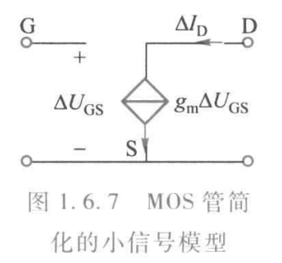

    由于MOS管的栅源输入电阻很大，故可认为G、S间是开路的