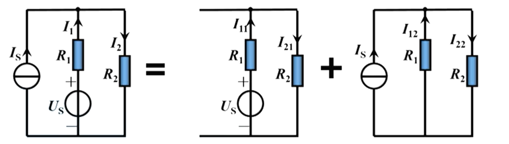
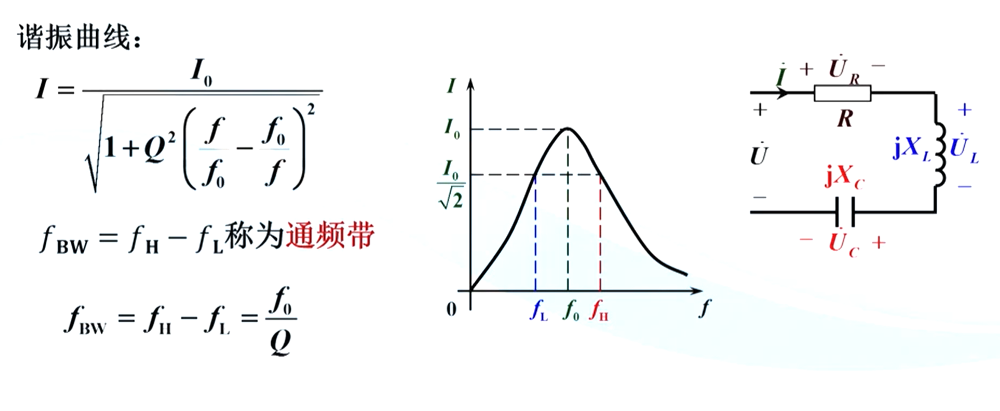
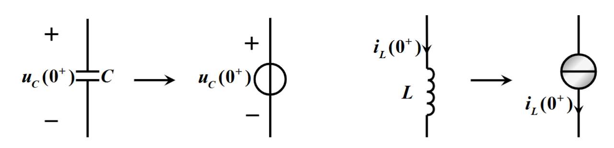
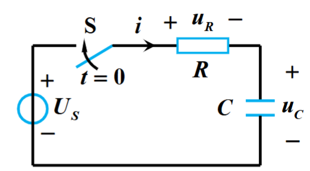

# Chap2 电路分析基础

## 基尔霍夫定律

!!! definition "基本概念"
    - 节点：三个或三个以上电路元件的连接点
    - 支路：连接两个节点之间的电路
    - 回路：电路中任一闭合路径称为回路
    - 网孔：电路中最简单的单孔回路

!!! theorem "基尔霍夫定律"
    - 基尔霍夫电流定律（KCL）：任何节点上的所有支路电流的代数和在任何时刻都等于零

    - 基尔霍夫电压定律（KVL）：形成任何一个回路的所有支路沿同一循行方向电压的代数和在任何时刻都等于零

!!! info  "支路电流法"
    1. 标出各支路电流的参考方向，设支路数为b，则有b个支路电流，有b个独立方程式
    2. 列写结点的KCL电流方程式，设结点数为n，可建立(n-1)个独立方程式
    3. 列写回路的KVL电压方程式，数目为I=[b-(n-1)]个
    4. 解联立方程组，求出各支路电流

## 叠加定理与等效源定理

### 叠加定理

!!! theorem "叠加原理"
    对于一个线性电路，由几个独立电源共同作用所产生的电流或电压，等于各个独立电源单独作用时分别在该支路所产生的电流或电压的代数和

    

!!! attention "注意"
    - 只限于线性电路
    - 只有电压电流可以叠加，功率不行
    - **除去不作用的电源，对电压源予以短路，对电流源予以开路**
    - 受控源不是独立电源，不能单独作用
    - 叠加为代数相加，注意电压电流参考方向

### 等效电源定理

!!! definition "二端网络"
    凡是具有两个接线端的部分电路，就称为二端网络；视其内部是否包含电源，分为有源二端网络和无源二端网络

!!! theorem "戴维宁定理"
    1. 一个线性有源二端网络可用一个电压源和一个电阻的串联电路等效
    2. 电压等于开路电压$U_{OC}$
    3. 串联电阻等于除去独立电源后在其端口处等效电阻

!!! theorem "诺顿定理"
    1. 一个线性有源二端网络可用一个电流源和一个电阻的并联电路等效
    2. 电流等于短路电流$I_{SC}$
    3. 并联电阻等于除去独立电源后在其端口处等效电阻

!!! attention "注意"
    1. 被等效的二端网络必须是线性的
    2. 二端网络和外电路之间没有耦合关系（即如果出现受控源，不能是二端网络的电学量影响外电路的电学量）

!!! note "等效电阻求取方法"
    1. 串并联化简法
    2. 外施电压法 $R_0=\frac{U}{I}$
    3. 开短路法 $R_0=\frac{U_{OC}}{I_{SC}}$
    4. 负载实验法
   
!!! attention "注意"
    当有源二段网络中含有受控源时，除去独立电源后，受控源仍保留在网络中，应用外施电压法和开路法计算等效电阻，而不能使用串并联化简法

!!! question "习题2.2.8"
    如图所示以a、b为端点的二端网络中，含有电流控制源电流源20$I_2$。试求：(1)当$R_3=10k\Omega$时的开路电压$U_{OC}$和等效电阻$R_0$

      

    由图可得

    $$\left\{\begin{aligned}I_1=I_2+I_3 \\ I_3=20I_2+I_4 \\ R_1I_1+R_2I_2=U_1 \\ R_3I_3+R_4I_4-R_2I_2=0\end{aligned}\right.$$ 

    开路电压

    $$U_{OC}=R_4I_4=-0.6861V$$

    电路中含有受控源，将独立电源$U_1$短接，并在端口接外施电压U

    

    $$I_3^\prime =\frac{U}{(R_1 \parallel R_2)+R_3}$$

    $$I_2^\prime=\frac{R_1}{R_1+R_2}I^\prime_3$$

    $$I^\prime=I_3^\prime +20I_2^\prime$$

    $$R_0^\prime = \frac{U}{I^\prime}$$

    $$R_0=R_4 \parallel R_0^\prime=0.7241\Omega$$

## 正弦交流电路

### 正弦量的三要素

三要素：最大值、角频率、初相位

!!! note "相位差"
    $\varphi=\varphi_u-\varphi_i$

    - $\varphi=0$，$u$和$i$同相
    - $\varphi>0$，$u$超前于$i$，$i$滞后于$u$
    - $\varphi=180\degree$，$u$与$i$反相
    - $\varphi=90\degree$，$u$与$i$正交

### 正弦量的相量表示法

!!! info "相量法"
    相量法：用复数表述正弦量

    - 代数表达式：$A=a+jb$
    - 指数表达式：$A=|A|e^{j\varphi}$
    - 极坐标表达式：$A=|A|\angle \varphi$

    正弦量变换为相量:有效值->复数的模，初相位->复数的幅角

### 电阻、电感、电容元件上电压与电流关系的相量形式

!!! note "电阻"
    - 电阻两端u与i是同频率正弦量
    - u与i同相位
    - 瞬时值、有效值和向量均服从欧姆定律

!!! note "电感"
    - u与i是同频率正弦量，i滞后于u90°
    - 电感电压有效值等于电流有效值乘以$\omega L$
    - 相量形式的欧姆定律$\dot{U}=jX_L\dot{I}$
    - $X_L=\omega L=2\pi fL$称为感抗
    - **电感在直流稳态时相当于短路**

!!! note "电容"
    - u和i是同频率正弦量，i超前于u90°
    - 相量形式的欧姆定律$\dot{U}=-jX_C\dot{I}$
    - $X_C=\frac{1}{\omega C}=\frac{1}{2\pi fC}$称为容抗
    - 高频电流容易通过电容
    - **电容在直流电路处于稳定状态时相当于开路**

### 简单正弦交流电路的计算

RLC串联电路中

$$\dot{U}=\dot{U}_R+\dot{U}_L+\dot{U}_C$$

$$\dot{U}=R\dot{I}+jX_L\dot{I}-jX_C\dot{I}=[R+j(X_L-X_C)]\dot{I}=(R+jX)\dot{I}=Z\dot{I}$$

!!! definition "定义"
    - 复阻抗：$Z=R+jX$
    - 电抗：$X=X_L-X_C$
    - 阻抗：$|Z|$
    - 阻抗角：$\varphi=\arctan\frac{X}{R}$

**电压与电流的有效值之比等于阻抗模，电压与电流的之间的相位差等于阻抗角**

!!! note "复阻抗的进一步讨论"
    - $X>0$，$\varphi>0$，i滞后于u，电路为电感性
    - $X<0$，$\varphi<0$，i超前于u，电路为电容性
    - $X=0$，$\varphi=0$，i与u同相位，电路为电阻性，处于谐振状态

### 交流电路的功率

!!! definition "定义"

    - 瞬时功率：$p=ui$

    - 平均功率/有功功率：$P=\frac{1}{T}\int_0^T pdt=UI\cos \varphi=UI\lambda$

    - 无功功率：$Q=UI\sin \varphi$

    - 视在功率：$S=UI=\sqrt{P^2+Q^2}$

    - $\lambda=cos\varphi$为功率因数
    
    - $\varphi$为功率因数角

!!! note "功率因数的提高"
    电源设备的容量 $S=UI$

    负载消耗的有功功率 $P=UI\cos \varphi=UI\lambda$

    要提高电源设备的利用率，就要求提高功率因数$\lambda$

    当负载的$P$和电压$U$一定时，$\lambda \uparrow \rightarrow I\downarrow$，因此消耗在输电线路上的功率$\Delta p=R_LI^2 \downarrow$

    工业设备多为感性，常用并联$C$，使得$\lambda \uparrow$
    
### RLC电路中的谐振

!!! definition "串联谐振"
    在RLC串联电路中，当$X_L=X_C$时，$\dot{I}$和$\dot{U}$同相，电路呈电阻性，这种工作状态称为串联谐振，又称为电压谐振

    

    谐振频率

    $$f_0=\frac{1}{2\pi\sqrt{LC}}$$

    特性阻抗

    $$\rho=\omega_0 L =\frac{1}{\omega_0C}=\sqrt{\frac{L}{C}}$$

    品质因数

    $$Q=\frac{U_L}{U}=\frac{U_C}{U}=\frac{2\pi f_0L}{R}=\frac{1}{2\pi f_0CR}$$

!!! note "谐振曲线"

    

!!! note "并联谐振"

    

    $$f_0=\frac{1}{2\pi\sqrt{LC}}\sqrt{1-\frac{C}{L}R^2}\approx\frac{1}{2\pi\sqrt{LC}}$$

    并联谐振具有以下特点：

    1. 并联谐振电路的等效阻抗较大且具有纯电阻性质，其等效阻抗

    $$Z_0=R_0=\frac{R^2+(2\pi f_0L)^2}{R}=\frac{L}{RC}$$

    2. 电路中的总电流较小，故并联谐振又称为电流谐振

## 三相交流电路

### 三相交流电源

!!! definition "三相交流电源"
    三相电源：由三个幅值相等、频率相同、相位互差$120\degree$单相交流电源所构成的电源

    

    - 三个绕组的连接点称为中性点或零点
    - 从中性点引出的导线，称为中性线或零线
    - 三相绕组的三个始端引出的线称为相线或端线，又称为火线
    - 引出中性线的电源称为三相四线制电源，不引出中性线的供电方式称为三相三线制
    - 各相线与中性线之间的电压称为相电压，相线与相线之间的电压称为线电压

!!! note "相电压与线电压"
    三相电源相电压的相量表达式为

    $$\left.\begin{aligned}\dot{U}_U=U_P \angle 0\degree \\ \dot{U}_V=U_P \angle -120 \degree \\ \dot{U}_W=U_P \angle -240\degree \end{aligned}\right\}$$

    线电压和相电压之间的关系为

    $$\left.\begin{aligned}\dot{U}_{UV}=\dot{U}_U-\dot{U}_V=\sqrt{3}U_P \angle 30\degree \\ \dot{U}_{VW}=\dot{U}_V-\dot{U}_W=\sqrt{3}U_P \angle -90\degree \\ \dot{U}_{WU}=\dot{U}_W-\dot{U}_U=\sqrt{3}U_P \angle -210\degree\end{aligned}\right\}$$

    

### 三相电路的计算

!!! note "负载星形联结"
    星形联结：各相负载的额定电压等于电源的相电压，又称$Y$形联结

    

    **相电流等于线电流**

    各项负载电流为

    $$\left.\begin{aligned}\dot{I}_U=\frac{\dot{U}_U}{Z_u} \\ \dot{I}_V=\frac{\dot{U}_V}{Z_v} \\ \dot{I}_W=\frac{\dot{U}_w}{Z_w}\end{aligned}\right\}$$

    中性线电流

    $$\dot{I}_N=-(\dot{I}_U+\dot{I}_V+\dot{I}_W)$$

!!! note "负载三角形联结"
    三角形联结：各相负载的额定电压等于电源的线电压

    

    **相电压等于线电压**

    各相负载电流为

    $$\left.\begin{aligned}\dot{I}_{uv}=\frac{\dot{U}_{uv}}{Z_{uv}}= \frac{\dot{U}_{UV}}{Z_{uv}} \\
    \dot{I}_{vw}=\frac{\dot{U}_{vw}}{Z_{vw}}= \frac{\dot{U}_{VW}}{Z_{vw}} \\ 
    \dot{I}_{wu}=\frac{\dot{U}_{wu}}{Z_{wu}}= \frac{\dot{U}_{WU}}{Z_{wu}} \\  
    \end{aligned}\right\}$$

    线电流

    $$\left.\begin{aligned}\dot{I}_U=\dot{I}_{uv}-\dot{I}_{wu} \\ \dot{I}_V=\dot{I}_{vw}-\dot{I}_{uv} \\
    \dot{I}_W=\dot{I}_{wu}-\dot{I}_{vw} \\\end{aligned}\right\}$$

!!! caution "注意"
    1. 星形联结，三相负载相同，可以省去中性线

    2. 星形不对称负载必须要有中性线，且中性线上不允许装熔断器

!!! note "三相电路的功率"
    三相电路的有功功率等于各相有功功率之和

    $$P=P_u+P_v+P_w=U_uI_u\cos\varphi_u+U_vI_v\cos \varphi_v +U_wI_w \cos\varphi_w$$

    $$P=P_{uv}+P_{vw}+P_{wu}=U_{uv}I_{uv}\cos \varphi_{uv}+U_{vw}I_{vw}\cos \varphi_{vw}+U_{wu}I_{wu}\cos \varphi_{wu}$$

    三相负载对称时，记每相有功功率为$P_P$，相电压为$U_P$，相电流为$I_P$

    $$P=3P_P=3U_PI_P\cos \varphi$$

    三相电路中测量线电压和线电流比较方便，记线电压为$U_L$，线电流为$I_L$

    负载为星形联结时，$U_P=\frac{U_L}{\sqrt{3}}$，$I_P=I_L$；三角形联结时，$U_P=U_L$，$I_P=\frac{I_L}{\sqrt{3}}$，即

    $$\boxed{P=3U_PI_P\cos \varphi=\sqrt{3}U_LI_L\cos \varphi}$$

!!! caution "注意"
    式中的$\varphi$是**相电压与相电流的相位差**，而非线电压与线电流的相位差

    只取决于负载的性质（阻抗角），而与负载的连接方式无关

!!! question "习题2.4.4"
    把三角形联结的三相对称负载，不改变元件参数但改接为星形联结，接在同一三相交流电源上。设三相电源的线电压为$U_L$，每相负载阻抗为$Z=|Z|\angle \varphi$。试问：（1）两种接法的电流有效值之比$I_\Delta/I_Y$是多少？（2）两种接法供给的有功功率之比$P_\Delta/P_Y$是多少

    

    (1) 三角形联结时，相电流$I_{P\Delta}=\frac{U_L}{|Z|}$，线电流

    $$I_\Delta =\sqrt{3}I_{P\Delta}=\sqrt{3}\frac{U_L}{|Z|}$$

    星形联结时，相电流$I_{PY}=\frac{U_P}{|Z|}=\frac{U_L}{\sqrt{3}|Z|}$，线电流

    $$I_Y=I_{PY}=\frac{U_L}{\sqrt{3}|Z|}$$

    $$I_{\Delta}/I_{Y}=3$$

    (2) 三角形联结时，

    $$P_{\Delta}=\sqrt{3}U_LI_L\cos \varphi=\sqrt{3}U_LI_\Delta \cos \varphi$$

    星形联结时，

    $$P_Y=\sqrt{3}U_LI_L\cos \varphi=\sqrt{3}U_LI_Y \cos \varphi$$

    $$P_\Delta/P_Y=3$$

## 一阶电路的瞬态分析

!!! definition "稳态和瞬态"
    - 稳态：电路中的激励和响应均是恒定量或按某种周期规律变化，电路的这种工作状态称为稳态
    - 瞬态：是相对稳定状态而言的，也称暂态

    对于有储能元件（L、C）的电路，当发生**换路**，即

    1. 电路接通电源或从电源断开、短路

    2. 电路参数或电路结构改变

    时，电路从一种稳定状态变化到另一种稳定状态，这个变化不能瞬时完成，需要经历一个过渡状态，常称为暂态

### 换路定律

!!! theorem "换路定律"
    1. 换路前后，电容上的电压不能突变，即

    $$\bm{u}_C (0^+)=\bm{u}_C (0^-)$$

    2. 换路前后，电感上的电流不能突变，即

    $$\bm{i}_L(0^+)=\bm{i}_L(0^-)$$

    换路定律实质上反映储能元件所储存的能量不能突变

!!! note "计算初始值的电路模型"
    

    - 对于电容元件，在求初始值时可以用一电压源$u_c(0^+)$替代。若初始电压为零，电容器相当短路

    - 对于电感元件，在求初始值时可以用一电流源$i_L(0^+)$替代。若初始电流为零，电感相当于断路
    
### RC电路的瞬态分析

!!! proof "RC电路瞬态分析"
    

    回路电压方程

    $$Ri+u_c=U_s$$

    由于

    $$i=C\frac{\mathrm{d}u_c}{\mathrm{d}t}$$

    即有

    $$\boxed{RC\frac{\mathrm{d}u_c}{\mathrm{d}t}+u_c=U_s}$$

    得

    $$\boxed{u_c(t)=u_c{(\infty})+[u_c(0^+)-u_c(\infty)]e^{-\frac{t}{\tau}},(t>0)}$$

    其中，$\tau=RC$，称为RC电路的时间常数

若$u_c(0^+)=0$而$u_c(\infty)\ne 0$，则

$$u_c(t)=u_c(\infty)(1-e^{-\frac{t}{\tau}}),(t>0)$$

这种电容无初始储能，瞬变过程完全由外部输入（称为激励）产生的电流或电压称为**零状态响应**

若$u_c(\infty)=0$而$u_c(0^+)\ne 0$，则

$$u_c(t)=u_c(0^+)e^{-\frac{t}{\tau}},(t>0)$$

这种仅靠储能元件释放能量而不是由外部输入产生的电流或电压称为**零输入响应**

!!! example "微分电路"
    微分电路：输出电压与输入电压近似成微分关系；可以分离输入信号的变化部分，抑制输入信号的不变部分

!!! example "RC耦合电路"
    RC耦合电路：隔断信号中的直流分量，传输其交流分量；常应用在交流放大电路中

### RL电路的瞬态分析

!!! proof "RL电路瞬态分析"
    

    节点电流方程

    $$i_R+i_L=I_s$$

    其中

    $$i_R=\frac{u_L}{R}, u_L=L\frac{\mathrm{d}i_L}{\mathrm{d}t}$$

    即有

    $$\boxed{\frac{L}{R}\frac{\mathrm{d}i_L}{\mathrm{d}t}+i_L=I_s,(t>0)}$$

    三要素公式

    $$\boxed{i_L(t)=i_L(\infty)+[i_L(0^+)-i_L(\infty)]e^{-\frac{t}{\tau}},(t>0)}$$