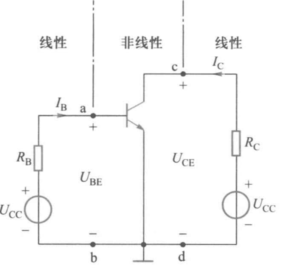
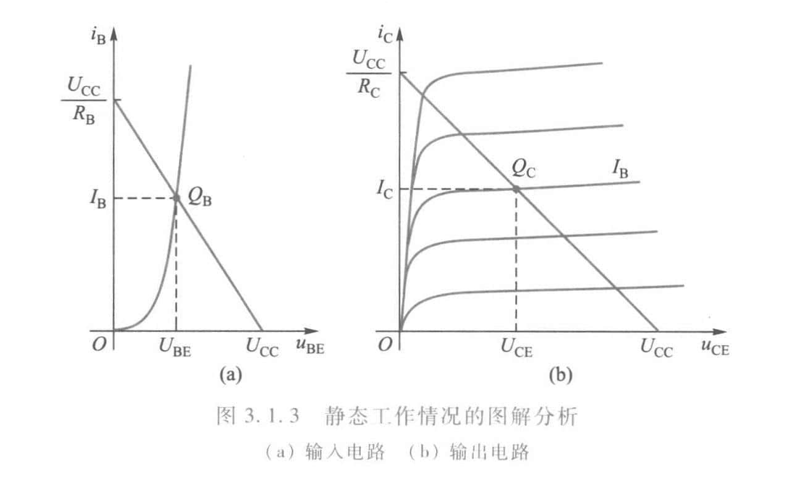

# Chap3 分立元件基本电路

## 共发射极放大电路

### 电路组成

!!! note "共发射极放大电路"
    

    - 晶体管：电流放大作用，发射结正偏，集电结反偏
    - 直流电源$U_{CC}$：提供放大所需能量
    - 偏置电阻$R_B$：调节偏置电阻，可调节基极电流
    - 集电极负载电阻$R_C$：将集电极电流的变化转换成电压的变化送到输出端
    - 耦合电容$C_1$、$C_2$：隔直，不适用于低频电路
    
### 静态分析

!!! info "静态分析"
    静态：放大器没有输入信号（$u_i=0$）时，电路中各处的电压电流都是直流恒定值，亦称为直流工作状态

    - 目的：
        + 确定三极管工作状态
        + 确定三极管静态工作点的合理性
    - 内容：在直流电源作用下，确定三极管
        + 基极电流$I_B$
        + 集电极电流$I_C$
        + 集电极与发射极之间的电压值$U_{CE}$
    - 方法：
        + 图解法
        + 估算法

!!! note "静态工作点"
    

    对于输入电路，其电压方程为

    $$U_{BE}=U_{CC}-R_BI_B$$

    $I_B$与$U_{BE}$的关系为一条直线，称为偏置线；偏置线与输入特性曲线的交点$Q_B$称为输入电路的静态工作点

    对于输出电路，其电压方程为

    $$U_{CE}=U_{CC}-R_CI_C$$

    $I_C$和$U_{CE}$的关系也是一条直线，称为负载线；负载线与输出特性曲线的交点$Q_C$称为输出电路的静态工作点

    
### 动态分析

!!! info "动态分析"
    动态：放大电路有输入信号时，电路中各处的电压电流都处于工作变动状态

    - 内容：输入信号变化时，电路中各种变化量的变动情况和相互关系
        + 电压放大倍数$A_U$
        + 输入电阻$r_{i}$
        + 输出电阻$r_o$
    - 方法：
        + 图解法
        + 微变等效电路分析方法

如果静态工作点选得过高，在$u_i$的正半周，晶体管很快进入饱和区，输出波形就产生失真，这种失真称为饱和失真

如果静态工作点选得过低，在$u_i$的负半周，晶体管进入截止区，这种失真称为截止失真

!!! summary "总结"
    1. 无输入信号时，晶体管的电流、电压都是直流量。当放大电路输入信号电压后，$i_B$、$i_C$和$u_{CE}$都在原来静态值的基础上叠加一个交流量，它们的方向是始终不变的

    2. 输出电压$u_o$为与$u_i$同频率的正弦波，且输出电压$u_o$的幅度比输入电压$u_i$大得多

    3. 电流$i_b$、$i_c$与输入电压$u_i$同相，而输出电压$u_o$与输入电压反相，即共发射极放大电路具有倒相作用

    4. 静态工作点的选择必须合适

!!! info "微变等效电路分析法"
    当放大电路的输入信号较小，且静态工作点选择合适时，晶体管的工作情况接近于线性状态，电路中各电流、电压的波形基本上是正弦波，因而可以将晶体管这个非线性元件组成的电路当作线性电路来处理

### 静态工作点的稳定

### 频率特性

## 共集电极放大电路

信号从发射极输出，所以共集电极电路又称为射极输出器

## 共源极放大电路

### 静态分析

### 动态分析

## 分立元件组成的基本门电路

### 二极管与门电路

### 二极管或门电路

### 晶体管及场效晶体管非门电路

