# Chap4 数字集成电路

电子电路中的信号可分为模拟信号和数字信号两种类型，模拟信号在时间上和数值上都连续变化，而数字信号在时间上和数值上则都是离散的；工作在模拟信号下的电子电路称为模拟电路，工作在数字信号下的电子电路称为数字电路

集成电路（integrated circuit, IC）具有元件密度高、体积小、重量轻、引线短、外部焊接点小、耗电省等优点

## 逻辑代数运算规则

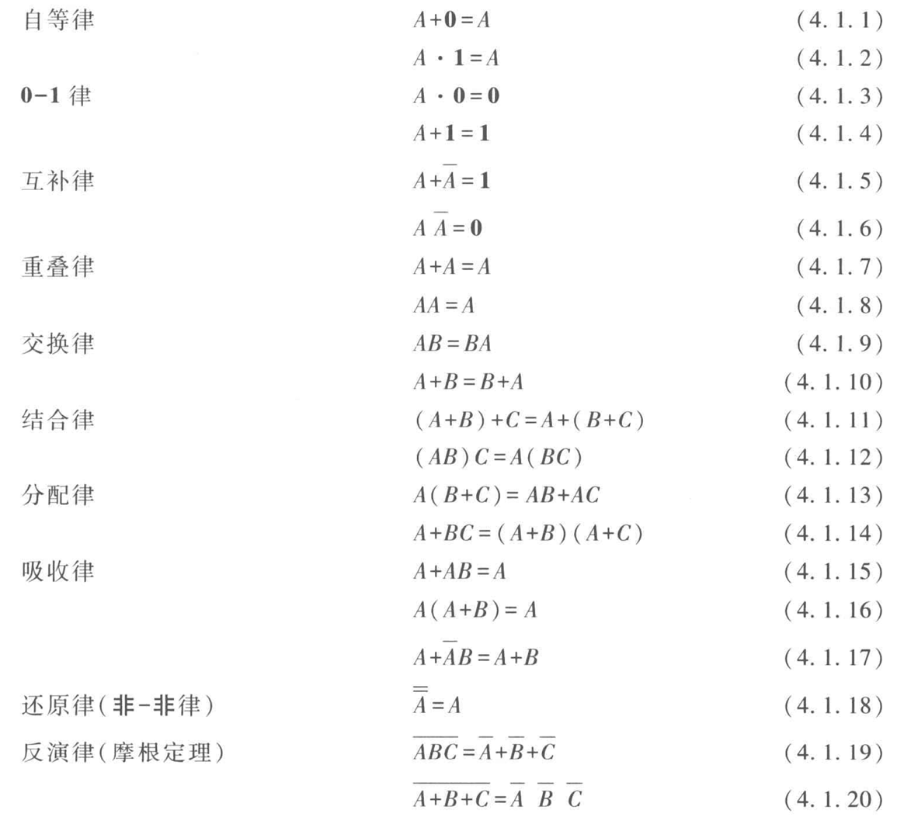

## 逻辑函数的表示和化简

逻辑函数可以分别用逻辑状态表、逻辑表达式及逻辑图来表示

## 集成门电路

### 集成门电路的类型

门电路是数字电路的基本逻辑单元

!!! note "门电路类型"
    集成门电路有双极型和MOS型，最常用的是TTL和CMOS集成门电路

    - TTL门电路
        + 晶体管-晶体管逻辑（transistor-transistor logic）门电路的简称
        + 具有工作速度快，带负载能力强，抗干扰性能好等优点

    - CMOS门电路
        + 互补（completementary）MOS门电路的简称
        + 由两种不同类型的MOS管组合而成，P沟道增强型MOS管作为负载管，N沟道增强型MOS管作为驱动管

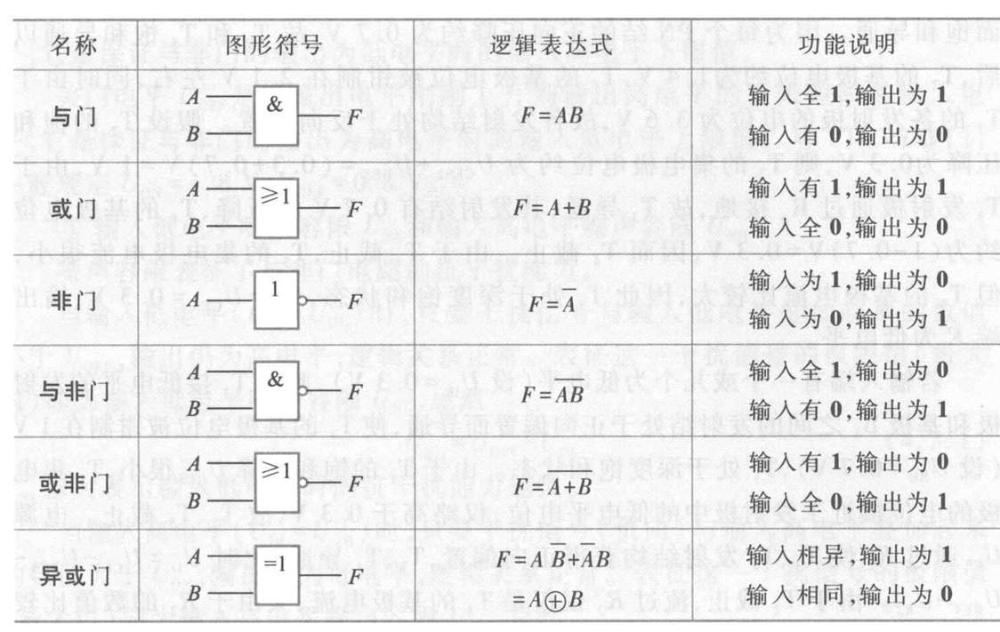

### TTL与非门、三态门和CMOS或非门电路

#### TTL与非门电路

#### TTL三态与非门电路

#### CMOS或非门电路

三态门有三种状态：高阻态、低电平和高电平

## 组合逻辑电路

!!! definition "组合逻辑电路"
    当输入变量取任意一组确定的值以后，输出变量的状态就唯一地确定，这类电路称为组合逻辑电路

### 组合逻辑电路的分析和设计方法

### 加法器

!!! definition "半加器"
    两个1位二进制数相加，如不考虑低位来的进位，称为半加器
    
    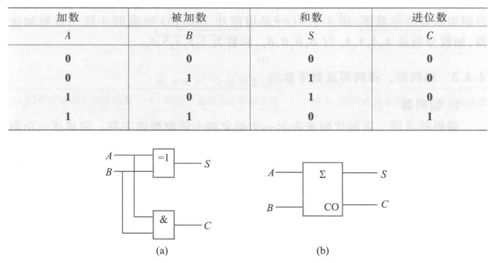

!!! definition "全加器"
    两个1位二进制数相加，若考虑低位来的进位，称为全加器

    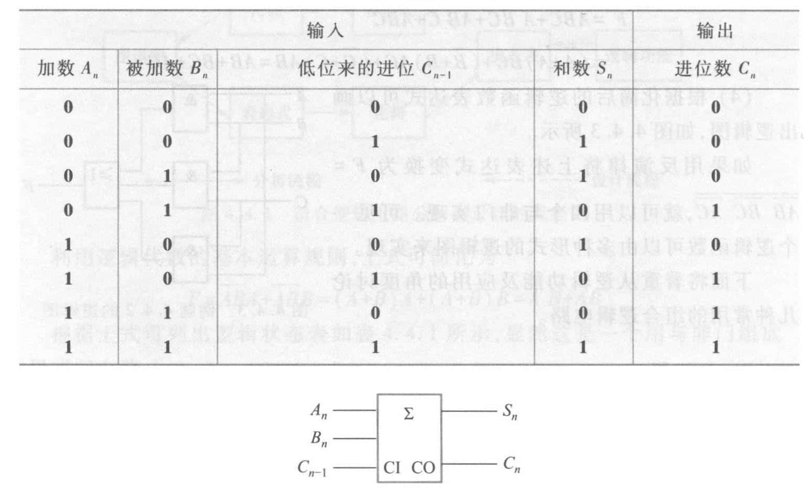

### 编码器、译码器及数字显示

实现编码功能的逻辑电路称为编码器，实现译码功能的逻辑电路称为译码器

二进制译码器有$N$个输入端，有$2^N$个输出端，通称为$N$线-$2^N$线译码器

用七段发光显示器件显示数字，需要配合使用七段译码器；七段译码器的输入是二-十进制码（BCD码），需要四个输入端，七个输出端

## 集成触发器

!!! definition "触发器"
    触发器具有0和1两个稳定状态，在触发信号的作用下，可以从原来的一种稳定状态转换到另一种稳定状态。与门电路不同，其输出状态不仅和当时输入有关，而且和以前的输出状态有关

    按逻辑功能的不同，触发器可分为RS触发器、D触发器、JK触发器和T触发器；按电路结构的不同，可分为基本触发器、同步触发器、边沿触发器

!!! definition "时序逻辑电路"
    输出不仅与当前时刻的输入状态有关，而且与电路原来的状态有关

集成触发器是组成时序逻辑电路的基本部件

### 基本RS触发器

图示为两个与非门组成的基本RS触发器，$\bar{S}$、$\bar{R}$为输入端，$Q$、$\bar{Q}$为输出端，正常工作时$Q$与$\bar{Q}$的电平是相反的

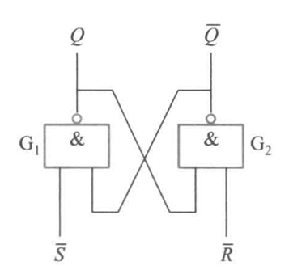

当$\bar{S}=1$、$\bar{R}=0$时，$G_2$门的输出$\bar{Q}=1$，反馈到$G_1$门，使$G_1$门的两个输入均为1，输出$Q=0$。$Q=0$又反馈到$G_2$门的输入端，保证$\bar{Q}=1$。此时$\bar{R}=0$的信号撤掉（即$\bar{R}$由0变1），触发器的状态不变，这就是触发器的记忆功能。$Q=0$、$\bar{Q}=1$，称触发器处于0状态

当$\bar{S}=0$、$\bar{R}=1$时，可分析得$Q=1$、$\bar{Q}=0$，触发器处于1状态

当$\bar{S}=1$、$\bar{R}=1$时，两个与非门的工作状态不受影响，触发器保持原来的状态不变

当$\bar{S}=1$、$\bar{R}=1$时，$Q=\bar{Q}=1$，是触发器的不正常状态

使用$Q^n$表示触发器原来的状态（称为原态），$Q^{n+1}$表示新的状态（称为次态），即有如下逻辑状态表

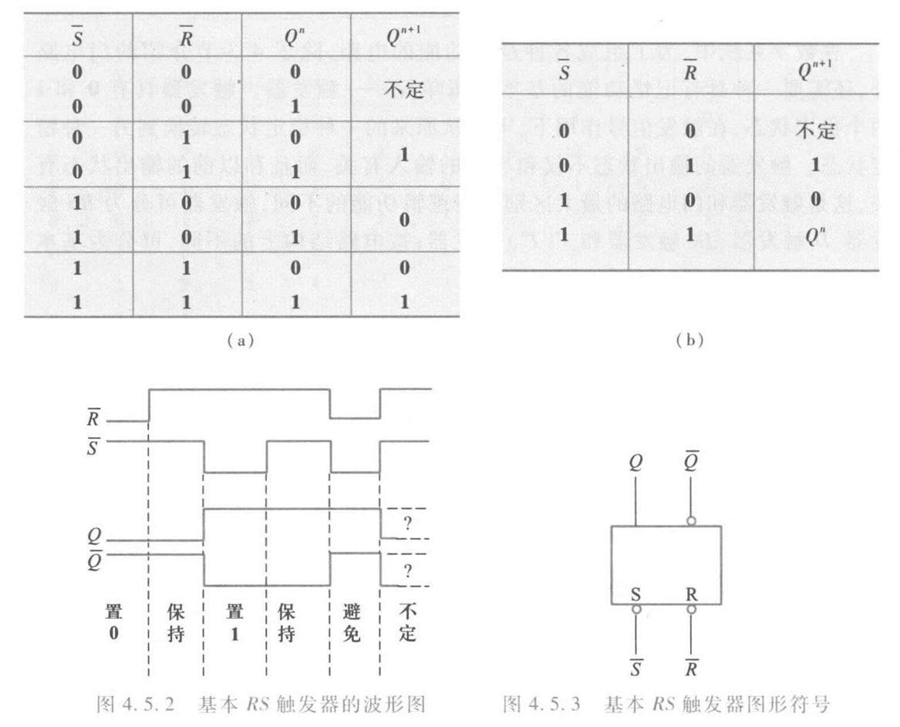

分析可知：

- 触发器输出有两个稳态：$Q=0$、$\bar{Q}=1$和$Q=1$、$\bar{Q}=0$，这种有两个稳态的触发器通常称为双稳态触发器；若令$\bar{S}=1$、$\bar{R}=1$，触发器的状态就可以保持，说明双稳态触发器具有记忆功能

- 利用加于$\bar{R}$、$\bar{S}$端的负脉冲可使触发器由一个稳态转换为另一稳态；加入的负脉冲称为触发脉冲

- 可以直接置位。当$\bar{R}=0$、$\bar{S}=1$时，$Q=0$，故$\bar{R}$端称为置0端或复位端（reset）；而$\bar{R}=1$、$\bar{S}=0$时，$Q=1$，故$\bar{S}$端称为置1端或置位端（set）

$\bar{R}$、$\bar{S}$上方的非号表示加负脉冲（低电平）才有此功能。图形符号中的$\bar{S}$、$\bar{R}$引线方框处的圆圈也表示该触发器是用低电平触发的。$\bar{Q}$引线方框处的圆圈表示该端状态和$Q$端相反

### 同步RS触发器

同步信号是一种脉冲信号，通常称为时钟脉冲（Clock Pulse, CP），作用是协调触发器和触发器、触发器和其他数字逻辑部件的动作

具有时钟脉冲的触发器称为同步触发器

图示为同步RS触发器，$R$、$S$端为数据输入端，$CP$端为时钟脉冲输入端，$\bar{S}_d$、$\bar{R}_d$为直接置位、复位输入端

图形符号中$C1$、$1S$、$1R$中的1是一种关联标识，表示$C1$和$1S$、$1R$是相互关联的输入，即只有在$C1$是高电平时，$1S$、$1R$才起作用

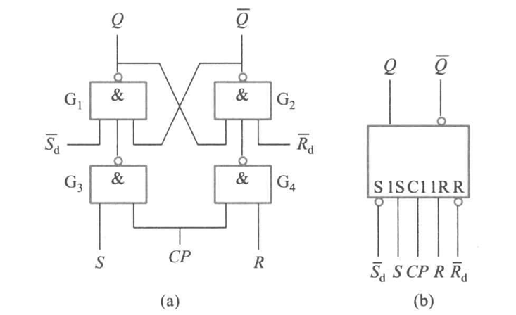

$\bar{S}_d$、$\bar{R}_d$不受$CP$的控制和$S$、$R$的影响，称为异步输入端，可以使触发器直接置位或复位；不作用时，$\bar{S}_d$和$\bar{R}_d$都应设置成高电平

### D锁存器和正边沿触发的D触发器

#### D锁存器

同步D触发器是一个单端输入的触发器，由于只能用于锁存数据，故通称为D锁存器

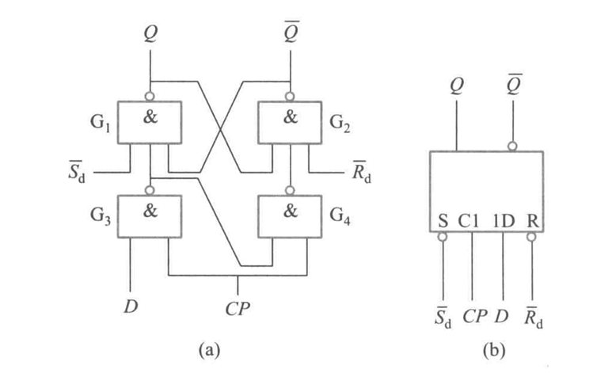

当$CP=0$时，D输入端被封锁，数据不能传入，D锁存器状态不变

当$CP=1$时，D锁存器输出状态由D输入端电平决定，若$D=1$则$Q=1$，若$D=0$泽$Q=0$。一旦$CP$重新变为0，D数据就被锁存

D锁存器的逻辑函数表达式（通常称为特性方程）为

$$Q^{n+1}=D$$

由于D锁存器的状态只有在$CP=1$期间才能改变，故把这种触发方式称为<b>电平触发方式</b>。电平触发方式的优点是结构简单，动作比较快。缺点是$CP=1$期间，输入状态的变化会引起输出状态的变化。因此电平触发方式的触发器不能用于计数，只能用于锁存数据

#### 正边沿出发的D触发器

<b>边沿触发</b>是指触发器的次态仅由时钟脉冲的上升沿或下降沿来到时的输入信号决定，分为正边沿（上升沿）和负边沿（下降沿）

图中方框内$C1$的^符号，表示$C1$的输入由0变1（上升沿）时，1D的输入起作用

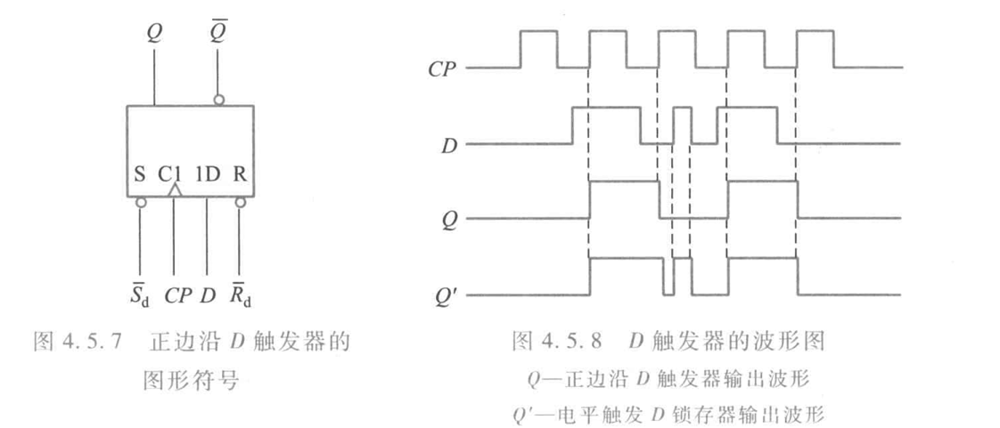

### 负边沿触发的JK触发器

图示$CP$端方框处圆圈，加上^符号，表示$CP$信号从高电平到低电平时有效，即属于负边沿触发

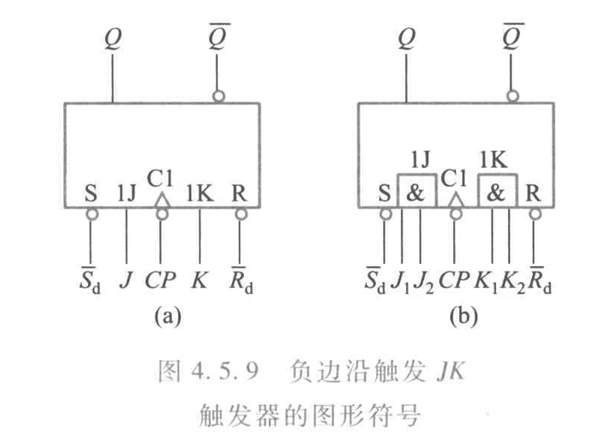

其特性方程为

$$Q^{n+1}=J\overline{Q^n}+\overline{K}Q^n$$

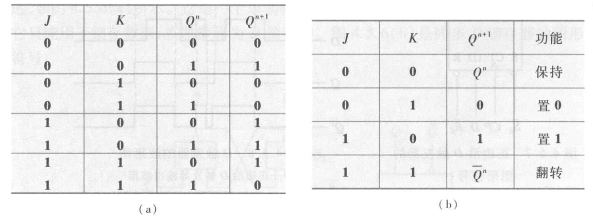

如果把触发器的J、K端连在一起，则称为T触发器，特性方程为

$$Q^{n+1}=T\overline{Q^n}+\overline{T}Q^n$$

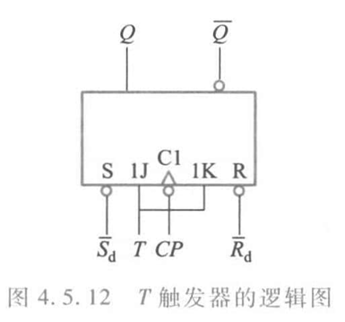

当$T=1$时，$Q^{n+1}=\bar{Q}^n$（此时又称为$T^\prime$触发器），$CP$每次作用，触发器都翻转；当$T=0$时，$Q^{n+1}=Q^n$，$Q$状态保持不变。$T$（$T^\prime$）触发器常用于计数电路中

## 时序逻辑电路

时序逻辑电路根据时钟脉冲加入方式的不同，分为同步时序逻辑电路和异步时序逻辑电路

同步时序逻辑电路中各触发器公用同一个时钟脉冲，因而各触发器的动作均与时钟脉冲同步。异步时序逻辑电路中各触发器不共用同一个时钟脉冲，因而各触发器的动作时间不同步

### 时序逻辑电路的分析方法

!!! info "分析方法"
    1. 分析电路的组成
    2. 写出组合逻辑电路对外输出的逻辑表达式，称为<b>输出方程</b>
    3. 写出各个触发器输入端的逻辑函数表达式，称为<b>驱动方程</b>
    4. 把各个触发器的驱动方程代入触发器的特性方程，得出各触发器的<b>状态方程</b>
    5. 根据状态方程和输出方程，列出逻辑状态转换表，画出波形图，确定时序电路的状态变化规律和逻辑功能

计数循环中出现的状态称为有效状态，计数循环中不出现的状态称为无效状态

在任何初始状态下都能在时钟脉冲作用下使电路自动回到某一个有效状态，则称该电路能自启动

### 寄存器

寄存器是一种典型的时序电路，分为数码寄存器和移位寄存器

#### 数码寄存器

数码寄存器用来暂时存放二进制数码，可以用触发器构成，需要存放N位二进制码，就要用N个触发器

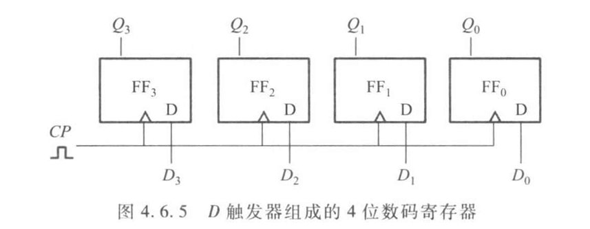

#### 移位寄存器

移位寄存器可分为单向移位寄存器和双向移位寄存器。按输入方式的不同，可分为串行输入和并行输入；按输出方式的不同，可分为串行输出和并行输出

!!! question "习题4.6.6"
    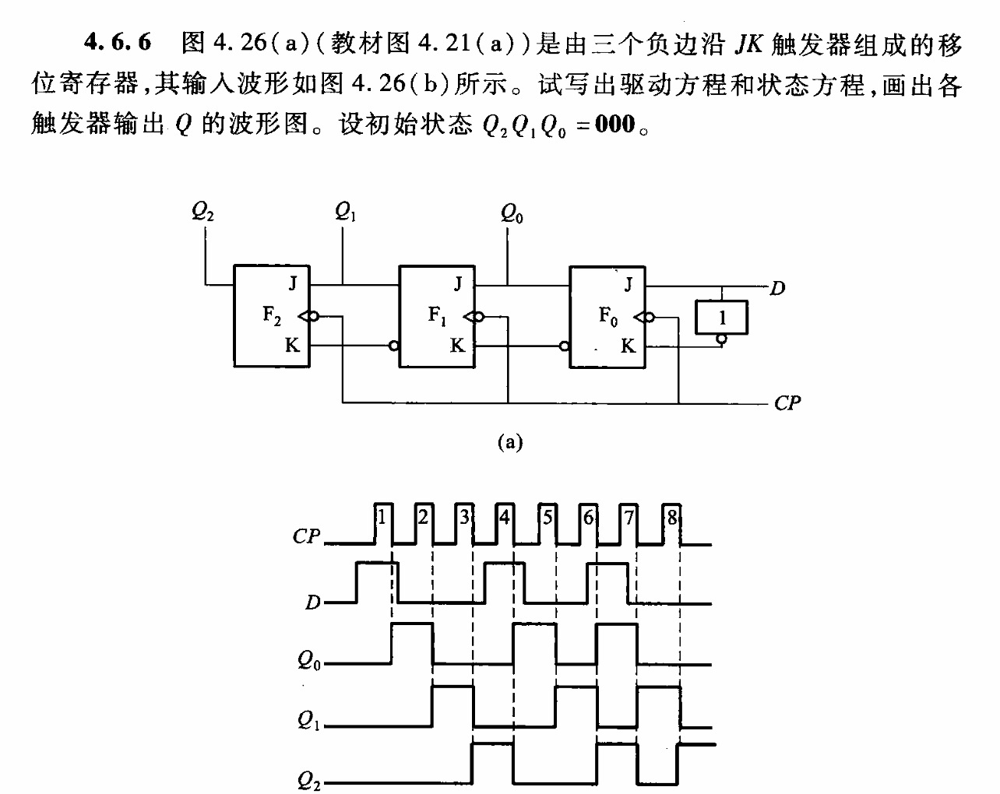
    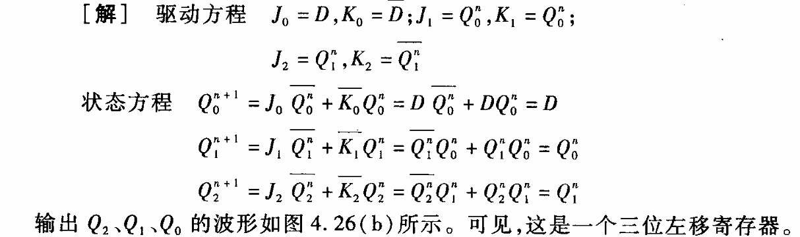
    
### 计数器

计数器可以由JK和D触发器构成

## 半导体存储器

### 只读存储器

### 随机存取存储器

## 可编程逻辑器件

### 可编程只读存储器

### 可编程逻辑阵列

### 通用阵列逻辑

### 现场可编程门阵列

## 应用举例

### 9位数字密码锁电路

### 带数字显示的七路抢答器