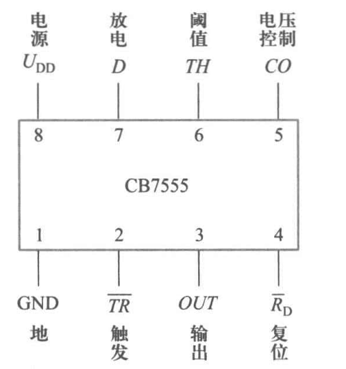
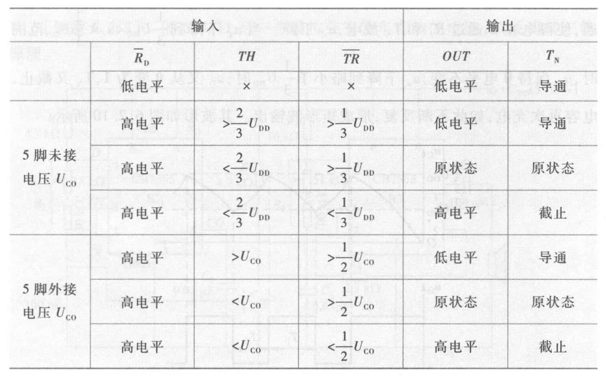

# Chap6 波形产生和变换

## 正弦波振荡电路

正弦波振荡电路由放大、反馈、选频和稳幅环节组成，属于正反馈电路

### 正弦波振荡电路的基本原理

维持自激振荡的平衡条件为

$$AF=1$$

其中A为开环放大系数，F为反馈系数

幅度平衡条件：$AF=1$

相位平衡条件：$\varphi_A+\varphi_F=2n\pi \quad(n=0,1,2...)$

### RC正弦波振荡电路

### LC正弦波振荡电路

## 多谐振荡器

多谐振荡器也称矩形波（含方波）发生器

### 用集成运放构成的多谐振荡器

### 用石英晶体构成的多谐振荡器

### 用555集成定时器构成的多谐振荡器

常用的555定时器有：

双极型定时器——5G15555

CMOS定时器——CB7555

多谐振荡器没有稳定状态，属于无稳触发器

## 单稳态触发器和施密特触发器

### 用555集成定时器构成的单稳态触发器

单稳态触发器主要用于整形、定时和延时
### 用555集成定时器构成的施密特触发器