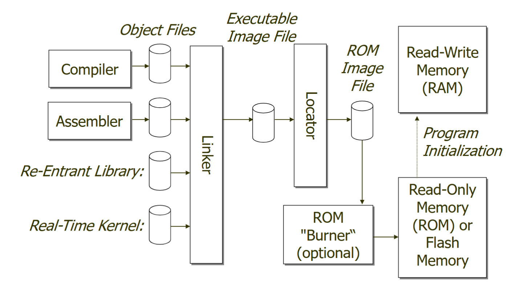
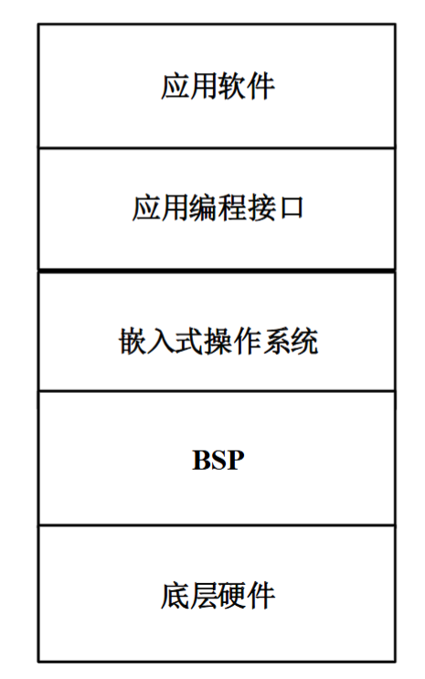

# Chap1 Introduction

Embedded computing system: any device that includes a programmable computer but is not itself a general-purpose computer

嵌入式计算系统：指包含可编程计算机（通常是微处理器）的任何设备，但其本身并不是通用计算机

Characteristics of embedded system: sophisticated functionality、reliable、real-time operation、high performance、low manufacturing cost、low power、safe and secure

其特点是：**面向应用**，对执行速度、可靠性、功耗等要求高，往往**成本敏感**，**设计周期短**；基本系统、I/O模块、传感器、执行机构、电源、通信模块等组成；技术发展趋势是多核、网络化、智能

??? note "Contradictory Requirements of CPS"

    - Integration: Cyber + Physical、Computation + Dynamics、Security + Safety

    - Contradiction: 
        + adaptablity(适应性) vs. repeatablity(重复性)
        + high connectivity(高连接性) vs. security(安全) and privacy(隐私)
        + high performance(高性能) vs. low energy(低能耗)
        + asynchrony(异步) vs. coordination(协调)/cooperation(合作)
        + scalability(可扩展性) vs. reliablity(可靠性) and predictablity(可预测性)
        + laws and regulations(法律法规) vs. technical possibilities(技术可能性)
        + economies of scale(clound)(规模经济) vs. locality(fog)(本地性)
        + open(开放) vs. proprietary(专有)
        + algorithms(算法) vs. dynamics(动力)

    - Innovation: Cyber-Physical systems requires new engineering methods and models to address these contradictions

!!! note "real-time operation"
    - Must finish operations by deadlines
        + Hard real time: missing ddl causes failure
        + Soft real time: missing ddl results in degraded performance
    - Many systems are multi-rate: must handle operations at widely varing rates

!!! note "嵌入式系统基本结构"
    - 硬件：嵌入式核心芯片、内存系统、外部接口
    - 软件：嵌入式操作系统（Embedded Operating System）、应用软件、板级支持包（board support package, BSP）
    - 层次结构：

