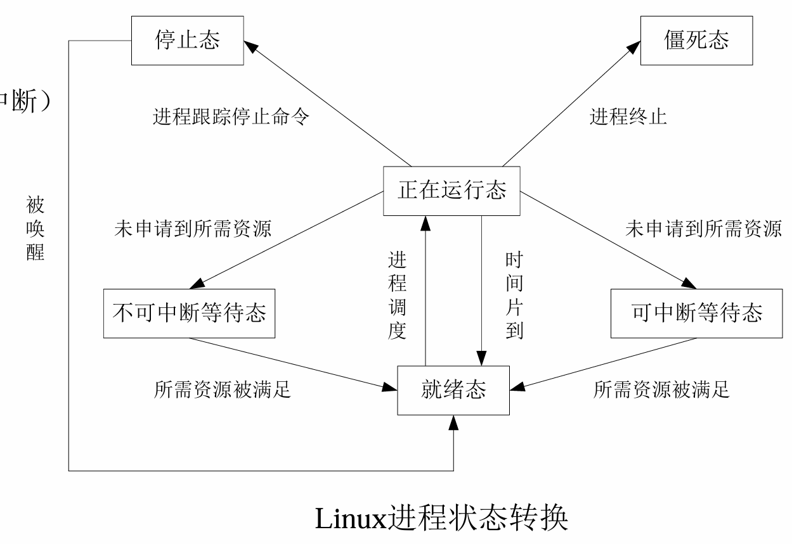

# Chap6 OS & Process/Thread Management

## OS的基本结构

操作系统：实现对计算机资源的管理、控制应用程序的执行、提供应用程序访问计算机资源的接口、实现对操作系统内核及应用程序的保护

!!! note "CPU特权级"
    - 可分成核心态、用户态
    - 核心态（特权模式）：具有较高特权，能执行一切指令，访问所有寄存器和存储器
    - 用户态（非特权模式）：具有较低特权，只能执行规定命令，访问指定的寄存器和存储器
    - Arduino处理器不支持不同特权级，树莓派、Pixhawk处理器支持

操作系统内核是操作系统中最关键最基础的部分，包括中断处理程序、设备驱动程序、时钟管理、进程管理


嵌入式操作系统特点：体积小、实时性、可剪裁性、可靠性、低功耗

嵌入式OS分类：面向低端设备（FreeRROS）、面向高端设备（Linux）、面向移动应用（iOS、Android）、面向高可靠实时应用（VxWorks）

VxWorks具有可裁剪微内核结构；高效的任务管理；灵活的任务间通讯；微秒级的中断处理；支持POSIX 1003.1b实时扩展标准；支持多种物理介质及标准的、完整的TCP/IP网络协议等

实时操作系统（RTOS）评价体系：任务调度机制、内存管理、最小内存开销、最大中断禁止时间、任务切换时间

最大中断禁止时间和任务切换时间是最重要的技术指标

## 进程的基本概念

进程：是程序的一次执行过程，是系统进行资源分配和调度的基本单位

线程：是进程的一个执行流，是CPU调度和分派的基本单位。一个进程可以由多个线程组成，它们共享进程的资源。

顺序执行（sequential）：程序独占整个系统的所有资源，处理机严格按照程序所规定的顺序进行操作，只有在前一个操作执行完成后，才进行后续操作

并发执行（concurrent）：一组逻辑上互相独立的程序或程序段，在执行过程中其执行时间在客观上相互重叠

进程的实体：进程控制块（Process Control Block, PCB）、程序段、数据段

PCB中记录了操作系统所需的用于描述进程进展情况及控制进程运行所需的全部信息。PCB 是进程存在的唯一标志。一般把PCB存放在操作系统专门开辟的PCB区内。

PCB涵盖了四个主要方面的信息。首先，进程描述信息包括进程标识符、用户名或用户标识号以及家族关系，用于识别不同进程、确定资源归属及保护。其次，处理机状态信息存储了通用寄存器、指令计数器、程序状态字以及用户栈指针等处理器的现场信息。第三，进程调度信息记录着进程状态、优先级、调度所需的其他信息（如CPU等待时间和已执行时间总和）以及阻塞原因，为进程调度和进程对换提供依据。最后，进程控制信息包含程序和数据的地址、进程同步和通信机制、资源清单以及链接指针等，以实现进程间的协调、通信及资源的有效管理。为高效管理众多PCB，系统通常采用链接方式或索引方式来组织PCB。

!!! definition "进程"
    - 进程是一个具有一定独立功能的程序关于某个数据集合的一次运行活动，是动态的、有生命的
    - 进程是系统中资源拥有者的基本单位

!!! note "进程的状态及其转换"
    - 就绪状态：进程分配到除CPU以外的所有必要资源后，只要再获得CPU便可立即执行
    - 执行状态：进程已获得CPU、其程序正在执行的状态
    - 阻塞状态：正在执行的进程因发生某事件暂时无法继续执行时，便放弃CPU处于暂停状态

    

!!! note "Linux进程的状态转换"
    运行状态、等待状态、停止状态、僵死状态

    

进程互斥（mutual exclusion）：指当有若干进程都要使用某一共享资源时，若该资源是临界资源，则任何时刻最多允许一个进程使用，其他要使用该资源的进程必须等待，直到占用该资源者释放该资源

临界资源（critical resource）：操作系统中将一次只允许一个进程访问的资源称为临界资源

临界区（critical section）：把进程中访问临界资源的那段程序代码称为临界区。为实现对临界资源的互斥访问，应保证诸进程互斥地进入各自的临界区。必须在临界区前面增加一段用于进行上述检查的代码，我们把这段代码段称为进入区（Entry Section）；相应地，在临界区后面也要加上一段称为退出区（Exit Section）的代码，用于将临界区正被访问的标志恢复为未被访问的标志。
    
临界区问题解决方法：软件方法（忙等待）、信号量机制

一个访问某一临界资源的循环进程可描述如下：

```
while(True)
{
  entry section
  critical section
  exit section
  remainder section
}
```

进程同步（syncronization）:将异步环境下的一组并发进程进行直接制约，使得各进程按一定的速度执行的过程称为进程间的同步

具有同步关系的一组并发进程称为合作进程，合作进程间互相发送的信号称为消息或事件

进程的同步与进程的互斥都涉及到并发进程共享资源的问题，进程的互斥实际上是进程同步的一种特殊情况

有时也把进程的互斥与进程的同步统称为进程的同步

创建进程
```c
#include <stdio.h>
#include <unistd.h>
int main(){
    int pid;
    pid = fork(); // system call
    if (pid < 0){
        // error occurred
        return -1;
    } else if (pid == 0){
        // child process
        printf("child process executing…\n");
        return 0;
    } else {
        // parent process
        wait(); // system call, wait for children completion
        printf("parent process executing…\n");
        return 0;
    }
}
```

创建线程
```c
#include <pthread.h>  
void* threadFunction(void* arg) {
    ...
    // 线程函数返回时，可以返回一个指向某个对象的指针，或者返回NULL
    return pointerToSomething or NULL;
}
int main(void) {  
    pthread_t threadID;
    void* exitStatus; // 存储线程结束时的返回状态。
    int value = something;
    // 使用pthread_create函数创建一个新线程。
    // 第二个参数用来设置线程属性，这里传递NULL表示使用默认属性。
    // 第四个参数是传递给线程函数的参数，这里我们传递了&value。
    pthread_create(&threadID, NULL, threadFunction, &value);  
    // 使用pthread_join函数等待线程结束。这个函数会阻塞当前线程，直到指定的线程结束。
    // 第二个参数是一个指向void指针的指针，用来存储线程函数的返回值。
    pthread_join(threadID, &exitStatus);  
    return 0;
}
```

## 进程/线程调度

CPU约束进程：大量时间计算，少量I/O
I/O约束进程：大量I/O，少量时间计算

进程的执行是CPU brust和I/O brust交替的过程

!!! note "调度方式（decision mode）"
    - 非抢占式（Non-preemptive）
        + 进程一旦被调度，则执行到结束或不能继续执行
    - 抢占式（Preemptive）
        + 当一个新的进程到达时
        + 当有进程从阻塞变为就绪时
        + 进程从核心态返回到用户态时（如中断、系统调用返回）

### 信号量

value：表示可用资源的数量
当 value >= 0 时，其数值表示可用资源的数量。
当 value < 0 时，其绝对值表示阻塞的进程数。在初始化时，这个值是非负的。
一个等待队列，里面存放的是正在等待这类资源的进程。
信号量的原语操作

信号量的操作主要有两个：wait 和 signal，有时也被称为 P 和 V 操作

wait原语(P操作)：

S.value 减1
如果 S.value 减1后仍然大于或等于零，进程继续执行。
如果 S.value 减1后小于零，该进程被阻塞，并被放入与该信号量相对应的等待队列 L 中，然后进行进程调度。
signal原语(V操作)：

S.value 加1
如果 S.value 加1后的结果大于零，进程继续执行。
如果 S.value 加1后的结果小于或等于零，从该信号量的等待队列 L 中唤醒一个等待的进程，然后返回原进程继续执行或进行进程调度。


互斥量：是一个整数值，用于控制对共享资源的访问

信号量机制：操作系统提供的装置，用于进行进程/线程的同步与互斥

原子操作（atomic operation）：一个不可分割的操作，即一旦开始，就会完整执行完，不会被其他操作中断

### 生产者-消费者

生产者-消费者机制：用于描述两个或多个进程共享有限缓冲区的场景，生产者向缓冲区添加数据，消费者从缓冲区移除数据

生产者进程结构
```
do {
    ...
    /* produce an item in next_produced */
    ...
    wait(empty); // 等待缓冲区有空位
    wait(mutex); // 等待获得互斥访问权，以修改缓冲区
    ...
    /* add next_produced to the buffer */
    ...
    signal(mutex); // 释放互斥访问权
    signal(full); // 指示缓冲区已满（或增加一个项目）
} while (true);
```

消费者进程结构

```
do {
    wait(full); // 等待缓冲区有数据
    wait(mutex); // 等待获得互斥访问权，以修改缓冲区
    ...
    /* remove an item from buffer to next_consumed */
    ...
    signal(mutex); // 释放互斥访问权
    signal(empty); // 指示缓冲区已空（或减少一个项目）
    ...
    /* consume the item in next_consumed */
    ...
} while (true);
```

## 进程通信

进程间通信：共享存储、消息传递（消息队列和信箱）、管道

!!! note "调度算法：分时系统"

    - FCFS(first come first served)：先来先服务，直至结束

    - RR(round robin)：时间片轮转，时间片到时，将进程放入就绪队列的末尾，然后从队列头部取出一个进程运行，公平的调度策略，不会导致进程饥饿

    - Priority scheduling：基于优先级的调度

## 死锁


死锁：系统中存在一个进程集合，该集合中的每个进程都占用了一定数量的资源，并且在等待被集合中的其他进程占用的资源

!!! note "死锁的条件"
    - Mutual exclusion: 互斥
    - Hold and wait: 保持等待，申请资源时拥有其他资源
    - No preemption: 非剥夺，进程占有的资源只能由进程自己释放，不会被别的进程剥夺
    - Circular wait: 循环等待

## 看门狗

!!! note "看门狗"
    看门狗定时器（Watchdog Timers）：一种硬件机制，用于检测和恢复软件系统故障

    1. 看门狗定时器本质上是一个硬件计数器，它以固定速率向下计数至零
    2. 必须对软件进行修改，确保每条执行路径都能足够频繁地重新初始化该定时器，以防止计数器溢出（达到零值）并导致系统复位
    3. 如果计数器确实达到零，系统会判定发生故障。此时，看门狗定时器会向中央处理器（CPU）发送复位信号，使系统重新初始化

!!! note "看门狗程序示例"

    - 第一段：在任务被触发时设置截止时间并启动任务

    - 第二段：任务执行主体，检查是否超时，并记录状态

    - 第三段：看门狗监视器，定期检查所有任务的状态，决定是否重启计数器（或系统）

### 任务触发段
```c
Task trigger (e.g., ISR or different thread)    Task to compute output response
...
deadline[TASK] = current_time() + LIMIT ;
busy[TASK] = true ;
SemaphorePost(...) ;
...
```

当任务需要被触发时（例如中断服务程序 ISR 或其他线程），设置该任务的截止时间 deadline[TASK]

LIMIT 是该任务允许的最大执行时间

将 busy[TASK] 设为 true，表示该任务已开始执行但尚未完成

通过 SemaphorePost 发出信号量，唤醒等待该信号量的任务线程，使其开始执行

### 任务执行与截止时间检查

```c
while (true)
{
    SemaphorePend(...) ;  // 等待触发信号量
    ...
    // Compute output response
    if (current_time() > deadline[TASK])
    {
        failed[TASK] = true ;
    }
    busy[TASK] = false ;
}
```

任务线程在一个无限循环中等待信号量（SemaphorePend）

一旦被触发，执行实际的计算工作（Compute output response）

完成后检查当前时间是否超过预设的截止时间，如果是，则标记 failed[TASK] = true

最后将 busy[TASK] 设为 false，表示任务已完成

### 看门狗监视器

```c
while (true)
{
    int now, task ;
    sleep(...) ;  // for less than counter period ...
    now = current_time();
    for (task = 0; task < tasks; task++)
    {
        if (failed[task]) break ;
        if (busy[task] && now > deadline[task]) break ;
    }
    if (task == tasks) restart_counter()
}
```

看门狗线程定期（通过 sleep）检查所有任务的状态。

循环检查每个任务：

如果 failed[task] == true，说明该任务已经报告过失败，直接 break

如果任务正忙（busy[task] == true）且当前时间已超过其截止时间（now > deadline[task]），说明任务超时未完成，break

如果 task == tasks，意味着所有任务都通过了检查（没有失败且没有超时），则调用 restart_counter()（可能是重置看门狗计数器，防止系统重启）

如果循环因 break 退出，task 会小于 tasks，则不会重置计数器，最终看门狗超时会导致系统重启
