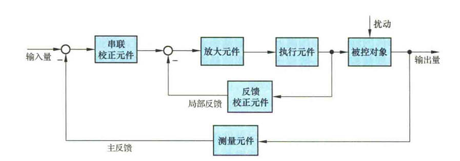

# Chap1 自动控制的一般概念

## 自动控制的基本原理与方式

反馈：取出输出量送回输入端，并与输入信号相比较产生偏差信号

反馈信号与输入信号相减，使得产生偏差越来越小，称为负反馈，反之则为正反馈

!!! note "反馈控制系统基本组成"
    - 测量元件：检测被控制的物理量，非电量一般转化为电量
    - 给定元件：给出与期望的被控量相对应的系统输入量
    - 比较元件：比较测量元件检测的被控量与给定元件的输入量，求出偏差
    - 放大元件：将比较元件的偏差信号进行放大
    - 执行元件：直接推动被控对象，使被控量发生变化
    - 校正元件/补偿元件：用串联或反馈的方式连接在系统中，以改善系统的性能

    

!!! note "基本概念"
    - 前向通路：信号从输入端沿箭头方向到达输出端的传输通路
    - 主反馈通路：系统输出量经测量元件反馈到输入端的传输通路
    - 主回路：前向通路与主反馈通路构成
    - 单回路系统：只有一个主反馈通路的系统
    - 多回路系统：两个及以上反馈通路的系统

加到反馈控制系统上的外作用：有用输入，扰动

!!! note "基本控制方式"
    - 反馈控制方式：按偏差控制，又称闭环控制
    - 开环控制方式
        + 按给定量控制的开环控制
        + 按扰动控制的开环控制，又称顺馈控制
    - 复合控制方式：按偏差控制和按扰动控制相结合
        

## 自动控制系统的分类

### 线性连续控制系统

用线性微分方程描述，其一般形式为

$$a_0\frac{d^n}{dt^n}c(t)+a_1\frac{d^{n-1}}{dt^{n-1}}c(t)+...+a_{n-1}\frac{d}{dt}c(t)+a_nc(t)=b_0\frac{d^n}{dt^n}r(t)+b_1\frac{d^{n-1}}{dt^{n-1}}r(t)+...+b_{n-1}\frac{d}{dt}r(t)+b_nr(t)$$

其中，c(t)为被控量，r(t)为系统输入量

系数为常数时，为定常系统；系统随时间变化，为时变系统

!!! note "线性定常连续系统"
    根据输入量的变化规律分类

    - 恒值控制系统
        + 输入量为常值，要求被控量等于一个常值，又称为调节器
    - 随动系统
        + 输入量为预先未知的时变函数，要求被控量以尽可能小的误差跟随，又称跟踪系统
        + 如果被控量为机械位置或其导数，又称伺服系统
    - 程序控制系统
        - 输入量为预先已知的时变函数，要求被控量跟随

### 线性定常离散控制系统

用差分方程描述

$$a_0 c(k+n)+a_1 c(k+n-1)+...+a_{n-1} c(k+1)+a_n c(k)=b_0 r(k+m)+b_1r(k+m-1)+...+b_{n-1}r(k+1)+b_nr(k)$$

### 非线性控制系统

用非线性微分（或差分）方程描述

## 对自动控制系统的基本要求

!!! note "基本要求"
    - 稳定性：一个稳定的控制系统，其被控量偏离期望值的初始偏差应随时间增长逐渐较小并趋于零
        + 线性自动控制系统的稳定性是由系统结构和参数决定的，与外界因素无关
    - 快速性：控制系统过渡过程的形式和快慢有要求，称为稳态性能
    - 准确性：被控量的稳态值和期望值之间存在稳态误差，稳态误差是衡量控制系统精度的重要标志

典型外作用：阶跃函数、斜坡函数、脉冲函数、正弦函数

一般将阶跃函数作用下系统的响应特性作为评价系统动态性能指标的依据

