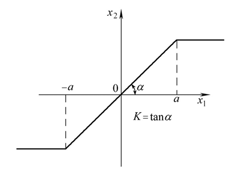
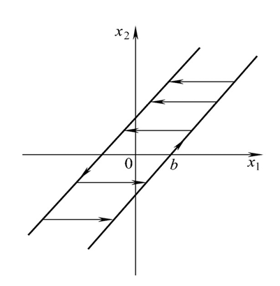
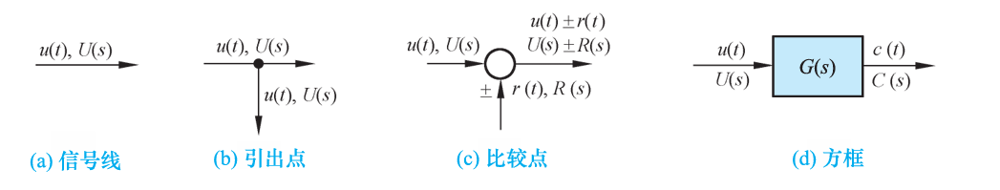
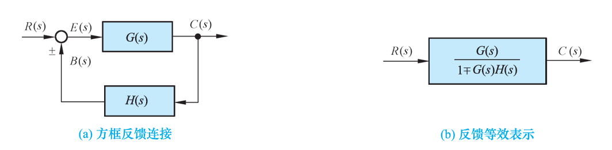

# Chap2 控制系统的数学模型

!!! note "数学模型"
    - 时域模型：微分方程
    - 复域模型：传递函数
    - 频域模型：频域特性

    

## 控制系统的时域数学模型

### 线性系统的基本特性

线性系统可以应用叠加原理，即系统具有可叠加性和均匀性/齐次性

### 非线性微分方程的线性化

!!! note "非线性特性"
    |饱和|间隙|死区|
    |:-:|:-:|:-:|
    |||

!!! note "线性化方法"
    1. 忽略弱非线性因素
    2. 小偏差法（切线法，增量线性化法）

!!! note "小偏差法"
    假设：控制系统调节过程中，各个元件输入量和输出量只是在平衡点附近作微小变化

    

    在平衡点$(x_0,y_0)$处连续可微，则可将函数在平衡点附近展开成泰勒级数

    $$y=f(x)=y_0+\frac{\mathrm{d}y}{\mathrm{d}x}|_{x_0} (x-x_0)+\frac{1}{2!}\frac{\mathrm{d}^2 y}{\mathrm{d}x^2}|_{x_0} (x-x_0)^2+...$$

    忽略二次以上项，上式可写为

    $\Delta y=k\Delta x$, $\Delta y=y-y_0$

    $\Delta x=x-x_0$, $k=\frac{\mathrm{d}y}{\mathrm{d}x}|_{x_0}$

    略去增量符号，y=kx即为非线性元件的线性化数学模型

## 控制系统的复数域数学模型

### 传递函数的定义和性质

!!! info "传递函数定义"
    **线性定常系统的传递函数，定义在零初始条件下，系统输出量的拉氏变换与输入量的拉氏变换之比**

    零初始条件：在零时刻，系统的输入、输出及其各阶导数均为零

    设线性定常系统由下列n阶线性常微分方程描述

    $$a_0\frac{d^n}{dt^n}c(t)+a_1\frac{d^{n-1}}{dt^{n-1}}c(t)+...+a_{n-1}\frac{d}{dt}c(t)+a_nc(t)=b_0\frac{d^n}{dt^n}r(t)+b_1\frac{d^{n-1}}{dt^{n-1}}r(t)+...+b_{n-1}\frac{d}{dt}r(t)+b_nr(t)$$

    对上式分别求拉氏变换，令$C(s)=L[c(t)],R(s)=L[r(t)]$

    $$[a_0s^n+a_a s^{n-1}+...+a_{n-1}s+a_n]C(s)=[b_0s^m+b_1 s^{m-1}+...+b_{m-1}s+b_m]R(s)$$

    系统传递函数为

    $$\frac{C(s)}{R(s)}=\frac{b_0s^m+b_1s^{m-1}+...+b_m}{a_ss^n+a_1s^{n-1}+...+a_n}=\frac{M(s)}{N(s)}$$

!!! note "传递函数性质"
    1. 传递函数是复变量s的有理真分式函数
    2. 传递函数只取决于元件的结构和参数，而与输入量的形式无关，也不反映系统内部的任何信息
    3. 传递函数与微分方程具有相通性
    4. 传递函数G(s)的拉氏反变换是脉冲响应$g(t)$，脉冲响应$g(t)$是系统在单位脉冲$\delta(t)$输入时的输出响应

### 传递函数的零点和极点

!!! info "首1标准型"
    传递函数可写为如下形式

    $$G(s)=\frac{b_0(s-z_1)(s-z_2)...(s-z_m)}{a_0(s-p_1)(s-p_2)...(s-p_n)}=K^*\frac{\prod_{i=1}^m (s-z_i)}{\prod_{j=1}^n(s-p_j)}$$

    - $z_i(i=1,2,...m)$为分子多项式的零点，称为传递函数的零点
    - $p_j(j=1,2...n)$为分母多项式的零点，称为传递函数的极点
    - $K^*$称为传递系数或根轨迹增益
    - 上式使用零点和极点表示传递函数，称为首1标准型，多用于根轨迹法
    - 零极点分布图中用$\circ$表示零点，用$\times$表示极点

!!! info "尾1标准型"
    $$G(s)=\frac{b_m (\tau_1s+1)(\tau_2^2 s^2+2\xi \tau_2 s+1)...(\tau_i s+1)}{a_n(T_1s+1)(T_2^2 s^2+2\xi T_2s+1)...(T_j s+1)}$$

    - 一次因子对应实数零极点，二次因子对应共轭复数零极点
    - $\tau_i$和$T_j$称为时间常数
    - $k=b_m/a_n=K^*\prod_{i=1}^m(-z_i)/\prod_{j=1}^n (-p_j)$称为增益或传递系数S
    - 上式称为尾1标准型，多用于频率法

!!! note "性质"
    1. 传递函数与微分方程一一对应
    2. 传递函数表征系统本身的动态特性；传递函数只取决于系统本身的结构和参数，而与输入和初始条件等外部因素无关
    3. 实际系统$m\le n$，分子分母多项式系数均为实数
    4. 有确定的零、极点分布图与传递函数对应

### 传递函数的极点和零点对输出的影响

传递函数的极点时微分方程的特征根，决定所描述系统自由运动的模态

!!! note "零点、极点与系统相应的关系"
    1. 极点决定了系统自由运动的固有属性
    2. 极点位置决定了自由运动模态的收敛性，从而决定了模态的稳定性，并影响了系统响应的快速性
    3. 零点决定了运动模态的比例

## 控制系统的结构图与信号流图

### 系统结构图的组成和绘制

!!! note "系统结构图"
    控制系统结构图包含四种基本单元：信号线、引出点/测量点、比较点/综合点、方框/环节

    

### 结构图的等效变换的简化

1. 串联方框的简化

$$C(s)=G_1(s)G_2(s)R(s)=G(s)R(s)$$

2. 并联方框的简化

$$C(s)=[G_1(s)\pm G_2(s)]R(s)=G(s)R(s)$$

3. 反馈连接方框的简化

$$C(s)=G(s)[R(s)\pm H(s)C(s)]=\frac{G(s)}{1+\mp G(s)H(s)}R(s)=\Phi(s)R(s)$$

### 信号流图的组成和性质

!!! note "基本性质"
    - 节点标志系统的变量
    - 支路相当于乘法器，信号流经支路时，被乘以支路增益而变换为另一信号
    - 信号在支路上只能沿箭头单向传递
    - 对于给定的系统，节点变量的设置是任意的，因此信号流图不唯一

!!! info "术语"
    - 源节点（输入节点）：只有信号的输出支路，代表系统的输入变量
    - 阱节点（输出节点）：只有输入支路，代表系统的输出变量
    - 混合节点：既有输入支路又有输出支路
    - 前向通路：信号从输入节点到输出节点传递时，每个节点只通过一次的通路
    - 回路：起点和终点在同一节点，且信号通过每一节点不多于一次的闭合通路
    - 不接触回路：回路之间没有公共节点

### 梅森增益函数

