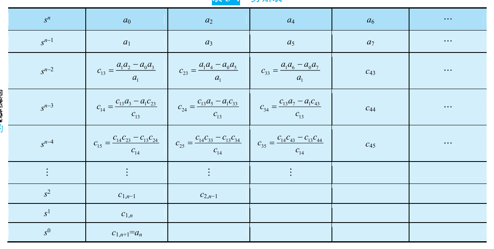

# Chap3 线性系统的时域分析法

## 系统时间响应的性能指标

!!! note "典型输入信号"
    

!!! definition "动态过程和稳态过程"
    - 控制系统的响应由动态过程和稳态过程组成
    - 动态过程：系统在典型输入信号作用下，系统输出量从初始状态到最终状态的响应过程，又称过渡过程或瞬态过程
    - 稳态过程：系统在典型输入信号作用下，当时间t趋于无穷时，系统输出量的表现方式

!!! note "动态性能和稳态性能"
    - 控制系统的性能包括动态性能和稳态性能，性能指标通常通过系统的单位阶跃响应来定义
    - 反映系统的动态性能的阶跃响应指标
        + 上升时间$t_r$：响应从终值10%上升到终值90%所需的时间；亦可定义为响应从零第一次上升到终值的时间
        + 峰值时间$t_p$：响应超过其终值到达第一个峰值所需的时间
        + 调节时间$t_s$：响应到达并保持在终值$\pm$5%内所需的最短时间
        + 超调量$\sigma \%$：又称最大超调量或百分比超调量，响应的最大偏离量$c(t_p)$与终值$c_{\infty}$的差与终值比的百分数，即
        
        $$\sigma \%=\frac{c(t_p)-c(\infty)}{c(\infty)}\times 100\%$$
    - 反映系统的稳态性能的阶跃响应指标
        + 稳态误差

    

## 一阶系统的时域分析

系统对输入信号导数的响应，就等于系统对该输入信号响应的导数；或者，系统对输入信号积分的响应，就等于对该输入信号响应的积分，而积分常数由零输出初始条件确定

## 二阶系统的时域分析

## 高阶系统的时域分析

如果在所有的闭环极点中，距虚轴最近的极点周围没有闭环零点，而其他闭环极点又远离虚轴，那么距虚轴最近的闭环极点所对应的响应分量，随时间的推移衰减缓慢，在系统的时间响应过程中起主导作用，这样的闭环极点就称为闭环主导极点

## 线性系统的稳定性分析

### 稳定性的基本概念

所谓稳定性，是指系统在扰动消失后，由初始偏差状态恢复到原平衡状态的性能

根据李雅普诺夫稳定性理论，线性控制系统的稳定性可叙述如下：

若线性控制系统在初始扰动的影响下，其动态过程随时间的推移逐渐衰减并趋于零（原平衡工作点），则称系统渐近稳定，简称稳定；反之，若在初始扰动影响下，系统的动态过程随时间的推移而发散，则称系统不稳定

### 线性系统稳定的充分必要条件

线性系统稳定的充分必要条件：闭环系统特征方程的所有跟均具有负实部；或者说，闭环传递函数的极点均位于s左半平面

### 劳斯-赫尔维茨稳定判据

!!! note "赫尔维茨判据"
    设线性系统的特征方程为

    $$D(s)=a_0s^n+a_1s^{n-1}+...+a_{n-1}s+a_n=0, a_0>0$$

    则使线性系统稳定的必要条件是：在特征方程中各项系数为正数

!!! note "劳斯判据"
    

    线性系统稳定的充分必要条件是劳斯表中第一列各值为正。如果劳斯表第一列中出现小于零的数值，系统就不稳定，且第一列各系数符号的改变次数，代表特征方程的正实部根的数目

## 线性系统的稳态误差计算

### 误差与稳态误差

控制系统的稳态误差定义为误差信号$e(t)$的稳态分量$e_{ss}(\infty)$，常以$e_{ss}$简单标志

