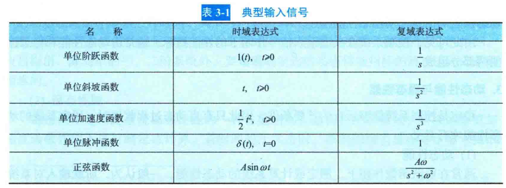
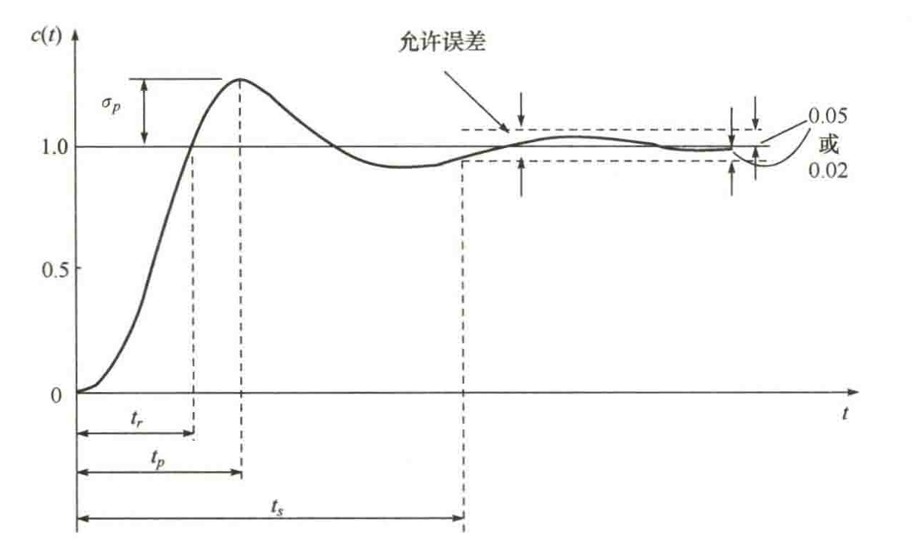
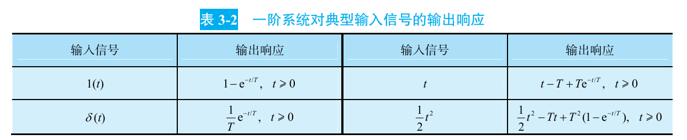
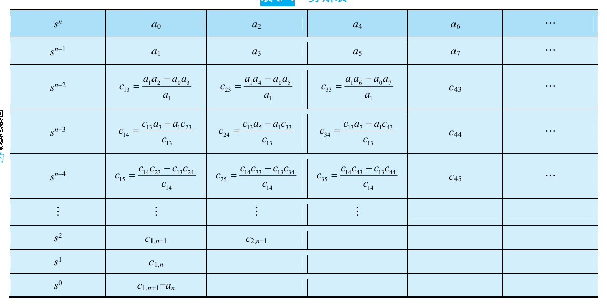

# Chap3 线性系统的时域分析法

## 系统时间响应的性能指标

### 典型输入信号

### 动态过程和稳态过程

控制系统的时间响应由动态过程和稳态过程组成

动态过程：系统在典型输入信号作用下，系统输出量从初始状态到最终状态的响应过程，又称过渡过程或瞬态过程

稳态过程：系统在典型输入信号作用下，当时间t趋于无穷时，系统输出量的表现方式，又称稳态响应

### 动态性能和稳态性能

控制系统的性能包括动态性能和稳态性能

#### 动态性能

描述稳定的系统在单位阶跃函数作用下，动态过程随时间t的变化状况的指标，称为动态性能指标，包括

- <b>上升时间（rise time）$t_r$</b>：响应从终值10%上升到终值90%所需的时间；对于有振荡的系统，亦可定义为响应从零第一次上升到终值的时间

- <b>峰值时间（peak time）$t_p$</b>：响应超过其终值到达第一个峰值所需的时间

- <b>调节时间（settling time）$t_s$</b>：响应到达并保持在终值$\pm$5%内所需的最短时间

- <b>超调量$\sigma \%$</b>：又称最大超调量或百分比超调量，响应的最大偏离量$c(t_p)$与终值$c_{\infty}$的差与终值比的百分数，即
        
$$\sigma \%=\frac{c(t_p)-c(\infty)}{c(\infty)}\times 100\%$$

若$c(t_p)<c_{\infty}$，则响应无超调

通常，用$t_p$或$t_r$评价系统的响应速度；用$\sigma\%$评价系统的阻尼程度；而$t_s$是同时反映响应速度和阻尼程度的综合性指标

#### 稳态性能

稳态误差是反映系统的稳态性能的阶跃响应指标，通常在阶跃函数、斜坡函数或加速度函数作用下进行测定或计算

若时间趋于无穷时，系统的输出量不等于输入量或输入量的确定函数，则系统存在稳态误差。稳态误差是系统控制精度或抗扰动能力的一种度量

## 一阶系统的时域分析

一阶系统的传递函数为

$$\Phi(s)=\frac{C(s)}{R(s)}=\frac{1}{Ts+1}$$

<b>系统对输入信号导数的响应，就等于系统对该输入信号响应的导数</b>

<b>系统对输入信号积分的响应，就等于对该输入信号响应的积分，而积分常数由零输出初始条件确定</b>

## 二阶系统的时域分析

二阶系统的传递函数为

$$\Phi(s)=\frac{C(s)}{R(s)}=\frac{\omega^2_n}{s^2+2\xi \omega_n s + \omega_n^2}$$

$\omega_n$称为自然频率（或无阻尼振荡频率）

$\xi$称为阻尼比（或相对阻尼系数）

特征方程$s^2+2\xi \omega_n s+\omega_n^2$的两个特征根（闭环极点）为$s_{1,2}=-\xi \omega_n \pm \omega_n \sqrt{\xi^2-1}$

根据$\xi$和1的大小关系将系统分为欠阻尼、临界阻尼、过阻尼

$\omega_d=\omega_n \sqrt{1-\xi^2}$称为阻尼自然频率

!!! note "二阶系统阶跃响应性能指标"
    上升时间

    $$t_r=\frac{\pi -\text{arccos}(\xi)}{\omega_d}$$

    峰值时间

    $$t_p=\frac{\pi}{\omega_d}$$

    超调量

    $$\sigma \%=e^{-\frac{\pi \xi}{\sqrt{1-\xi^2}}}\times 100\%$$

    调节时间

    $$t_s=\frac{3.5}{\xi \omega_n}$$

### 二阶系统性能的改善

比例-微分控制和测速反馈控制

## 高阶系统的时域分析

如果在所有的闭环极点中，距虚轴最近的极点周围没有闭环零点，而其他闭环极点又远离虚轴，那么距虚轴最近的闭环极点所对应的响应分量，随时间的推移衰减缓慢，在系统的时间响应过程中起主导作用，这样的闭环极点就称为闭环主导极点

## 线性系统的稳定性分析

### 稳定性的基本概念

所谓稳定性，是指系统在扰动消失后，由初始偏差状态恢复到原平衡状态的性能

根据李雅普诺夫稳定性理论，线性控制系统的稳定性可叙述如下：

若线性控制系统在初始扰动的影响下，其动态过程随时间的推移逐渐衰减并趋于零（原平衡工作点），则称系统渐近稳定，简称稳定；反之，若在初始扰动影响下，系统的动态过程随时间的推移而发散，则称系统不稳定

### 线性系统稳定的充分必要条件

线性系统稳定的充分必要条件：<b>闭环系统特征方程的所有跟均具有负实部；或者说，闭环传递函数的极点均位于s左半平面</b>

### 劳斯-赫尔维茨稳定判据

!!! note "赫尔维茨判据"
    设线性系统的特征方程为

    $$D(s)=a_0s^n+a_1s^{n-1}+...+a_{n-1}s+a_n=0, a_0>0$$

    则使线性系统稳定的必要条件是：在特征方程中各项系数为正数

!!! note "劳斯判据"
    

    线性系统稳定的充分必要条件是劳斯表中第一列各值为正。如果劳斯表第一列中出现小于零的数值，系统就不稳定，且第一列各系数符号的改变次数，代表特征方程的正实部根的数目

## 线性系统的稳态误差计算

### 误差与稳态误差

控制系统的稳态误差定义为误差信号$e(t)$的稳态分量$e_{ss}(\infty)$，常以$e_{ss}$简单标志

### 阶跃输入作用下的稳态误差和静态位置误差系数

### 斜坡输入作用下的稳态误差和静态速度误差系数

### 加速度输入作用下的稳态误差和静态加速度误差系数

### 动态误差系数

### 扰动作用下的稳态误差

