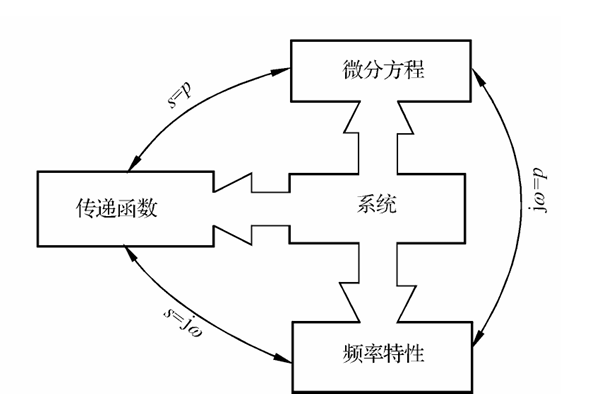
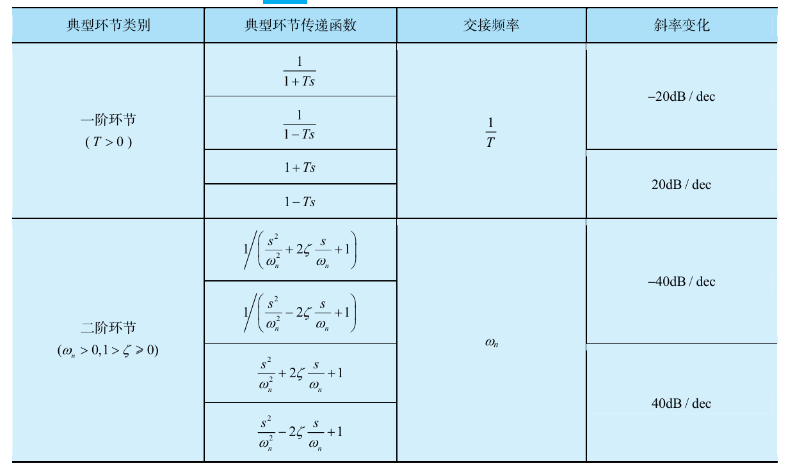

# Chap5 线性系统的频域分析法

稳定系统的频率特性等于输出和输入的傅氏变换之比

## 频率特性

### 频率特性的基本概念

系统性能分析的两种基本方法：根轨迹法和频率响应法

定义谐波输入下，输出响应中与输入同频率的谐波分量与谐波输入的幅值之比$A(\omega)$为<b>幅频特性</b>，相位之差$\phi(\omega)$为<b>相频特性</b>，并称其指数表达形式

$$G(\mathrm{j}\omega)=A(\omega)e^{\mathrm{j}\phi(\omega)}$$

为系统的<b>频率特性</b>

### 频率特性的几何表示法

对数坐标图法即bode图法，极坐标图法即Nyquist图法

#### 幅相频率特性曲线

又称幅相曲线或极坐标图

#### 对数频率特性曲线

又称伯德曲线或伯德图

对数频率特性曲线的横坐标按$\lg \omega$分度，单位为rad/s，对数幅频曲线的纵坐标按

$$L(\omega)=20\lg |G(\mathrm{j}\omega)|=20\lg A(\omega)$$

线性分度，单位为dB。对数相频曲线的纵坐标按$\varphi(\omega)$线性分度，单位为°。由此构造的坐标系称为半对数坐标系

在对数分度中，当变量增大或减小10倍，称为10倍频程（dec）

!!! info "伯德图的绘制"
    1. 将开环传递函数写成尾1形式
    2. 分出各典型环节，确定基准线
    3. 列出各环节的转折频率
    4. 将各环节叠加作图

#### 对数幅相曲线

又称尼科尔斯曲线或尼科尔斯图

## 典型环节与开环系统的频率特性

### 典型环节

!!! note "典型环节"
    - 最小相位环节
        + 比例环节K (K>0)
        + 惯性环节1/(Ts+1) (T>0)
        + 一阶微分环节Ts+1 (T>0)
        + 振荡环节$1/(s^2/\omega_n^2+2\xi s/\omega_n +1)$
        + 二阶微分环节$s^2/\omega_n^2+2\xi s/\omega_n +1$
        + 积分环节$1/s$
        + 微分环节$s$
    - 非最小相位环节
        + 比例环节K
        + 惯性环节1/(-Ts+1)
        + 一阶微分环节-Ts+1
        + 振荡环节
        + 二阶微分环节

最小性为环节对应s左半平面的开环零点或极点
### 典型环节的频率特性

#### 比例环节

#### 积分环节

$$L(\omega)=-20\lg \omega$$

#### 一阶惯性环节

$$G(s)=\frac{1}{1+Ts},G(\mathrm{j\omega})=\frac{1}{1+T\omega \mathrm{j}}$$

$$L(\omega)=20\lg \frac{1}{\sqrt{1+T^2\omega^2}}=-20\lg \sqrt{1+T^2\omega^2}$$

近似认为，$\omega < \frac{1}{T}$时，$L(\omega)=0$，$\omega >\frac{1}{T}$时，$L(\omega)=-20\lg T\omega$

$\omega=\frac{1}{T}$称为转折频率

对于相频特性，相角从0°变为-90°，转折频率时相角为-45°

#### 一阶微分环节

$$G(s)=1+Ts,G(\mathrm{j}\omega)=1+T\omega \mathrm{j}$$

$$L(\omega)=20\lg \sqrt{1+T^2\omega^2}$$

对于相频特性，相角从0°变为90°，转折频率时相角为45°

#### 二阶振荡环节

### 开环幅相特性曲线

### 开环对数频率特性曲线

### 延迟环节和延迟系统

输出量经恒定延时后不失真地复现输入量变化的环节称为延迟环节。含有延迟环节的系统称为延迟系统。

$$c(s)=1(t-\tau)r(1-\tau)$$

$$G(s)=\frac{C(s)}{R(s)}=e^{-\tau s}$$

## 频率域稳定判据

### 奈氏判据的数学基础

!!! theorem "幅角原理"
    设s平面闭合曲线$\Gamma$包围F(s)的Z个零点和P个极点，则s沿$\Gamma$顺时针运动一周时，在$F(s)$平面上，$F(s)$闭合曲线$\Gamma_F$包围缘点的圈数

    $$R=P-Z$$

### 奈奎斯特稳定判据

!!! theorem "奈氏判据"
    反馈控制系统稳定的充分必要条件时半闭合曲线$\Gamma_{GH}$不穿过$(-1,\mathrm{j}0)$点且逆时针包围临界点$(-1,\mathrm{j}0)$点的圈数R等于开环传递函数的正实部极点数P

    $$Z=P-R=P-2N$$

### 对数频率稳定判据

!!! theorem "对数频率稳定判据"
    设P为开环系统正实部的极点数，反馈控制系统稳定的充分必要条件是$\varphi (\omega_c) \ne (2k+1)\pi\quad(k=0,1,2,...)$和$L(\omega)>0$时，$\Gamma_\varphi$曲线穿越$(2k+1)\pi$线的次数

    $$N=N_+ -N_-$$

    满足

    $$Z=P-2N=0$$

### 条件稳定系统

闭环稳定有条件的系统称为条件稳定系统；系统总是闭环不稳定的，这样的系统称为结构不稳定系统

## 稳定裕度

### 相角裕度

!!! definition "相角裕度"
    定义相角裕度为

    $$\gamma=180^\circ + \angle [G(\mathrm{j}\omega_c)H(\mathrm{j}\omega_c)]$$

    含义是，对于闭环稳定系统，如果系统开环相频特性再滞后$\gamma$度，系统将处于临界稳定状态

### 幅值裕度

!!! definition "幅值裕度"
    定义幅值裕度为

    $$h=\frac{1}{|G(\mathrm{j}\omega_x)H(\mathrm{j}\omega_x)|}$$

    含义是，对于闭环稳定系统，如果系统开环幅频特性再增大h倍，则系统将处于临界稳定状态；对于闭环不稳定的系统，幅值裕度指出为了使系统临界稳定，开环幅频特性应当减小到原来的$1/h$

## 闭环系统的频域性能指标

### 控制系统的频带宽度

### 系统带宽与信号频谱的关系

## 控制系统频域设计
