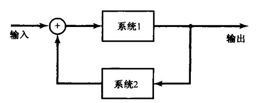

# Chap1 信号与系统

## 连续时间和离散时间信号

!!! definition "信号"
    - 连续时间信号：自变量是连续可变的，记为$x(t)$
    - 离散时间信号：自变量仅取在一组离散值上，记为$x[n]$

!!! note "信号的描述"
    - 物理上：信号是信息寄寓变化的形式
    - 数学上：信号是一个或多个变量的函数
    - 形态上：信号表现为一种波形

### 信号能量与功率

!!! definition "能量"

    对于连续时间信号

    $$E_\infty=\lim_{T\rightarrow \infty}\int_{-T}^T |x(t)|^2 \mathrm{d}t =\int_{-\infty}^{+\infty}|x(t)|^2 \mathrm{d}t$$

    对于离散时间信号

    $$E=\lim_{N\rightarrow\infty}\sum_{n=-N}^{+N}|x[n]|^2=\sum_{n=-\infty}^{+\infty}|x[n]|^2$$

!!! definition "功率"
    对于连续时间信号

    $$P_\infty=\lim_{T\rightarrow \infty}\frac{1}{2T}\int_{-T}^{T} |x(t)|^2 \mathrm{d}t$$

    对于离散时间信号

    $$P_\infty=\lim_{N\rightarrow \infty}\frac{1}{2N+1}\sum_{n=-N}^{+N}|x[n]|^2$$

!!! note "信号分类"
    - 能量信号：$E_\infty <\infty$
    - 功率信号：$P_\infty$为不等于零的有限值
    - 既非能量信号又非功率信号

## 自变量的变换

### 自变量变换举例

自变量变换：时移、时间反转、时间尺度变换

!!! example "例题"
    对于信号$x(t)$，求$x(\alpha t+\beta)$

    1. 根据$\beta$进行延时或超前
    2. 根据$|\alpha|$对此信号进行线性压缩或扩展
    3. 若$\alpha<0$，进行时间反转

### 周期信号

!!! definition "周期信号"
    对于连续时间信号，存在正值T，使得

    $$x(t)=x(t+T)$$

    则为周期信号，使上式成立的最小T，称为基波周期$T_0$

    对于离散时间信号，存在正整数N，使得

    $$x[n]=x[n+N]$$

    则为周期信号，使上式成立的最小N，称为基波周期$N_0$

### 偶信号与奇信号

!!! definition "奇部和偶部"

    偶部

    $${Ev}\{x(t)\}=\frac{1}{2}[x(t)+x(-t)]$$

    奇部

    $${Od}\{x(t)\}=\frac{1}{2}[x(t)-x(-t)]$$

## 指数信号与正弦信号

### 连续时间复指数信号与正弦信号

!!! definition "连续时间复指数信号"
    连续时间复指数信号具有以下形式
    
    $$x(t)=Ce^{at}$$

    - 若C和a均为实数，为实指数信号
    - 若a为纯虚数，为周期复指数信号

!!! note "一般复指数信号"
    一般复指数信号可由实指数信号和周期复指数信号表示，考察复指数信号$Ce^{at}$
       
    $$C=|C|e^{\mathrm{j}\theta}$$

    $$a=r+\mathrm{j}\omega_0$$

    由欧拉关系，可展开为

    $$Ce^{at}=|C|e^{rt}\cos (\omega_0 t+\theta)+\mathrm{j}|C|e^{rt}\sin(\omega_0 t+\theta)$$

    
### 离散时间复指数信号与正弦信号

!!! definition "复指数序列"
    
    $$x[n]=C\alpha^n=Ce^{\beta n}$$

    $$C\alpha^n = |C||\alpha|^n \cos (\omega_0 n+\theta)+\mathrm{j}|C||\alpha|^n \sin (\omega_0 n+\theta)$$

### 离散时间复指数序列的周期性质

## 单位冲激与单位阶跃函数

### 离散时间单位脉冲和单位阶跃序列

!!! definition "单位脉冲"
    $$\delta[n]=\left\{\begin{aligned}0, n\le 0 \\ 1, n=0\end{aligned}\right.$$

!!! definition "单位阶跃"
    $$u[n]=\left\{\begin{aligned}0, n<0 \\ 1, n\ge 0 \end{aligned}\right.$$

!!! hint "单位脉冲和单位阶跃的关系"
    单位脉冲是单位阶跃的一次差分

    $$\delta[n]=u[n]-u[n-1]$$

    单位阶跃是单位脉冲的求和函数

    $$u[n]=\sum_{m=-\infty}^n \delta [m]$$

!!! note "采样性质"
    $$x[n]\delta[n]=x[0]\delta[n]$$

    $$x[n]\delta[n-n_0]=x[n_0]\delta[n-n_0]$$

### 连续时间单位阶跃和单位冲激函数

!!! definition "单位阶跃"
    $$u(t)=\left\{\begin{aligned}0, t<0 \\ 1, t>0 \end{aligned}\right.$$    

!!! hint "单位阶跃和单位冲激的关系"
    单位阶跃是单位冲激的积分函数

    $$u(t)=\int_{-\infty}^t \delta(\tau) \mathrm{d}\tau$$

    单位冲激可视为单位阶跃的一次微分

    $$\delta(t)=\frac{\mathrm{d}u(t)}{\mathrm{d}t}$$

    若将积分变量$\tau$置换为$\sigma=t-\tau$，可表示为

    $$u(t)=\int_{-\infty}^t \delta(\tau) \mathrm{d}\tau=\int_\infty^{0}\delta (t-\sigma)(-\mathrm{d}\sigma)$$

    等效为

    $$u(t)=\int_{0}^\infty \delta(t-\sigma) \mathrm{d}\sigma$$

!!! note "采样性质"
    $$x(t)\delta(t)=x(0)\delta(t)$$

    $$x(t)\delta(t-t_0)=x(t_0)\delta(t-t_0)$$
## 连续时间和离散时间系统

!!! definition "系统"
    连续时间信号系统

    $$x(t)\rightarrow y(t)$$

    离散时间信号系统

    $$x[n]\rightarrow y[n]$$

!!! definition "系统的互联"
    级联

    

    并联

    

    反馈互联

    

## 基本系统性质

### 记忆系统与无记忆系统

!!! definition "无记忆"
    无记忆：对自变量的每一个值，一个系统的输出仅仅取决于该时刻的输入

离散时间记忆系统：累加器、延迟单元

### 可逆性与可逆系统

!!! definition "可逆性"
    可逆：在不同的输入下，导致不同的输出

### 因果性

!!! definition "因果性"
    因果性：在任何时刻的输出只取决于现在的输入及过去的输入

### 稳定性
!!! definition "稳定性"
    稳定性：输入是有界的，则输出也必须是有界的

### 时不变性

!!! defintion "时不变性"
    时不变性：系统的特性和行为不随时间而变

### 线性

!!! definition "线性"
    线性系统满足：

    - 可加性： $y_1(t)+y_2(t)$是对$x_1(t)+x_2(t)$的响应

    - 齐次性：$ay_1(t)$是对$ax_1(t)$的响应，a为任意复常数

!!! theorem "叠加性质"
    对于输入的线性组合

    $$x[n]=\sum_k a_k x_k[n]$$

    的响应为

    $$y[n]=\sum_k a_k y_k[n]$$

    