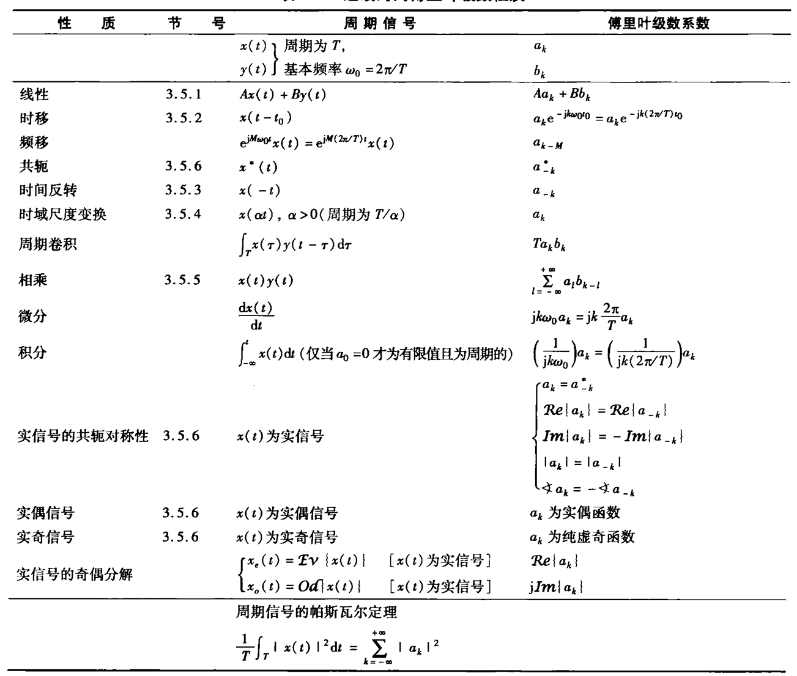
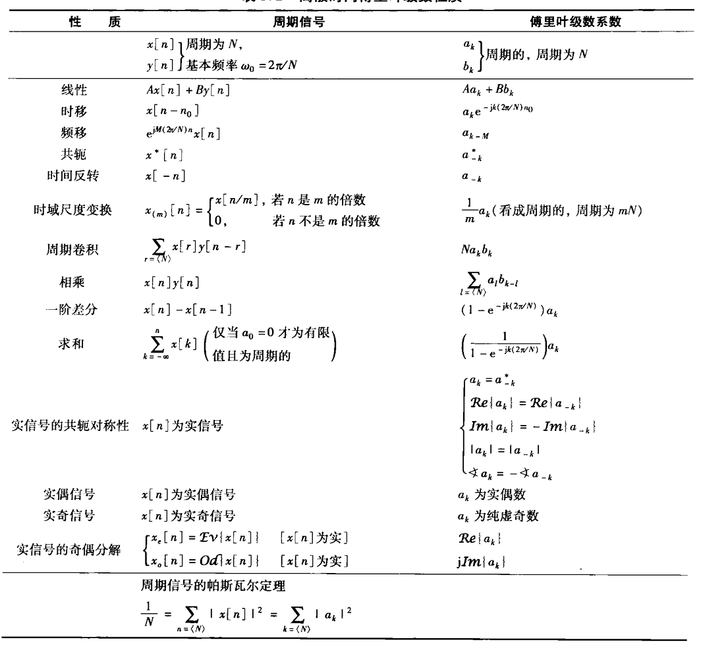

# Chap3 周期信号的傅里叶级数表示

## 线性时不变系统对复指数信号的响应

!!! definition "定义"
    一个信号，若该系统对该信号的输出相应仅是一个常数乘以输入，则称该信号为系统的特征函数，幅度因子称为系统的特征值

复指数是线性时不变系统的特征函数；复指数序列时离散时间线性时不变系统的特征函数

## 连续时间周期信号的傅里叶级数表示

### 成谐波关系的复指数信号的线性组合

周期信号的傅里叶级数表示

$$x(t)=\sum_{-\infty}^{+\infty}a_k e^{jk\omega_0 t}=\sum_{k=-\infty}^{+\infty} a_k e^{jk(2\pi/T)t}$$

k=1和k=-1的项称为基波分量或一次谐波分量，k=2和k=-2的项称为二次谐波分量，k=N和k=-N的分量称为N次谐波分量

对于实周期信号

$$x(t)=a_0+2\sum_{k=1}^\infty A_k \cos (k\omega_0 t+\theta_k)$$

!!! proof "推导过程"
    由于x(t)是一个实信号

    $$x(t)=x^*(t)$$

    即有

    $$x(t)=\sum_{k=-\infty}^{+\infty} a_k^* e^{-jk\omega_0 t}$$

    在求和式中，以-k代替k，则有

    $$x(t)=\sum_{k=-\infty}^{+\infty} a_{-k}^* e^{jk\omega_0 t}$$

    即有

    $$a_k^*=a_{-k}$$

    将求和式重新写成

    $$x(t)=a_0 + \sum_{k=1}^\infty [a_k e^{jk\omega_0 t}+ a_{-k}e^{-jk\omega_0 t}]$$

    以$a_k^*$代替$a_{-k}$

    $$x(t)=a_0+\sum_{k=1}^\infty [a_k e^{jk\omega_0 t}+a_k^* e^{-jk\omega_0 t}]$$

    即有

    $$x(t)=a_0 + \sum_{k=1}^{\infty} 2 \mathcal{Re} \{a_k e^{jk\omega_0 t}\}$$

    将$a_k$以极坐标形式给出

    $$a_k=A_k e^{j\theta _k}$$

    可写成

    $$x(t)=a_0 + \sum_{k=1}^\infty 2\mathcal{Re} \{A_k e^{j(k\omega_0 t+\theta_k)}\}$$

    即

    $$x(t)=a_0+2\sum_{k=1}^{\infty} A_k \cos (k\omega_0 t +\theta_k)$$

### 连续时间周期信号傅里叶级数表示的确定

!!! formula "综合公式"

    $$x(t)=\sum_{k=-\infty}^{+\infty} a_k e^{jk\omega_0 t}=\sum_{k=-\infty}^{+\infty} a_k e^{jk(2\pi/T)t}$$

!!! formula "分析公式"

    $$a_k=\frac{1}{T} \int_T x(t)=e^{-jk\omega_0 t}dt=\frac{1}{T} \int_T x(t)e^{-jk (2\pi/T)t}dt$$

$\{a_k\}$称为傅里叶数级系数或频谱系数

## 傅里叶级数的收敛

!!! note "狄里赫利条件"
    1. 在任何周期内，$x(t)$必须绝对可积，即

    $$\int_T |x(t)|\mathrm{d}t <\infty$$

    2. 在任意有限区间内，$x(t)$具有有限个起伏变化；即，在任何单个周期内，$x(t)$的最大值和最小值的数目有限

    3. 在$x(t)$的任何有限区间内，只有有限个不连续点，且在这些不连续点上，函数是有限值

## 连续时间傅里叶级数性质

## 离散时间周期信号的傅里叶级数表示

!!! formula "综合公式"
    $$x[n]=\sum_{k=<N>} a_ke^{jk\omega_0n}=\sum_{k=(N)}a_k e^{jk(2\pi/N)n}$$

!!! formula "分析公式"
    $$a_k=\frac{1}{N}\sum_{n=<N>}x[n]e^{-jk\omega_0 n}=\frac{1}{N}\sum_{n=<N>}x[n]e^{-jk(2\pi/N)n}$$

## 离散时间傅里叶级数性质

## 傅里叶级数与线性时不变系统

## 滤波

## 用微分方程描述的连续时间滤波器举例