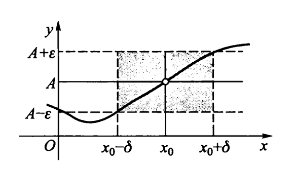

# Chap1 函数与极限

## 函数的概念

## 数列极限

!!! definition "数列极限"
    数列极限的$\varepsilon-\delta$定义为：

    若$\forall \varepsilon>0$，$\exists$正整数$N$，当$n>N$时，都有$|a_n-a|<\varepsilon$，则

    $$\lim_{n\rightarrow\infty}a_n=a$$

### 数列极限存在的准则

!!! theorem "定理"
    定理1（夹逼定理）：设$\{a_n\}$，$\{b_n\}$为收敛数列，且$\lim_{n\rightarrow\infty}\{a_n\}=a$，$\lim_{n\rightarrow\infty}\{b_n\}=a$，若存在正整数$N_0$，当$n>N_0$时，都有$a_n\le c_n\le b_n$，则数列$\{c_n\}$收敛，且$\lim_{n\rightarrow\infty}c_n=a$

## 函数极限

### 函数极限的概念

!!! definition "函数极限"
    设函数$f(x)$在点$x=x_0$的某一空心邻域$\overset{\circ}{U}(x_0,\delta_0)$内有定义，$A$为一常数，若任给$\varepsilon>0$，总存在$\delta>0(\delta\le \delta_0)$，使得当$0<|x-x_0|<\delta$时，都有$|f(x)-A|<\varepsilon$成立，则称$A$为函数$f(x)$当$x\rightarrow x_0$时的极限，记作

    $$\lim_{x\rightarrow x_0}f(x)=A$$

    几何意义：对于任给的$\varepsilon>0$，存在$\delta>0$，当$0<|x-x_0|<\delta$时，曲线$y=f(x)$上的点$(x,f(x))$全部落在直线$y=A-\varepsilon$与$y=A+\varepsilon$之间的带型区域内

    

### 函数极限存在的准则

### 无穷小量、无穷大量、阶的比较

!!! note "常用的等价无穷小"
    - $(1+x)^\alpha-1\sim \alpha x$, $1-\cos x\sim \frac{1}{2}x^2$, $a^x-1\sim x\ln a$
    - $x-\sin x\sim \frac{1}{6}x^2$, $\tan x-x\sim \frac{1}{3}x^2$, $x-\ln(1+x)\sim\frac{1}{2}x^2$
    - $\arcsin x-x\sim\frac{1}{6}x^3$, $x-\arctan x\sim \frac{1}{3}x^3$

!!! note "常用的泰勒公式"
    - $e^x=1+x+\frac{x^2}{2!}+...+\frac{x^n}{n!}+o(x^n)$
    - $\sin x=x-\frac{x^3}{3!}+...+(-1)^{n-1}\frac{x^{2n-1}}{(2n-1)!}+o(x^{2n-1})$
    - $\cos x=1-\frac{x^2}{2!}+...+(-1)^n\frac{x^{2n}}{(2n)!}+o(x^{2n})$
    - $\ln (1+x)=x-\frac{x^2}{2}+...+(-1)^{n-1}\frac{x^n}{n}+o(x^n)$
    - $(1+x)^\alpha=1+\alpha x+\frac{\alpha(\alpha-1)}{2!}x^2+...+\frac{\alpha(\alpha-1)...(\alpha-n+1)}{n!}x^n+o(x^n)$

## 函数的连续性

### 函数连续的概念

!!! definition "间断点"
    - 第一类间断点：左右极限均存在
        + 可去间断点：若$\lim_{x\rightarrow x_0}f(x)=A$，而$f(x)$在$x=x_0$处没有定义或有定义但$f(x_0)\ne A$，则称$x_0$为$f(x)$的可去间断点
        + 跳跃间断点：$\lim_{x\rightarrow x_0^+}f(x)=f(x_0^+)$，$\lim_{x\rightarrow x_0^-}f(x)=f(x_0^-)$，但$f(x_0^+)=f(x_0^-)$，则称$x_0$为$f(x)$的跳跃间断点，$|f(x_0^+)-f(x_0^-)|$为跳跃度
    - 第二类间断点：左、右极限至少有一个不存在