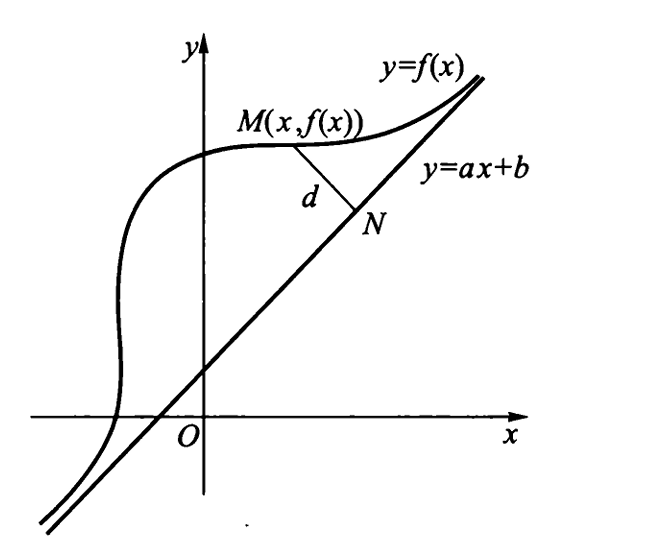
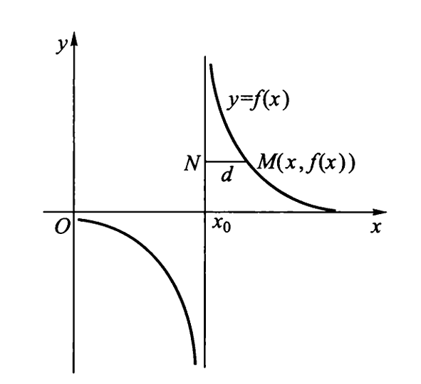

# Chap3 微分中值定理及导数的应用

## 微分中值定理

### 费马定理、最大（小）值

!!! definition "极值与极值点"
    若存在 $x_0$ 的某邻域$(U(x_0, \delta)$，使得对一切$x \in U(x_0, \delta)$，都有$f(x_0) \geqslant f(x)(f(x_0) \leqslant f(x))$，则称$f(x_0)$为极大值（极小值），称$x_0$为极大（小）值点
    
    极大值、极小值统称为极值，极大值点、极小值点统称为极值点

!!! theorem "费马定理"
    设$f(x)$在点$x_0$处取到极值，且$f^\prime(x_0)$存在，则$f^\prime(x_0)=0$

极值点一定包含在驻点或导数不存在的点之中

最大值点与最小值点一定包含在区间端点、区间内部的驻点及区间导数不存在的点之中

### 罗尔定理

### 拉格朗日定理、函数的单调区间

## 未定式的极限

!!! formula "洛必达法则Ⅰ"
    设

    （1） $\lim\limits_{x \to x_0} f(x) = 0$， $\lim\limits_{x \to x_0} g(x) = 0$；

    （2）存在 $x_0$ 的某邻域 $\mathring{U}(x_0)$，当 $x \in \mathring{U}(x_0)$ 时，$f'(x)$，$g'(x)$ 都存在，且 $g'(x) \neq 0$；

    （3） $\lim\limits_{x \to x_0} \dfrac{f'(x)}{g'(x)} = A$（或 $\infty$），

    则

    $$
    \lim\limits_{x \to x_0} \frac{f(x)}{g(x)} = \lim\limits_{x \to x_0} \frac{f'(x)}{g'(x)} = A \text{(or } \infty \text{)}.
    $$

!!! formula "洛必达法则Ⅱ"
    设

    （1） $\lim\limits_{x \to x_0} f(x) = \infty$， $\lim\limits_{x \to x_0} g(x) = \infty$；

    （2）存在 $x_0$ 的某邻域 $\mathring{U}(x_0)$，当 $x \in \mathring{U}(x_0)$ 时，$f'(x)$，$g'(x)$ 都存在，且 $g'(x) \neq 0$；

    （3） $\lim\limits_{x \to x_0} \dfrac{f'(x)}{g'(x)} = A$（或 $\infty$），

    则

    $$
    \lim\limits_{x \to x_0} \frac{f(x)}{g(x)} = \lim\limits_{x \to x_0} \frac{f'(x)}{g'(x)} = A \text{(or } \infty \text{)}.
    $$

## 泰勒定理及应用

!!! theorem "泰勒定理"
    设函数 $f(x)$ 在区间 $I$ 上 $n$ 阶连续可导，在 $I$ 内部存在 $n+1$ 阶导数，$x_0 \in I$，任给 $x \in I$，且 $x \neq x_0$，有

    $$
    \begin{aligned}
    f(x) &= P_n(x) + \frac{f^{(n+1)}(\xi)}{(n+1)!}(x-x_0)^{n+1} \\
    &= f(x_0) + f'(x_0)(x-x_0) + \frac{f''(x_0)}{2!}(x-x_0)^2 + \cdots + \\
    &\quad \frac{f^{(n)}(x_0)}{n!}(x-x_0)^n + \frac{f^{(n+1)}(\xi)}{(n+1)!}(x-x_0)^{n+1},
    \end{aligned} 
    $$

    其中，$\xi$ 是介于 $x_0$ 与 $x$ 之间的某一点

    $$
    P_n(x) = f(x_0) + f'(x_0)(x-x_0) + \frac{f''(x_0)}{2!}(x-x_0)^2 + \cdots + \frac{f^{(n)}(x_0)}{n!}(x-x_0)^n
    $$

    称为 $n$ 次泰勒多项式

!!! formula "麦克劳林展开式"
    常用函数的带有佩亚诺余项的麦克劳林公式

    $$
    e^x = 1 + x + \frac{x^2}{2!} + \cdots + \frac{x^n}{n!} + o(x^n)
    $$

    $$
    \sin x = x - \frac{x^3}{3!} + \frac{x^5}{5!} - \frac{x^7}{7!} + \cdots + (-1)^n \frac{x^{2n+1}}{(2n+1)!} + o(x^{2n+1})
    $$

    $$
    \cos x = 1 - \frac{x^2}{2!} + \frac{x^4}{4!} - \frac{x^6}{6!} + \cdots + (-1)^n \frac{x^{2n}}{(2n)!} + o(x^{2n})
    $$

    $$
    \ln(1+x) = x - \frac{x^2}{2} + \frac{x^3}{3} - \frac{x^4}{4} + \cdots + (-1)^{n-1} \frac{x^n}{n} + o(x^n)
    $$

    $$
    (1+x)^\alpha = 1 + \alpha x + \frac{\alpha(\alpha-1)}{2!}x^2 + \cdots + \frac{\alpha(\alpha-1)\cdots(\alpha-n+1)}{n!}x^n + o(x^n)
    $$

    $$
    \arcsin x = x + \frac{x^3}{2 \cdot 3} + \frac{1 \cdot 3}{2 \cdot 4 \cdot 5}x^5 + \frac{1 \cdot 3 \cdot 5}{2 \cdot 4 \cdot 6 \cdot 7}x^7 + \cdots + \frac{(2n)!}{4^n (n!)^2 (2n+1)}x^{2n+1} + o(x^{2n+1}), \quad (|x| < 1)
    $$

    $$
    \arctan x = x - \frac{x^3}{3} + \frac{x^5}{5} - \frac{x^7}{7} + \cdots + (-1)^n \frac{x^{2n+1}}{2n+1} + o(x^{2n+1}), \quad (|x| \le 1)
    $$

    $$
    \sec x = 1 + \frac{x^2}{2} + \frac{5x^4}{24} + \frac{61x^6}{720} + \frac{1385x^8}{40320} + \cdots + \frac{(-1)^n E_{2n}}{(2n)!}x^{2n} + o(x^{2n}), \quad (|x| < \frac{\pi}{2})
    $$

## 函数图形的凹凸性与拐点

!!! theorem "曲线凹凸的判定定理"
    设函数$f(x)$在区间$(a,b)$内具有二阶导数，那么

    (1)若$x\in(a,b)$，有$f^{\prime\prime}(x)>0$，则曲线$y=f(x)$在$(a,b)$内是凹的

    (1)若$x\in(a,b)$，有$f^{\prime\prime}(x)<0$，则曲线$y=f(x)$在$(a,b)$内是凸的

!!! definition "拐点"
    设函数$y=f(x)$在点$x_0$的某邻域内具有二阶导数，若$(x_0,f(x_0))$是曲线$y=f(x_0)$的<b>拐点</b>或<b>变凹点</b>

## 函数图形的描绘

### 曲线的斜渐进线

!!! definition "斜渐进线"
    设函数$y=f(x)$在$(-\infty,-c]\cup[c,+\infty](c\ge0)$内有定义，若存在一个已知的直线$L:y=ax+b$（$a$、$b$为常数），使得曲线$y=f(x)$上的动点$M(x,y)$，当它沿着曲线无限远离原点（即$x\rightarrow\infty$时），点$M$到直线$L$的距离$d$趋于0，则称直线$L$是曲线$y=f(x)$当$x\rightarrow\infty$时的斜渐进线

    

    易得

    $$a=\lim_{x\rightarrow\infty} \frac{f(x)}{x},b=\lim_{x\rightarrow\infty}(f(x)-ax)$$

    当$a=0$时，$y=b$称为曲线的水平渐进线，水平渐进线包含在斜渐进线中

### 垂直渐进线

!!! definition "垂直渐进线"
    当曲线上点$M(x,f(x))$沿着曲线无限远离原点时，点$M$到直线$x=x_0$的距离$d$趋于零，则称直线$x=x_0$是曲线$y=f(x)$的垂直渐进线或铅垂渐进线

    

    由定义知，$x=x_0$是曲线$y=f(x)$的垂直渐进线的充要条件是$\lim_{x\rightarrow x_0}f(x)=\infty$或$\lim_{x\rightarrow x_0^+}f(x)=\infty$或$\lim_{x\rightarrow x_0^-}f(x)=\infty$

## 导数在经济中的应用

### 经济中常用函数

#### 成本函数

设$C_1$为固定成本，$C_2$为可变成本，$\bar{C}$为平均成本，则总成本

$$C(q)=C_1+C_2(q), \bar{C}(q)=\frac{C(q)}{q}=\frac{C_1}{q}+\frac{C_2(q)}{q}$$

#### 收益函数

设$p$为平均收益，则总收益

$$R=qp=qp(q)$$

#### 利润函数

设利润为$L$，则有

$$L=R-C$$

#### 需求函数

设$p$表示商品价格，$q$表示需求量，则$q=f(p)$是单调递减函数，称为需求函数

#### 供给函数

设$p$表示商品价格，$q$表示供给量，则$q=\varphi(p)$是单调递减函数，称为供给函数

### 边际分析

边际成本$MC$和边际收益$MR$

$$MC=C^\prime(q)$$

$$MR=R^\prime(q)$$

### 弹性分析

#### 弹性的概念

!!! definition "弹性"
    函数$y=f(x)$的相对改变量

    $$\frac{\Delta y}{y_0}=\frac{f(x_0+\Delta x)-f(x_0)}{y_0}$$

    与自变量的相对改变量$\frac{\Delta x}{x_0}$之比$\frac{\Delta y}{y_0}/\frac{\Delta x}{x_0}$称为函数$y=f(x)$从$x=x_0$到$x=x_0+\Delta x$<b>两点间的相对变化率</b>或称<b>两点间的弹性</b>

    若$f^\prime(x)$存在，则极限值

    $$\lim_{\Delta x\rightarrow 0}\frac{\Delta y/y_0}{\Delta x/x_0}=\lim_{\Delta x\rightarrow0}\frac{x_0}{y_0}\cdot \frac{\Delta y}{\Delta x}=f^\prime(x_0)\frac{x_0}{y_0}$$

    称为$f(x)$在点$x_0$处的相对变化率，或<b>相对导数</b>或<b>弹性</b>，记作$\frac{Ey}{Ex}|_{x=x_0}$或$\frac{E}{Ey}f(x_0)$

    若$f^\prime(x)$存在，则

    $$\frac{Ey}{Ex}=f^\prime(x)\frac{x}{y}$$

    称为$f(x)$的<b>弹性函数</b>

#### 需求弹性

#### 供给弹性

## 曲率

!!! definition "曲率"
    当$\tau \rightarrow0$（$N$沿曲线趋于$M$）时，若平均曲率$\frac{\theta}{\tau}$的极限存在，则该极限值称为曲线在点$M$的曲率，记作$k$，即

    $$k=\lim_{\tau \rightarrow 0}\frac{\theta}{\tau}$$

!!! formula "曲率公式"
    $$
    k = \frac{\left| y''x' - x''y' \right|}{\left( x'^2 + y'^2 \right)^{\frac{3}{2}}}
    $$

    $$
    k = \frac{\left| y'' \right|}{\left( 1 + y'^2 \right)^{\frac{3}{2}}}
    $$