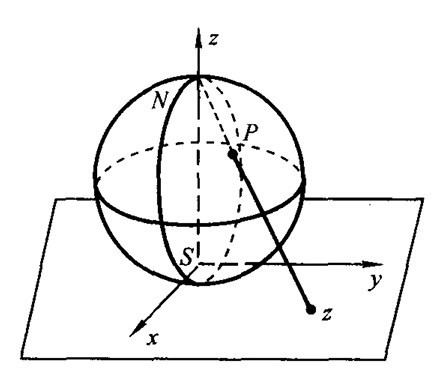
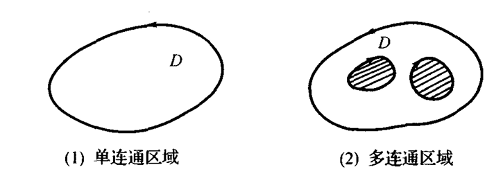

# Chap1 预备知识

## 复数

### 复数的定义

!!! definition "复数"
    形如$z=x+\mathrm{i}y$的数称为复数，其中$\mathrm{i}$为虚数单位，$x$和$y$是任意实数，分别称为复数$z$的实部和虚部，记为

    $$x=\text{Re}z,y=\text{Im}z$$

### 复平面与复数的模及辐角

直角坐标平面上的点$(x,y)$可与复数$z=x+\mathrm{i}y$建立一一对应关系。我们称表示复数$z$的平面为复平面或$z$平面

复数还可由原点引向点$z$的向量$Oz$表示。向量$Oz$的长度称为复数$z$的模，记为$|z|$或$r$，因此有

$$|z|=r=\sqrt{x^2+y^2}\ge 0$$

当$z\ne 0$时，实轴正向与复数$z$所表示的向量$Oz$的夹角$\theta$称为$z$的辐角，记为

$$\theta=\text{Arg}z$$

显然有$\tan \theta=\frac{y}{x}$

任意非零复数$z$有无穷多个辐角，通常把满足条件

$$-\pi <\theta_0 \le \pi$$

的辐角$\theta_0$称为$\text{Arg}z$的主值，记为$\theta_0=\text{arg}z$，于是

$$\theta=\text{Arg}z=\text{arg}z+2k\pi \quad(k=0,\pm 1,\pm 2,...)$$

### 复数的其他表示方法

复数的三角函数形式（简称三角形式）

$$z=r(\cos\theta+i\sin\theta)$$

复数的指数形式

$$z=re^{i\theta}$$

## 复数的运算

### 复数的乘积与商的几何意义

两个复数乘积的模等于它们模的乘积，乘积的辐角等于它们辐角之和，即

$$|z_1z_2|=r_1r_2=|z_1||z_2|$$

$$\text{Arg}(z_1z_2)=\text{Arg}z_1+\text{Arg}z_2$$

两个复数之商的模等于它们模的商，商的辐角等于被除数的辐角与除数辐角之差，即

$$|\frac{z_1}{z_2}|=\frac{|z_1|}{|z_2|}$$

$$\text{Arg}\frac{z_1}{z_2}=\text{Arg}z_1-\text{Arg}z_2$$

### 复数的乘幂与方根

$z=re^{\mathrm{i}\theta}$的$n$次幂为

$$z^n=r^n(\cos n\theta+i\sin n\theta)=r^n e^{\mathrm{i}n\theta}$$

从而有

$$|z^n|=|z|^n$$

取$r=1$即得棣莫佛公式

$$(\cos\theta+\mathrm{i}\sin\theta)^n=\cos n\theta+\mathrm{i}\sin n\theta$$

称满足方程$w^n=z$的所有$w$值为$z$的$n$次方根，记为

$$w=\sqrt[n]{z}$$

在复平面上，这$n$个根均匀分布在以原点为中心、$\sqrt[n]{r}$为半径的圆周上，它们是内接于该圆周的正$n$边形的$n$个顶点

$$w_k=(\sqrt[n]{z})_k =\sqrt[n]{r}e^{i\frac{\theta_0+2k\pi}{n}} \quad (k=0,1,2,...n-1)$$

### 复球面与无穷远点

利用球极平面射影法把球面射影到平面上去，以此建立球面$S$与复平面$\mathbb{C}$的点的对应

我们引进一个理想“点”与北极点$N$对应，称为无穷远点，记为$\infty$。加上$\infty$点的复平面称为扩充复平面，记为$\bar{\mathbb{C}}=\mathbb{C}\cup{\infty}$。这样的球面称为复球面，是扩充复平面的几何模型

注意：扩充复平面上的$\infty$点只有一点

关于$\infty$点的运算，作出如下规定

- $z\ne \infty$，则$z\pm \infty=\infty \pm z=\infty$
- $z\ne 0$，则$z\cdot \infty=\infty\cdot z=\infty$
- $z\ne \infty$，则$\frac{\infty}{z}=\infty$，$\frac{z}{\infty}=0$
- $z\ne 0$，则$\frac{z}{0}=\infty$
- $|\infty|=+\infty$，$\infty$的实部、虚部、辐角均无意义

## 复平面上的点集

### 平面点集的概念

!!! definition "邻域"
    把满足$|z-z_0|<\delta(\delta>0)$的点$z$的全体，称为$z_0$的$\delta$邻域，记为

    $$D(z_0,\delta)={z;|z-z_0|<\delta}$$

    $D(z_0,\delta)\backslash{z_0}=\{z;0<|z-z_0|<\delta\}$称为$z_0$的去心邻域

- 内点、开集：若点集$E$的点$z_0$有一邻域全含于$E$内，则称$z_0$为$E$的内点；若点集$E$的点皆为内点，则称$E$为开集

- 边界点、边界：若在点$z_0$的任意领域内，既有属于点集$E$的点又有不属于点集$E$的点，则称$z_0$为$E$的边界点；点集$E$的边界点的全体为$E$的边界，记为$\partial E$或$bd(E)$

- 区域：若开集$E$内任何两点可以用包含在$E$内的一条折线连接起来，则称开集$E$为连通集，连通的开集称为区域

- 有界区域：如果存在正数$M$，使对于一切$z\in D$，有$|z|\le M$，则称$D$为有界区域，否则称$D$为无界区域

!!! definition "简单曲线、光滑曲线"
    设$x(t)$和$y(t)$是实变量$t$的两个函数，其在闭区间$[\alpha,\beta]$上连续，则由方程组

    $$\left\{\begin{aligned}x=x(t) \\ y=y(t)\end{aligned} \quad\alpha\le t\le \beta\right.$$

    或由实自变量的复值函数

    $$z=z(t)=x(t)+\mathrm{i}y(t) \quad \alpha\le t \le \beta$$

    所决定的点集$C$，称为$z$平面上一条有向曲线

    若曲线$C$在$\alpha \le t\le \beta$上有$x'(t)$与$y'(t)$存在、连续且不全为零，则称$C$为光滑曲线；由有限条光滑曲线衔接而成的连续曲线，称为分段光滑曲线

- 单连通区域：设$D$为复平面上的区域，若在$D$内的任意简单闭曲线的内部仍属于$D$，则称$D$为单连通区域，否则称多连通区域

直观上看，单连通区域内部没有洞而多连通区域内部有洞

### 平面图形的复数表示

一些简单的平面图形可用复数或其模或辐角所满足的方程或不等式来表示，反之亦然