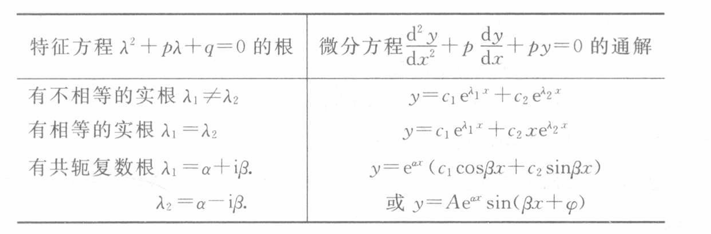
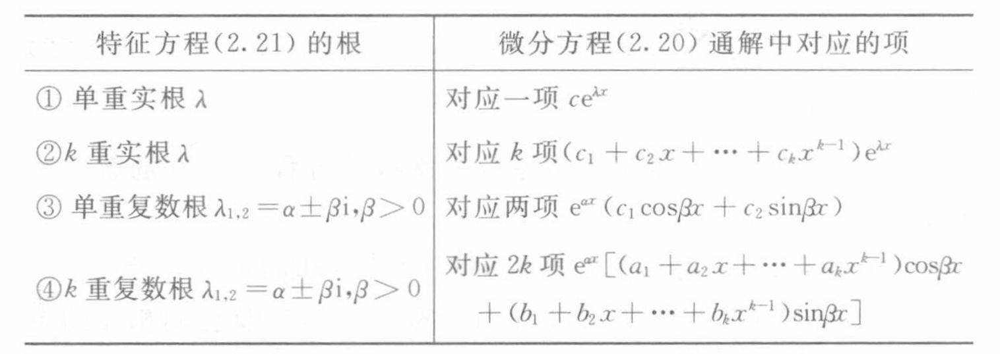

# Chap2 线性微分方程

## 线性微分方程解的一般理论

线性微分方程的一般形式是

$$\frac{\mathrm{d}^ny}{\mathrm{d}x^n}+p_1(x)\frac{\mathrm{d}^{n-1}y}{\mathrm{d}x^{n-1}}+...+p_{n-1}(x)\frac{\mathrm{d}y}{\mathrm{d}x}+p_n(x)y=f(x)$$

当$f(x)\not\equiv0$，称为<b>非齐次线性微分方程</b>，其中$f(x)$称自由项；当$f(x)\equiv0$，称

$$\frac{\mathrm{d}^ny}{\mathrm{d}x^n}+p_1(x)\frac{\mathrm{d}^{n-1}y}{\mathrm{d}x^{n-1}}+...+p_{n-1}(x)\frac{\mathrm{d}y}{\mathrm{d}x}+p_n(x)y=0$$

为<b>齐次线性微分方程</b>

## 常系数线性微分方程的解法

### 二阶常系数齐次线性方程的解法

给定二阶常系数齐次线性方程

$$y^{\prime\prime}+py^{\prime}+qy=0$$

称

$$\lambda^2+p\lambda+q=0$$

为特征方程，称其根为特征根

$p^2-4q>0$，有两根$r_1 \ne r_2$

$$
y=C_1 e^{r_1 x}+C_2 e^{r_2 x}
$$

$p^2-4q=0$，有两根$r_1=r_2=r$

$$
y=(C_1+C_2 x)e^{rx}
$$

$p^2-4q<0$，有两复根$r_{1,2}=\alpha+i \beta$

$$
y=e^{\alpha x}(C_1 \cos \beta x+ C_2 \sin \beta x)
$$

### n阶常系数齐次线性方程的解法

### 常系数非齐次线性微分方程的解法

讨论二阶常系数线性非齐次方程

$$y^{\prime\prime}+py^{\prime}+qy=f(x)$$

若自由项具有$P_m(x)e^{\alpha x}$的形式

假设特解具有如下形式

$$y^*=Q(x)e^{\alpha x}$$

即有

$$\frac{\mathrm{d}^2 Q}{\mathrm{d}x^2}+(2\alpha+p)\frac{\mathrm{d}Q}{\mathrm{d}x}+(\alpha^2+p\alpha+q)Q=P_m(x)$$

讨论$\alpha$与特征方程的关系，归纳有

$$y^*=x^kR_m(x)e^{\alpha x}$$

k=0，当$\alpha$不为特征根时；k=1，当$\alpha$为单重特征根时；k=2，当$\alpha$为二重特征根时

若自由项具有$P_m(x)e^{ax}\cos bx$或$Q_le^{ax}\sin bx$或$P_m(x)e^{ax}\cos bx+Q_le^{ax}\sin bx$的形式

对于$P_m(x)e^{ax}\cos bx$，只需求方程

$$y^{\prime\prime}+p^\prime+qy=P_m(x)e^{(a+ib)x}$$

的一个解取其实部即可

同理，对于$Q_l(x)e^{ax}\sin bx$，只需求方程

$$y^{\prime\prime}+p\prime+qy=Q_m(x)e^{(a+ib)x}$$

的一个解取其虚部即可

## 一般线性微分方程的一些解法

### 变量变换法

#### 欧拉方程

<b>欧拉方程</b>的一般形式是

$$a_0x^n\frac{\mathrm{d}^n y}{\mathrm{d}x^n}+a_1x^{n-1}\frac{\mathrm{d}^{n-1}y}{\mathrm{d}x^{n-1}}+...+a_{n-1}x\frac{\mathrm{d}y}{\mathrm{d}x}+a_ny=0$$

作变量代换

$$t=\ln x$$

以二阶欧拉方程为例

$$\frac{\mathrm{d}y}{\mathrm{d}x}=\frac{\mathrm{d}y}{\mathrm{d}t}\cdot \frac{\mathrm{d}t}{\mathrm{d}x}=\frac{1}{x}\cdot\frac{\mathrm{d}y}{\mathrm{d}t}$$

$$\frac{\mathrm{d}^2 y}{\mathrm{d}x^2}=\frac{1}{x}(\frac{\mathrm{d}^2 y}{\mathrm{d}x^2}-\frac{\mathrm{d}y}{\mathrm{d}t})$$

即有

$$a_0(\frac{\mathrm{d}^2 y}{\mathrm{d}t^2}-\frac{\mathrm{d}y}{\mathrm{d}t})+a_1\frac{\mathrm{d}y}{\mathrm{d}t}+a_2y=f(e^t)$$

即

$$a_0\frac{\mathrm{d}^2 y}{\mathrm{d}t^2}+(a_1-a_0)\frac{\mathrm{d}y}{\mathrm{d}t}+a_2y=f(e^t)$$

#### 降阶

考虑二阶齐次线性微分方程

分离变量，可得通解

$$y=y_1[c_1+c_2\int \frac{1}{y_1^2}e^{-\int p(x)\mathrm{d}x}\mathrm{d}x]$$

称为二阶齐次线性微分方程的解的<b>刘维尔公式</b>

### 变动任意常数法  

### 幂级数解法
