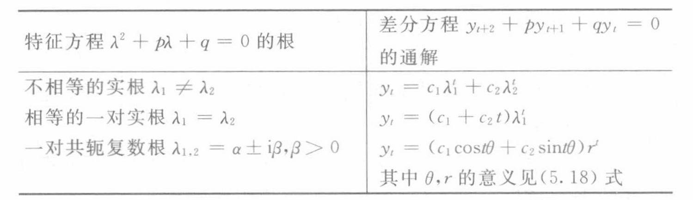

# Chap5 差分方程

## 差分与差分方程的基本概念

一阶差分记为

$$\Delta y_t=y_{t+1}-y_t$$

二阶差分记为

$$\Delta^2 y_t=\Delta(\Delta y_t)=y_{t+2}-2y_{t+1}+y_t$$

## 一阶及二阶常系数线性差分方程的解法

### 一阶常系数线性差分方程的解法

$$y_{t+1}+py_t=f(t)$$

$$y_{t+1}+py_t=0$$

分别称为一阶常系数线性非齐次差分方程与齐次差分方程

其特征方程为

$$\lambda+p=0$$

$\lambda=-p$为特征根，易知通解为$y_t=c(-p)^t$

若$f(t)$为$m$次多项式$P_m(t)$

其特解为

$$y_t^*=t^kQ_m(t)$$

k=0，当$-p\ne1$（即1不是特征根）时；k=1，当$-p=1$（即1是特征根）时

若$f(t)$为$P_ma^t$

其特解为

$$y_{t}^*=t^kQ_m(t)a^t$$

k=0，当$-p\ne a$（即a不是特征根）时；k=1，当$-p=a$（即a是特征根）时

### 二阶常系数线性差分方程的解法

$$y_{t+2}+py_{t+1}+qy_t=f(t)$$

$$y_{t+2}+py_{t+1}+qy_t=0$$

分别称为二阶常系数线性非齐次差分方程和齐次差分方程

其特征方程为

$$\lambda^t+p\lambda+q=0$$

