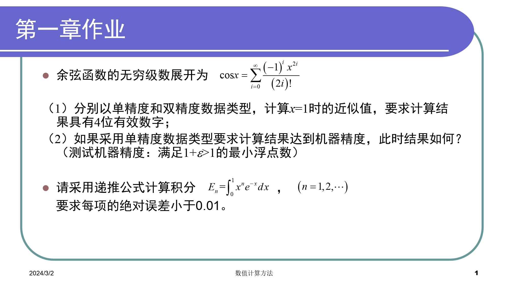
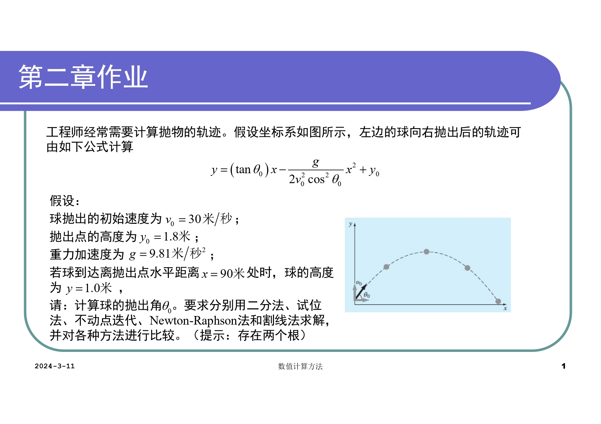
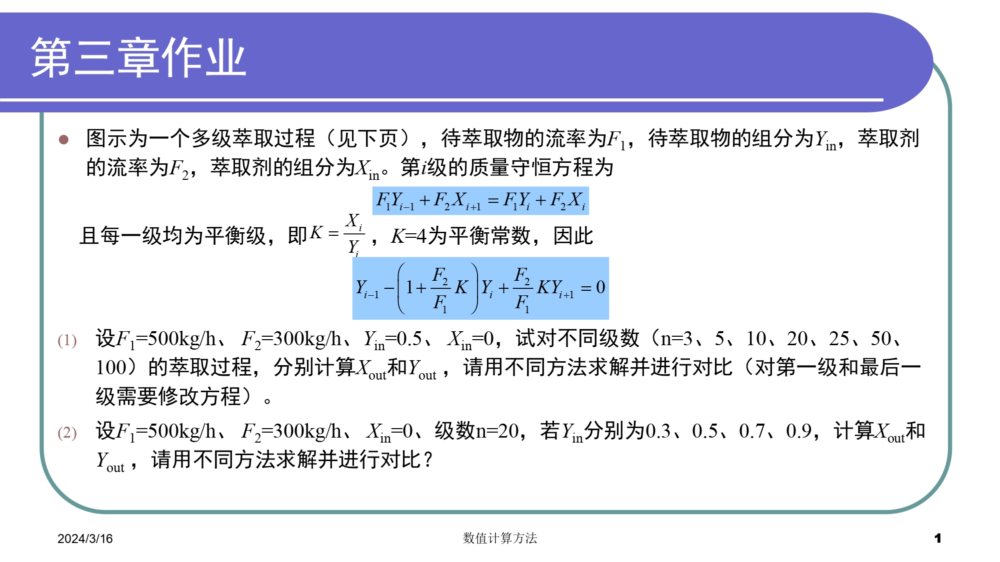
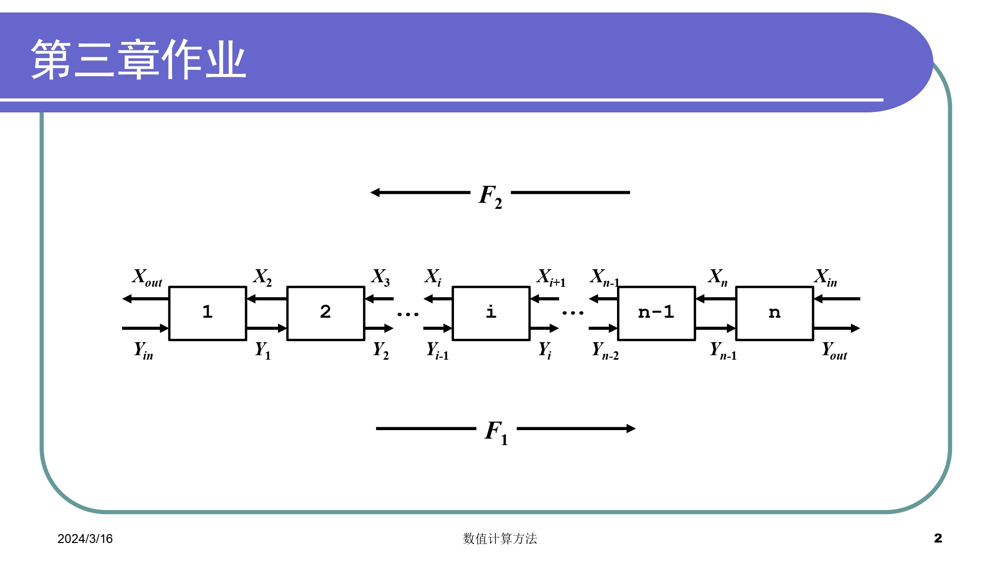
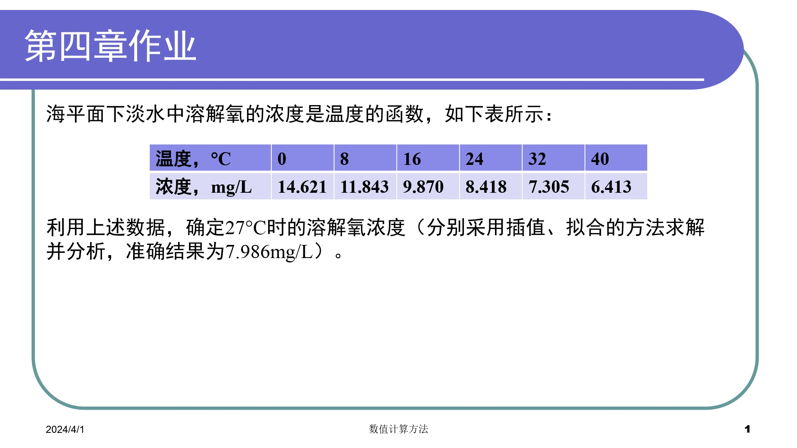
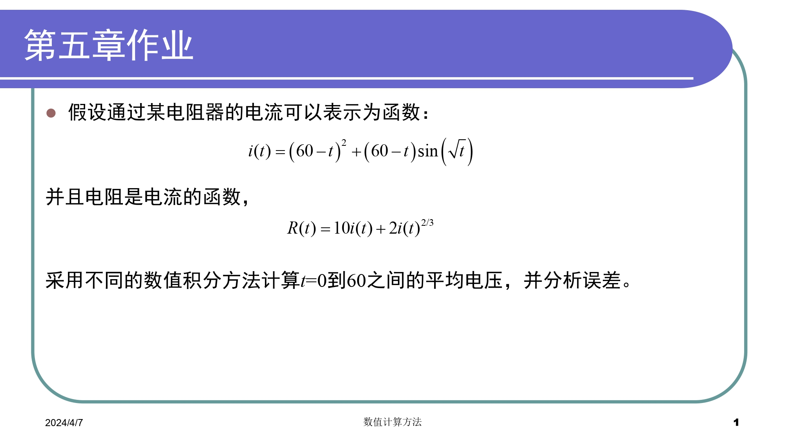

# Numerical Method Homework
## HW01
### Question

### Hint
### Analysis

Q2则遇到小麻烦。保留两位小数时输出为负（而且负得离谱），但积分结果肯定为正。思考后，增加了值为保留小数位数的变量。在matlab运行日志中可以看到，当保留小数位数达到10位时，才能得到相对准确的计算结果。 
对于这种数值较小的运算，0.01的误差累积起来也会造成相当程度的偏差。更确切地说，是由于导数绝对值较大造成的误差传播。解决问题时，必须要根据数据大小选定相应的精度或者选择方法进行优化。 
PS：正在施工中，等整理结束后会导出为pdf
 

### Solution

## HW02
### Question

### Hint
### Analysis
#### 求解较小根
1. **试位法**
    + 相比二分法引入了纵向容差
2. **不动点迭代**
    + 引入相对误差，有助于确保解达到所需精度迭代停止
    + 同时，导数绝对值必须<=1,才能收敛(在本题中就发散)
    + 由于不动点是满足g(x)=x的点，故要记得变换函数g(x)=f(x)+x,并确保导数值<1(弄了半天)
3. **Newton-Raphson方法**
    + 需要导函数
#### 求解较大根
1. 改了一些参数竟然warning,于是根据错误信息在chapter0增加了error list(待施工)
2. 问题主要在右端点,把2/pi-eps改成50*pi/101就好了，很好奇什么原理
3. Newton算出来是错的，数值远比答案大，说明发散
### Solution

## HW03
### Question

### Hint
### Analysis
> 1. Report已上传到我的[学习笔记](https://happystarkitty.github.io/Math),课程即将结束时会做一次总的修订，并将作业分析独立出来(矩阵打起来是真的花时间)
> 2. 题目理解起来难度比较大，一开始认为只要不断迭代求解就行(实际上也是)，所以没想到应用线性方程组。但后来发现可以归为带状方程组，于是分别采用高斯消去法和Thomas算法(题目没描述好，我最初没注意到$x_i$和$y_i$有关系)
> 4. 比较麻烦的是第一级和最后一级改写方程，所以写循环的时候还要判断一下
> 3. 快敲完代码的时候才想到可以直接调用函数
### Solution

## HW04
### Question

### Hint
### Analysis
#### 插值
- 采用拉格朗日插值函数，注意到有6个节点，在允许范围内，故不做多余操作
- 结果是7.9682，误差小于0.02，已经相当精确
#### 拟合
- 采用指数函数拟合数据，slides有点抽象,本来机器学习中学过的梯度下降方法,后来想到只需要方程两边取对数即可。
- 结果是8.1140，可见拟合相对来说就没有那么精确了
### Solution

## HW05
### Question

### Hint
### Analysis
#### Newton-Cotes
- Newton-Cotes积分，非常友好的算法
#### Guass
- Gauss求积公式是真的抽象，所以就不能大量援引slides了(bushi)
- 主要的麻烦是要求节点和权重，我这里是直接用了三点Gauss-Legendre求积公式
- 不过我有一个困惑，我学习的时候是说$x_0$和$x_1$未知使得代数精度更高，但如果确定了使用某个正交多项式，$x_{0}$和$x_{1}$不就固定了么，所以事实上应该代数精度和Newton-Cotes相同才对啊
- 发现答案出现了复数，忘了改写方程了
- 改完之后发现结果达到$e^10$，和我Newton-Cotes差了两个数量级，于是我又试了两点Gauss-Legendre，结果和三点求积公式是一个数量级
- 为了避免Newton-Cotes误差较大(不过我记得数值积分都是稳定的呀\苦笑)，我又试了Romberg方法，结果自然是和Newton-Cotes算出来差不多，最后发现是我输出的东西输出错了！！！
- 好好好，战术总结，gauss在计算量较小的情况下保证了较高的精度，非常神奇
### Solution

## Large Project