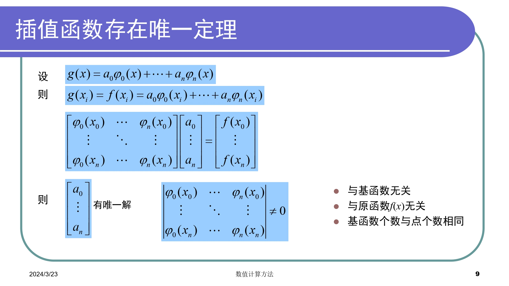
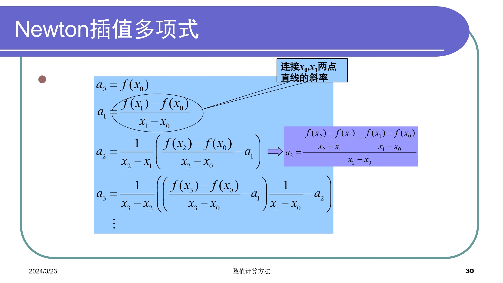
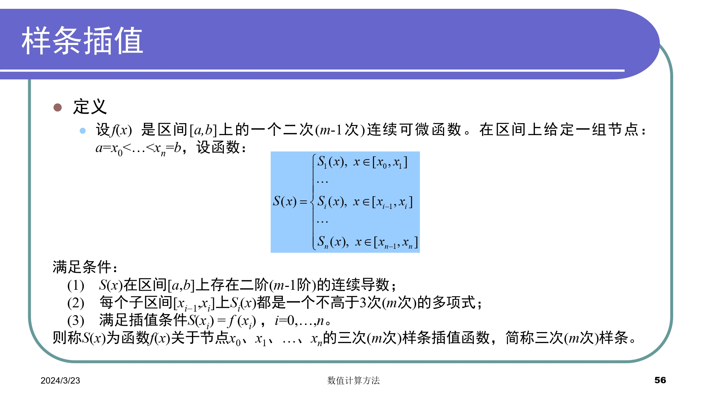
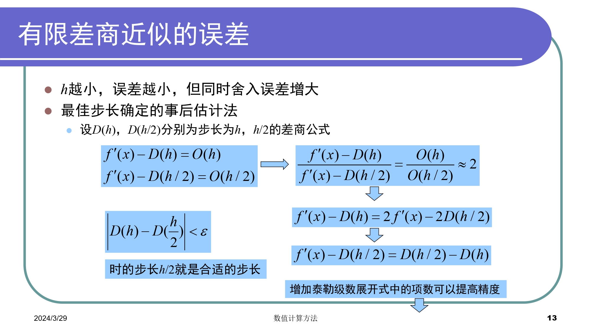
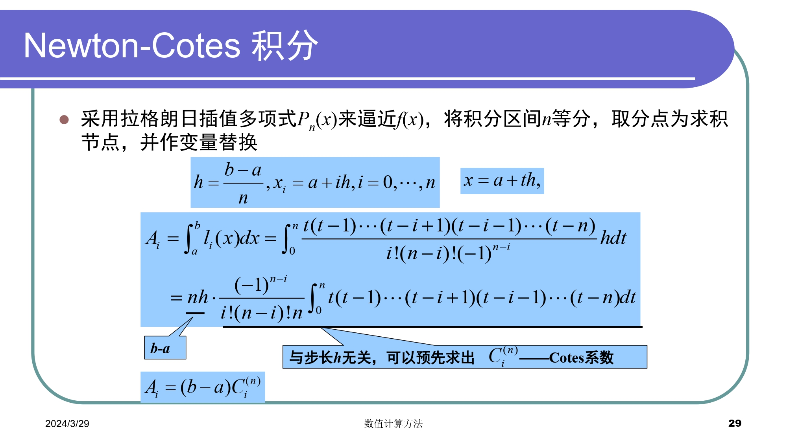
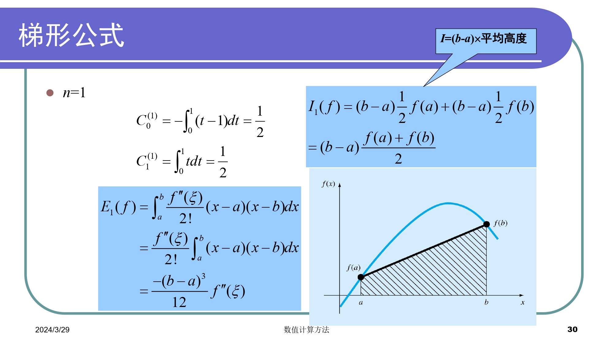
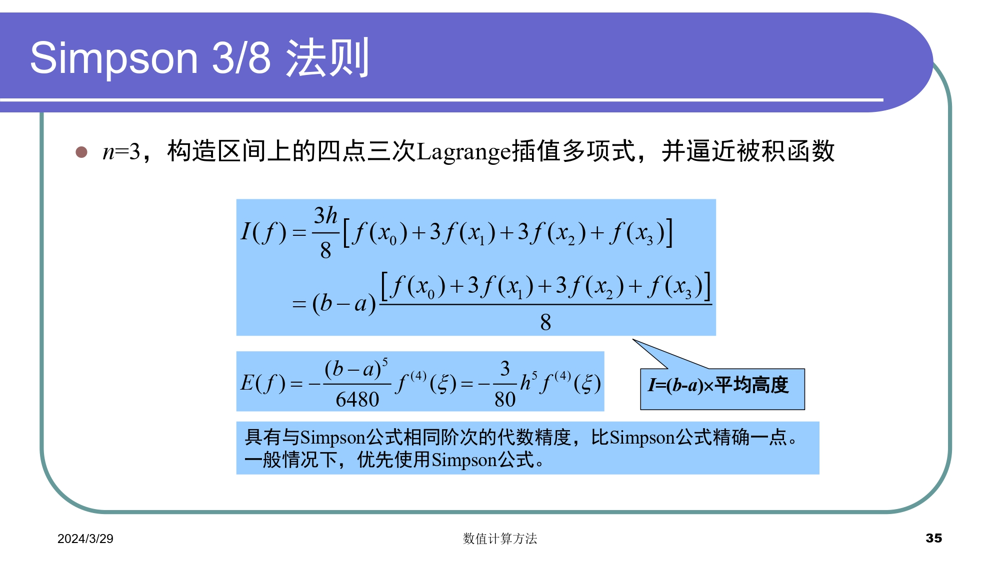
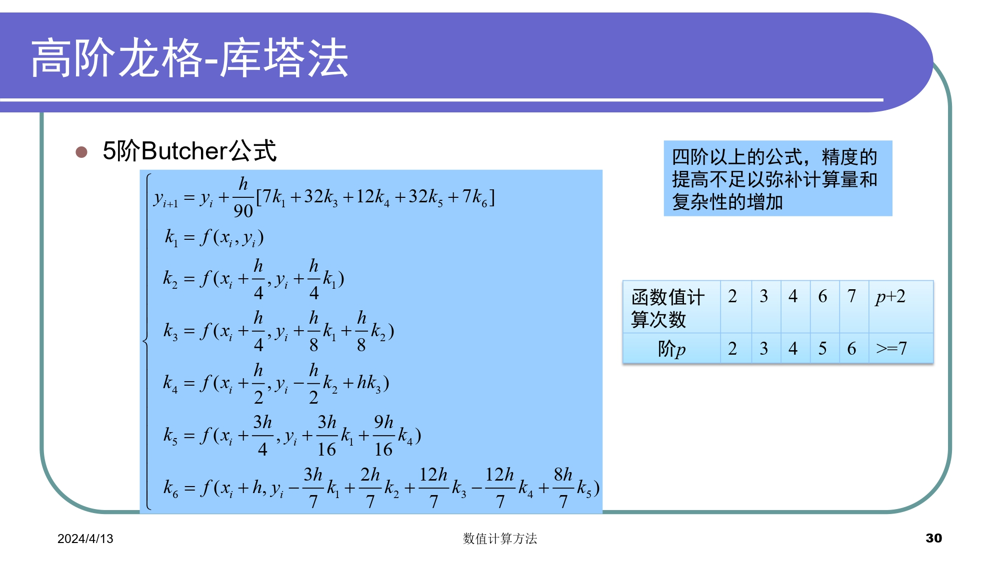
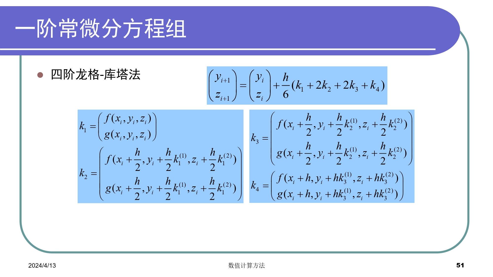

# Numerical Methods Notes

## Chapter0 Matlab

### 官方文档
[*Matlab Manual*](https://ww2.mathworks.cn/help/matlab/index.html?s_tid=CRUX_lftnav)

### 文件操作

+ 开始/结束命令行日志命令：diary lab01.txt / diary off 
+ 清空命令行命令：clc
+ 删除日志命令：delete("diary.txt")
+ 切换文件路径：cd D:\workspace\matlab
+ 一个文件一般只有一个同名函数

### 基本语法
+ 语句加上分号可以隐藏输出
+ 块注释：%{    %}
+ 数组的索引从1开始
+ 函数调用可以使用feval
+ :运算符可以创建向量
+ ~=不等于

### 数学函数
1. 常用运算
    + mod %求余
    + rem %求余，返回的余数与被除数符号相同
    + mean %计算数组平均值
    + sum %计算数组元素和
    + exp %指数函数
    + log(x,base) %对数函数

2. 保留小数位数 
    + floor %向下取整
    + roundn(n,-p) %注意负号，如果缺省-p则为四舍五入
    + format short %控制显示
    + fprintf %美化输出  

3. 求根
    + fzero %单函数求根
    + roots %求多项式的根

4. 多项式
    + poly %用已知的根构建多项式
    + polyval %求多项式的值
    + polyvalm %求带有矩阵变量的多项式的值

5. 矩阵
    + cond %计算矩阵条件数
    + norm %计算矩阵或向量的范数
    + inv %矩阵求逆
    + pinv %求矩阵伪逆
    + det %计算行列式的值
    + rank %求秩
    + eig eigs %矩阵特征值
    + lu %LU分解
    + chol %cholesky分解

6. 插值与拟合
    + polyfit %多项式最小二乘拟合
    + interp1 %一维插值(查表)
    + interp1q %快速一维线性插值
    + interp2 %二维插值
    + interpn %n维插值
    + spline,csape %三次样条插值
    + ppval %分段多项式估计函数

7. 绘图
    + plot %生成图形
    + legend %标识各条线
    + hold on %将绘图添加到现有图形中
    + figure %打开新的图窗，并将其作为当前图窗
    + clf reset %清空图窗
    + grid on %启用网格线
    + grid off %禁用网格线

8. 随机数
    + rand %生成均匀分布的随机数
    + randi %生成服从离散均匀分布的随机整数
    + randn %生成服从标准正态分布的随机数
    + randperm %生成包含随机排列的整数序列

9. 数值微分和积分
    + quad %Simpson公式
    + trapz %梯形公式
    + diff %数值微分(连续函数求导)
    + quadl %Lobatto求积(一种高斯求积公式，取代quad8)
    + dblquad %二重积分

10. 常微分方程
    + ode23 %二阶、三阶R-K方法，求解非刚性微分方程的低阶方法，较低精度
    + ode45 %四阶、五阶R-K方法，求解非刚性微分方程的中阶方法，大多数场合的首选算法，中等精度
    + ode113 %非刚性微分方程，可变阶
    + ode23s %解刚性微分方程的低阶方法
    + ode15s %刚性微分方程，可变阶
    + desolve %符号解

11. 杂项
    + length %获取数组或向量的长度，即元素数量
    + size %返回数组或矩阵的维度信息
    + tic %开始计时
    + toc %结束及时
    + linspace %生成指定区间等间距数组
    + importdata %导入数据文件
    + whos %列出工作区中的变量及类型与大小

### 常用操作

#### 矩阵与向量

matlab的向量化操作非常强大，需要善于利用
```matlab
% 1.读取所有行与列
a
a(:,:)
% 2.读取前i行，前j列
a(1:i,1:j)
% 3.读取第i行，第j列
a(i,j)
% 4.读取所有行，第j列；第i行，所有列
a(:,j)
a(i,:)
% 5.读取某几行的某几列
a([i1,i2..ip],[j1,j2..jq])
```

#### 求解多项式方程

``` matlab
%-----次数已知-----
% 声明符号变量
syms a b c x;
% 定义方程
eqn = a*x^2 + b*x +c == 0;
% 求解方程
solutions = solve(eqn,[a,b,c]);

%-----次数未知-----
syms x;
n_max = 5; % 最大阶次
solutions = [];

for n = 1:n_max
    % 定义方程
    eqn = poly2sym(sym('a', [1, n+1]), x) == 0;
    
    % 求解方程
    sol = solve(eqn);
    
    % 将解添加到结果中
    solutions = [solutions; sol];
end

% 显示所有解
solutions
```

#### 矩阵乘法

matlab矩阵乘法分为两种，times 和 .*

##### 语法

```matlab
C=A.*B;
C=times(A,B);
```
##### 说明

- 对应元素的相乘，A和B的大小必须相同和兼容
- 如果A和B的大小兼容，则两个数组会隐式扩展以相互匹配
- 如A或B中的一个是标量，则该标量与另一个数组的每个元素相结合
- 此外，行向量或列向量会隐式扩展以形成矩阵


### Error List
>**警告: 冒号操作数必须为实数标量**
**错误使用 * 用于矩阵乘法的维度不正确**

---

## Chapter1 绪论

### 概览

根据计算机特点，研究通过计算机求工程问题满足精度要求的近似解。应用数值计算方法解决工程问题的流程如下：

- 建立数学模型
- 简化成一系列算术运算和逻辑运算
- 求出问题数值解
- 对算法的收敛性、稳定性和误差进行分析计算

### 数学模型

用数学语言来表达物理系统或过程本质特征的公式或方程

+ 因变量=f(自变量，参数，强制函数) 
+ 因变量：用来刻画系统行为或状态的特征量
+ 自变量：通常为维度，如时间和空间，系统的行为是用自变量来确定的
+ 参数：反映系统的性质或组成
+ 强制函数：外部对系统施加的影响。

### 数值方法特点
+ 稳定性
+ 准确性与精确性
+ 收敛速度

### 误差分析
#### 误差种类的来源

+ 数值误差：包括舍入误差和截断误差
+ 舍入误差：由于计算机只能表示有限位数的量
+ 截断误差：由于数值方法可能运用近似方法表示准确数值运算或数量
+ 不与数值方法直接相关的误差：如粗差、形式化或模型误差、数据不确定性误差


### 有效数字
*为了正式规定数值的有效程度*
<br>
*判断有效数字位数的方法*

#### 舍入误差
+ 数的计算机表示
+ 计算机中的算术运算
##### 数的计算机表示


##### 计算机运算误差原因

1. 通用算术运算
    + 有效数字丢失
    + 主要体现在尾数的调整
2. 大规模计算
    + 舍入误差的累积效应
3. 大数和小数相加
    + 如无穷级数求和
4. 减性抵销
    + 两个几乎相等的浮点数所引起的舍入误差
    + 如二次求根公式
    + 变换公式或扩展精度
5. 拖尾效应
    + 求和过程中，某一项的值大于和值本身
    + 在符号交替的级数中会出现
6. 内积
    + 使用扩展精度

#### 截断误差
+ 多项式数值计算的近似
+ 误差与步长的n+1次方成比例
#### 误差传播
+ 函数导数的绝对值较大
+ 初始误差可稳定传播或不稳定传播
### 算法的数值稳定性

### 总结


---

## Chapter2 非线性方程求根
### 概览

1. 求解代数方程和超越方程的实数根
    + 根的分离(预先给出根的一个粗略位置)
    + 近似根的精确化(向真实根逼近)
2. 求解多项式的所有实数根和复数根
### 收敛阶

### 划界法
#### 二分法
**取左右端点中点**
```matlab
%二分法
function [c,err,yc]=bisect(f,a,b,delta)
ya=feval(f,a);
yb=feval(f,b);
if ya*yb>0
    disp('Note: f(a)*f(b)>0')
    return
end
max_times=1+round((log(b-a)-log(delta))/log(2));
for k=1:max_times
    c=(a+b)/2;
    yc=feval(f,c);
    if yc==0
        a=c;
        b=c;
    elseif yb*yc>0
        b=c;
        yb=yc;
    else
        a=c;
        ya=yc;
    end
    if b-a<delta
        break
    end
end

c=(a+b)/2;
err=abs(b-a)/2;
yc=feval(f,c);
```

#### 试位法
**取左右端点连成直线与X轴的交点**
```matlab
%试位法
function [c,err,yc]=regula(f,a,b,delta,epsilon,max1)

ya=feval(f,a);
yb=feval(f,b);
if ya*yb>0
    disp('Note: f(a)*f(b)>0')
    return
end
for k=1:max1
    dx=yb*(b-a)/(yb-ya); %dx为c,b之间的距离
    c=b-dx;
    ac=c-a; %ac为a,c之间的距离
    yc=feval(f,c);
    if yc==0
        break
    elseif yb*yc>0
        b=c;
        yb=yc;
    else 
        a=c;
        ya=yc;
    end
    dx=min(abs(dx),ac);
    if abs(dx)<delta
        break
    end
    if abs(yc)<epsilon
        break
    end 

c=b-yb*(b-a)/(yb-ya);
err=abs(b-a);
yc=feval(f,c);
end
```
**优势**：一般情况下，试位法比二分法误差减小得快
**缺陷**：在某些情况下，试位法收敛慢；近似误差小于真实误差；一个划界点不动可能导致很差的收敛性


### 开方法
#### 不动点迭代
**取接近满足f(x)=x不动点的点**
```matlab
%不动点迭代
function [k,p,err,P]=fixpt(g,p0,delta,max1)

P(1)=p0;
for k=2:max1
    P(k)=feval(g,P(k-1));
    err=abs(P(k)-P(k-1));
    relerr=err/(abs(P(k))+eps);
    p=P(k);
    if (err<delta) || (relerr<delta)
        break
    end

if k==max1
    disp('maximum number of iteration exceeded')
end
end
```
+ 导数绝对值大于1，误差增大
+ 导数为正，误差为正，迭代的解单调；导数为负，误差增大
+ 方法收敛时，误差大致与前一次的迭代误差成比例，且小于前一次的迭代误差(线性收敛)
#### Newton-Raphson方法
**取某点切线与x轴的交点(等价于g(x)=x-f(x)/f'(x)不动点)**
```matlab
%Newton-Raphson方法
function [p0,err,k,y]=newton(f,df,p0,delta,epsilon,max_times)

for k=1:max_times
    p1=p0-feval(f,p0)/feval(df,p0);
    err=abs(p1-p0);
    relerr=2*err/(abs(p1)+delta);
    p0=p1;
    y=feval(f,p0);
    if (err<delta) || (relerr<delta) || (abs(y)<epsilon)
        break
    end
end
```


#### 割线法
**取同侧端点连成直线与x轴交点**
```matlab
%割线法
function [p1,err,k,y]=secant(f,p0,p1,delta,epsilon,max_times)

for k=1:max_times
    p2=p1-feval(f,p1)*(p1-p0)/(feval(f,p1)-feval(f,p0));
    err=abs(p2-p1)
    relerr=2*err/(abs(p2)+delta);
    p0=p1;
    p1=p2;
    y=feval(f,p1);
    if (err<delta || (relerr<delta) || abs(y)<epsilon)
        break
    end
end
if k==max_times
    disp('maximum number of iteration exceeded')
end
```
+ 类似Newton-Raphson方法，用差商估计斜率
+ 类似试位法，用两个初时估计值计算函数斜率的近似，并将其投射到x轴上获得一个新的估计值
+ 收敛阶，1.618
+ 对于所有现实情况，试位法通常收敛，割线法可能发散；如果割线法收敛，通常比试位法快
#### 针对重根的改进


### 总结


---

## Chapter3 线性代数方程组
### 系数矩阵类型

+ 低阶稠密矩阵
+ 大型稀疏矩阵(矩阵中0元素较多)
+ 三对角矩阵(非0元素集中于主对角线及相邻两对角线上)
### 数值解法

### 直接法
#### 高斯消去法

##### 病态方程组判别
+ 行列式的值
+ 矩阵求逆
    + 缩放系数矩阵，使每一行最大元素为1，缩放后的逆矩阵元素值大于1数倍则为病态
    + 将逆矩阵与原矩阵相乘，结果不接近单位阵则为病态
    + 求逆矩阵的逆矩阵，与原系数矩阵对比，不相等则为病态
+ 系数微小改变再求解

##### 解求精技术

+ 使用扩展精度
+ 选主元
列主元消去法或者全主元消去法
+ 缩放
缩放之后的系数用来确定是否需要交换主元，但实际消去和回代中仍使用原系数值
##### 消去法
+ 顺序消去法条件苛刻，且数值不稳定
+ 全主元消去法工作量偏大，需要比较的元素及行列交换工作较多，算法复杂
+ 高斯约当消去法形式上简单，且无回代求解，但计算量大
+ 从算法优化的角度考虑，列主元消去法较好
```matlab
function X=Gauss(A,B)
%采用高斯消去法
n=length(B);
for i=1:n-1
    %寻找该列绝对值最大的元素
    max=abs(A(i,i));
    mark=i;
    for j=i+1:n
        if (abs(A(i,j)) > max)
            max=abs(A(i,j));
            mark=j;
        end
    end
    %交换行
    l=A(i,:);
    A(i,:)=A(mark,:);
    A(mark,:)=l;
    c=B(i);
    B(i)=B(mark);
    B(mark)=c;
    %顺序消元
    %消去
    for j=i+1:n %对第j行进行操作
        factor=A(j,i)/A(i,i);
        for k=i+1:n %对第k个进行操作
            A(j,k)=A(j,k)-factor*A(i,k);
        end
        B(j)=B(j)-factor*B(i);
    end
end

%回代
X(n)=B(n)/A(n,n)
for i=n-1:-1:1
    sum=B(i);
    for j=i+1:n
        sum=sum-A(i,j)*X(j);
    end
    X(i)=sum/A(i,i);
end
end
```

#### 三角分解(LU分解)
LU分解矩阵求逆可减少计算量
##### Doolittle分解
+ L为单位下三角矩阵，U为上三角矩阵
##### Crout分解
+ L为下三角矩阵，U为单位上三角矩阵
##### 三角分解和高斯消去的比较

+ 计算量相当
+ 三角分解不必计算中间结果，不需要提前知道右端项
+ 解相同系数矩阵方程相当方便
##### Cholesky分解
对称正定矩阵的平方根法

+ 由Doolittle分解，A有唯一分解$A=LU$
+ LDR分解：(L、R分别为下、上三角矩阵，D为对角矩阵)
+ 三角分解：$A=LDL^T$
+ 优势：存储量小，计算量小，数值稳定
+ 缺点：存在开方运算，可能会出现根号下复数
#### 带状方程组
+ 高斯消去或LU分解效率低
+ 元素满足对角占优条件，可以证明A非奇异，且各阶顺序主子式都采用三对角方程组的追赶法(Thomas算法)
#### Thomas算法
1. 分解计算公式：$A=LU$
2. 求解方程组 $Ly=f$ 的递推算式
3. 求解方程组 $Ux=y$ 的递推算式
```matlab
function X=Thomas(A,B)
%采用三对角方程组的追赶法
n=length(B);
%crout分解
L=eye(n);
U=zeros(n);
for i=1:n
    %计算U矩阵的第i行
    U(i,i:n)=A(i,i:n)-L(i, 1:i-1)*U(1:i-1,i:n);        
    %计算L矩阵的第i+1列到第n列
    for j=i+1:n
        L(j,i)=(A(j,i)-L(j,1:i-1)*U(1:i-1,i))/U(i,i);
    end
end
%求解方程组Ly=f
Y=zeros(1,n);
Y(1)=B(1)/A(1,1);
for i=2:n
    Y(i)=(B(i)-A(i,i-1)*Y(i-1))/(A(i,i)-A(i,i-1)*U(i,i-1));
end 
%求解方程组Ux=y
X(n)=Y(n);
for i=n-1:-1:1
    X(i)=Y(i)-X(i+1)*U(i,i+1);
end
end
```
### 误差分析、条件数
#### 向量范数
满足条件：正定，齐次，三角不等式
+ "2"范数(欧几里得范数)
$$
||x||_2=(\sum\limits_{i=1}^{n}x_i^{2})^{1/2}
$$
+ "1"范数
$$
||x||_1=\sum\limits_{i=1}^{n}|x_i|
$$
+ "∞"范数(极大值范数或一致向量范数)
$$
||x||_∞=\mathop{\max_{1\leq{i}\leq{n}}^{}}{|x_i|}
$$
+ "p"范数
$$
||x||_p=(\sum\limits_{i=1}^{n}|x_i|^{p})^{1/p}
$$
#### 矩阵范数
满足条件：正定，齐次，三角不等式，矩阵乘法不等式(相容性条件)
+ "2"范数(谱范数)
$$
||A||_2=[\lambda_{max}A^TA]^{1/2}
$$
+ "1"范数(列和范数)
$$
||A||_1=\max\limits_{1\leq{j}\leq{n}}\sum\limits_{i=1}^{n}|a_{ij}|
$$
+ "∞"范数(行和范数)
$$
||A||_∞=\max_{1\leq{i}\leq{n}}\sum_{j=1}^n|a_{ij}|
$$
##### 谱半径
+ A的所有特征值的集合称为谱
+ 称$\rho(A)=\max\limits_{1\leq{i}\leq{n}}|\lambda_i|$
+ $||A||$为$A$的任意一种范数，有$\rho{(A)}\leq{||A||}$
#### 病态方程组和矩阵条件数
相对误差直接与A的条件数相关


### 迭代方法
#### 迭代法


#### 雅可比迭代法(同步迭代法)


#### 高斯-赛德尔方法(异步迭代法)

#### 收敛性


#### 逐次超松弛迭代法(SOR)


---

## Chapter4 插值和拟合
### 插值
#### 插值函数
一般有代数多项式、有理函数、三角函数，其中有理插值可使区间内插值误差分布均匀，适用于某些被插函数具有无穷间断点的附近
#### 插值函数存在唯一定理
 
#### 插值多项式存在唯一性
 
#### 插值余项
 
#### 内插与外推
- 内插
插值点位于插值区间内，即$a<x<b$
- 外推
插值点位于插值区间外，即$x<a$或$x>b$，但又较接近于插值区间端点时
#### 插值余项误差
- 插值多项式仅与已知数据有关，与$f(x)$原来形式无关，但余项与$f(x)$密切相关
- 若$f(x)$本身是一个不超过n次多项式，则$P_{n}(x)=f(x)$
- 对于多项式插值，增加阶数不一定能提高精度(一般推荐3j个节点的插值)
- 插值点$x$不能位于插值区间之外的远处
#### Lagrange插值多项式
 
 ```matlab
 %拉格朗日插值多项式
function y_predict=lagrange(x_data,y_data,x_predict,num)
%num为插值节点数目

volumn_data=length(x_data);
volumn_predict=length(x_predict);
y_predict=zeros(1,volumn_predict);

%根据插值节点数目进一步筛选数据
divide=floor((volumn_data-1)/num);
x_train=zeros(1,num);
y_train=zeros(1,num);
for i=1:num
    x_train(i)=x_data(1+i*divide);
    y_train(i)=y_data(1+i*divide);
end

%计算预测值
for i=1:volumn_predict
    for j=1:num
        term=1;
        for k=1:num
            if k~=j
                term=term*(x_predict(i)-x_train(k))/(x_train(j)-x_train(k));
            end
        end
        y_predict(i)=y_predict(i)+term*y_train(j);
    end
end

end
```
##### 缺点
- 无承袭性：增加一个节点，所有的基函数都要重新计算
##### 适用场景
- 均匀分布的数据点
- 低阶插值
- 数据点误差较小
- 用于插值而非外推
#### Newton插值多项式
 
 
 
 
 

##### 等距节点的插值
数据在空间上间距相等

- 步长
$x_0<...<x_n$,其中$x_i-x_{i-1}=h$,$x_i=x_0+ih$,h被称作步长
- 有限差分
    - $\Delta f(x)=f(x+h)-f(x)$        一阶向前差分
    - $\nabla f(x)=f(x)-f(x-h)$        一阶向后差分
    - $\delta f(x)=f(x+h/2)-f(x-h/2)$  一阶中心差分
    - $\Delta$ 前差算子  $\nabla$ 后差算子  $\delta$ 中差算子
##### Newton向前插值公式
 
 

#### Hermite插值多项式
 

#### Runge现象
插值多项式次数越高：
1. 计算量大
2. 在部分区间(两端)激烈振荡，截断误差/计算余项偏大
#### 插值误差
- 截断误差是插值的收敛性问题，Runge现象
- 舍入误差是插值的稳定性稳定
- 为避免Runge和不稳定，一般限定n<7
- n较大时采用分段低次插值、样条插值、次数较低的最小二乘逼近
#### 分段低次插值
为了避免龙格现象，可以对每个小区间进行低次多项式插值，常见的有分段线性插值和分段抛物插值
```matlab
%分段低次插值
function y_predict=piecewise(x_data,y_data,x_predict)

volumn_data=length(x_data);
volumn_predict=length(x_predict);
y_predict=zeros(1,volumn_predict);

%分段线性插值

for i=1:volumn_predict
    %外推
    if x_predict(i)<x_data(1)
        y_predict(i)=y_data(1)+(y_data(2)-y_data(1))/(x_data(2)-x_data(1))*(x_predict(i)-x_data(1));
    end
    if x_predict(i)>x_data(volumn_data-1)
        y_predict(i)=y_data(volumn_data-1)+(y_data(volumn_data)-y_data(volumn_data-1))*(x_data(volumn_data)-x_data(volumn_data-1))*(x_predict(i)-x_data(volumn_data-1));
    end
    %内插
    for j=1:volumn_data-1
        if x_predict(i)>=x_data(j) && x_predict(i)<=x_data(j+1)
            y_predict(i)=y_data(j)+(y_data(j+1)-y_data(j))/(x_data(j+1)-x_data(j))*(x_predict(i)-x_data(j));
        end
    end
end


%{
%分段抛物插值
coefficient=zeros(volumn_data-2,3);%系数矩阵
for i=1:volumn_data-2
    k2=(y_data(i+2)-y_data(i+1))/(x_data(i+2)-x_data(i+1));
    k1=(y_data(i+1)-y_data(i))/(x_data(i+1)-x_data(i));
    coefficient(i,1)=(k2-k1)/(x_data(i+2)-x_data(i));
    coefficient(i,2)=k1-coefficient(i,1)*(x_data(i+1)+x_data(i));
    coefficient(i,3)=y_data(i)-coefficient(i,1)*x_data(i)*x_data(i)-coefficient(i,2)*x_data(i);
end

for i=1:volumn_predict
    %外推
    if x_predict(i)<x_data(1)
            y_predict(i)=coefficient(1,1)*x_predict(i)*x_predict(i)+coefficient(1,2)*x_predict(i)+coefficient(1,3);
    end
    if x_predict(i)>x_data(volumn_data-2)
            y_predict(i)=coefficient(volumn_data-2,1)*x_predict(i)*x_predict(i)+coefficient(volumn_data-2,2)*x_predict(i)+coefficient(volumn_data-2,3);
    end
    %内插
    for j=1:volumn_data-2
        if x_predict(i)>=x_data(j) && x_predict(i)<=x_data(j+2)
            y_predict(i)=coefficient(j,1)*x_predict(i)*x_predict(i)+coefficient(j,2)*x_predict(i)+coefficient(j,3);
            break;
        end
    end
end
%}

end
```
##### 优点
- 公式简单，只要区间充分小，就能保证误差要求
- 局部性质良好，修改某个节点，只影响相邻的两个区间
##### 缺点
- 不能保证节点处插值函数的导数连续，因而不能满足某些工程曲线光滑性的要求
#### 样条插值
##### 概览
- 样条插值的原理和分段低次插值相同，都是使用分段多项式来逼近数据
- 在样条插值中，相邻子区间的插值函数除了满足函数值连续，还对一阶连续性和二阶连续性有要求
 
 
 
##### 三弯矩法
0. 算法分析
简单地说就是将二阶导函数用线性函数表示，然后通过积分推导出三次方程的系数
1. 数据准备
导入已知的数据点，其中自变量$x_{i}$，因变量$y_{i}$
2. 计算差分
计算相邻数据点的差分，得到自变量的差分$h_{i}=x_{i+1}-x_{i}$和因变量的差分$\delta_{i}=(y_{i+1}-y_{i})/h_{i}$
3. 计算弯矩
在每个数据点$x_{i}$处，计算插值函数的弯矩$M_{i}$，通常通过以下公式计算$M_{i}=6(\frac{\delta_{i+1}-\delta_{i}}{h_{i+1}}-\frac{\delta_{i}-\delta_{i-1}}{h_{i}})$
其中$M_{1}$和$M_{n}$通常设定为零
4. 构建系数矩阵
根据已知数据点和弯矩值，构建系数矩阵。系数矩阵的每一行对应一个插值段的系数
5. 求解边界条件
由以上步骤得到4n-2个条件，我们需要在区间端点加上两个约束条件，称为边界条件。一般有：
    + 固定边界 (Clamped Spline)
    已知两端的一阶导数值，即 $S^\prime(x_{0})=y_{0}^\prime,S^\prime(x_{n})=y_{n}^\prime$
    + 自然边界 (Nature Spline)
    已知两端的二阶导数值，即 $S^{\prime\prime}(x_{0})=y_{0}^{\prime\prime},S^{\prime\prime}(x_{n})=y_{n}^{\prime\prime}$
    + 非扭结边界 (Not-A-Knot Spline)
    已知第一个插值节点的三阶导数值与第二个相等，最后一个插值点的三阶导数值与倒数第二个相等，即 $S_{0}^{\prime\prime\prime}(x_{0})=S_{1}^{\prime\prime\prime}(x_{1}),S_{n-2}^{\prime\prime\prime}(x_{n-1})=S_{n-1}^{\prime\prime\prime}(x_{n})$
6. 求解插值函数
解出系数矩阵，得到每个插值段的系数。这些系数就是样条插值函数的参数，用于计算插值函数在任意点的值。
 
 
 
 
```matlab
%三次样条插值
function y_predict=spline(x_data,y_data,x_predict)

volumn_data=length(x_data);
volumn_predict=length(x_predict);
y_predict=zeros(1,volumn_predict);

%计算步长
h_array=zeros(1,volumn_data-1);
for i=1:volumn_data-1
    h_array(i)=x_data(i+1)-x_data(i);
end

%构造线性方程组
%构造左侧系数矩阵
A=zeros(volumn_data,volumn_data);
for i=1:volumn_data
    if i==1 || i==volumn_data
        A(i,i)=1;
    else
        A(i,i-1)=h_array(i-1);
        A(i,i)=2*(h_array(i-1)+h_array(i));
        A(i,i+1)=h_array(i);
    end
end
%构造右侧向量
B=zeros(1,volumn_data);
for i=1:volumn_data
    if i==1 || i==volumn_data
        B(i)=0;
    else
        B(i)=(y_data(i+1)-y_data(i))/h_array(i)-(y_data(i)-y_data(i-1))/h_array(i-1);
    end
end

disp(A)
disp(B)
%求解
X=gauss(A,B);

%计算样条函数的系数
a_array=zeros(1,volumn_data-1);
c_array=zeros(1,volumn_data-1);
b_array=zeros(1,volumn_data-1);
d_array=zeros(1,volumn_data-1);
for i=1:volumn_data-1
    a_array(i)=y_data(i);
    c_array(i)=X(i)/2;
    d_array(i)=(X(i+1)-X(i))/6/h_array(i);
    b_array(i)=(y_data(i+1)-y_data(i))/h_array(i)-h_array(i)/2*X(i)-h_array(i)/6*(X(i+1)-X(i));
end

%计算预测值
for i=1:volumn_predict
    %外推
    if x_predict(i)<x_data(1)
        y_predict(i)=a_array(1)+b_array(1)*(x_predict(i)-x_data(1))+c_array(1)*power(x_predict(i)-x_data(1),2)+d_array(1)*power(x_predict(i)-x_data(1),3);
    end
    if x_predict(i)>x_data(volumn_data)
        y_predict(i)=a_array(volumn_data-1)+b_array(volumn_data-1)*(x_predict(i)-x_data(volumn_data))+c_array(volumn_data-1)*power(x_predict(i)-x_data(volumn_data),2)+d_array(volumn_data-1)*power(x_predict(i)-x_data(volumn_data),3);
    end
    %内插
    for j=1:volumn_data-1
        if x_predict(i)>=x_data(j) && x_predict(i)<=x_data(j+1)
            y_predict(i)=a_array(j)+b_array(j)*(x_predict(i)-x_data(j))+c_array(j)*power(x_predict(i)-x_data(j),2)+d_array(j)*power(x_predict(i)-x_data(j),3);
            break;
        end
    end
end

end
```
#### 逆插值
- 交换变量
    - 横坐标在空间分布的不均匀性会导致插值多项式产生振荡(即使是低阶多项式)
- 利用初始数据进行插值，得到插值多项式后，寻找对应的$x$值，相当于方程求根
### 拟合
求出一个经验公式，使各数据点从总体上最贴近，而不一定要求构造的函数曲线通过所给数据点
#### 最小二乘方法
 
##### 基本环节
- 确定$\varphi(x)$的形式
- 求最小二乘解
##### 解法
 
 
 
##### 代数多项式拟合
 
 
### 总结
- 相同点
    - 从函数角度看，插值法与最小二乘法都是根据函数表求函数的近似表达式的问题，属于函数逼近问题
    - 从几何上看，二者都是根据一列数据点求曲线的近似曲线问题，是曲线拟合问题
- 不同点
    - 插值法根据插值条件选择近似函数
    - 最小二乘法根据“偏差平方和最小”原则选择近似函数

---

## Chapter5 数值微分和数值积分
### 概览
#### 数值微分
- 有限差商逼近导数
- 数据存在误差，使用曲线拟合技术构造光滑拟合曲线，对拟合曲线微分
#### 数值积分
$$
\int_{a}^{b}f(x)dx=f(\xi)(b-a)
$$
用区间$[a,b]$上一些点$x_{k}$出的函数值$f(x_{k})$的加权平均值，作为平均高度$f(\xi)$的近似值
$$
I=\int_{a}^{b}f(x)dx=\sum_{k=0}^{n}A_{k}f(x_{k})
$$
求积系数$A_{k}=\omega_{k}(b-a)$,$\omega_{k}$是求积节点权系数
#### 复杂函数
- 由函数表达式生成离散的数据列表
- 在离散点的基础上，利用数值方法计算数值微分和积分
#### 稳定性
- 一般数值积分过程稳定，解精确度较高(正负随机误差倾向于相互抵消)
- 数值微分解不稳定，精度较差(正负随机误差倾向于累积)
### 数值微分
#### 差商近似




#### 插值型数值微分
用插值函数的导数近似为原函数的导数


- 用三次样条插值的导数近似被插值函数的导数，效果相当好
- 实际问题中公式选择视具体问题而定
给定一个列表函数，对函数中间各点都可使用精度较高的中心差商公式，但起始点只能使用前插公式，终点则使用后插公式
- 一般情况下，三点公式比两点公式准确，步长越小结果越准确。但当余项中的高阶导数无界或计算过程中的舍入误差超过截断误差是，结论不成立
### 数值积分


#### Newton-Cotes积分

- 一组基于等距节点的数值积分方法
- 形式有梯形规则(Trapezoidal Rule)、辛普森规则(Simpson's Rule)、复合梯形规则(Composite Trapezoidal Rule)
- 在给定区间的等距离点上估计函数值，然后使用多项式插值来近似积分值

```matlab
%使用Newton-Cotes积分
function int_newton=Newton(f,a,b,n)
%f=求积函数，a=左端点，b=右端点，n=节点数
array=linspace(a,b,n);
y_array=zeros(1,n);
h=(b-a)/(n-1);
for i=0:n-1
    y_array(i+1)=f(a+i*h);
end
int_newton=h*sum(y_array);
```







#### Romberg积分

- 一组自适应数值积分方法
- 通过递归地细分区间并应用Newton-Cotes积分来逼近积分值
- 通过不断增加节点的数量和细分区间的大小来提高积分的准确度，并最终收敛于所需的精度


##### 数值微分的外推法


#### Gauss求积公式
##### 概览
- 一种基于节点和权重的数值积分方法
- 通过选择合适的节点和权重来最小化积分误差
- 节点通常是选择为Chebyshev节点或Legendre节点，权重则通过多项式插值和正交性质来确定。
##### 比较
代数精度和待定数量的数量相关，待定系数数量为n，代数精度至少为n-1，我们讨论只有两个节点的情况：
$$
\int_{-1}^{1}f(x)dx \approx A_{0}f(x_{0})+A_{1}f(x_{1}) 
$$
对于Newton-Cotes积分，由于区间等分，故$x_{0}$和$x_{1}$确定，待定系数只有$A_{0}$和$A_{1}$，代数精度至少为1

而Gauss积分由于不等分区间，则$x_{0}$和$x_{1}$也是待定系数，代数精度至少为3
```matlab
%使用高斯求积公式
function int_gauss=Gauss(f,a,b)
a0=(b+a)/2;
a1=(b-a)/2;

%三点Gauss-Legendre公式
x1=-sqrt(3/5);
x2=0;
x3=sqrt(3/5);
int_1=f(a0 + a1 * x1) * 5/9;
int_2=f(a0 + a1 * x2) * 8/9;
int_3=f(a0 + a1 * x3) * 5/9;
int_gauss=(int_1+int_2+int_3)*a1;
end

%{
%两点Gauss-Legendre公式
x1=sqrt(3)/3;
x2=-sqrt(3)/3;
int_1=fun2(f,a0,a1,x1);
int_2=fun2(f,a0,a1,x2);
int_gauss=int_1+int_2;
%}
```


- 优点
    - 计算量小，精度高
- 缺点
    - n改变大小时，节点和系数几乎都改变
    - 利用余项控制精度困难
    - 需要计算节点处的函数值，不适用于函数表达式未知的情况
- 较多采用复合求积的方法，将积分区间分成m个等长的小区间，在每个小区间上使用同一低阶Gauss求积公式算出积分的近似值，再相加
### 总结


---

## Chapter6 常微分方程的数值解
### 概览
定解条件

- 初值问题
给出积分曲线在初始点的状态(初始条件)
- 边值问题
给出积分曲线首尾两端的状态(边界条件)


### 初值问题
#### 欧拉(Eular)法


#### 龙格-库塔(Runge-Kutta)法





#### 多步法


#### 稳定性、收敛性和刚性问题


##### 稳定性


##### 收敛性


#### 微分方程组和高阶微分方程





### 边值问题


#### 打靶法


#### 差分法

### 总结


