# Numerical Methods
## Chapter0 Matlab
### 官方文档
[*Matlab Manual*](https://ww2.mathworks.cn/help/matlab/index.html?s_tid=CRUX_lftnav)
### 文件操作
+ 开始/结束命令行日志命令：diary lab01.txt / diary off 
+ 清空命令行命令：clc
+ 删除日志命令：delete("diary.txt")
+ 切换文件路径：cd D:\workspace\matlab
+ 一个文件一般只有一个同名函数
### 基本语法
+ 语句加上分号可以隐藏输出
+ 块注释：%{    %}
+ 数组的索引从1开始
+ 函数调用可以使用feval
### 数学函数
1. 保留小数位数 
    + roundn(n,-p) %注意负号
    + format short %控制显示
    + fprintf %美化输出  

2. 求根
    + fzero %单函数求根
    + roots %求多项式的根

3. 多项式
    + poly %用已知的根构建多项式
    + polyval %求多项式的值
    + polyvalm %求带有矩阵变量的多项式的值

4. 矩阵
    + cond %计算矩阵条件数
    + norm %计算矩阵或向量的范数
    + inv %矩阵求逆
    + pinv %求矩阵伪逆
    + det %计算行列式的值
    + rank %求秩
    + eig eigs %矩阵特征值
    + lu %LU分解
    + chol %cholesky分解
5. 杂项
    + len %获取数组或向量的长度，即元素数量
    + size %返回数组或矩阵的维度信息
    + tic %开始计时
    + toc %结束及时

### Error List
>**警告: 冒号操作数必须为实数标量**

## Chapter1 绪论
### 数学模型
用数学语言来表达物理系统或过程本质特征的公式或方程。
+ 因变量=f(自变量，参数，强制函数) 
+ 因变量：用来刻画系统行为或状态的特征量
+ 自变量：通常为维度，如时间和空间，系统的行为是用自变量来确定的
+ 参数：反映系统的性质或组成
+ 强制函数：外部对系统施加的影响。
### 数值方法特点
+ 稳定性
+ 准确性与精确性
+ 收敛速度
### 误差种类的来源
+ 数值误差：包括舍入误差和截断误差
+ 舍入误差：由于计算机只能表示有限位数的量
+ 截断误差：由于数值方法可能运用近似方法表示准确数值运算或数量
+ 不与数值方法直接相关的误差：如粗差、形式化或模型误差、数据不确定性误差


### 有效数字
*为了正式规定数值的有效程度*
<br>
*判断有效数字位数的方法*
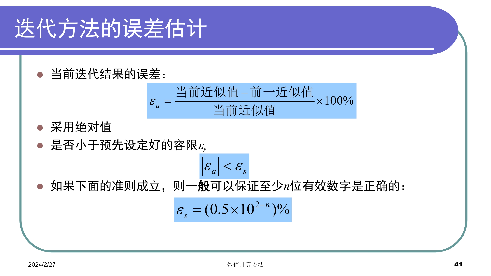
### 舍入误差
+ 数的计算机表示
+ 计算机中的算术运算
#### 数的计算机表示
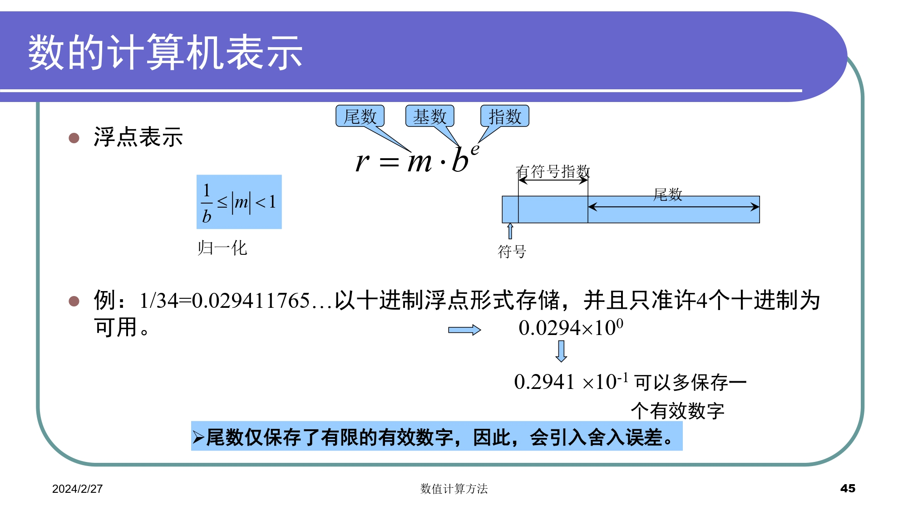
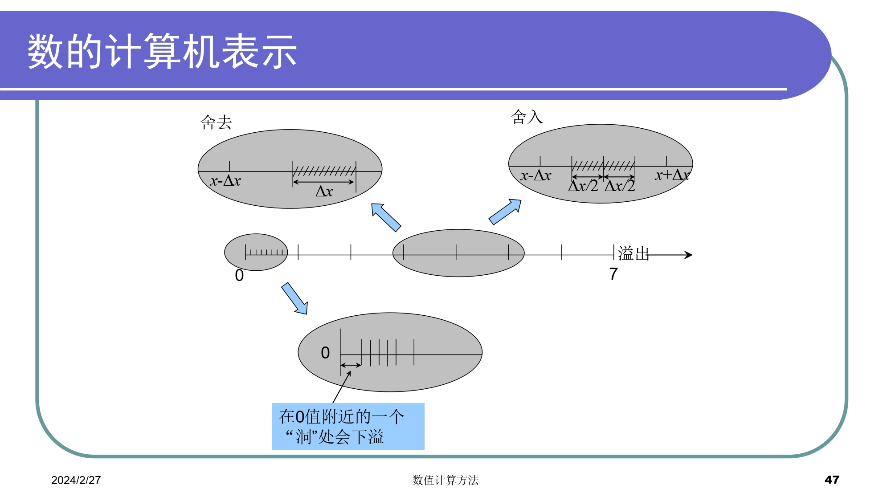
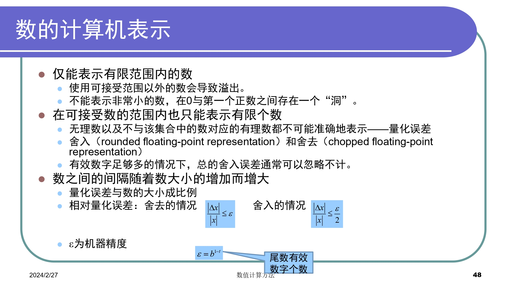
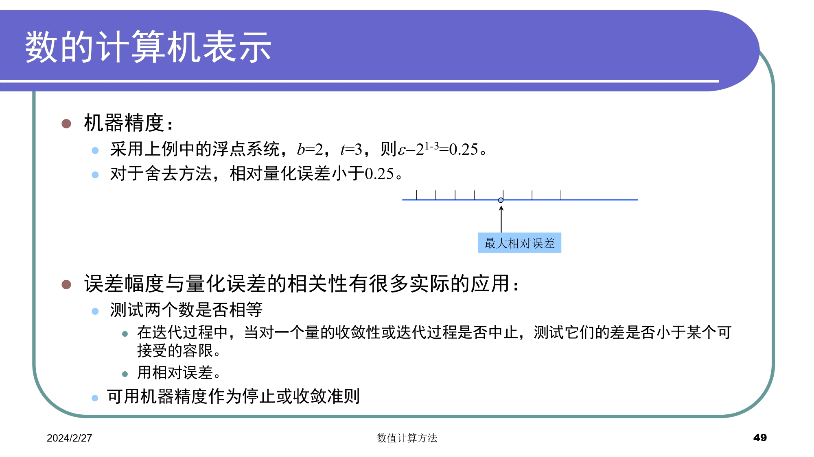
#### 计算机中的算术运算
##### 造成误差的原因
1. 通用算术运算
    + 有效数字丢失
    + 主要体现在尾数的调整
2. 大规模计算
    + 舍入误差的累积效应
3. 大数和小数相加
    + 如无穷级数求和
4. 减性抵销
    + 两个几乎相等的浮点数所引起的舍入误差
    + 如二次求根公式
    + 变换公式或扩展精度
5. 拖尾效应
    + 求和过程中，某一项的值大于和值本身
    + 在符号交替的级数中会出现
6. 内积
    + 使用扩展精度

#### 截断误差
+ 多项式数值计算的近似
+ 误差与步长的n+1次方成比例
### 误差传播
+ 函数导数的绝对值较大
+ 初始误差可稳定传播或不稳定传播
### 算法的数值稳定性
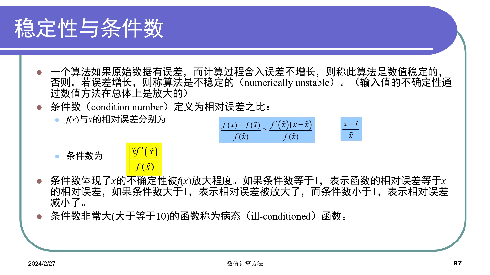
### 总结
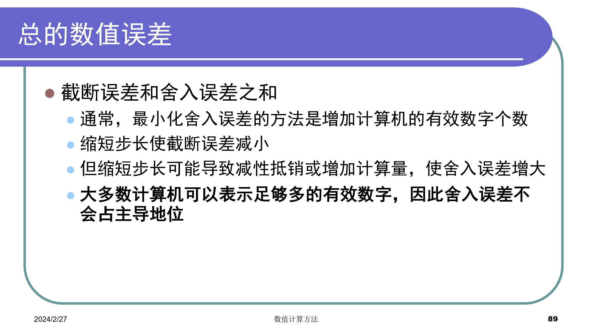
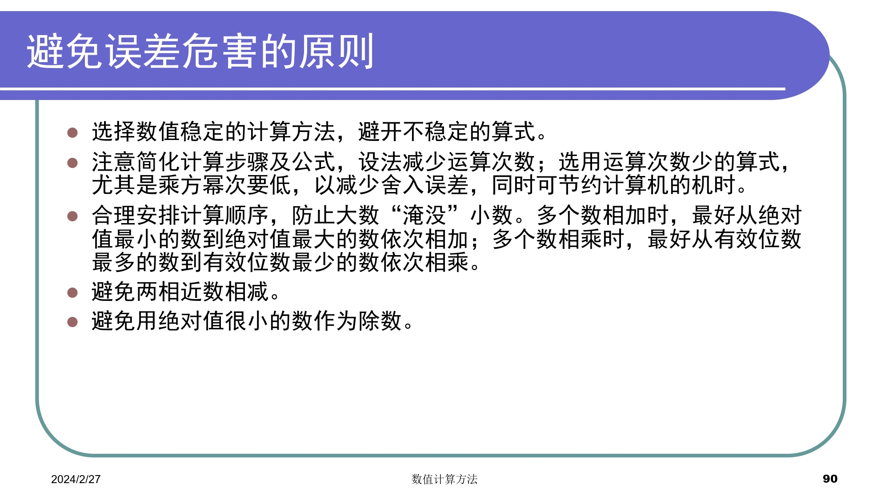
### 作业分析

Q2则遇到小麻烦。保留两位小数时输出为负（而且负得离谱），但积分结果肯定为正。思考后，增加了值为保留小数位数的变量。在matlab运行日志中可以看到，当保留小数位数达到10位时，才能得到相对准确的计算结果。<br>
对于这种数值较小的运算，0.01的误差累积起来也会造成相当程度的偏差。更确切地说，是由于导数绝对值较大造成的误差传播。解决问题时，必须要根据数据大小选定相应的精度或者选择方法进行优化。<br>
PS：正在施工中，等整理结束后会导出为pdf
<br>

## Chapter2 非线性方程求根
### 应用方向
1. 求解代数方程和超越方程的实数根
    + 根的分离(预先给出根的一个粗略位置)
    + 近似根的精确化(向真实根逼近)
2. 求解多项式的所有实数根和复数根
### 收敛阶
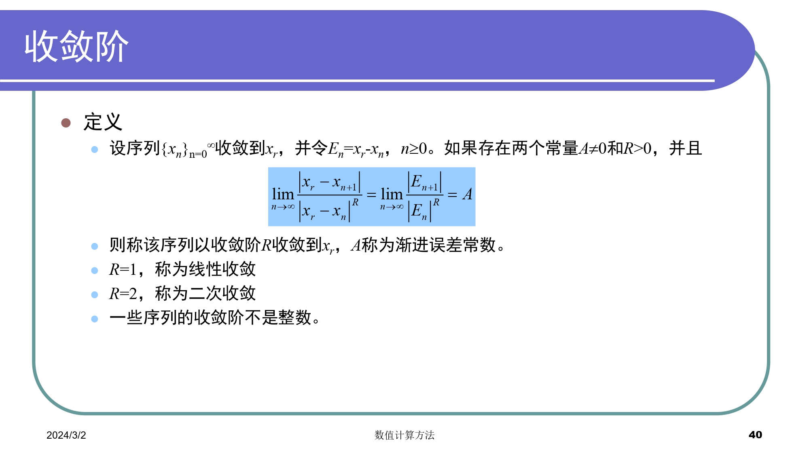
### 划界法
#### 二分法
**取左右端点中点**
```matlab
%二分法
function [c,err,yc]=bisect(f,a,b,delta)
ya=feval(f,a);
yb=feval(f,b);
if ya*yb>0
    disp('Note: f(a)*f(b)>0')
    return
end
max_times=1+round((log(b-a)-log(delta))/log(2));
for k=1:max_times
    c=(a+b)/2;
    yc=feval(f,c);
    if yc==0
        a=c;
        b=c;
    elseif yb*yc>0
        b=c;
        yb=yc;
    else
        a=c;
        ya=yc;
    end
    if b-a<delta
        break
    end
end

c=(a+b)/2;
err=abs(b-a)/2;
yc=feval(f,c);
```
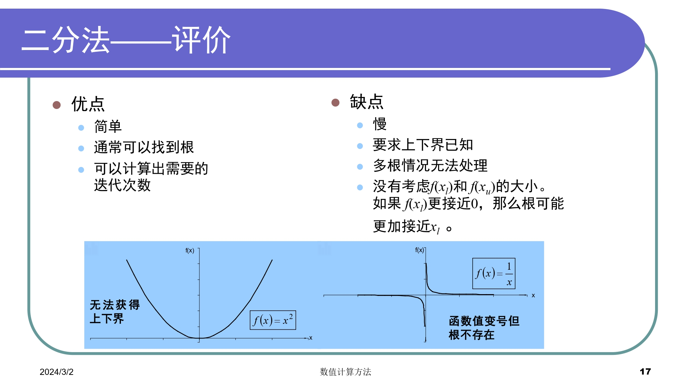
#### 试位法
**取左右端点连成直线与X轴的交点**
```matlab
%试位法
function [c,err,yc]=regula(f,a,b,delta,epsilon,max1)

ya=feval(f,a);
yb=feval(f,b);
if ya*yb>0
    disp('Note: f(a)*f(b)>0')
    return
end
for k=1:max1
    dx=yb*(b-a)/(yb-ya); %dx为c,b之间的距离
    c=b-dx;
    ac=c-a; %ac为a,c之间的距离
    yc=feval(f,c);
    if yc==0
        break
    elseif yb*yc>0
        b=c;
        yb=yc;
    else 
        a=c;
        ya=yc;
    end
    dx=min(abs(dx),ac);
    if abs(dx)<delta
        break
    end
    if abs(yc)<epsilon
        break
    end 

c=b-yb*(b-a)/(yb-ya);
err=abs(b-a);
yc=feval(f,c);
end
```
**优势**：一般情况下，试位法比二分法误差减小得快
**缺陷**：在某些情况下，试位法收敛慢；近似误差小于真实误差；一个划界点不动可能导致很差的收敛性
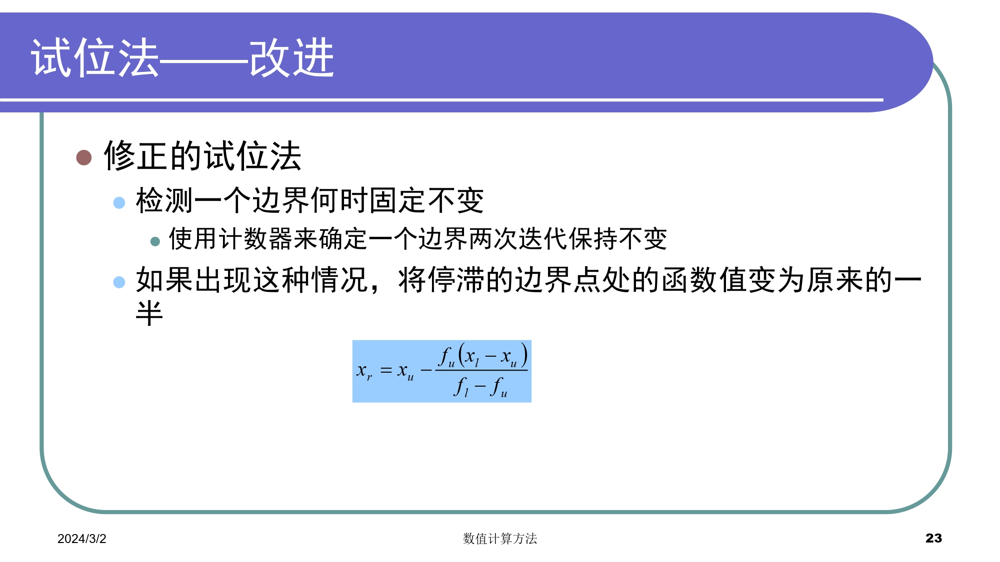


### 开方法
#### 不动点迭代
**取接近满足f(x)=x不动点的点**
```matlab
%不动点迭代
function [k,p,err,P]=fixpt(g,p0,delta,max1)

P(1)=p0;
for k=2:max1
    P(k)=feval(g,P(k-1));
    err=abs(P(k)-P(k-1));
    relerr=err/(abs(P(k))+eps);
    p=P(k);
    if (err<delta) || (relerr<delta)
        break
    end

if k==max1
    disp('maximum number of iteration exceeded')
end
end
```
+ 导数绝对值大于1，误差增大
+ 导数为正，误差为正，迭代的解单调；导数为负，误差增大
+ 方法收敛时，误差大致与前一次的迭代误差成比例，且小于前一次的迭代误差(线性收敛)
#### Newton-Raphson方法
**取某点切线与x轴的交点(等价于g(x)=x-f(x)/f'(x)不动点)**
```matlab
%Newton-Raphson方法
function [p0,err,k,y]=newton(f,df,p0,delta,epsilon,max_times)

for k=1:max_times
    p1=p0-feval(f,p0)/feval(df,p0);
    err=abs(p1-p0);
    relerr=2*err/(abs(p1)+delta);
    p0=p1;
    y=feval(f,p0);
    if (err<delta) || (relerr<delta) || (abs(y)<epsilon)
        break
    end
end
```

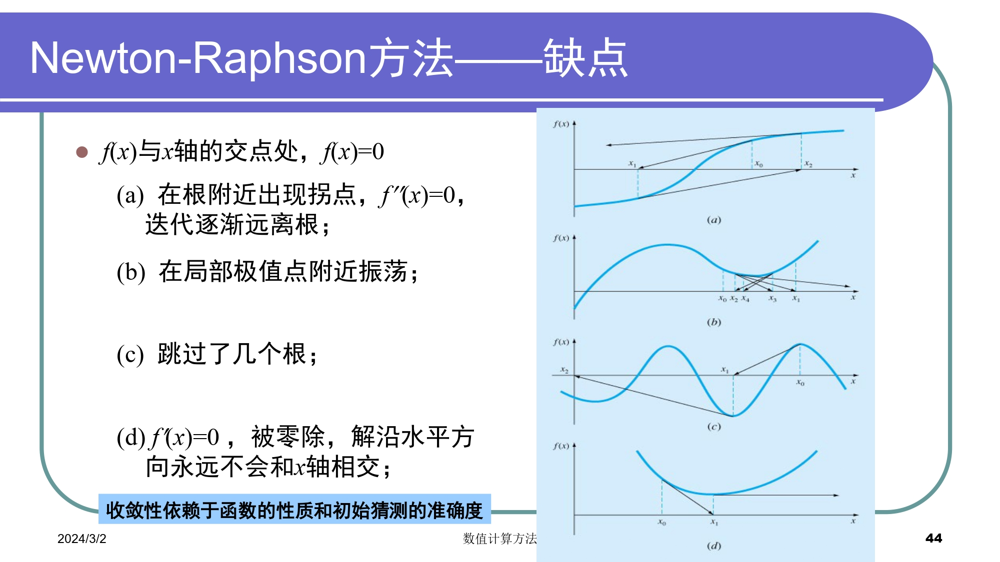
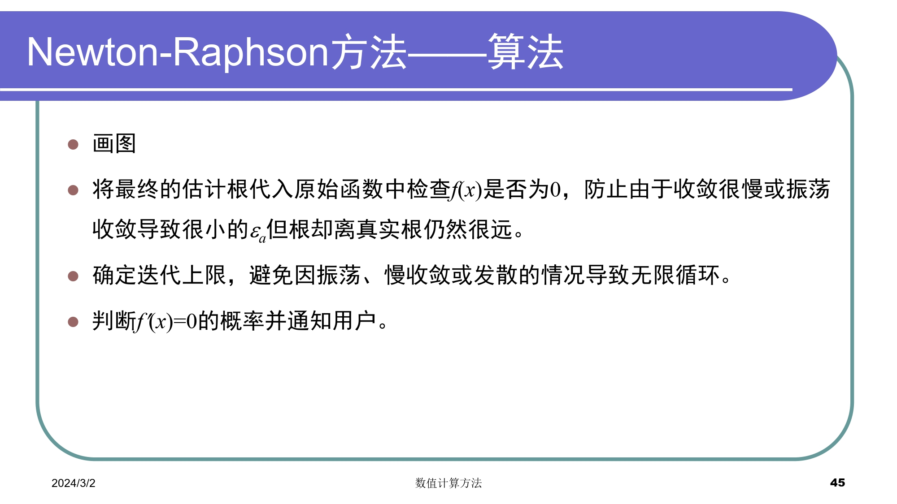

#### 割线法
**取同侧端点连成直线与x轴交点**
```matlab
%割线法
function [p1,err,k,y]=secant(f,p0,p1,delta,epsilon,max_times)

for k=1:max_times
    p2=p1-feval(f,p1)*(p1-p0)/(feval(f,p1)-feval(f,p0));
    err=abs(p2-p1)
    relerr=2*err/(abs(p2)+delta);
    p0=p1;
    p1=p2;
    y=feval(f,p1);
    if (err<delta || (relerr<delta) || abs(y)<epsilon)
        break
    end
end
if k==max_times
    disp('maximum number of iteration exceeded')
end
```
+ 类似Newton-Raphson方法，用差商估计斜率
+ 类似试位法，用两个初时估计值计算函数斜率的近似，并将其投射到x轴上获得一个新的估计值
+ 收敛阶，1.618
+ 对于所有现实情况，试位法通常收敛，割线法可能发散；如果割线法收敛，通常比试位法快
#### 针对重根的改进
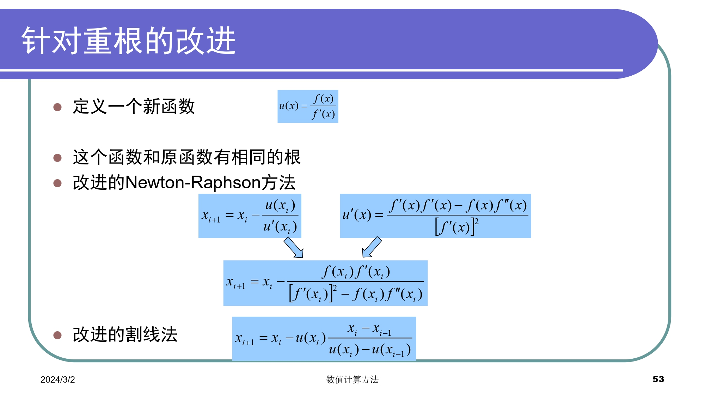
### 总结延伸
#### 扩展
+ 方法的改进
+ 非线性方程组求根
+ 多项式求根
#### 总结
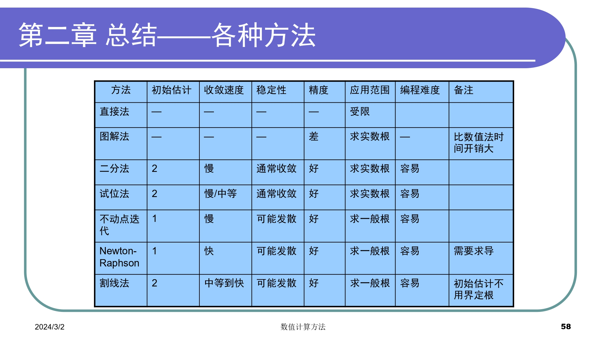
### 作业分析
#### 求解较小根
1. **试位法**
    + 相比二分法引入了纵向容差
2. **不动点迭代**
    + 引入相对误差，有助于确保解达到所需精度迭代停止
    + 同时，导数绝对值必须<=1,才能收敛(在本题中就发散)
    + 由于不动点是满足g(x)=x的点，故要记得变换函数g(x)=f(x)+x,并确保导数值<1(弄了半天)
3. **Newton-Raphson方法**
    + 需要导函数
#### 求解较大根
1. 改了一些参数竟然warning,于是根据错误信息在chapter0增加了error list(待施工)
2. 问题主要在右端点,把2/pi-eps改成50*pi/101就好了，很好奇什么原理
3. Newton算出来是错的，数值远比答案大，说明发散
## Chapter3 线性代数方程组
### 系数矩阵类型
+ 低阶稠密矩阵
+ 大型稀疏矩阵(矩阵中0元素较多)
+ 三对角矩阵(非0元素集中于主对角线及相邻两对角线上)
### 数值解法
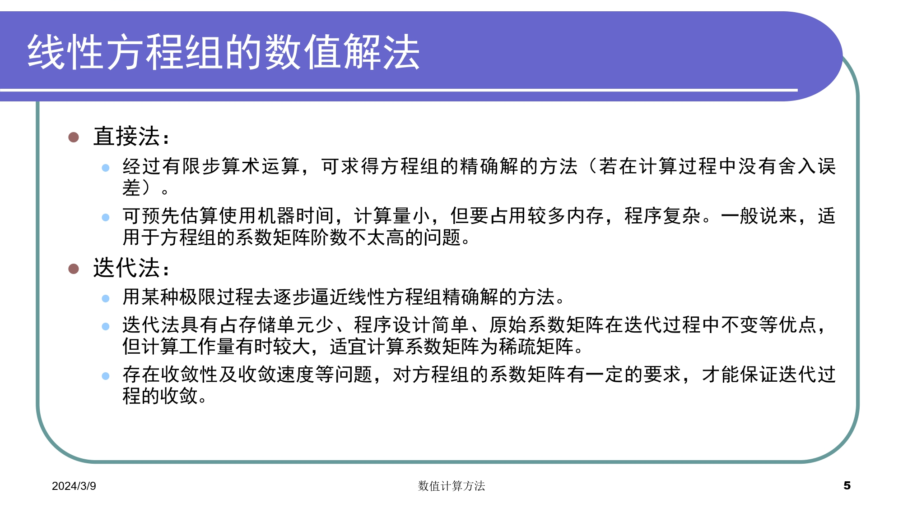
### 高斯消去法
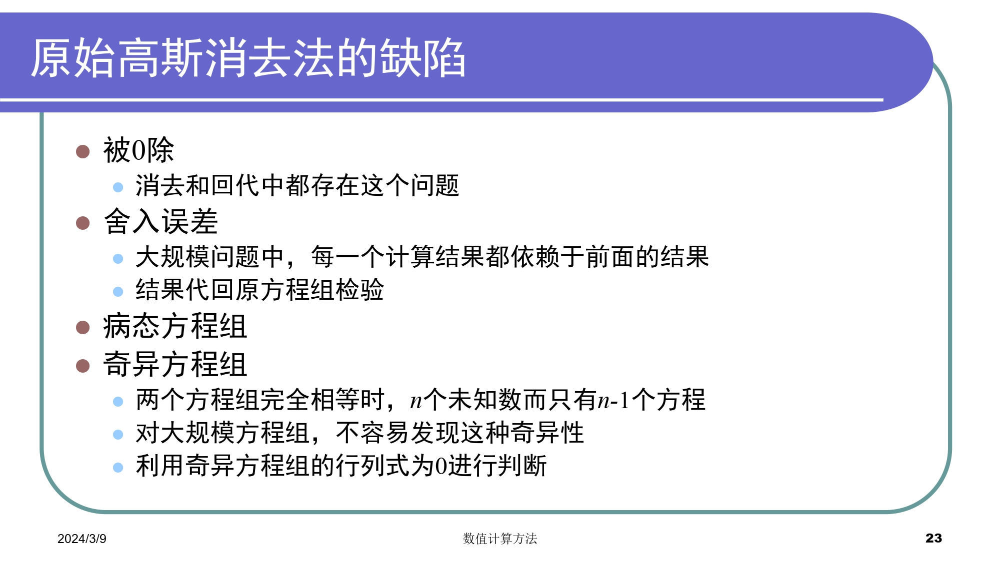
#### 病态方程组判别
+ 行列式的值
+ 矩阵求逆
    + 缩放系数矩阵，使每一行最大元素为1，缩放后的逆矩阵元素值大于1数倍则为病态
    + 将逆矩阵与原矩阵相乘，结果不接近单位阵则为病态
    + 求逆矩阵的逆矩阵，与原系数矩阵对比，不相等则为病态
+ 系数微小改变再求解
#### 解求精技术
+ 使用扩展精度
+ 选主元
列主元消去法
全主元消去法
+ 缩放
缩放之后的系数用来确定是否需要交换主元，但实际消去和回代中仍使用原系数值
#### 消去法
+ 顺序消去法条件苛刻，且数值不稳定
+ 全主元消去法工作量偏大，需要比较的元素及行列交换工作较多，算法复杂
+ 高斯约当消去法形式上简单，且无回代求解，但计算量大
+ 从算法优化的角度考虑，列主元消去法较好
### LU分解、特殊矩阵和矩阵求逆
+ Doolittle分解：L为单位下三角矩阵，U为上三角矩阵
+ Crout分解：L为下三角矩阵，U为单位上三角矩阵
+ Cholesky分解：对称正定矩阵的平方根法
    + 优势：存储量小，计算量小，数值稳定
    + 缺点：存在开方运算，可能会出现根号下复数
#### 带状方程组
### 误差分析、条件数
#### 向量和矩阵的范数
+ "2"范数(欧几里得范数)
$$
||x||_2=(\sum\limits_{i=1}^{n}x_i^{2})^{1/2}
$$
+ "1"范数
$$
||x||_1=\sum\limits_{i=1}^{n}|x_i|
$$
+ "∞"范数(极大值范数或一致向量范数)
$$
||x||_∞=\mathop{\max_{1\leq{i}\leq{n}}^{}}{|x_i|}
$$
+ "p"范数
$$
||x||_p=(\sum\limits_{i=1}^{n}|x_i|^{p})^{1/p}
$$
### 迭代方法
#### 雅可比迭代法(同步迭代法)
#### 高斯-赛德尔方法(异步迭代法)
### 作业分析
> 1. Report已上传到我的[学习笔记](https://happystarkitty.github.io/Math)
> 2. 题目理解了半天，太抽象了
## Chapter4 插值和拟合
### 插值
#### 插值函数
+ 代数多项式
+ 有理函数
+ 三角函数
#### 插值函数存在唯一定理
+ 与基函数无关
+ 与原函数无关
+ 基函数与点个数相同  

**定理**：$\{x_i\}_{i=0}^n$为n+1个节点，$\phi=span\{{\varphi_0,\varphi_1...\varphi_n}\}$n+1维空间，则插值函数存在唯一，当且仅当
$$
\begin{equation}
\left[
\begin{array}{ccc}
a_{11} & a_{12} & a_{13} \\
a_{21} & a_{22} & a_{23} \\
a_{31} & a_{32} & a_{33} 
\end{array}
\right]        
\end{equation}
$$
### 拟合

## Chapter5 数值微分和数值积分
## Chapter6 常微分方程的数值解


