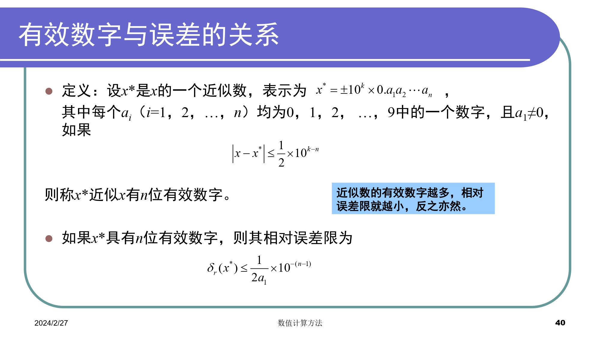
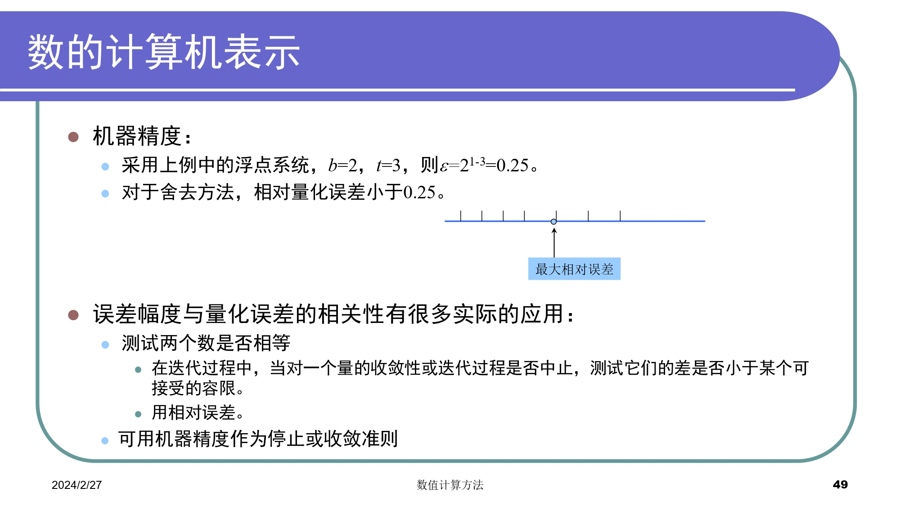
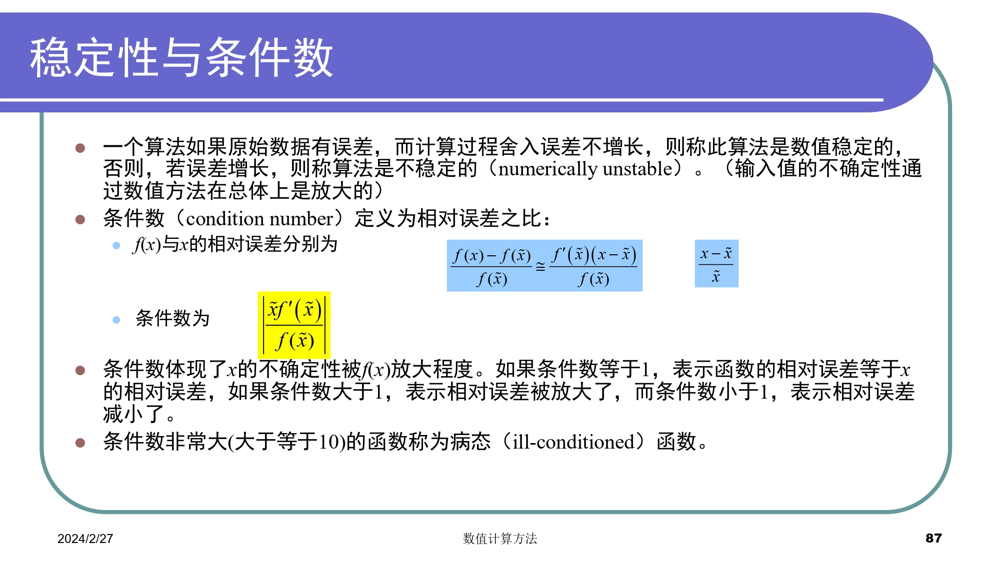

# Chap1 绪论

## 概览

根据计算机特点，研究通过计算机求工程问题满足精度要求的近似解。应用数值计算方法解决工程问题的流程如下：

- 建立数学模型
- 简化成一系列算术运算和逻辑运算
- 求出问题数值解
- 对算法的收敛性、稳定性和误差进行分析计算

### 数学模型

用数学语言来表达物理系统或过程本质特征的公式或方程

+ 因变量=f(自变量，参数，强制函数) 
+ 因变量：用来刻画系统行为或状态的特征量
+ 自变量：通常为维度，如时间和空间，系统的行为是用自变量来确定的
+ 参数：反映系统的性质或组成
+ 强制函数：外部对系统施加的影响。

### 数值方法特点
+ 稳定性
+ 准确性与精确性
+ 收敛速度

### 误差分析
#### 误差种类的来源

+ 数值误差：包括舍入误差和截断误差
+ 舍入误差：由于计算机只能表示有限位数的量
+ 截断误差：由于数值方法可能运用近似方法表示准确数值运算或数量
+ 不与数值方法直接相关的误差：如粗差、形式化或模型误差、数据不确定性误差

绝对误差

$$e(x^*)=x-x^*$$

误差限

$$|e(x^*)|=|x-x^*|\le \varepsilon$$

相对误差

$$e_r(x^*)=\frac{e(x^*)}{x}=\frac{x-x^*}{x}$$

相对误差限

$$|e_r(x^*)|=|\frac{e(x^*)}{x^*}|\le \varepsilon_r$$

### 有效数字

有效数字：若近似值$x^*$的误差限是$\frac{1}{2}\times 10^{-n}$，则称$x^*$准确到小数点后第$n$位，并从第一个非零数字到这一位的所有数字均称为有效数字

 

#### 舍入误差
+ 数的计算机表示
+ 计算机中的算术运算
##### 数的计算机表示

#### 截断误差
+ 多项式数值计算的近似
+ 误差与步长的n+1次方成比例

## 误差传播
+ 函数导数的绝对值较大
+ 初始误差可稳定传播或不稳定传播

### 算法的数值稳定性

## 计算机运算误差原因

1. 通用算术运算
    + 有效数字丢失
    + 主要体现在尾数的调整
2. 大规模计算
    + 舍入误差的累积效应
3. 大数和小数相加
    + 如无穷级数求和
4. 减性抵销
    + 两个几乎相等的浮点数所引起的舍入误差
    + 如二次求根公式
    + 变换公式或扩展精度
5. 除数绝对值远小于被除数绝对值
5. 拖尾效应
    + 求和过程中，某一项的值大于和值本身
    + 在符号交替的级数中会出现
6. 内积
    + 使用扩展精度

### 总结

