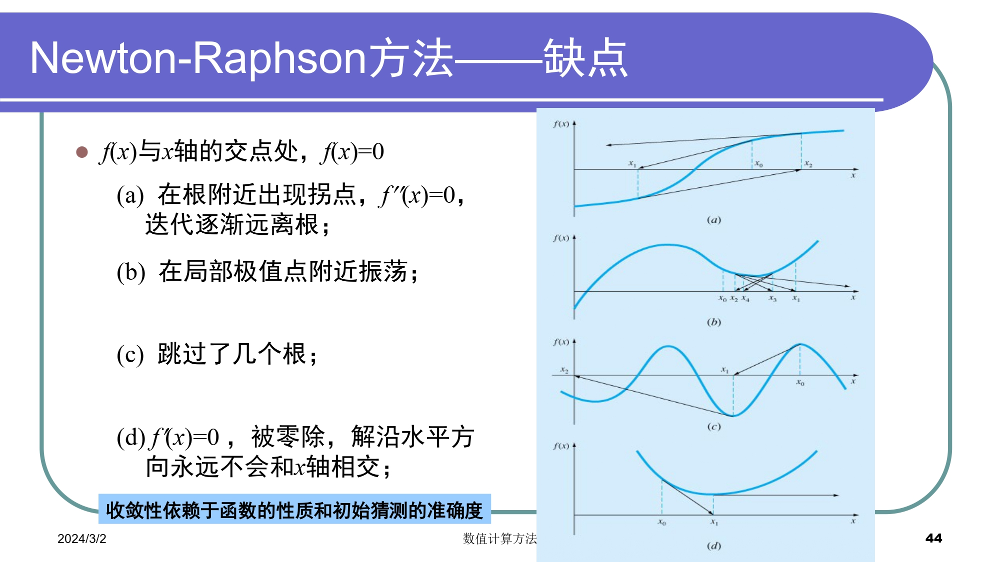
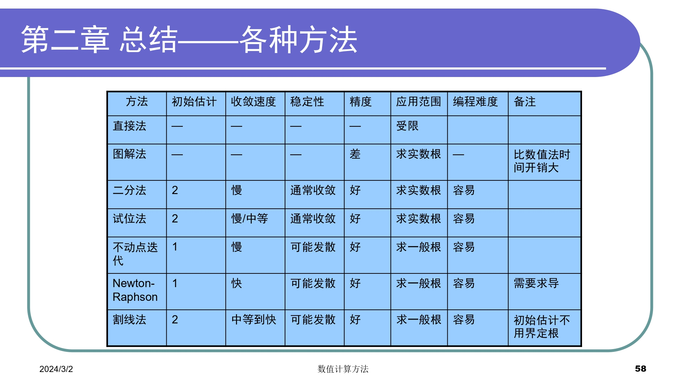

# Chapt2 非线性方程求根

### 概览

1. 求解代数方程和超越方程的实数根
    + 根的分离(预先给出根的一个粗略位置)
    + 近似根的精确化(向真实根逼近)
2. 求解多项式的所有实数根和复数根
### 收敛阶

### 划界法
#### 二分法
**取左右端点中点**
```matlab
%二分法
function [c,err,yc]=bisect(f,a,b,delta)
ya=feval(f,a);
yb=feval(f,b);
if ya*yb>0
    disp('Note: f(a)*f(b)>0')
    return
end
max_times=1+round((log(b-a)-log(delta))/log(2));
for k=1:max_times
    c=(a+b)/2;
    yc=feval(f,c);
    if yc==0
        a=c;
        b=c;
    elseif yb*yc>0
        b=c;
        yb=yc;
    else
        a=c;
        ya=yc;
    end
    if b-a<delta
        break
    end
end

c=(a+b)/2;
err=abs(b-a)/2;
yc=feval(f,c);
```

#### 试位法
**取左右端点连成直线与X轴的交点**
```matlab
%试位法
function [c,err,yc]=regula(f,a,b,delta,epsilon,max1)

ya=feval(f,a);
yb=feval(f,b);
if ya*yb>0
    disp('Note: f(a)*f(b)>0')
    return
end
for k=1:max1
    dx=yb*(b-a)/(yb-ya); %dx为c,b之间的距离
    c=b-dx;
    ac=c-a; %ac为a,c之间的距离
    yc=feval(f,c);
    if yc==0
        break
    elseif yb*yc>0
        b=c;
        yb=yc;
    else 
        a=c;
        ya=yc;
    end
    dx=min(abs(dx),ac);
    if abs(dx)<delta
        break
    end
    if abs(yc)<epsilon
        break
    end 

c=b-yb*(b-a)/(yb-ya);
err=abs(b-a);
yc=feval(f,c);
end
```
**优势**：一般情况下，试位法比二分法误差减小得快
**缺陷**：在某些情况下，试位法收敛慢；近似误差小于真实误差；一个划界点不动可能导致很差的收敛性


### 开方法
#### 不动点迭代
**取接近满足f(x)=x不动点的点**
```matlab
%不动点迭代
function [k,p,err,P]=fixpt(g,p0,delta,max1)

P(1)=p0;
for k=2:max1
    P(k)=feval(g,P(k-1));
    err=abs(P(k)-P(k-1));
    relerr=err/(abs(P(k))+eps);
    p=P(k);
    if (err<delta) || (relerr<delta)
        break
    end

if k==max1
    disp('maximum number of iteration exceeded')
end
end
```
+ 导数绝对值大于1，误差增大
+ 导数为正，误差为正，迭代的解单调；导数为负，误差增大
+ 方法收敛时，误差大致与前一次的迭代误差成比例，且小于前一次的迭代误差(线性收敛)
#### Newton-Raphson方法
**取某点切线与x轴的交点(等价于g(x)=x-f(x)/f'(x)不动点)**
```matlab
%Newton-Raphson方法
function [p0,err,k,y]=newton(f,df,p0,delta,epsilon,max_times)

for k=1:max_times
    p1=p0-feval(f,p0)/feval(df,p0);
    err=abs(p1-p0);
    relerr=2*err/(abs(p1)+delta);
    p0=p1;
    y=feval(f,p0);
    if (err<delta) || (relerr<delta) || (abs(y)<epsilon)
        break
    end
end
```




#### 割线法
**取同侧端点连成直线与x轴交点**
```matlab
%割线法
function [p1,err,k,y]=secant(f,p0,p1,delta,epsilon,max_times)

for k=1:max_times
    p2=p1-feval(f,p1)*(p1-p0)/(feval(f,p1)-feval(f,p0));
    err=abs(p2-p1)
    relerr=2*err/(abs(p2)+delta);
    p0=p1;
    p1=p2;
    y=feval(f,p1);
    if (err<delta || (relerr<delta) || abs(y)<epsilon)
        break
    end
end
if k==max_times
    disp('maximum number of iteration exceeded')
end
```
+ 类似Newton-Raphson方法，用差商估计斜率
+ 类似试位法，用两个初时估计值计算函数斜率的近似，并将其投射到x轴上获得一个新的估计值
+ 收敛阶，1.618
+ 对于所有现实情况，试位法通常收敛，割线法可能发散；如果割线法收敛，通常比试位法快
#### 针对重根的改进


### 总结


---